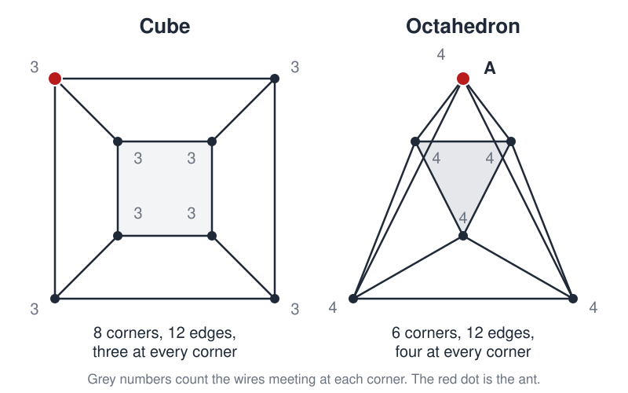

# Ant Walk

 This work is licensed under a <a rel="license" href="http://creativecommons.org/licenses/by/4.0/">Creative Commons Attribution 4.0 International License</a>.

*[Section 3](../section3.md), session 13. Discussed together with [Seven Bridges](seven-bridges.md), alongside the [Pedestrian Crosswalk Mystery](pedestrian-crosswalk-mystery.md) and the [chemical pattern-formation lab](chemical-pattern-formation-lab.md).*

!!! abstract "The problem"

    Reconstructed from the syllabus: Winfree's own statement of this
    problem has not survived, and the syllabus gives only the title, paired
    with Seven Bridges. What follows is the puzzle the editors think was
    most likely meant; the other readings are listed at the foot of the
    page.

    An ant lives on a wire model of a cube: twelve straight wires meeting
    at eight corners, nothing else, and it walks only along the wires.
    Starting at any corner it likes, can it travel every one of the twelve
    wires exactly once? If it can, show a route. If it cannot, say exactly
    why — then find the fewest wires it must walk twice to cover them all
    in one continuous walk.

    Now move the ant to a wire octahedron: six corners, twelve wires, four
    wires at every corner. Ask the same question. Dudeney set this version
    in 1917, with a fly that "confines its walks entirely to the edges".
    Before you turn to Seven Bridges, notice what single observation
    settles both solids.

{ width="560" }

*The two wire models, flattened into diagrams. Drawn for this site (CC BY 4.0).*

## Why it is in the course

Session 13 opens Section 3, Observations and Questions, and the syllabus
asks the class to "Discuss Ant Walk and Seven Bridges". Euler's triumph at
Königsberg was not a calculation. It was an observation — count the
bridge-ends at each landmass — followed by the right question: what
property of the map decides whether any route exists at all?

An ant confined to the edges of a solid invites the same move. Almost
everyone begins by trying routes, gets stuck, and tries another. The
discovery is the moment you stop tracing and start counting: look at a
corner and ask what a walk must do every time it passes through one. That
one question answers the cube, the octahedron and Königsberg alike. Note
what you threw away to get it — everything except which corners join
which.

## Where it comes from

Euler read his solution of the Königsberg bridge problem to the St
Petersburg Academy on 26 August 1735 and published it in 1741. Every
landmass, he observed, except possibly the two where the walk starts and
ends, must have an even number of bridge-ends; Königsberg's four are all
odd. The same count decides any "walk every edge once" puzzle: such a walk
exists exactly when the network has zero or two odd corners. Euler proved
the condition necessary, Carl Hierholzer that it is sufficient (1873).

Puzzle-makers then moved the idea onto solids. Dudeney's "The Fly on the
Octahedron" (*Amusements in Mathematics*, 1917, No. 245) flattens the solid
into a diagram with four lines at every point and counts the complete
routes from its top corner. The cube, with three wires at each of its eight
corners, is the textbook impossible case. Whether Winfree meant this puzzle
is not recorded.

??? tip "Hints"

    - Do not try routes. Count how many wires meet at each corner of the
      cube, then of the octahedron.
    - Passing through a corner uses two wires, one to arrive and one to
      leave. What does that imply for a corner where an odd number meet?
    - Only the starting and finishing corners can behave differently. How
      many corners, at most, can be odd?
    - For the cube: walking a wire twice is like adding an extra wire. How
      few extra wires leave at most two corners odd?

??? success "Resolution"

    **Cube.** Three wires meet at each of the eight corners — odd. In a
    walk using every wire once, every corner but the start and the finish
    is entered and left equally often, so it must be even. At most two may
    be odd; the cube has eight, so no such walk exists. Covering all twelve
    wires needs repeats, and each repeated wire flips the count at both of
    its ends, so it can fix two odd corners at once. Three
    repeats are enough for a walk that may finish anywhere (fifteen
    traversals); a walk returning to its start needs four (sixteen).

    **Octahedron.** Four wires meet at each of the six corners, all even,
    so a walk over all twelve edges exists from any corner and must end
    where it began. Dudeney: "if we start at the point A and go over all
    the lines once, we must always end our route at A." He counts 1,488
    such routes from that top point.

    **Seven Bridges.** Euler's paper makes the identical observation: all
    four Königsberg landmasses are odd, so no walk crosses each bridge once.

## Sources

- **Arthur T. Winfree**, *The Art of Scientific Discovery*, ECOL 479/579 course handout — the archived web copy of the same syllabus, carrying the same single line — [Wayback Machine capture, 2002-04-20](https://web.archive.org/web/20020420212713/http://eebweb.arizona.edu:80/Faculty/Winfree/handout_479.htm){target=_blank} 🔓
- **Henry Ernest Dudeney**, *Amusements in Mathematics*, No. 245 "The Fly on the Octahedron" and No. 246 "The Icosahedron Puzzle" (1917) — [Project Gutenberg eBook #16713](https://www.gutenberg.org/ebooks/16713){target=_blank} 🔓
- **Leonhard Euler**, "Solutio problematis ad geometriam situs pertinentis", *Commentarii academiae scientiarum Petropolitanae* 8, 128-140 (1741) — [Euler Archive E53](https://scholarlycommons.pacific.edu/euler-works/53/){target=_blank} 🔓
- **Wikipedia contributors**, "Eulerian path" — [Wikipedia](https://en.wikipedia.org/wiki/Eulerian_path){target=_blank} 🔓
- **Wikipedia contributors**, "Seven Bridges of Königsberg" — [Wikipedia](https://en.wikipedia.org/wiki/Seven_Bridges_of_K%C3%B6nigsberg){target=_blank} 🔓
- **Wikipedia contributors**, "Ant on a rubber rope" — [Wikipedia](https://en.wikipedia.org/wiki/Ant_on_a_rubber_rope){target=_blank} 🔓
- **Martin Gardner**, *aha! Gotcha: Paradoxes to Puzzle and Delight*, pp. 145-146 (1982) — [Internet Archive](https://archive.org/details/ahagotchaparadox00gard){target=_blank} 🔓 *(borrow)*
- **Mark McCartney**, "Extending the rubber rope: convergent series, divergent series and the integrating factor", *International Journal of Mathematical Education in Science and Technology* 44(4), 554-559 (2013) — [DOI](https://doi.org/10.1080/0020739X.2012.729615){target=_blank} 🔒
- **M. C. Escher**, "Möbius Strip II (Red Ants)", woodcut, February 1963 — [official gallery](https://mcescher.com/gallery/mathematical/){target=_blank} 🔓
- **Arthur T. Winfree**, *The Art of Scientific Discovery: original course syllabus* — [PDF](https://github.com/tyson-swetnam/aosd/blob/main/docs/assets/aosd_syllabus.pdf){target=_blank} 🔓

!!! note "How sure are we that this is Winfree's problem?"

    Not sure at all. The syllabus is the only surviving trace, and it gives
    the title and nothing more; the archived web copy of the same handout
    carries the same single line, and no other page on Winfree's archived
    lab site mentions an ant problem. The pairing with Seven Bridges is the
    strongest clue. The candidates weighed:

    - **An edge-walk on a solid** — the reconstruction above. Both problems
      in the session are walks over edges settled by the same corner-count.
      Medium confidence, but inference, not documentation.
    - **Gardner's ant on a rubber rope**, which crawls 1 cm/s along a 1 km
      rope stretched by another kilometre each second. It does reach the
      end, but the puzzle has nothing to do with Königsberg.
    - **An ant on a Möbius band**, as in Escher's 1963 woodcut. Königsberg
      is also the birth of topology, and the syllabus discusses Escher's
      *Print Gallery* in session 16 — but nothing in the archive or the
      syllabus mentions a Möbius band.

---

*Back to [Section 3](../section3.md) · [All problems](index.md) · [The schedule](../syllabus.md#section-3-observations-and-questions)*
