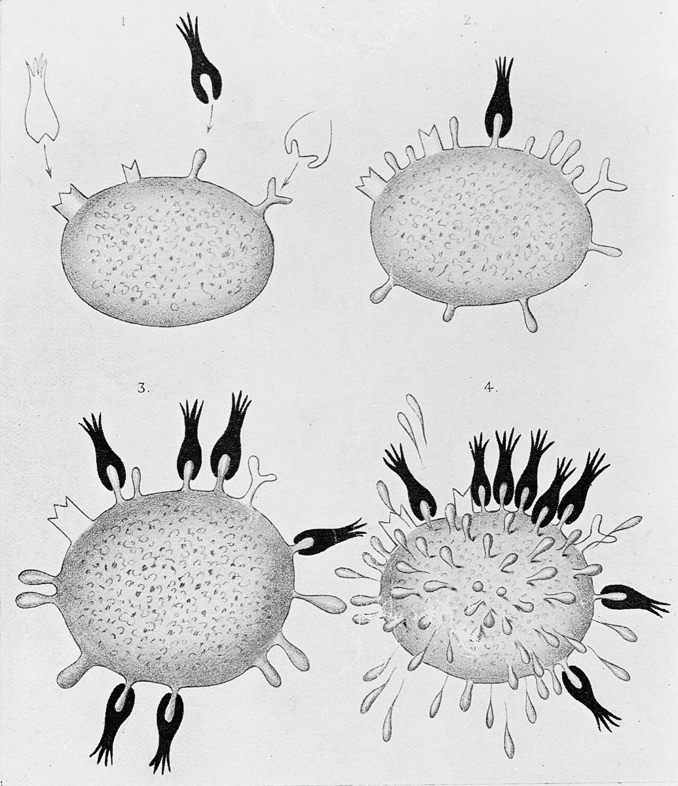

# Antigen Invasions

 This work is licensed under a <a rel="license" href="http://creativecommons.org/licenses/by/4.0/">Creative Commons Attribution 4.0 International License</a>.

*[Section 5](../section5.md), session 29. Dealt with in the same session as [Martian DNA](martian-dna.md), while the class finishes discovering [the laws of a toy universe](laws-of-toy-universe.md).*

!!! abstract "The problem"

    Reconstructed from the syllabus: only the name survives, so this
    exercise is the editors' own, not Winfree's text.

    An animal is invaded, on a schedule, by foreign substances **A**, **B**
    and **C**. A is a small synthetic chemical that no ancestor of this
    animal ever met. (A molecule this small provokes nothing on its own,
    so A is coupled to a carrier protein for injection; take that as given.) The
    animal's blood is drawn at intervals and tested for anything that binds
    each substance. The units are schematic: only the shapes matter.

    | Day | Injected | binds A | binds B | binds C |
    | ---: | :-- | ---: | ---: | ---: |
    | 0 | A | 0 | 0 | 0 |
    | 7 | - | 3 | 0 | 0 |
    | 14 | - | 30 | 0 | 0 |
    | 28 | A + B | 15 | 0 | 0 |
    | 31 | - | 200 | 0 | 0 |
    | 35 | - | 900 | 3 | 0 |
    | 42 | - | 1000 | 30 | 0 |

    Also:

    - C was never injected.
    - A close chemical relative of A is bound by the day-42 blood about ten
      times less tightly.
    - The animal makes nothing that binds its own proteins, and tissue from
      another animal, introduced early in life, is later accepted as its own.

    **Your tasks**

    1. **State the rules.** Write down what this record forces you to
       believe, and no more. Compare the two rises in the "binds A" column,
       then compare the second rise with what B does on the same days.
    2. **Explain them.** Propose at least two mechanisms, as different as
       you can make them: say, the invader is a mould the body shapes its
       answer around; or the body already carries a vast variety of answers
       and the invader picks out and multiplies the ones that fit.
    3. **Find the test that decides.** For each mechanism, name an
       observation it predicts and the other forbids. Which rule is awkward
       for the mould?
    4. **Count.** Suppose the animal must be ready for about 10⁸
       distinguishable invaders, and its genome has 10⁴ to 10⁵ genes. Under
       the second mechanism, how many kinds of binder must exist in advance?
       Does that arithmetic kill the mechanism, or can you repair it?

{ width="560" }

*The table above as a graph. The dots are the table's values; the lines between and after them are schematic. Drawn for this site (CC BY 4.0).*

## Why it is in the course

Section 5 is "Inferences, Hypotheses, Explanations", and session 29 sets Feynman's *The Character of Physical Law* beside two problems, "Deal with Antigen Invasions" and "Deal with Martian DNA". Earlier the class read Chamberlin's *The Method of Multiple Working Hypotheses* and Platt's *Strong Inference*; this reconstruction puts them to work. Several explanations fit some of the facts, and the job is to find the observation that separates them.

The course promises exercises that "depend as little as possible on knowledge of any particular subject area" and that are "mostly made from elementary mathematics". Nothing here needs immunology, and task 4 shows that an explanation surviving the qualitative facts can still be killed, or rescued, by counting.

## Where it comes from

How a body answers an invader it has never met is a classic biological puzzle with a history of rival hypotheses. Paul Ehrlich's side-chain theory (1900) had cells already carrying many kinds of receptor, over-producing and shedding the kind a toxin fits; it was later abandoned. Karl Landsteiner then showed that animals make specific antibodies against synthetic chemicals, which evolution cannot have prepared them for.

{ width="560" }

*Diagrams illustrating Paul Ehrlich's side-chain theory, from his Croonian Lecture "On Immunity with Special Reference to Cell Life" (1900). Wellcome Collection, CC BY 4.0, via Wikimedia Commons.*

In 1940 Linus Pauling proposed that an antibody folds around the antigen and takes its shape from it. The template theory dominated for fifteen years. Niels Jerne (1955), then David Talmage and F. Macfarlane Burnet (1957), turned the logic around; Susumu Tonegawa, from 1976, settled the counting. The name fits a second story too: antigenic variation, in which a parasite changes its coat and invades the same host again.

??? tip "Hints"

    - Specificity is easy for a mould. What does a mould say about the
      *second* invasion, or about why the body spares itself?
    - If the variety exists beforehand, something must be thrown away. What
      happens to binders that fit the body's own molecules, and when?
    - One gene per specificity is the assumption doing the damage. What if a
      binder is built from parts picked from several small boxes?
    - Look for a test at the level of a single cell.

??? success "Resolution"

    *For the reconstruction only; Winfree's answer is not known. This is
    how biology settled the question.*

    **Selection, not instruction.** The body carries a huge, randomly
    generated repertoire before any invasion; the invader picks the cells
    whose answer already fits and drives them to multiply. Jerne proposed
    selection; Talmage and Burnet made it clonal, one lymphocyte, one
    specificity, and Nossal and Lederberg (1958) confirmed that one cell
    makes one antibody.

    - **Memory** follows: clones selected by the first invasion are still
      there, enlarged, so a second dose of A is met faster and harder while
      B, on the same day, starts from scratch.
    - **Self-tolerance** follows: self-reactive clones are removed or
      silenced during development, so early-introduced tissue counts as self.
    - **Counting**: Tonegawa showed antibody genes are spliced in each
      developing cell from separate pools of segments; with two chains and
      mutation, a few hundred parts give well over 10⁸ combinations.

    Pauling's template explained specificity but not memory or tolerance.
    For a changing invader the answer is antigenic variation: trypanosomes
    switch among more than a thousand coat genes, so each cleared wave is
    followed by a variant the immune system has not met.

## Sources

- **Niels K. Jerne**, "The Natural-Selection Theory of Antibody Formation", *PNAS* 41(11), 849–857 (1955) — [PubMed Central](https://pmc.ncbi.nlm.nih.gov/articles/PMC534292/){target=_blank} 🔓
- **F. Macfarlane Burnet**, "A modification of Jerne's theory of antibody production using the concept of clonal selection" (*Australian Journal of Science*, 1957; reprinted in *CA: A Cancer Journal for Clinicians* 26(2), 119–121, 1976) — [DOI](https://doi.org/10.3322/canjclin.26.2.119){target=_blank} 🔒
- **Linus Pauling**, "A Theory of the Structure and Process of Formation of Antibodies", *Journal of the American Chemical Society* 62, 2643–2657 (1940) — [DOI](https://doi.org/10.1021/ja01867a018){target=_blank} 🔒
- **Karl Landsteiner**, *The Specificity of Serological Reactions* (Dover, 1962) — [Internet Archive](https://archive.org/details/specificityofser0000land){target=_blank} 🔓 *(borrow)*
- **Charles A. Janeway Jr. et al.**, *Immunobiology*, 5th ed. (2001), Chapter 1: Basic Concepts in Immunology — [NCBI Bookshelf](https://www.ncbi.nlm.nih.gov/books/NBK10757/){target=_blank} 🔓
- **Charles A. Janeway Jr. et al.**, *Immunobiology*, 5th ed. (2001), "Immunological memory" — [NCBI Bookshelf](https://www.ncbi.nlm.nih.gov/books/NBK27158/){target=_blank} 🔓
- **Steven A. Frank**, *Immunology and Evolution of Infectious Disease* (2002), Chapter 3: Benefits of Antigenic Variation — [NCBI Bookshelf](https://www.ncbi.nlm.nih.gov/books/NBK2405/){target=_blank} 🔓
- **Wikipedia contributors**, "Clonal selection" (overview) — [Wikipedia](https://en.wikipedia.org/wiki/Clonal_selection){target=_blank} 🔓
- **Wikipedia contributors**, "Antigenic variation" (overview) — [Wikipedia](https://en.wikipedia.org/wiki/Antigenic_variation){target=_blank} 🔓
- **Richard P. Feynman**, *The Character of Physical Law* (1965), the session 29 reading — [Internet Archive](https://archive.org/details/characterofphysi00feyn){target=_blank} 🔓 *(borrow)*
- **Arthur T. Winfree**, *The Art of Scientific Discovery: original course syllabus* (2001) — [PDF](https://github.com/tyson-swetnam/aosd/blob/main/docs/assets/aosd_syllabus.pdf){target=_blank} 🔓

!!! note "How sure are we that this is Winfree's problem?"

    We are not: the identification is **unknown**. The syllabus gives only
    the name and the session, no statement of the problem survives, and
    searches found no puzzle by that name.
    Candidates, the first two merged above:

    - **Explain the immune response**: propose and test mechanisms for
      specificity, memory and self-tolerance, with counting as a check.
    - **Read the rules off a data set** of successive injections; the plural
      "Invasions" suggests a series of exposures.
    - **Repeated invasions by a changing invader**: why relapsing fever,
      trypanosomes or influenza come back (antigenic variation). Winfree
      worked on dynamical systems, but nothing favours this reading.

    If the problem sheet surfaces, this page should be rewritten around it.

---

*Back to [Section 5](../section5.md) · [All problems](index.md) · [The schedule](../syllabus.md#section-5-inferences-hypotheses-explanations)*
