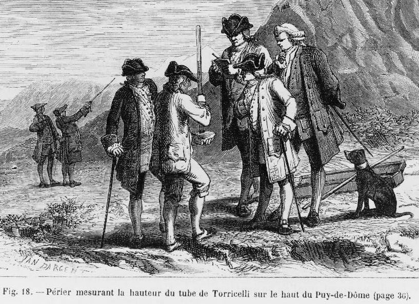

# The Barometer Story

 This work is licensed under a <a rel="license" href="http://creativecommons.org/licenses/by/4.0/">Creative Commons Attribution 4.0 International License</a>.

*[Section 2](../section2.md), session 8. The same session discusses [Telltale Number](telltale-number.md) and, under the note "About assumptions", [Tying Knots](tying-knots.md).*

!!! abstract "The problem"

    **Part 1: try it first.** A physics examination asked:
    *"Show how it is possible to determine the height of a tall building
    with the aid of a barometer."* (Alexander Calandra, 1959/1964.)

    Take five minutes and list every way you can think of, without
    stopping at the first. Then mark which of them a physics instructor
    would accept for full credit.

    **Part 2: the story**, paraphrased by the editors; Calandra's text is
    in copyright.

    Calandra was asked to referee a grading dispute. The instructor wanted
    to give a student zero; the student insisted on a perfect score. His
    answer was, in effect, lower the barometer from the roof on a rope and
    measure the rope. Calandra thought the answer complete and correct —
    and empty of physics, which is what a physics grade certifies.

    He gave the student six minutes to try again, with some physics in
    it. At five minutes the student had written nothing; asked whether he
    wished to give up, he said no, he had *many* answers and was choosing
    the best. In the last minute he wrote: drop the barometer from the
    roof, time the fall, use the free-fall formula. That earned almost full
    credit. On the way out he listed the rest: compare its shadow with the
    building's, mark the stairwell off in barometer-lengths, swing it as a
    pendulum and infer the height from the change in *g*, or — probably
    best, he said — trade the barometer to the superintendent for the
    answer.

    **For the session.** Which answer would you have graded highest, and
    what were you feeling as you decided?

{ width="560" }

*Six of the seven methods; the student's pendulum is left out, for the reason given below. Drawn for this site (CC BY 4.0).*

## Why it is in the course

The syllabus puts the story at the head of session 8 with "Adams Chapter 3: Emotional blocks", then "About assumptions and Tying Knots". Adams's blocks include fear of taking a risk, no appetite for chaos, and judging ideas instead of generating them. The instructor shows several at once: one answer in mind, instant judgement, no room for the rest. The student shows fluency, holding many answers in suspension through five silent minutes.

The story also carries the assumption lesson: "with the aid of a barometer" was silently read as "using the barometer's pressure reading". And it turns the lens on the reader, since most people feel a flash of irritation at one character or the other, and that feeling is the block under discussion.

## Where it comes from

Alexander Calandra (1911-2006) taught physics at Washington University in St. Louis from 1948 until his retirement in 1979. His essay "Angels on a Pin" appeared in *Pride* in 1959 and was reprinted in *Current Science* in January 1964 as "The Barometer Story: A problem in teaching critical thinking", whose main title is the one the syllabus uses. The version everyone copies is "Angels on the Head of a Pin", *Saturday Review*, 21 December 1968.

The joke is older. The *Reader's Digest Treasury of Wit & Humor* (1958) already has a student lowering an aneroid barometer on a string and measuring the string. Later retellings move the exam to Copenhagen and make the student Niels Bohr; Snopes files the tale under "Legend" and rejects that attribution.

??? tip "Hints"

    - Inventory the barometer as an object, not an instrument: it has a length, a shadow and a resale value, and it can be tied, dropped, swung and given away.
    - Ask what the question says and what the grader silently added.
    - Sort your list by what each method demonstrates: physics, ingenuity, or merely the number.
    - Check the accuracy. Pressure falls by roughly 1 hPa for every 8 m near sea level; is that measurable on a 30 m building?
    - Notice your reaction to each character, and name the block behind it.

## What happened

**The intended answer.** Read the barometer at street level and on the roof and take the difference: pressure falls with height, near sea level by about 1 hPa per 8 m. This is Pascal's idea, tested in 1648 when his brother-in-law Florin Périer carried a Torricelli tube up the Puy de Dôme. For one building it is also among the least precise methods on the list.

{ width="560" }

*Florin Périer measuring the mercury column near the top of the Puy de Dôme, 1648. Wood engraving by Yan Dargent for Louis Figuier, 1867; Library of Congress, LCCN 2006690481. Public domain, via Wikimedia Commons.*

**How the six hold up.** The rope is exact, and uses the barometer as a plumb bob. Free fall contains real physics but destroys the instrument, and a hand-timed fall is good to perhaps ten percent. Shadows work by similar triangles; the staircase is exact and tedious; the superintendent has no physics and perfect accuracy. The pendulum is the weak one: the free-air gradient of *g* is about three parts in ten million per metre, so a 100 m building changes *g* by three parts in a hundred thousand, which no stopwatch pendulum can detect. The answer that sounds most sophisticated is the only one that cannot be made to work — our objection, not Calandra's or Simanek's.

**What it does not settle.** Calandra's 1964 moral warns against teaching "the scientific method" as a recipe divorced from subject matter. Donald Simanek grants that the piece is nicely constructed humour but holds that "as a parable with a moral, it falls flat": Calandra never says plainly what the moral is. And the referee's dilemma is real. The rope answer is correct and shows no physics, so the defective thing was the question, not the student. The lesson is not that the student was right and the instructor wrong, but that the single-answer expectation was an assumption nobody examined.

## Sources

- **Alexander Calandra**, "Angels on the Head of a Pin: A Modern Parable", *Saturday Review*, 21 December 1968, p. 60 — [full text with Ronald B. Standler's note on the 1961 and 1964 versions](http://www.rbs0.com/baromete.htm){target=_blank} 🔓
- **Alexander Calandra**, "The Barometer Story: A problem in teaching critical thinking", *Current Science* (teacher's edition), 1964 — [full text, including the seven precautions](https://panarchy.org/calandra/barometer.html){target=_blank} 🔓
- **Alexander Calandra**, "Angels on the Head of a Pin" — [copy posted by Stephen Hicks](https://www.stephenhicks.org/2022/07/10/angels-on-the-head-of-a-pin-by-alexander-calandra/){target=_blank} 🔓
- **Alexander Calandra**, "The Barometer Story", in Lee Archie and John G. Archie (eds), *Reading for Philosophical Inquiry*, ch. 3 — [philosophy.lander.edu](https://philosophy.lander.edu/intro/introbook2.1/x874.html){target=_blank} 🔓
- **American College Public Relations Association**, *Pride*, vols 3-4 (1959), the essay's first appearance — [Google Books](https://books.google.com/books?id=DNWgAAAAMAAJ&q=barometer){target=_blank} 🔒
- **Reader's Digest Association**, *Reader's Digest Treasury of Wit & Humor* (1958), p. 303, the earlier one-liner — [Google Books](https://books.google.com/books?id=P7cNAQAAMAAJ&q=aneroid+barometer){target=_blank} 🔒
- **Joachim Verhagen** (compiler) and **Donald E. Simanek**, *Science Jokes* section 2.12, which reproduces Calandra's text and Simanek's critique "The Barometer Fable" — [jcdverha.home.xs4all.nl](https://jcdverha.home.xs4all.nl/scijokes/2_12.html){target=_blank} 🔓
- **David Mikkelson**, "The Barometer Problem", *Snopes* (2000, revised since) — [snopes.com](https://www.snopes.com/fact-check/the-barometer-problem/){target=_blank} 🔓
- **Richard R. Hake**, "The Old Barometer Story (OBS) Redux" (2013) — [mailing-list archive](http://betterfilecabinet.com/pipermail/rume_betterfilecabinet.com/2013-January/004364.html){target=_blank} 🔓
- **Nature Loves Math**, "The myth of Niels Bohr and the barometer question" (2011) — [naturelovesmath.com](https://www.naturelovesmath.com/en/humor/the-myth-of-niels-bohr-and-the-barometer-question/){target=_blank} 🔓
- **Wikipedia contributors**, "Barometer question" — [en.wikipedia.org](https://en.wikipedia.org/wiki/Barometer_question){target=_blank} 🔓
- **Wikipedia contributors**, "Alexander Calandra" — [en.wikipedia.org](https://en.wikipedia.org/wiki/Alexander_Calandra){target=_blank} 🔓
- **James L. Adams**, *Conceptual Blockbusting: A Guide to Better Ideas* (1974; 3rd ed. 1986), Chapter 3, Emotional Blocks — [Internet Archive](https://archive.org/details/conceptualblockb00jame){target=_blank} 🔓 *(borrow)*
- **Arthur T. Winfree**, *The Art of Scientific Discovery: original course syllabus* — [PDF](https://github.com/tyson-swetnam/aosd/blob/main/docs/assets/aosd_syllabus.pdf){target=_blank} 🔓

---

*Back to [Section 2](../section2.md) · [All problems](index.md) · [The schedule](../syllabus.md#section-2-creative-blocks)*
