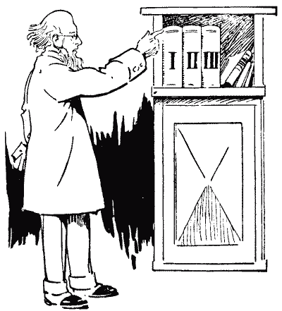

# Bookworm's Journey

 This work is licensed under a <a rel="license" href="http://creativecommons.org/licenses/by/4.0/">Creative Commons Attribution 4.0 International License</a>.

*[Section 1](../section1.md), session 4. Discussed together with [Golden Tooth](golden-tooth.md) and [Salvation of Doug](salvation-of-doug.md).*

!!! abstract "The problem"

    A set of volumes of a learned work stands in its usual order on a
    bookshelf: Volume I at the left, then Volume II, and so on, spines
    facing outward. A bookworm starts at the first page of Volume I and
    bores in a straight line, perpendicular to the covers, until it reaches
    the last page of the last volume.

    Suppose there are three volumes. In each, the leaves (the paper, not
    counting covers) are together 3 inches thick, and each cover is 1/8
    inch thick.

    **How long is the bookworm's tunnel?**

    Before you compute, decide what you actually *know* about where "the
    first page of Volume I" and "the last page of Volume III" sit on the
    shelf, and what you are only *imagining*. If you have three matching
    books to hand, you are allowed to go and look.

    *Variant for a larger shelf:* an encyclopedia has ten volumes, each 2
    inches thick including two 1/8-inch covers. Same question.

    The three-volume dimensions are H. E. Dudeney's, from "The Industrious
    Bookworm", Problem 420 of *Amusements in Mathematics* (1917, public
    domain), in which Professor Rackbrane reports that a bookworm "has
    actually bored a hole straight through from the first page to the
    last" of three volumes on his shelf. The ten-volume variant is the
    common modern retelling, reconstructed here. Winfree's own numbers are
    not recorded.

{ width="560" }

*Dudeney's illustration for Problem 420, "The Industrious Bookworm", from Amusements in Mathematics (1917). Public domain, via Project Gutenberg eBook #16713.*

## Why it is in the course

The syllabus lists this puzzle for session 4 with the note "distinguishing things we know vs only imagine". It shares the session with the [Golden Tooth](golden-tooth.md) ("facts before explanations of facts") and the [Salvation of Doug](salvation-of-doug.md), all inside Section 1, whose theme is detecting nonsense, error checking, false assumptions and cherishing mistakes.

Dudeney's own solution opens with "the hasty reader", who answers at once and answers wrongly. The mistake is not arithmetical. It comes from a picture the imagination supplies without being asked, and that picture stands in, unnoticed, for a fact anyone could check in ten seconds by walking to a shelf. So the puzzle is a miniature of the section's theme, and of its neighbour the Golden Tooth, where a learned explanation was built on a fact nobody had verified. Before you explain or calculate, ask which parts of your mental picture are observations and which are assumptions you never examined.

The syllabus says the puzzles in this course are "contrived much as the organizers of an Easter Egg Hunt do", and that their purpose "is to slow you down for a few minutes so you can examine the working of your own mind". This one only slows you down if you refuse to trust the first picture that comes to mind.

## Where it comes from

According to David Singmaster's *Sources in Recreational Mathematics* (section 7.AT, "Bookworm's Distance") and his *Chronology of Recreational Mathematics*, the earliest known printed appearance is in *Sam Loyd's Cyclopedia of 5000 Puzzles, Tricks and Conundrums* (1914), compiled by Loyd's son after his death. Loyd's version is a timing puzzle with two volumes: Volume I has 100 leaves and Volume II 150 leaves; a "destructive little bookworm (Ptinus brunneus)" bores one leaf a minute and takes an hour to get through a cover; how long does it take to get from the first page of Volume I to the last page of Volume II? Singmaster suspected an earlier nineteenth-century origin but could not document one.

H. E. Dudeney published the three-volume distance version as Problem 420, "The Industrious Bookworm", in *Amusements in Mathematics* (1917), with Professor Rackbrane pointing at three volumes on his shelf. Singmaster lists more than a dozen later appearances between 1924 and 1971, under titles such as "Bookworm's pilgrimage" (1939) and "Way of a worm" (1943), with two, three or four volumes.

Eugene P. Northrop put it on page 1 of *Riddles in Mathematics: A Book of Paradoxes* (1944), in his opening chapter "What is a Paradox?". He treats the puzzle as a specimen of reasoning led astray by hasty judgment, the wrong answer following from a failure to examine every part of the problem. A few pages later he calls it "the problem of the bookworm's journey" — the closest published match to Winfree's title, though a natural enough name for it, so it is corroboration rather than evidence of how the puzzle reached him. Today it is usually posed with a ten- or twenty-volume encyclopedia.

??? tip "Hints"

    - Do not reach for arithmetic yet. First ask: on a shelf, which physical side of Volume I is its first page on, the left or the right? Which side of the last volume is its last page on?
    - Picture pulling Volume I off the shelf and opening it to page 1. Which way did you have to turn it? Where was page 1 relative to the neighbouring volume while the book was still on the shelf?
    - Try the smallest case: just two volumes. How much paper does the worm actually cross?
    - If you have any three matching books in the room, line them up and poke a pencil in at page 1 of the first. This is the "go and look" step, and it is the whole lesson.
    - Once you have the geometry right, the arithmetic is one line: count the covers crossed and the complete volumes crossed.

??? success "Resolution"

    When the volumes stand in order on a shelf with spines outward, each
    book's front cover faces right, toward the next volume, and its back
    cover faces left. So page 1 of Volume I is at the right-hand edge of
    Volume I, just inside its front cover and next to Volume II. The last
    page of the final volume is at the left-hand edge of that volume, just
    inside its back cover. A straight tunnel from one to the other passes
    through the front cover of Volume I, all of the intermediate volumes
    (paper and both covers each), and the back cover of the last volume.
    It does not pass through the leaves of the first or last volume at all.

    { width="560" }

    *The shelf seen from above. Drawn for this site (CC BY 4.0).*

    **Dudeney's three-volume case** (leaves 3 inches per volume, covers 1/8
    inch): the worm penetrates four covers (1/2 inch) and the leaves of
    Volume II (3 inches), a total of **3 1/2 inches**, against the hasty
    answer of 9 inches. In Dudeney's words: "You will find, on examining
    any three consecutive volumes on your shelves, that the first page of
    Vol. I. and the last page of Vol. III. are actually the pages that are
    nearest to Vol. II."

    **Ten-volume variant** (each volume 2 inches thick including two
    1/8-inch covers): two covers (1/4 inch) plus eight whole volumes (16
    inches) makes **16 1/4 inches**, not 20.

    **Two-volume case** (Loyd's original, 1914): the worm crosses only two
    covers and no paper at all. At Loyd's rate of one hour per cover, "it
    requires but two hours".

    A caveat worth raising in class: the answer depends on a convention
    (Western books, spines out, volumes in left-to-right order). A
    right-to-left script or a differently arranged shelf changes the
    geometry. That is the point. The shelf is a fact to be checked, not a
    thing to be assumed.

## Sources

- **Henry Ernest Dudeney**, *Amusements in Mathematics*, Problem 420, "The Industrious Bookworm" (1917) — [Project Gutenberg eBook #16713](https://www.gutenberg.org/files/16713/16713-h/16713-h.htm){target=_blank} 🔓
- **Sam Loyd** (compiled by Sam Loyd Jr.), *Sam Loyd's Cyclopedia of 5000 Puzzles, Tricks and Conundrums*, pp. 327 and 383 (1914) — [scan on Wikimedia Commons](https://commons.wikimedia.org/wiki/File:Cyclopedia_of_Puzzles_by_Samuel_Loyd.pdf){target=_blank} 🔓
- **David Singmaster**, *Sources in Recreational Mathematics*, section 7.AT, "Bookworm's Distance" (c. 2004) — [SOURCE3.DOC](https://www.puzzlemuseum.com/singma/singma5/SOURCES/SOURCE3.DOC){target=_blank} 🔓
- **David Singmaster**, *Chronology of Recreational Mathematics* (c. 2000) — [link](https://utenti.quipo.it/base5/introduz/singchro.htm){target=_blank} 🔓
- **Eugene P. Northrop**, *Riddles in Mathematics: A Book of Paradoxes*, Chapter One, p. 1 (D. Van Nostrand, 1944; Dover reprint, ISBN 9780486780160) — [Dover Publications](https://store.doverpublications.com/products/9780486780160){target=_blank} 🔒
- **Eugene P. Northrop**, *Riddles in Mathematics: A Book of Paradoxes*, 1945 English Universities Press printing — [Internet Archive, Digital Library of India scan](https://archive.org/details/dli.ernet.247854){target=_blank} 🔓
- **ProofWiki contributors**, "Bookworm Riddle" — [ProofWiki](https://proofwiki.org/wiki/Bookworm_Riddle){target=_blank} 🔓
- **Arthur T. Winfree**, *The Art of Scientific Discovery: original course syllabus* — [PDF](https://github.com/tyson-swetnam/aosd/blob/main/docs/assets/aosd_syllabus.pdf){target=_blank} 🔓

---

*Back to [Section 1](../section1.md) · [All problems](index.md) · [The schedule](../syllabus.md#section-1-detecting-nonsense-error-checking-false-assumptions-cherishing-mistakes)*
