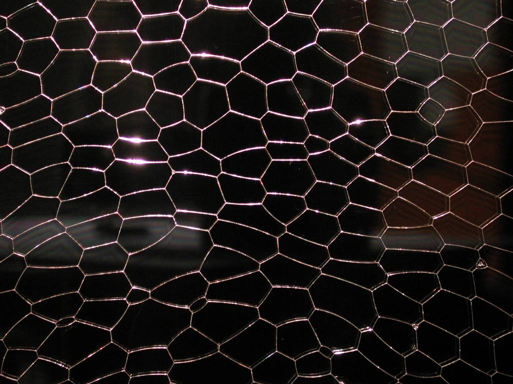

# Cell Shapes Lab

 This work is licensed under a <a rel="license" href="http://creativecommons.org/licenses/by/4.0/">Creative Commons Attribution 4.0 International License</a>.

*[Section 4](../section4.md), session 20, continuing through sessions 21 and 22. Session 21 also deals with [Paired Observations](paired-observations.md) and [Neutrinos](neutrinos.md); session 22 with the [Egg Pouches](egg-pouches-lab.md) lab and [Platonic Solids](platonic-solids.md).*

!!! abstract "The problem"

    Reconstructed from the syllabus, which says only "Start Cell Shapes
    lab in class", then "Collaborative experiments" and "Further
    experiments on cell shapes". No lab sheet survives; the recipe is the
    editors' suggestion.

    **The material.** A flat patch of cells, with no gaps and no overlaps.
    Different groups can use different ones: a *froth* (bubbles blown into
    a saucer of dish-soap solution and squashed into one layer under clear
    plastic), a *living sheet* (onion skin, a leaf peel, a micrograph), or
    a *drawn sheet* (forty scattered dots, each given the points nearer to
    it than to any other dot).

    **The task.** Count before you theorise. Record each cell's sides and
    area, and how many walls meet at each junction, at what angles. Pool
    the class's counts and look for regularities: the average number of
    sides, and any link between size and sides, or between a cell's sides
    and its neighbours'. If you made a froth, revisit the same cells next
    session: which grew, which vanished? Then try to prove whichever rule
    survives.

{ width="560" }

*A two-dimensional foam, the kind of patch a group would count. Photograph by Klaus-Dieter Keller. Public domain, via Wikimedia Commons.*

## Why it is in the course

Section 4 is "Patterns, Empirical Generalizations". Nobody announces the
law: the class finds it by counting, then tries to explain it, in session
4's order, "facts before explanations of facts". It is one of the course's puzzles
"for simple lab manipulation", and the syllabus gives it three sessions,
the second for "Collaborative experiments".

It also sets a trap. A froth *looks* hexagonal, so people say "hexagons".
Some of what the counts show is forced by topology, and some is only
roughly true; telling those apart echoes session 4's
"distinguishing things we know vs only imagine". Session 22 pairs the last
experiments with [Platonic Solids](platonic-solids.md), carrying the
question into three dimensions.

## Where it comes from

Robert Hooke named the biological "cell" in *Micrographia* (1665),
describing cork under a heading that already speaks of "frothy Bodies".
Joseph Plateau set out the rules of soap films in the nineteenth century;
D'Arcy Thompson's *On Growth and Form* (1917) saw the same froth in
plant tissue, with cell walls "everywhere meeting, by threes, at angles of
120 degrees, irrespective of the size of the individual cells".

Then came the counters: F. T. Lewis on cucumber epidermis (1928), Edwin
Matzke on 600 foam bubbles (1946), D. A. Aboav on grains in metal (1970),
von Neumann and W. W. Mullins on how a flat froth coarsens (1952, 1956).
Weaire and Rivier reviewed the field in 1984, and Graner and Riveline
(2017) test Thompson's analogy against living tissue.

Winfree knew this ground: his publication list includes a 1961 Westinghouse
Science Talent Search award project, "The physics and chemistry of soap
bubbles and films", and a 1977 study with Joseph Altman of how Purkinje
cells are spaced.

??? tip "Hints"

    - Settle your definitions first: what is a side, a vertex, a rim cell? Write the rules down.
    - Look at the junctions before the cells. If four walls seem to meet, look closer.
    - Compute the mean and the whole distribution, not just the commonest value.
    - Plot area against number of sides, and a cell's sides against its neighbours' average. Which relation only looks convincing?
    - Count vertices, edges and faces and try Euler's V - E + F = 2. Could your average have come out any other way?

??? success "Resolution"

    - **Three walls to a junction, at 120 degrees.** Plateau's rule in a froth; a four-way junction splits into two three-way ones.
    - **Six sides on average, a theorem.** If three edges meet at every vertex, 3V = 2E, and Euler's formula gives F = E/3 + 2. Each edge borders two cells, so the mean number of sides is 2E/F, which tends to 6 as the patch grows. Topology forces it, not soap or biology.
    - **Not hexagons.** Five-, six- and seven-sided cells dominate. In Thompson's words, "the cells will be *on the average* hexagonal, but some will have fewer and some more sides than six".
    - **Lewis's law (approximate).** Cells with more sides tend to be larger; a rule of thumb that fails in several real tissues (Fischer and colleagues, 2023).
    - **Aboav-Weaire law (approximate).** Many-sided cells tend to have few-sided neighbours.
    - **Von Neumann's law, in a froth watched over days.** A cell's area changes at a rate proportional to (n - 6): cells with fewer than six sides shrink and vanish, those with more grow, and the average stays at six (tested on a real foam by Roth, Jones and Durian, 2012).

    { width="560" }

    *Drawn for this site (CC BY 4.0). Schematic, with straight walls.*

    **In three dimensions** no Platonic solid appears: Matzke's bubbles averaged about 13.7 faces, and Kelvin's 1887 candidate for the least-area partition of space was beaten in 1994 by the Weaire-Phelan structure.

## Sources

- **D'Arcy Wentworth Thompson**, *On Growth and Form*, 1st ed., Chapters VII-VIII (1917) — [Project Gutenberg](https://www.gutenberg.org/ebooks/55264){target=_blank} 🔓
- **Robert Hooke**, *Micrographia*, Observation XVIII and Scheme XI (1665) — [Wikimedia Commons](https://commons.wikimedia.org/wiki/File:Micrographia_Schem_11.jpg){target=_blank} 🔓
- **Wikipedia contributors**, "Plateau's laws" — [Wikipedia](https://en.wikipedia.org/wiki/Plateau%27s_laws){target=_blank} 🔓
- **Frederic T. Lewis**, "The correlation between cell division and the shapes and sizes of prismatic cells in the epidermis of Cucumis", *Anatomical Record* 38, 341–376 (1928) — [doi:10.1002/ar.1090380305](https://doi.org/10.1002/ar.1090380305){target=_blank} 🔒
- **Edwin B. Matzke**, "The three-dimensional shape of bubbles in foam", *American Journal of Botany* 33, 58–80 (1946) — [doi:10.1002/j.1537-2197.1946.tb10347.x](https://doi.org/10.1002/j.1537-2197.1946.tb10347.x){target=_blank} 🔒
- **D. A. Aboav**, "The arrangement of grains in a polycrystal", *Metallography* 3, 383–390 (1970) — [doi:10.1016/0026-0800(70)90038-8](https://doi.org/10.1016/0026-0800(70)90038-8){target=_blank} 🔒
- **W. W. Mullins**, "Two-dimensional motion of idealized grain boundaries", *Journal of Applied Physics* 27, 900–904 (1956) — [doi:10.1063/1.1722511](https://doi.org/10.1063/1.1722511){target=_blank} 🔒
- **Denis Weaire and Nicolas Rivier**, "Soap, cells and statistics - random patterns in two dimensions", *Contemporary Physics* 25, 59–99 (1984) — [doi:10.1080/00107518408210979](https://doi.org/10.1080/00107518408210979){target=_blank} 🔒
- **A. E. Roth, C. D. Jones and D. J. Durian**, "Coarsening of Two Dimensional Foam on a Dome", *Physical Review E* 86, 021402 (2012) — [arXiv:1206.2293](https://arxiv.org/abs/1206.2293){target=_blank} 🔓
- **Sir William Thomson (Lord Kelvin)**, "On the division of space with minimum partitional area", *Philosophical Magazine* 24, 503–514 (1887) — [doi:10.1080/14786448708628135](https://doi.org/10.1080/14786448708628135){target=_blank} 🔒
- **Denis Weaire and Robert Phelan**, "A counter-example to Kelvin's conjecture on minimal surfaces", *Philosophical Magazine Letters* 69, 107–110 (1994) — [doi:10.1080/09500839408241577](https://doi.org/10.1080/09500839408241577){target=_blank} 🔒
- **François Graner and Daniel Riveline**, "'The Forms of Tissues, or Cell-aggregates': D'Arcy Thompson's influence and its limits", *Development* 144, 4226–4237 (2017) — [doi:10.1242/dev.151233](https://doi.org/10.1242/dev.151233){target=_blank} 🔒
- **Sabine C. Fischer, George W. Bassel and Philip Kollmannsberger**, "Tissues as networks of cells: towards generative rules of complex organ development", *Journal of the Royal Society Interface* 20, 20230115 (2023) — [PMC](https://pmc.ncbi.nlm.nih.gov/articles/PMC10369035/){target=_blank} 🔓
- **Joseph Altman and Arthur T. Winfree**, "Postnatal development of the cerebellar cortex in the rat. V. Spatial organization of Purkinje cell perikarya", *Journal of Comparative Neurology* 171, 1–16 (1977) — [doi:10.1002/cne.901710102](https://doi.org/10.1002/cne.901710102){target=_blank} 🔒
- **Arthur T. Winfree**, publications in chronological order (archived lab page, 2002) — [Internet Archive](https://web.archive.org/web/20020110220211/http://eebweb.arizona.edu:80/Faculty/Winfree/chronological.html){target=_blank} 🔓
- **Arthur T. Winfree**, *The Art of Scientific Discovery* course handout (archived 20 April 2002) — [Internet Archive](https://web.archive.org/web/20020420212713/http://eebweb.arizona.edu/Faculty/Winfree/handout_479.htm){target=_blank} 🔓
- **Arthur T. Winfree**, *The Art of Scientific Discovery*: original course syllabus — [PDF](https://github.com/tyson-swetnam/aosd/blob/main/docs/assets/aosd_syllabus.pdf){target=_blank} 🔓

!!! note "How sure are we that this is Winfree's problem?"

    Sure of the subject, not of the method. The syllabus gives the name and
    three sessions; Winfree's archived handout lists the same entries. No
    description of the exercise survives, so the medium is unknown.

    - **A flat soap froth**, watched as it coarsens: cheap, changing between classes, and close to Winfree's 1961 soap-film project. Medium confidence.
    - **Biological cell sheets**, such as leaf or onion epidermis, the material of Lewis's counts. Needs microscopes. Medium confidence.
    - **A paper construction**, such as cells drawn around scattered dots, following session 19's [slicing of a disk](n-dots-on-circle.md). Needs only pencils, but "experiments" suggest something that changes. Low confidence.

---

*Back to [Section 4](../section4.md) · [All problems](index.md) · [The schedule](../syllabus.md#section-4-patterns-empirical-generalizations)*
