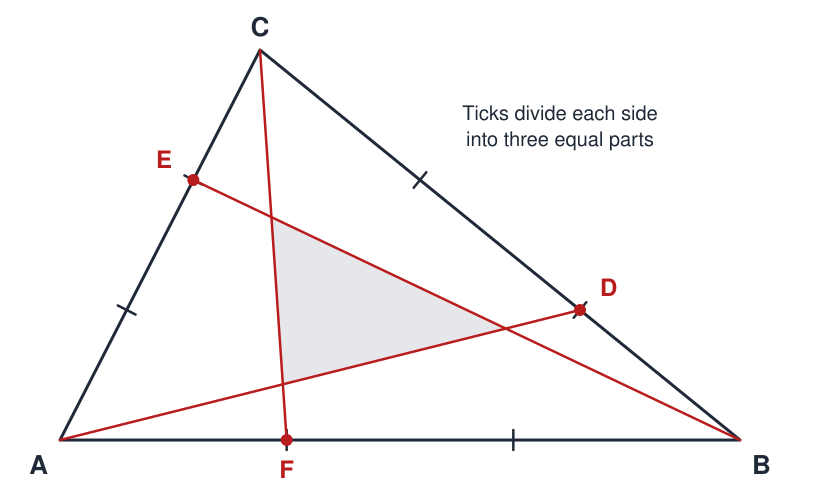

# Cevians

 This work is licensed under a <a rel="license" href="http://creativecommons.org/licenses/by/4.0/">Creative Commons Attribution 4.0 International License</a>.

*[Section 3](../section3.md), session 18. Discussed together with [Superposed Filters](superposed-filters.md).*

!!! abstract "The problem"

    *The syllabus gives only the name. This is the editors' statement of the
    puzzle it most probably means; see the note at the end.*

    A **cevian** is a straight segment from a corner of a triangle to a
    point on the opposite side (a median is one example).

    Draw a large triangle *ABC*. Mark *D* one-third of the way from *B* to
    *C*, *E* one-third of the way from *C* to *A*, and *F* one-third of the
    way from *A* to *B*. Draw the cevians *AD*, *BE* and *CF*. They enclose
    a small triangle in the middle.

    1. Before measuring, write down a guess: what fraction of the area of
       *ABC* is the central triangle?
    2. Measure it and compare.
    3. Explain the number, then find a second, independent explanation.
    4. Does the answer depend on the shape of the triangle?
    5. What if the marks sit at one-quarter of each side, or at different
       fractions on different sides?

{ width="560" }

*Drawn for this site (CC BY 4.0).*

## Why it is in the course

Section 3 is "Observations and Questions", and here a measurement overrules
a confident first impression. The figure is built entirely from thirds.
When James Randi set the puzzle in early 2001, he reported
that an instinctive answer "might be one-ninth, which many readers gave us."
A careful drawing disagrees, and the honest next step is a question: why
that number?

The syllabus says the puzzles exist "to slow you down for a few minutes so
you can examine the working of your own mind". Writing the guess down first
is how you catch your mind at work. As with session 12's
[Sums of Integers](sums-of-integers.md), "like a jig-saw puzzle of
cross-checks", the answer can be reached several ways that check one another.

## Where it comes from

Robert Potts's 1859 school edition of Euclid poses the figure for an
equilateral triangle (Problem 59). A later exercise (Problem 100) asks the
reader to show what share of the area each of its two triangles has: one joining the
marks, and one enclosed by the cevians. (His numbers are in the Resolution.)

The general formula, for cevians cutting the sides in any ratios, was set in
the Cambridge Tripos of January 1878 and solved in Glaisher's 1879 volume of
solutions. Edward John Routh, himself a Tripos coach then, printed it in a
footnote to his *Treatise on Analytical Statics* (first edition 1891;
p. 82 of the 1896 second edition), noting that "the author has not met with
these expressions". It is called Routh's theorem all the same.

The puzzle became famous through Hugo Steinhaus's *Mathematical Snapshots*,
which gives a proof with no algebra. Martin Gardner sent that proof to
Randi's column in 2001. A 2004 *Mathematical Gazette* note, "Feynman's
triangle", reportedly tells how Richard Feynman was set the puzzle in a
dinner conversation and worked it out himself. The editors have not read it.

??? tip "Hints"

    - Draw it big on graph paper and count squares before reasoning.
    - Start with a convenient triangle: (0,0), (3,0), (0,3). Then ask
      whether an affine map, which takes any triangle to any other and
      scales every area by the same factor, could change the fraction.
    - Find how each cevian is cut by the other two. The ratio is simple.
    - No algebra: through each corner of the central triangle, draw a line
      parallel to the side opposite that corner. Add parallels in the same
      three directions through *A*, *B* and *C*. Compare the pieces outside
      *ABC* with the gaps inside.

??? success "Resolution"

    The central triangle is exactly **one-seventh** of *ABC*, for any
    triangle.

    **Coordinates.** With *A* = (0,0), *B* = (3,0), *C* = (0,3) (area 9/2),
    *D* = (2,1), *E* = (0,2), *F* = (1,0). The cevians cross at
    *P* = (6/7, 3/7) (*AD* and *CF*), *Q* = (12/7, 6/7) (*AD* and *BE*) and
    *R* = (3/7, 12/7) (*BE* and *CF*). The shoelace formula gives triangle
    *PQR* an area of 9/14, and (9/14)/(9/2) = 1/7. Affine maps preserve area
    ratios, so this holds for every triangle.

    **Ratios.** Each cevian is cut 3 : 3 : 1 counting from its corner: *P*
    and *Q* sit 3/7 and 6/7 of the way from *A* to *D*. Triangle *AFC* is
    one-third of *ABC*, because *AF* is one-third of *AB*. Triangle *AFP*
    has the same apex *A* and a base *FP* one-seventh as long as *FC*, so it
    is 1/21 of *ABC*. The same argument makes *BDQ* and *CER* 1/21 each.
    Triangle *ABD* is also one-third (7/21) of *ABC*, and it holds *AFP*,
    *BDQ* and one quadrilateral, so each quadrilateral is 5/21. The centre
    gets what is left: 21 − 3 − 15 = 3 twenty-firsts, or 1/7.

    **Steinhaus.** Through each corner of the central triangle, draw a line
    parallel to the opposite side. Each passes through one of the unused
    one-third marks. Parallels in the same directions through *A*, *B* and
    *C* complete six copies of the central triangle around it. The parts of
    the copies that stick out beyond the sides of *ABC* match the gaps left
    inside it, so *ABC* has the area of seven central triangles.

    **Routh's theorem.** If *CD*/*BD* = *x*, *AE*/*CE* = *y*,
    *BF*/*AF* = *z*, the central fraction is
    (*xyz* − 1)² / [(*xy* + *y* + 1)(*yz* + *z* + 1)(*zx* + *x* + 1)].
    With all ratios equal to *n* it is (*n* − 1)² / (*n*² + *n* + 1): 0 for
    medians, 1/7 for thirds, 4/13 for quarter points. Potts's Problem 100
    gives "one-third and one-seventh" for his two triangles. For more proofs
    see Coxeter's *Introduction to Geometry* and Klamkin and Liu (1981).

## Sources

- **Robert Potts**, *Euclid's Elements of Geometry*, fifth school edition, Problems 59 and 100, pp. 78 and 80 (1859) — [Internet Archive](https://archive.org/details/euclidselements00unkngoog){target=_blank} 🔓
- **J. W. L. Glaisher, G. H. Prior and N. M. Ferrers**, *Solutions of the Cambridge Senate-House Problems and Riders for the Year 1878*, rider (vii), p. 33 (1879) — [Internet Archive](https://archive.org/details/solutionsofcambr00glaiuoft){target=_blank} 🔓
- **Edward John Routh**, *A Treatise on Analytical Statics, with Numerous Examples*, vol. I, 2nd ed., footnote on p. 82 (1896) — [Internet Archive](https://archive.org/details/cihm_33231){target=_blank} 🔓
- **Hugo Steinhaus**, *Mathematical Snapshots*, revised English edition (1960) — [Internet Archive](https://archive.org/details/mathematicalsnap0000stei){target=_blank} 🔓 *(borrow)*
- **H. S. M. Coxeter**, *Introduction to Geometry*, 2nd ed. (1969) — [Internet Archive](https://archive.org/details/introductiontoge0000coxe){target=_blank} 🔓 *(borrow)*
- **M. S. Klamkin and A. Liu**, "Three more proofs of Routh's theorem", *Crux Mathematicorum* 7, 199–203 (1981) — [CMS scan of the issue](https://cms.math.ca/wp-content/uploads/crux-pdfs/Crux_v7n07_Aug.pdf){target=_blank} 🔓
- **James Randi**, Commentary of 9 February 2001 (the puzzle's answer and the Steinhaus proof sent by Martin Gardner) — [Wayback Machine](https://web.archive.org/web/20060427055758/http://www.randi.org/jr/02-09-2001.html){target=_blank} 🔓
- **R. J. Cook and G. V. Wood**, "88.46 Feynman's triangle", *The Mathematical Gazette* 88(512), 299–302 (2004) — [doi:10.1017/S002555720017514X](https://doi.org/10.1017/S002555720017514X){target=_blank} 🔒 (not read by the editors)
- **Wikipedia contributors**, "One-seventh area triangle" — [Wikipedia](https://en.wikipedia.org/wiki/One-seventh_area_triangle){target=_blank} 🔓
- **Wikipedia contributors**, "Routh's theorem" — [Wikipedia](https://en.wikipedia.org/wiki/Routh%27s_theorem){target=_blank} 🔓
- **Eric W. Weisstein**, "Routh's Theorem", MathWorld — [MathWorld](https://mathworld.wolfram.com/RouthsTheorem.html){target=_blank} 🔓
- **Arthur T. Winfree**, *The Art of Scientific Discovery*: original course syllabus — [PDF](https://github.com/tyson-swetnam/aosd/blob/main/docs/assets/aosd_syllabus.pdf){target=_blank} 🔓

!!! note "How sure are we that this is Winfree's problem?"

    Probable, not certain. The syllabus lists only "Cevians" in session 18,
    beside Superposed Filters, and no surviving Winfree document describes
    it. This puzzle is the standard one told in terms of cevians, needs no
    apparatus, has a surprising measurable answer and cross-checking proofs,
    and was in Randi's column in 2001 (the syllabus says many handouts came
    "from current periodicals").
    Two weaker readings remain:

    - **Counting regions** made by several cevians from each corner, a
      pattern hunt; but the disk-slicing problem,
      [n dots on a circle](n-dots-on-circle.md), is listed separately in
      session 19.
    - **Ceva's theorem**: discover when three cevians meet in one point, as
      medians do. The name comes from it, but it lacks a one-number surprise.

---

*Back to [Section 3](../section3.md) · [All problems](index.md) · [The schedule](../syllabus.md#section-3-observations-and-questions)*
