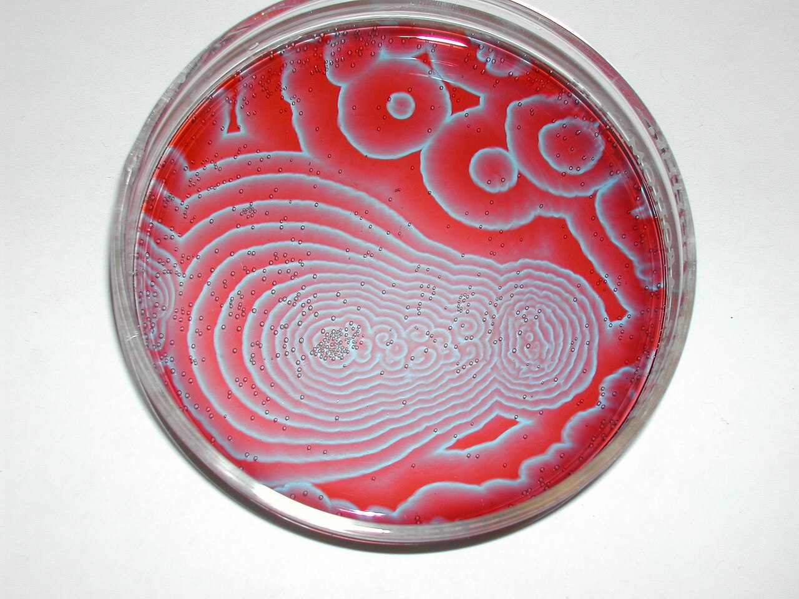
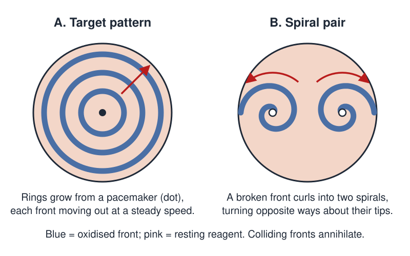

# Chemical Pattern-Formation Lab

 This work is licensed under a <a rel="license" href="http://creativecommons.org/licenses/by/4.0/">Creative Commons Attribution 4.0 International License</a>.

*[Section 3](../section3.md), session 13, continuing through sessions 14 and 15. The same session discusses [Ant Walk](ant-walk.md), [Seven Bridges](seven-bridges.md) and the [Pedestrian Crosswalk Mystery](pedestrian-crosswalk-mystery.md).*

!!! abstract "The problem"

    Reconstructed from the syllabus: the schedule says only "start lab
    exercise on chemical pattern-formation", then "more chemical
    observations", then "last chemical observations". No lab sheet
    survives; this is the exercise as it was most likely run.

    **The set-up.** A layer a few millimetres deep of the ferroin-catalysed
    Belousov-Zhabotinsky reagent, in a covered petri dish about 10 cm
    across, left unstirred on a white background. The reagent is an acidic
    mix of bromate, malonic acid and the iron indicator ferroin, red when
    reduced and blue when oxidised, so the chemistry paints its own
    picture. It contains sulfuric acid and bromate, so it needs goggles,
    gloves, supervision, and a published safety-checked recipe for this
    unstirred dish, not one from this page. Note that the open recipes
    below (the RSC's, Ruoff's) are for the stirred beaker version instead.

    **The task.** Over three sessions, in small groups, keep a dated
    notebook of what you *see*, not of what you think is happening, and
    sketch the dish at intervals. When do the first blue spots appear? How
    fast do the rings grow? What happens when two fronts meet, or when one
    is broken? Then rank the questions your observations raise by how
    surprising the answer would be, and test one, prediction written down
    first.

{ width="560" }

*Target patterns in a real dish, with the bubbles and stray fronts a
diagram leaves out. Photograph by Stephen Morris, chemistry by Michael
Rogers, 2004. CC BY 2.0, via Wikimedia Commons.*

{ width="560" }

*The two patterns to watch for. Drawn for this site (CC BY 4.0).*

## Why it is in the course

Section 3 is "Observations and Questions", and the syllabus labels these
three days as observations and nothing else. A dish of this reagent is
almost an instrument for the purpose: something visibly happens over
minutes, the patterns are strange, and nobody in the room can explain
them. That forces session 4's discipline of "facts before explanations of
facts", like the outdoor exercise in the same session, where the class
watches a [pedestrian crosswalk](pedestrian-crosswalk-mystery.md).

The readings press the point: session 14 pairs the lab with Judson's
*Chance* and [What Isn't There](what-isnt-there.md), session 15 with
Judson's *Evidence* and
[Mother Nature as magician](mother-nature-as-magician.md). The syllabus
promises puzzles "for pencil and paper and for simple lab manipulation";
this is the lab half, and it asks for no chemistry, only patience and an
honest notebook.

## Where it comes from

Boris Belousov found the first oscillating reaction in a stirred flask in
the early 1950s. Editors rejected it, by Winfree's own account, because a
solution changing colour back and forth looked like a violation of
thermodynamics; it surfaced only in an obscure 1959 volume. Anatol
Zhabotinsky took it up in 1961.

In 1970 Zaikin and Zhabotinsky reported in *Nature* that a thin unstirred
layer makes expanding rings from point pacemakers. Later that year Winfree,
then at Chicago, saw what his own reasoning had ruled out. He had argued on
topological grounds that a wave cannot rotate forever in a plain layer: it
needs a hole to circulate around. Then came "a bewildering surprise, on
October 10, 1970, to behold several perfectly stable spiral waves sedately
rotating in a dish of this chemical reagent", in the words of Strogatz's
obituary of him. He published the spirals in *Science* in 1972; Field's
lecture demonstration the same year helped make the reaction a classroom
standard, and such spirals later turned up in fibrillating heart muscle.

So the class was watching the phenomenon its instructor's career was built
on, and an argument of his own that a dish had overturned.

??? tip "Hints"

    - Split the notebook page: on the left only what the eye sees, colours, shapes, times, distances; on the right your guesses. The left column fills more slowly than people expect.
    - Time things. How long from pouring to the first blue spot? How many millimetres a minute does a front travel? Does the gap between rings stay the same?
    - Watch a collision. When two rings meet, do they cross like ripples on a pond, or do something else?
    - Watch a free end. A broken front does not simply stop; sketch one end every minute.
    - Next session change one thing: layer thickness, temperature, a wire drawn through.

??? success "Resolution"

    There is no answer to grade; the exercise is the notebook. But careful
    observers reliably find this much.

    - **Pacemakers and targets.** Blue oxidation waves start at discrete points, a dust speck or a scratch, and spread as concentric rings at a steady few millimetres a minute. Fast pacemakers entrain slow ones, so a few targets come to rule the dish.
    - **Annihilation, not superposition.** Colliding fronts wipe each other out rather than crossing. Each is a pulse of excitation trailed by a refractory zone that cannot fire again yet: the signature of an *excitable medium*, and what links the dish to nerve and heart tissue.
    - **Spirals.** A broken front curls around its own refractory tail, usually giving a counter-rotating pair. Spirals turn faster than pacemakers and outlive them, so an old dish fills with them. Their tips are phase singularities: the "hole" Winfree's argument demanded, shrunk to a point.

## Sources

- **A. N. Zaikin and A. M. Zhabotinsky**, "Concentration Wave Propagation in Two-dimensional Liquid-phase Self-oscillating System", *Nature* 225, 535–537 (1970) — [doi:10.1038/225535b0](https://doi.org/10.1038/225535b0){target=_blank} 🔒
- **Arthur T. Winfree**, "Spiral Waves of Chemical Activity", *Science* 175(4022), 634–636 (1972) — [doi:10.1126/science.175.4022.634](https://doi.org/10.1126/science.175.4022.634){target=_blank} 🔒
- **Arthur T. Winfree**, "Rotating Chemical Reactions", *Scientific American* 230(6), 82–95 (June 1974) — [scientificamerican.com](https://www.scientificamerican.com/article/rotating-chemical-reactions/){target=_blank} 🔒
- **Arthur T. Winfree**, "The prehistory of the Belousov-Zhabotinsky oscillator", *Journal of Chemical Education* 61(8), 661 (1984) — [doi:10.1021/ed061p661](https://doi.org/10.1021/ed061p661){target=_blank} 🔒
- **Richard J. Field**, "A reaction periodic in time and space. A lecture demonstration", *Journal of Chemical Education* 49(5), 308 (1972) — [doi:10.1021/ed049p308](https://doi.org/10.1021/ed049p308){target=_blank} 🔒
- **Anatol M. Zhabotinsky**, "Belousov-Zhabotinsky reaction", *Scholarpedia* 2(9), 1435 (2007) — [scholarpedia.org](http://www.scholarpedia.org/article/Belousov-Zhabotinsky_reaction){target=_blank} 🔓
- **Peter Ruoff**, "The Phenomenology of the Belousov-Zhabotinsky Reaction" (University of Stavanger; authorship inferred from the site) — [ux.uis.no](https://www.ux.uis.no/~ruoff/BZ_Phenomenology.html){target=_blank} 🔓
- **Ted Lister / Royal Society of Chemistry**, "Classic Chemistry Demonstrations: 2. An oscillating reaction" (1995; the stirred version, not the petri-dish one) — [Internet Archive PDF](https://web.archive.org/web/20140816215935/http://www.rsc.org/learn-chemistry/content/filerepository/CMP/00/001/001/Classicdemos_full.pdf){target=_blank} 🔓
- **Bassam Z. Shakhashiri**, *Chemical Demonstrations: A Handbook for Teachers of Chemistry*, vol. 2 (University of Wisconsin Press) — [archive.org](https://archive.org/details/chemicaldemonstr0002shak){target=_blank} 🔓 *(borrow)*
- **Steven Strogatz**, "Arthur Taylor Winfree" (obituary), *Physics Today* 56(6), 74–75 (2003) — [physicstoday.aip.org](https://physicstoday.aip.org/obituaries/arthur-taylor-winfree){target=_blank} 🔓
- **Leon Glass**, "Arthur T. Winfree (1942-2002)" (obituary), *Nature* 421, 34 (2003) — [doi:10.1038/421034a](https://doi.org/10.1038/421034a){target=_blank} 🔒
- **Arthur T. Winfree**, *When Time Breaks Down: The Three-Dimensional Dynamics of Electrochemical Waves and Cardiac Arrhythmias* (1987) — [archive.org](https://archive.org/details/whentimebreaksdo0000winf){target=_blank} 🔓 *(borrow)*
- **Arthur T. Winfree**, *The Geometry of Biological Time* (1980; 2nd ed. 2001) — [archive.org](https://archive.org/details/geometryofbiolog0000winf){target=_blank} 🔓 *(borrow)*
- **Wikipedia contributors**, "Belousov-Zhabotinsky reaction" — [overview and bibliography](https://en.wikipedia.org/wiki/Belousov%E2%80%93Zhabotinsky_reaction){target=_blank} 🔓
- **Arthur T. Winfree**, "A. T. Winfree in Tucson, AZ" (archived lab home page, 2002) — [Internet Archive](https://web.archive.org/web/20021225142609/http://eebweb.arizona.edu/faculty/winfree/){target=_blank} 🔓
- **Arthur T. Winfree**, *The Art of Scientific Discovery* course handout (archived 2002) — [Internet Archive](https://web.archive.org/web/20020420212713/http://eebweb.arizona.edu/Faculty/Winfree/handout_479.htm){target=_blank} 🔓

!!! note "How sure are we that this is Winfree's problem?"

    Fairly, but not certainly. The syllabus gives three lines, and no lab
    sheet survives in the Internet Archive.

    - **The Belousov-Zhabotinsky reaction in petri dishes**, as above. Winfree's 2002 home page says his funding covered "chemical, cardiac, and neural excitable media", so the reagents were down the hall, and no other bench-top chemical pattern unfolds over hours with no instruments. High confidence.
    - **Liesegang rings**, periodic precipitation bands in a gel: as slow and as equipment-light, but nothing ties Winfree to them. Low confidence.
    - **A menu of systems.** The syllabus names no reaction. Low confidence.

    The protocol above is ordinary practice for this demonstration, not
    Winfree's instructions.

---

*Back to [Section 3](../section3.md) · [All problems](index.md) · [The schedule](../syllabus.md#section-3-observations-and-questions)*
