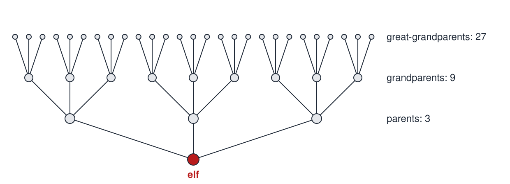

# Collective Reproduction

 This work is licensed under a <a rel="license" href="http://creativecommons.org/licenses/by/4.0/">Creative Commons Attribution 4.0 International License</a>.

*[Section 1](../section1.md), session 6, alongside [Evaporated Gold](evaporated-gold.md). The syllabus reads "Start group effort on Collective Reproduction".*

!!! abstract "The problem"

    **A reconstruction.** No statement of Winfree's exercise survives. This
    one was written for this site, not by Winfree. Its elves come from the
    one clue to the original (see "Where it comes from"); the numbers are
    illustrative choices.

    Someone describes a hidden valley of elves and makes four claims:

    - (i) Every elf has exactly three parents.
    - (ii) No elf's parents are related, and no elf appears twice in any family tree.
    - (iii) The valley has never held more than 1,000 elves at one time.
    - (iv) Elves have lived in the valley, and only there, for 40 generations.

    1. **Alone first.** How many great-great-grandparents does one elf
       have? How many ancestors 40 generations back?
    2. **Pool.** Compare answers as a class. Where you disagreed, was it
       arithmetic or a different assumption?
    3. **Find the fault.** Can all four claims be true together? Say
       which claims are involved.
    4. **Repair the story** with the smallest change. What must then be
       true about elf family trees?
    5. **Compare with people.** Does the same argument apply to your own
       ancestors, with two parents each, 30 generations back?

{ width="560" }

*Three generations of one elf's family tree under claim (i). Drawn for this site (CC BY 4.0).*

## Why it is in the course

Session 6 closes Section 1, "Detecting Nonsense, Error Checking, False Assumptions, Cherishing Mistakes". Its topics include "hidden assumptions", and it starts the first group effort in the schedule.

The syllabus says the class meets partly "to work jointly for a while on bigger problems or puzzles", including ones that "need lots of data-collecting, best pooled from many sources". If the leading reading in the note at the end is right (an inference), the lesson is that a harmless-sounding story can hide an impossibility that only arithmetic and a check of assumptions expose.

## Where it comes from

The syllabus line is the only text of Winfree's that names the exercise. The schedule is "a retrospective syllabus of Spring 2001, with dates changed to reflect the future", so it was presumably run in Spring 2001.

In the [HTML version of Winfree's handout](https://web.archive.org/web/20020420212713/http://eebweb.arizona.edu/Faculty/Winfree/handout_479.htm){target=_blank}, the link on this item points to a bookmark named `Elves_Collective_Reproduction`. The target is not in the handout, and its links to other course files point to paths on Winfree's own PC, archived only as failed captures. The name is the only trace of the content. No other checked page of his [archived site](https://web.archive.org/web/20021225142609/http://eebweb.arizona.edu/faculty/winfree/){target=_blank} mentions elves.

??? tip "Hints"

    - Draw one elf's family tree three generations back before calculating. Have a neighbour count your drawing.
    - List every assumption you make about the tree, including unstated ones. Which could fail?
    - Compare the size of the tree far back with something else the story tells you about the valley. Do the two fit?
    - If two claims clash, which does the least work in the story? Drop it and redraw the tree.

??? success "Resolution"

    For the reconstruction only; Winfree's own problem is unknown.

    With three parents and no repeats, generation *k* back holds 3^*k*^ ancestors: 3, 9, 27, then 81 great-great-grandparents. Forty generations back that is 3^40^ = 12,157,665,459,056,928,801, about 1.2 × 10^19^.

    But a valley of at most 1,000 elves over 40 generations can have held only about 1,000 × 40 = 40,000 different elves, far too few to fill that tree. The four claims cannot all be true.

    The cheapest repair is to drop claim (ii): the same elves fill many places in each tree, so parents are often related. Keeping (ii) would need far more elves, or immigrants, contradicting (iii) or (iv). This is pedigree collapse, and it applies to humans: 2^30^, roughly a billion, ancestor slots 30 generations back far exceeds the population of the time.

## Sources

- **Arthur T. Winfree**, *The Art of Scientific Discovery*: course syllabus, 2001 — [PDF](https://github.com/tyson-swetnam/aosd/blob/main/docs/assets/aosd_syllabus.pdf){target=_blank} 🔓
- **Arthur T. Winfree**, *The Art of Scientific Discovery*: course handout, HTML version — [Wayback Machine, 20 April 2002](https://web.archive.org/web/20020420212713/http://eebweb.arizona.edu/Faculty/Winfree/handout_479.htm){target=_blank} 🔓
- **Arthur T. Winfree**, faculty home page — [Wayback Machine, 25 December 2002](https://web.archive.org/web/20021225142609/http://eebweb.arizona.edu/faculty/winfree/){target=_blank} 🔓
- **Wikipedia contributors**, "Pedigree collapse"; background for the reconstruction — [Wikipedia](https://en.wikipedia.org/wiki/Pedigree_collapse){target=_blank} 🔓
- **L. S. Penrose**, "Self-Reproducing Machines", *Scientific American* 200(6), 105–114 (June 1959) — [doi:10.1038/scientificamerican0659-105](https://doi.org/10.1038/scientificamerican0659-105){target=_blank} 🔒

!!! note "How sure are we that this is Winfree's problem?"

    Not sure. The bookmark shows only that elves figured in the item; no
    exercise about collectively reproducing elves could be found. Four
    readings remain, all low confidence, ordered by fit with "Elves":

    1. **A reasoning puzzle about imaginary elves** whose reproduction is
       collective, for instance more than two parents each, with the lesson
       in hidden assumptions about ancestry. The reconstruction follows this.
    2. **A "many hands" exercise**: the class, as a team of elves, copies a
       pattern piece by piece and checks where the joined result goes wrong.
    3. **Self-reproduction as such**, with elves as the agents (compare
       Penrose 1959); nothing links it to Winfree.
    4. **Class-wide replication**, formerly the lead reading: everyone
       reproduces the same result and the class pools the outcomes.

    The tension: "Elves" favours reading 1, but the syllabus's account of
    group efforts (data "best pooled from many sources") fits reading 4
    better. Hence nothing rates above low.

---

*Back to [Section 1](../section1.md) · [All problems](index.md) · [The schedule](../syllabus.md#section-1-detecting-nonsense-error-checking-false-assumptions-cherishing-mistakes)*
