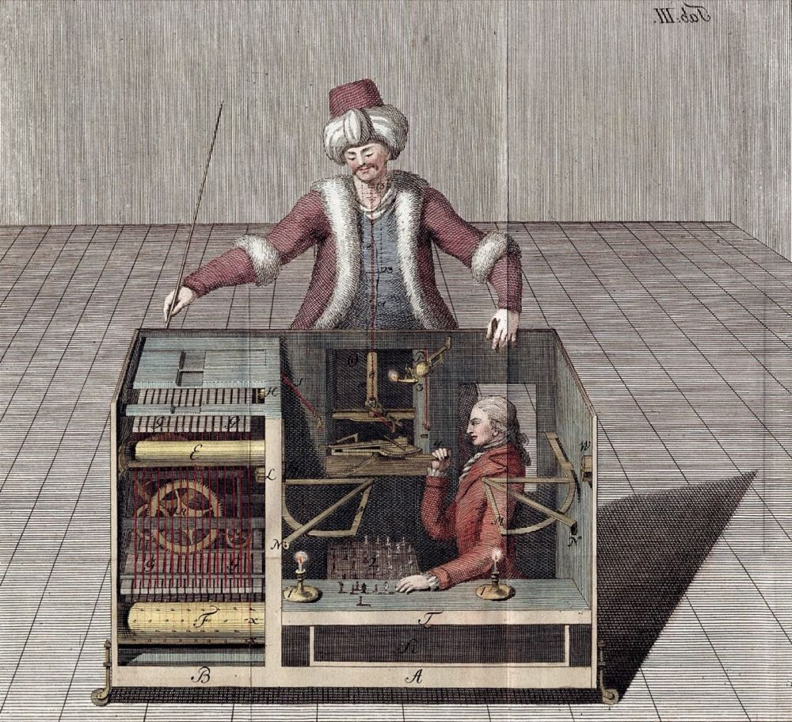

# Conscious Machines

 This work is licensed under a <a rel="license" href="http://creativecommons.org/licenses/by/4.0/">Creative Commons Attribution 4.0 International License</a>.

*[Section 1](../section1.md), session 2. The "second of two contrasting challenges"; the first, in session 1, was [13 Nails](thirteen-nails.md).*

!!! abstract "The problem"

    Reconstructed from the syllabus: it records only the title of this
    challenge. The wording below is the editors' reconstruction from the
    title, the pairing with the 13 nails problem, and the readings due the
    same day.

    On Tuesday the challenge was thirteen nails: balance them all on the
    head of one, and you can see at once whether you have succeeded.
    Today's challenge has no apparatus at all.

    **Could a machine be conscious?**

    Notice what kind of question this is. With the nails, you could tell at
    once whether an attempt had worked. Here, suppose someone wheels a
    machine into the room and claims it is conscious. What observation would
    convince you? What would convince you of the opposite? If you cannot
    name one, is this still a question about the world, or only about how
    you would like to use a word?

    Spend a GamesWorth on it in your notebook:

    1. Write down what you mean by *machine* and by *conscious*, then check
       whether those definitions already decided your answer.
    2. How do you know that anyone *else* in the room is conscious, and
       would that method work on a machine?
    3. Try to design a test that a skeptic and a believer could both agree
       on in advance. Then look for the loophole each side would use to
       reject the result.
    4. Compare with the nails. Which of the two could you have got *wrong*,
       and how would you have found out?

    There is no answer key. What is graded is the record of how you tried.

{ width="560" }

*One of Joseph Racknitz's guesses at how the "thinking machine" worked. He was right that a person was hidden inside, wrong about where and how. Joseph Racknitz, 1789, via Humboldt University Library / Wikimedia Commons. Public domain.*

## Why it is in the course

The syllabus labels the first two exercises "contrasting challenges". The 13
nails problem is the kind of problem the course is mostly made of: silly,
concrete, and checkable. A wrong idea announces itself by falling on the
table. Conscious machines is its opposite. Nothing falls. On day two of a section
called Detecting Nonsense, Error Checking, False Assumptions, Cherishing
Mistakes, the challenge lets you feel what it is like to argue confidently
about something you have no way to check, and then to notice that. It
rehearses what session 4 calls "distinguishing things we know vs only
imagine".

The same day's readings supply the tools. Feynman's *Cargo Cult Science* is
about activities with the outward form of science but not the part that
makes it work. Platt's *The Art of Creative Thinking* is the source of the
GamesWorth habit. Adams's first chapter is about attacking ill-defined
problems. Turing's move in 1950, designing a test instead of answering "Can
machines think?", is the same habit: turn a question about words into a
question about what you could observe, and be honest when you cannot.

## Where it comes from

Kempelen's chess-playing Turk (1770) was exhibited as a thinking automaton
for 84 years. It was in fact worked by a chess player hidden in the cabinet.
People suspected as much early and argued it in print: Joseph Racknitz in
1789, Robert Willis in 1821, Edgar Allan Poe in 1836. But each guessed wrong
about the mechanism, and nobody described it accurately until 1857, three
years after the machine burned in Philadelphia. The argument was settled not
by debate but by someone finally looking inside.

Alan Turing set the modern form in "Computing Machinery and Intelligence"
(1950): he judged "Can machines think?" to be "too meaningless to deserve
discussion" and replaced it with the imitation game. Searle's Chinese room
(1980) argued that a system can pass any behavioural test while
understanding nothing; Chalmers (1995) named the residue the "hard problem";
Koch and Tononi (2008) proposed a criterion based on integrated information.
No test has yet been accepted by both sides.

The question was still open when Winfree set it in August 2001, and it is
still open now.

??? tip "Hints"

    - Treat your definitions as suspects: does your definition of
      "conscious" quietly contain the answer, for instance by requiring
      biology, or by requiring only behaviour?
    - Count your data. You have examined exactly one conscious system from
      the inside. Everything else is inferred from behaviour and resemblance
      to yourself. Does that inference stop, on principle, at machines?
    - Ask what observation would change your mind. If nothing could, your
      position is not a hypothesis about the world; it is a decision about
      how to use a word. That is not wrong, but it should be labelled.
    - Compare with the nails. What is the difference between not yet knowing
      the answer and there being no way to find out?

## What happened

There is no solution to publish, and that is the point of the pairing. What
follows is interpretive.

Turing refused the question as posed and substituted a test whose outcome
could be observed. He also noted that demanding inner certainty would, if
applied consistently, deny that other people think, so we adopt "the polite
convention that everyone thinks". Searle showed that such a test can be
passed by a system that understands nothing from the inside. Chalmers named
what the substitution loses. Seventy-five years on, no test has been
accepted in advance by both a skeptic and a believer.

The lesson is not that the question is silly but that it is a different kind
of question from the nails: one where no experiment corrects you, so
confidence is cheap and mistakes go undetected. Recognising which kind of
question you are holding, before you invest a GamesWorth in it, is the skill
this session exercises.

## Sources

- **A. M. Turing**, "Computing Machinery and Intelligence", *Mind* LIX(236), 433–460 (1950) — [PDF, Oxford CS e-library](https://www.cs.ox.ac.uk/activities/ieg/e-library/sources/t_article.pdf){target=_blank} 🔓
- **John R. Searle**, "Minds, Brains, and Programs", *Behavioral and Brain Sciences* 3(3), 417–424 (1980) — [doi:10.1017/S0140525X00005756](https://doi.org/10.1017/S0140525X00005756){target=_blank} 🔒
- **David J. Chalmers**, "The Puzzle of Conscious Experience", *Scientific American*, December 1995 — [author's copy](https://consc.net/papers/puzzle.html){target=_blank} 🔓
- **Graham Oppy and David Dowe**, "The Turing Test", *Stanford Encyclopedia of Philosophy* (2003, rev. 2021) — [plato.stanford.edu](https://plato.stanford.edu/entries/turing-test/){target=_blank} 🔓
- **David Cole**, "The Chinese Room Argument", *Stanford Encyclopedia of Philosophy* (2004, rev. 2024) — [plato.stanford.edu](https://plato.stanford.edu/entries/chinese-room/){target=_blank} 🔓
- **Richard P. Feynman**, "Cargo Cult Science", Caltech commencement address (1974) — [Caltech Engineering and Science](https://calteches.library.caltech.edu/51/2/CargoCult.htm){target=_blank} 🔓
- **Christof Koch and Giulio Tononi**, "Can Machines Be Conscious?", *IEEE Spectrum* (2008) — [spectrum.ieee.org](https://spectrum.ieee.org/can-machines-be-conscious){target=_blank} 🔓
- **John Rader Platt**, *The Excitement of Science* (1962; 1974 reprint), containing "The Art of Creative Thinking" — [Internet Archive](https://archive.org/details/excitementofscie0000plat){target=_blank} 🔓 *(borrow)*
- **Wikipedia**, "Mechanical Turk" — [en.wikipedia.org](https://en.wikipedia.org/wiki/Mechanical_Turk){target=_blank} 🔓
- **ProTradeCraft**, "Jobsite Magic Trick: Balance 13 Nails on the Head of One" — [protradecraft.com](https://www.protradecraft.com/jobsite-magic-trick-balance-13-nails-head-one){target=_blank} 🔓
- **Arthur T. Winfree**, *The Art of Scientific Discovery*: original course syllabus — [PDF](https://github.com/tyson-swetnam/aosd/blob/main/docs/assets/aosd_syllabus.pdf){target=_blank} 🔓

!!! note "How sure are we that this is Winfree's problem?"

    The syllabus is the only record: the title, the session (02, Thu 23
    August 2001) and the label "second of two contrasting challenges",
    paired with the 13 nails problem of the day before. Winfree's archived
    lab site says nothing about this challenge — no handout, no problem
    sheet, no column — so his exact wording in class is lost. Reading
    "contrasting" as checkable against uncheckable is the editors'
    inference from the pairing and from the section title, which is why the
    identification is "probable" and the statement above is labelled a
    reconstruction. Candidate readings, most likely first:

    1. An open-ended discussion challenge: could a machine be conscious, and
       how would you know? Posed as the opposite kind of problem from the
       nails.
    2. A design challenge in the spirit of Adams, assigned the same day:
       specify what a machine would have to do before you would call it
       conscious. A sharper version of the first, not a rival.
    3. A nonsense-detection exercise on a specific published claim about
       conscious computers, using Feynman's criteria. Least likely: the
       syllabus assigns no reading on machine consciousness.

---

*Back to [Section 1](../section1.md) · [All problems](index.md) · [The schedule](../syllabus.md#section-1-detecting-nonsense-error-checking-false-assumptions-cherishing-mistakes)*
