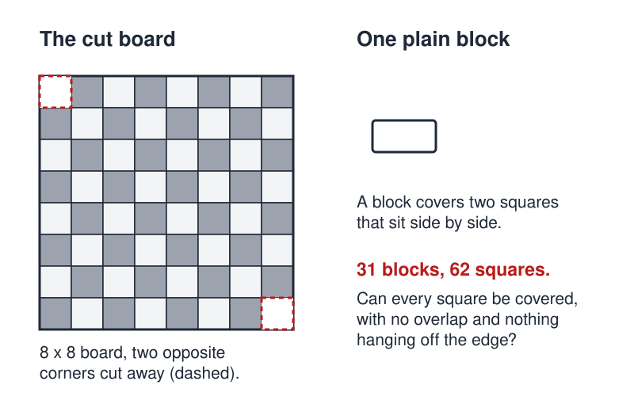

# Dominoes (group lab)

 This work is licensed under a <a rel="license" href="http://creativecommons.org/licenses/by/4.0/">Creative Commons Attribution 4.0 International License</a>.

*[Section 2](../section2.md), session 7. The same session discusses [Weird Organism](weird-organism.md) and [Rearranged Triangle](rearranged-triangle.md).*

!!! abstract "The problem"

    This is a reconstruction, not a record. The schedule says only "Start
    group lab on Dominoes". The puzzle below is the best-known domino
    problem that fits a session on perceptual blocks. Other readings are
    listed at the end of this page.

    **The puzzle.** Remove two diagonally opposite corner squares from an
    8 x 8 board, leaving 62. You have 31 plain blocks, each the size of two
    neighbouring squares. Can you lay them flat to cover every square, with
    no overlaps and nothing hanging off? If you can, show how. If you
    cannot, convince a skeptic that nobody can; failing is not enough.

    **As a group lab.** Work with real blocks and record every attempt in
    your GamesWorth book. Then remove two squares of your choosing, try
    smaller boards, pool the cases, and state what decides it.

{ width="560" }

*The cut board and the plain block you have 31 of. Drawn for this site (CC BY 4.0).*

## Why it is in the course

Session 7 opens Section 2 with Adams's chapter on perceptual blocks. If the
lab was the cut board, it is a clean specimen of a perceptual block.
Every attempt at laying blocks fails in a way that feels like bad luck.
Progress comes only when somebody stops asking "where does the next block
go?" and asks "what does any block always do?".

The syllabus says the class meets partly to "work jointly for a while on
bigger problems or puzzles that need a little equipment or need more
diversity of approaches and crazy suggestions". Many failed tilings, pooled
and argued over, are the evidence the group reasons from.

## Where it comes from

The philosopher Max Black posed the question in *Critical Thinking* (1946)
as an exercise in insight. Solomon Golomb discussed it in 1954, and Martin
Gardner put it in his *Scientific American* column in 1957. In his first
book of puzzles he treats it as a physical puzzle whose "props" are a
chessboard and dominoes. In 1964 John McCarthy offered it as "a tough nut
for first order theorem provers", because the colours the solution needs
are not part of the problem as stated. In 1990 Craig Kaplan and Herbert
Simon used it as the model insight problem in "In search of insight".

??? tip "Hints"

    - "Find a covering" and "decide whether one exists" are different questions. Failing at the first does not answer the second.
    - Look at one block. Wherever you put it, what is always true of the two squares underneath?
    - Shrink it: a 2 x 2 board with opposite corners removed, then a 4 x 4. Count something.
    - Your blocks are plain, but the board may not be. Would it matter if every square were the same colour, or if the missing squares were neighbours?
    - Once you have a rule, test it the other way: which boards *can* be covered?

??? success "Resolution"

    No covering exists. Every block covers one light and one dark square, so
    31 blocks cover 31 of each. But diagonally opposite corners are the same
    colour (light or dark, depending on which diagonal you cut), so the cut
    board has 32 squares of one colour and 30 of the other. The same
    argument rules out removing any two squares of one colour.

    The converse is Gomory's theorem: remove one light and one dark square,
    anywhere, and the rest can always be covered. Draw a closed path through
    all 64 squares, stepping between neighbours. Colours alternate along it,
    so the cuts leave one or two even stretches, each coverable by blocks.

    Shmuel Winograd's proof avoids colour. For k from 1 to 7, the top k rows
    hold 8k - 1 squares, an odd number. Blocks lying inside those rows cover
    squares in pairs, so an odd number of vertical blocks must cross the
    boundary below row k. Each vertical block crosses exactly one of these
    seven boundaries, so the number of vertical blocks is a sum of seven odd
    numbers, which is odd. Columns give the same for horizontal blocks. Odd
    plus odd is even, but 31 is odd.

## Sources

- **Arthur T. Winfree**, *The Art of Scientific Discovery (ECOL 479/579): course handout*, archived 20 April 2002 — [Wayback Machine](https://web.archive.org/web/20020420212713/http://eebweb.arizona.edu/Faculty/Winfree/handout_479.htm){target=_blank} 🔓
- **Max Black**, *Critical Thinking: An Introduction to Logic and Scientific Method* (1946; Internet Archive copy is the 1952 second edition) — [archive.org](https://archive.org/details/criticalthinking0000maxb){target=_blank} 🔓 *(borrow)*
- **Solomon W. Golomb**, "Checker Boards and Polyominoes", *American Mathematical Monthly* 61(10), 675–682 (1954) — [doi:10.1080/00029890.1954.11988548](https://doi.org/10.1080/00029890.1954.11988548){target=_blank} 🔒
- **Martin Gardner**, "Mathematical Games: An assortment of maddening puzzles", *Scientific American* 196(2), February 1957 — [doi:10.1038/scientificamerican0257-152](https://doi.org/10.1038/scientificamerican0257-152){target=_blank} 🔒
- **Martin Gardner**, *Hexaflexagons, Probability Paradoxes, and the Tower of Hanoi* (Cambridge University Press, 2008), "Mutilated Chessboard" — [archive.org](https://archive.org/details/hexaflexagonspro0000gard){target=_blank} 🔓 *(borrow)*
- **John McCarthy**, "The mutilated checkerboard", from *Creative Solutions to Problems* (1999) — [Stanford](http://www-formal.stanford.edu/jmc/creative/node2.html){target=_blank} 🔓
- **Craig A. Kaplan and Herbert A. Simon**, "In search of insight", *Cognitive Psychology* 22(3), 374–419 (1990) — [doi:10.1016/0010-0285(90)90008-R](https://doi.org/10.1016/0010-0285(90)90008-R){target=_blank} 🔒
- **Lorne A. Whitehead**, "Domino 'chain reaction'", *American Journal of Physics* 51(2), 182 (1983) — [doi:10.1119/1.13456](https://doi.org/10.1119/1.13456){target=_blank} 🔒
- **J. William Pfeiffer and John E. Jones (eds.)**, *A Handbook of Structured Experiences for Human Relations Training*, Vol. VI (1977), exercise 202, "Dominoes: A Communication Experiment" — [archive.org](https://archive.org/details/handbookofstruct0000unse_g0d8){target=_blank} 🔓 *(borrow)*
- **James L. Adams**, *Conceptual Blockbusting: A Guide to Better Ideas* — [archive.org](https://archive.org/details/conceptualblockb00adam_4){target=_blank} 🔓 *(borrow)*
- **Wikipedia contributors**, "Mutilated chessboard problem" — [overview and bibliography](https://en.wikipedia.org/wiki/Mutilated_chessboard_problem){target=_blank} 🔓
- **Arthur T. Winfree**, *The Art of Scientific Discovery: original course syllabus* (2001) — [PDF](https://github.com/tyson-swetnam/aosd/blob/main/docs/assets/aosd_syllabus.pdf){target=_blank} 🔓

!!! note "How sure are we that this is Winfree's problem?"

    Not sure at all. The schedule line is Winfree's only text on it. No other
    archived Winfree page mentions dominoes. A full-text search of the
    assigned Adams book found no domino or chessboard exercise.

    In Winfree's handout, the link on this item points to a bookmark named
    `White_blocks`. Its target is lost. Winfree's bookmark names sometimes
    repeat the title and sometimes name a hidden subject (`Keplers_Laws`
    for "Paired Observations"). So `White_blocks` may describe plain blocks
    used as dominoes, or, loosely, the crux of the cut-board puzzle (the
    Resolution above says why that fit is loose). Both are inferences, and
    neither names a puzzle. The candidates:

    - **The cut chessboard**, as above. It needs only plain blocks and fits
      the day's reading. Against it, a short puzzle is a thin "lab".
    - **A toppling-block lab**: time the wave along rows of blocks set at
      different spacings, or topple a chain of ever-larger blocks
      (Whitehead 1983). A domino chain is a toy excitable medium, Winfree's
      research field. Against it, Section 2 is about blocks, not
      measurement, though the section does hold one other lab (Pedestrian
      Crosswalk, session 12).
    - **Counting tilings** of a 2 x n strip, though pattern-finding is
      Section 4's business.
    - **"Dominoes: A Communication Experiment"** (Pfeiffer and Jones, 1977),
      a communication exercise. Very unlikely.

    "Lab" need not mean apparatus: the exercises are "mostly made from
    elementary mathematics so as to require no lab setup".

---

*Back to [Section 2](../section2.md) · [All problems](index.md) · [The schedule](../syllabus.md#section-2-creative-blocks)*
