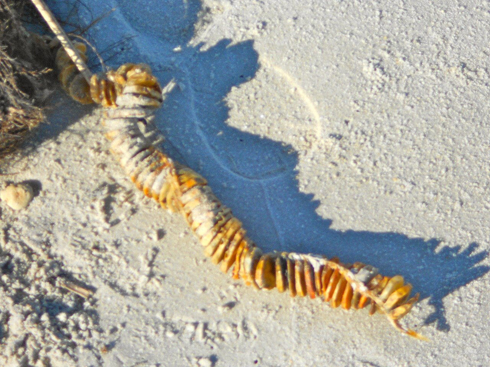

# Egg Pouches Lab

 This work is licensed under a <a rel="license" href="http://creativecommons.org/licenses/by/4.0/">Creative Commons Attribution 4.0 International License</a>.

*[Section 4](../section4.md), session 22. The same session continues the [Cell Shapes](cell-shapes-lab.md) lab and deals with [Platonic Solids](platonic-solids.md).*

!!! abstract "The problem"

    This is a reconstruction. The schedule says only "Do Egg Pouches lab in
    class", and Winfree's lab sheet is lost. What follows is a candidate lab
    built to fit that line and the bookmark discussed at the end of this
    page. It is not his wording.

    Each group gets a long chain of egg pouches joined end to end, such as
    a dried whelk egg-case string from a beach.

    **First, write down what you expect.** Is this one animal, or a
    container made by one? Which end came first? How do the pouches differ
    along the row?

    **Then count.** Number every pouch from one end, counting twice in
    opposite directions. Measure the size of each pouch, using the same
    measurement every time. Open a sample of pouches spread along the whole
    length and count what is inside each; record empty ones as zero.

    **Then pool.** Plot every group's specimens on one graph, contents
    against pouch number, and state a generalization in one sentence. Does
    it hold for every chain, or only on average? Could anything you counted
    tell an animal made of segments from a row of containers?

{ width="560" }

*One chain, and four chains pooled. The sizes and counts are illustrative,
not measured. Drawn for this site (CC BY 4.0).*

## Why it is in the course

Section 4 is "Patterns, Empirical Generalizations". Here you repeat one
measurement along a series and end with a sentence no single pouch could
support. The syllabus explains why such work happens in class: "Class meetings will also
prove essential for some problems in which no one individual can collect
enough data, but if we pool data, reality will come into focus." One
specimen is an anecdote. Twenty make a distribution.

The session's reading is "Adams Chapter 6: Alternative thinking languages",
and this lab cannot be done in words: you number, count and plot, then look
at the shape of the points.

## Where it comes from

Apart from the bookmark discussed at the end of this page, the name is the
only evidence. "Egg pouches" is the popular name for
the capsules on the egg-case string of a *Busycon* whelk. Wikipedia's
article on the genus says the dried strings are sometimes called
"mermaid's necklaces" because they look like a necklace strung with
"medallion-shaped egg pouches", and that each pouch holds "numerous
protoconchs (baby whelks)". A string is a ready-made series with countable
contents, and at a glance it looks like a worm.

{ width="560" }

*A whelk egg-case string on a beach. Photo by Smallbones, via Wikimedia
Commons, CC0.*

The segmented worms proper are the annelids. In earthworms and leeches, a
cocoon stores the fertilized eggs: one cocoon, not a chain of pouches to
count. The animal whose
body really is a chain of egg packets is the tapeworm: in Wikipedia's words,
"Mature proglottids are essentially bags of eggs". Yet a footnote in the
same article says tapeworms "are not formed of fixed body segments as are
the annelids".

??? tip "Hints"

    - Write your predictions down before you open anything. What you can no
      longer deny having believed is the point.
    - If your two counts in opposite directions disagree, look at the ends.
    - Sample pouches along the whole length, not a handful from one end.
    - Specimens differ in length. Before deciding a pattern has failed, plot
      position as a fraction of the whole chain.
    - Ask what observation would tell one animal from a stack of containers.
      If nothing you counted can settle it, say so. That is a result too.

??? success "Resolution"

    No resolution of Winfree's survives. The result is the class's own
    pooled graph: a pattern may appear only when many chains are plotted
    together, and may hold on average but not in every chain.

    A trend along a row records the order in which the row was made, so
    the data can argue for which end came first. Counting cannot say
    whether the object is an animal built of segments or a container built
    of compartments. Given the annelid and tapeworm facts above, something
    that looks like a segmented worm may be neither a worm nor segmented.

## Sources

- **Arthur T. Winfree**, *The Art of Scientific Discovery (ECOL 479/579): course handout*, archived 20 April 2002 — [Wayback Machine](https://web.archive.org/web/20020420212713/http://eebweb.arizona.edu/Faculty/Winfree/handout_479.htm){target=_blank} 🔓
- **Wikipedia contributors**, "Busycon" — [Wikipedia](https://en.wikipedia.org/wiki/Busycon){target=_blank} 🔓 (the "egg pouches" of whelk egg-case strings)
- **Wikipedia contributors**, "Annelid" — [Wikipedia](https://en.wikipedia.org/wiki/Annelid){target=_blank} 🔓 (the segmented worms and their single cocoon)
- **Wikipedia contributors**, "Cestoda" — [Wikipedia](https://en.wikipedia.org/wiki/Cestoda){target=_blank} 🔓 (proglottids as bags of eggs; the note on segmentation is an explanatory footnote)
- **Wikipedia contributors**, "Egg case (Chondrichthyes)" — [Wikipedia](https://en.wikipedia.org/wiki/Egg_case_(Chondrichthyes)){target=_blank} 🔓 (the single-capsule "mermaid's purse", a rejected reading)
- **Arthur T. Winfree**, *The Art of Scientific Discovery: original course syllabus* (2001) — [PDF](https://github.com/tyson-swetnam/aosd/blob/main/docs/assets/aosd_syllabus.pdf){target=_blank} 🔓

!!! note "How sure are we that this is Winfree's problem?"

    Not sure. The schedule line is Winfree's only text on this lab. In
    Winfree's handout, the link on "Egg Pouches" points to a bookmark named
    `Segmented_worm`. Its target was not archived. In
    the same handout, bookmark names often describe a problem's content
    rather than its classroom label (`Keplers_Laws` for "Paired
    Observations"), so the specimen was probably something that looked
    like a segmented worm. That is an inference, and it does not say which
    specimen. The candidates:

    - **A whelk egg-case string**, as above: its capsules are called "egg
      pouches" and it looks like a worm. No source ties it to Winfree.
    - **A tapeworm chain**, egg packets that look like segments. Less
      likely: it needs a preserved specimen and subject knowledge.
    - **Earthworm or leech cocoons, or segmentation itself as a pattern**,
      the most literal reading of the bookmark. Less likely: each cocoon is
      single, so there is no row of pouches to count.
    - **A packing lab**, squeezing soft eggs into polyhedra. Unlikely: it
      does not fit the bookmark, and [Cell Shapes](cell-shapes-lab.md)
      already covers that geometry.
    - **Shark or skate egg cases** ("mermaid's purses"). Rejected: each is
      a single capsule, not a row of pouches.

---

*Back to [Section 4](../section4.md) · [All problems](index.md) · [The schedule](../syllabus.md#section-4-patterns-empirical-generalizations)*
