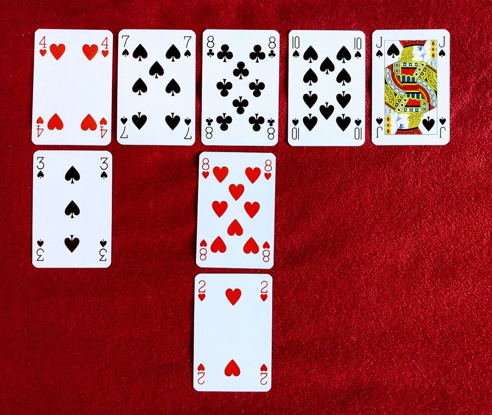

# Eleusis

 This work is licensed under a <a rel="license" href="http://creativecommons.org/licenses/by/4.0/">Creative Commons Attribution 4.0 International License</a>.

*[Section 4](../section4.md), session 23. Played in class; the same session deals with [the Mirror Mystery](mirror-mystery.md).*

!!! abstract "The problem"

    Eleusis is a card game in which one player invents a law of nature and
    the others discover it by experiment. (Editors' summary of Robert
    Abbott's rules.)

    **Setup.** The *dealer* secretly writes down a rule saying which card
    may follow the cards already accepted. The rule may depend only on
    accepted cards (for example the last one, or the last two). Shuffle
    two 52-card decks together, deal 14 cards to each other player (12 in
    the short version), and turn up one card as the *starter*.

    **Goal.** Get rid of your cards. A round ends when someone runs out;
    the fewer cards you still hold, the better you score.

    **Play.** In turn, each player lays down a card: an experiment. The
    dealer says only *right* or *wrong*, never why.

    - A right card extends the *mainline* to the right.
    - A wrong card goes *below* the last accepted card, in a *sideline*,
      and stays on the table; the player draws penalty cards.

    **Knowing the rule.** In Abbott's full game a player who thinks they
    know the rule may become *Prophet* and call other players' cards right
    or wrong; one wrong call and the Prophet is overthrown. In the short
    version (Eleusis Express) a player who has just played correctly may
    instead say a guess aloud; a correct guess ends the round.

    **Your task in class** (a reconstruction; nothing survives about how
    Winfree ran the session): play a few rounds, and log in your GamesWorth
    notebook each hypothesis you held, the card you played to test it, and
    how you got out of blind alleys. The log, not the score, is the
    exercise.

{ width="560" }

*Drawn for this site (CC BY 4.0). A made-up round: the dealer's rule is given at the end of the page.*

## Why it is in the course

Section 4 is "Patterns, Empirical Generalizations", and Eleusis is that
section in its purest form: from a table of accepted and rejected cards you
guess a rule, then choose the next card to test it. The syllabus says the
puzzles are there "to slow you down for a few minutes so you can examine
the working of your own mind", and asks you to "Write down your approaches,
your lucky insights, how you got into and out of blind alleys." A game
that never says why a card was wrong forces exactly that.

The sidelines keep every mistake on the table, as Section 1's "Cherishing
Mistakes" asks. Choosing the card that separates two rival rules is
Chamberlin's *The Method of Multiple Working Hypotheses* (session 25) in
miniature. The Prophet, brought down by one wrong call, anticipates Platt's
*Strong Inference* (session 27). And among the syllabus's "Other
good books on reserve" is George Pólya's *Induction and Analogy in
Mathematics*, the subject the game rehearses.

## Where it comes from

The game inventor Robert Abbott devised Eleusis in 1956. Martin
Gardner described it in his "Mathematical Games" column in *Scientific
American* for June 1959; Abbott quotes Gardner's verdict that it "should be
of special interest to mathematicians and other scientists because of its
striking analogy with scientific method".

From 1973 Abbott reworked the game, adding the sidelines and the Prophet,
and Gardner presented the new version in his October 1977 column as "the
game that simulates the search for truth". Abbott long refused to let
players just announce the rule, because "if a scientist publishes a
theory, then (unfortunately) the heavens do not part and God does not
declare whether the theory is right or not." In 2006 the mathematician John
Golden made a simpler version for elementary-school teachers, which Abbott
named Eleusis Express; Abbott now writes that on guessing aloud he had been
mistaken. Express came after the course, so Winfree cannot have used it.
His handout does not say which of Abbott's versions the class played.

{ width="560" }

*A game of Eleusis in play. Photograph by Kevan Davis (2019), via Wikimedia Commons, CC0 1.0.*

??? tip "Hints"

    - Each wrong card rules out every rule that would have allowed it, so
      the sidelines are often stronger evidence than the mainline.
    - Before each turn, write down your favoured rule and one rival, then
      play the card that separates them. A card both rules allow teaches
      you nothing.
    - Dealers tend to use a small vocabulary: colour, suit, odd or even, high
      or low, arithmetic on the last card. Check each against the whole
      layout before inventing anything exotic.
    - "Consistent so far" is not proof; the Prophet who forgets this is
      overthrown.
    - If you deal, allow several legal cards at any moment but not most of
      the deck. In Golden's words, "whatever rule you come up with, it will
      always be harder than you think it will be."

## What happened

Eleusis has no fixed answer: each round's answer is whatever the dealer
wrote. Winfree's debrief does not survive; Abbott's and Gardner's
commentary suggests what one can bring out:

- The dealer plays Nature, answering yes or no, never why. The Prophet is
  a theorist staking a reputation on public predictions.
- The sidelines exist because negative results are data.
- Players who pick cards to confirm a favourite hypothesis learn slowly;
  players who pick cards to discriminate between hypotheses learn fast.
- Dealers find that a rule they thought transparent is opaque to others.

??? success "The rule in the figure"

    Odd and even ranks alternate (ace 1, jack 11, queen 12, king 13), one
    of Golden's easy sample rules. The mainline runs 7, 4, 11, 2, 9. After
    the 4 an odd card was needed, so the 8 and 10 were wrong; after the 2,
    the 6 was wrong; after the 9 an even card was needed, so the king (13)
    was wrong.

    The mainline alone also fits "colours alternate". The sidelines rule
    that out: the 8 of clubs, the 6 of spades and the king of hearts each have the opposite colour to
    the card before them, yet all three were rejected.

## Sources

- **Robert Abbott**, "Eleusis and Eleusis Express", logicmazes.com (archived) — [Wayback Machine](https://web.archive.org/web/20241120065735/http://www.logicmazes.com/games/eleusis/){target=_blank} 🔓
- **Robert Abbott**, "Eleusis": publication history, logicmazes.com (archived) — [Wayback Machine](https://web.archive.org/web/20240117163833/https://www.logicmazes.com/games/eleusis/eleusis2.html){target=_blank} 🔓
- **John Golden, with Robert Abbott**, "Eleusis Express" rules (2006) — [Wayback Machine](https://web.archive.org/web/20250427175054/http://www.logicmazes.com/games/eleusis/express.html){target=_blank} 🔓
- **David Matuszek**, "New Eleusis", a summary of Abbott's full rules (1995) — [matuszek.org](https://matuszek.org/eleusis1.html){target=_blank} 🔓
- **Martin Gardner**, "Mathematical Games: An inductive card game", *Scientific American* 200(6), 160–168 (June 1959) — [doi:10.1038/scientificamerican0659-160](https://doi.org/10.1038/scientificamerican0659-160){target=_blank} 🔒
- **Martin Gardner**, "Mathematical Games: On playing New Eleusis, the game that simulates the search for truth", *Scientific American* 237(4), 18–25 (October 1977) — [doi:10.1038/scientificamerican1077-18](https://doi.org/10.1038/scientificamerican1077-18){target=_blank} 🔒
- **Martin Gardner**, *Penrose Tiles to Trapdoor Ciphers* (W. H. Freeman, 1989), reprinting the 1977 column — [Internet Archive](https://archive.org/details/penrosetilestotr00gard){target=_blank} 🔓 *(borrow)*
- **Martin Gardner**, *Origami, Eleusis, and the Soma Cube* (Cambridge University Press, 2008), reprinting the 1959 column — [Google Books](https://books.google.com/books?vid=ISBN9780521735247){target=_blank} 🔒
- **Wikipedia contributors**, "Eleusis (card game)" — [Wikipedia](https://en.wikipedia.org/wiki/Eleusis_(card_game)){target=_blank} 🔓 (overview; misdates the revised column to July 1977)
- **Kevan Davis**, photograph "Eleusis card game" (2019), CC0 1.0 — [Wikimedia Commons](https://commons.wikimedia.org/wiki/File:Eleusis_card_game.jpg){target=_blank} 🔓
- **Robert Ehrlich**, *Nine Crazy Ideas in Science: A Few Might Even Be True* (Princeton University Press, 2001), the session's assigned reading (Chapter 7) — [publisher](https://press.princeton.edu/books/paperback/9780691094953/nine-crazy-ideas-in-science){target=_blank} 🔒
- **Arthur T. Winfree**, *The Art of Scientific Discovery* (ECOL 479/579): course handout, archived 20 April 2002 — [Wayback Machine](https://web.archive.org/web/20020420212713/http://eebweb.arizona.edu/Faculty/Winfree/handout_479.htm){target=_blank} 🔓
- **Arthur T. Winfree**, *The Art of Scientific Discovery*: original course syllabus — [PDF](https://github.com/tyson-swetnam/aosd/blob/main/docs/assets/aosd_syllabus.pdf){target=_blank} 🔓

---

*Back to [Section 4](../section4.md) · [All problems](index.md) · [The schedule](../syllabus.md#section-4-patterns-empirical-generalizations)*
