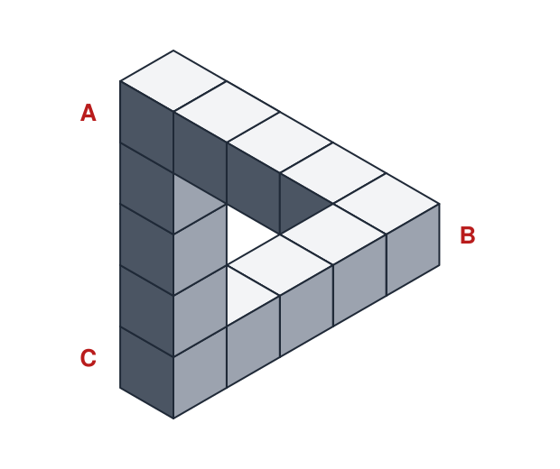
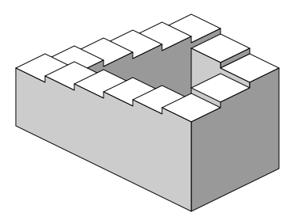

# Escher Print Gallery

 This work is licensed under a <a rel="license" href="http://creativecommons.org/licenses/by/4.0/">Creative Commons Attribution 4.0 International License</a>.

*[Section 3](../section3.md), session 16. Discussed together with [Hairy People](hairy-people.md) and [Green Stars](green-stars.md).*

!!! abstract "The problem"

    Reconstructed from the syllabus: Winfree's write-up is lost, so these
    questions are the editors', not his. Part 1 follows the title. Part 2
    follows a clue that points to Roger Penrose (see the box at the end of
    the page).

    **Part 1. Print Gallery.** Find M. C. Escher's lithograph *Print
    Gallery* (1956) on the
    [Escher Foundation's gallery page](https://mcescher.com/gallery/recognition-success/){target=_blank}
    (in copyright, so not reproduced here).

    1. A young man at the lower left looks at a print of a harbour town.
       Follow the town's buildings round the picture. Where do you end up?
    2. Do things get bigger or smaller as you go round? How can the picture
       still return to the same gallery?
    3. The middle is a blank disc carrying only Escher's monogram and
       signature. Is it unfinished, or could it not be drawn? What would
       have to be shown just outside it?

    **Part 2. Impossible figures.** The first figure below shows three bars
    of cubes, each meeting the next at a right angle.

    1. Cover all but one corner. Is anything wrong? Try the other corners.
    2. Could you build it from wood? If not, where is the impossibility: in
       a corner, in a bar, or somewhere else?
    3. The second figure is a staircase in four flights. Walk round it one
       way: every step goes down, yet you come back to where you began. Is
       it the same trick as the triangle? Is Print Gallery's loop
       impossible in the same sense?

{ width="560" }

*Every corner is an ordinary right-angled joint. Drawn for this site (CC BY 4.0).*

{ width="560" }

*An impossible staircase. Sakurambo (2005), public domain, via [Wikimedia Commons](https://commons.wikimedia.org/wiki/File:Impossible_staircase.svg){target=_blank}; white background added.*

## Why it is in the course

Section 3 is "Observations and Questions". Session 16 reads "Discuss Hairy People, Green Stars, and Escher Print Gallery"; two sessions earlier the class had to "Discuss [What Isn't There](what-isnt-there.md) (surprisingly hard)".

The rest is the editors' reading. Print Gallery fits that theme closely: its one blank patch is where the whole picture's logic comes to a point. The impossible figures test looking in another way. Every local piece passes inspection, and the trouble shows only when you follow the whole loop. Science has the same trap. Checking each step of an argument is not checking that the steps close up consistently.

Escher also comes up around Winfree's research, though nothing links these passages to the course item. In *When Time Breaks Down* (1987) he compared a scene of rotating waves to an Escher drawing of a waterfall. Steven Strogatz recalls in *Sync* (2003) that when Winfree sketched a twisted scroll ring by hand, he "accidentally produced a nonsense picture in the style of Escher".

## Where it comes from

**Print Gallery** (*Prentententoonstelling*) is a lithograph of May 1956. Escher, quoted by de Smit and Lenstra from Bruno Ernst, wanted a "cyclic expansion...without beginning or end". His four straight preparatory sketches together make a picture that contains itself at 1/256 of the size. He then switched to a curved grid that closes on itself, expanded 256 times, as you go once clockwise round the centre (de Smit and Lenstra, 2003; de Smit, 2005). De Smit and Lenstra published the exact mathematics of the print in 2003, after Winfree's course.

**The Penrose figures.** Roger Penrose saw Escher's prints at an exhibition held for the 1954 International Congress of Mathematicians in Amsterdam (Schattschneider, 2010). He then drew the tribar, three perpendicular bars that seem to form a triangle, and his father L. S. Penrose devised an endless staircase; they published both in 1958. Schattschneider says Penrose sent Escher the sketches, while Escher's 1960 letter to the Penroses says a friend sent him a photocopy of their article. Escher used the figures in *Ascending and Descending* (1960) and *Waterfall* (1961).

??? tip "Hints"

    - Start from the young man, not the hole. Follow his print until you are standing *in* it.
    - If each trip round enlarges things by the same factor, what happens running backwards, inwards?
    - For the triangle, cover all but one corner, then slide the cover on.
    - For each bar, note which end is nearer to you. Compare your first answer with your last. For the staircase, track height.

??? success "Resolution"

    **Print Gallery.** The buildings grow until one of them is the young
    man's gallery: the loop closes, by distortion rather than
    contradiction. Run backwards, the scene repeats ever smaller inwards:
    de Smit and Lenstra showed that the idealised picture contains a copy
    of itself turned clockwise about 157.6 degrees and shrunk about 22.58
    times, and a copy of that copy, and so on towards a single point at the
    centre. Infinitely many copies would have to fit there, so that point
    cannot be drawn. Escher's blank disc is larger than the point: he did
    not carry his grid in towards the middle.

    **The triangle.** A drawing never says how far away each part is, so
    the eye decides at each joint. Here B is nearer than A, C nearer than
    B, and A nearer than C: A is nearer than itself. No corner is wrong;
    the impossibility belongs to the loop. (Penrose later made this precise
    with cohomology.)

    **The staircase.** Round a closed path the height changes must total
    zero, yet walked one way every flight goes down. Triangle and staircase
    both break a quantity that must return to its start. Print Gallery lets
    size change steadily instead, and pays with a centre that cannot be
    drawn.

## Sources

- **Arthur T. Winfree**, *The Art of Scientific Discovery* (ECOL 479/579) course handout, archived 20 April 2002 — [Wayback Machine](https://web.archive.org/web/20020420212713/http://eebweb.arizona.edu/Faculty/Winfree/handout_479.htm){target=_blank} 🔓
- **M.C. Escher Foundation**, *Print Gallery*, May 1956, lithograph (Recognition and Success gallery) — [mcescher.com](https://mcescher.com/gallery/recognition-success/){target=_blank} 🔓
- **M.C. Escher Foundation**, Impossible constructions gallery: *Relativity*, *Ascending and Descending*, *Waterfall* — [mcescher.com](https://mcescher.com/gallery/impossible-constructions/){target=_blank} 🔓
- **B. de Smit and H. W. Lenstra Jr.**, "The Mathematical Structure of Escher's Print Gallery", in "Artful Mathematics: The Heritage of M. C. Escher", *Notices of the AMS* 50(4), 446–451 (2003) — [PDF, Wayback Machine](https://web.archive.org/web/20030412011949/http://www.ams.org:80/notices/200304/fea-escher.pdf){target=_blank} 🔓
- **Bart de Smit**, "The Droste-effect and the exponential transform", *Bridges Proceedings* 2005, 169–178 — [PDF](https://pub.math.leidenuniv.nl/~smitbde/papers/bridges-2005-desmit.pdf){target=_blank} 🔓
- **Bruno Ernst**, *The Magic Mirror of M. C. Escher* (1976) — [Internet Archive](https://archive.org/details/magicmirrorofmce0000erns){target=_blank} 🔓 *(borrow)* (Escher's words quoted above were read as quoted by de Smit and Lenstra)
- **Doris Schattschneider**, "The Mathematical Side of M. C. Escher", *Notices of the AMS* 57(6), 706–718 (2010) — [PDF, Wayback Machine](https://web.archive.org/web/20210415033924/http://www.ams.org/notices/201006/rtx100600706p.pdf){target=_blank} 🔓
- **L. S. Penrose and R. Penrose**, "Impossible objects: a special type of visual illusion", *British Journal of Psychology* 49(1), 31–33 (1958) — [doi:10.1111/j.2044-8295.1958.tb00634.x](https://doi.org/10.1111/j.2044-8295.1958.tb00634.x){target=_blank} 🔒 (not read by the editors; its contents are reported from Schattschneider)
- **Roger Penrose**, "On the Cohomology of Impossible Figures", in Michele Emmer (ed.), *The Visual Mind: Art and Mathematics* (MIT Press, 1993) — [Internet Archive](https://archive.org/details/visualmindartmat0000unse){target=_blank} 🔓 *(borrow)*
- **Wikipedia contributors**, "Penrose stairs" — [Wikipedia](https://en.wikipedia.org/wiki/Penrose_stairs){target=_blank} 🔓 (Escher's 1960 letter to the Penroses)
- **Sakurambo**, "Impossible staircase" (2005), public domain — [Wikimedia Commons](https://commons.wikimedia.org/wiki/File:Impossible_staircase.svg){target=_blank} 🔓
- **R. Penrose**, "The topology of ridge systems", *Annals of Human Genetics* 42, 435–444 (1979) — [doi:10.1111/j.1469-1809.1979.tb00677.x](https://doi.org/10.1111/j.1469-1809.1979.tb00677.x){target=_blank} 🔒 (not read by the editors; listed for the rival reading)
- **Steven Strogatz**, *Sync: The Emerging Science of Spontaneous Order* (2003) — [Internet Archive](https://archive.org/details/syncemergingscie00stro){target=_blank} 🔓 *(borrow)*
- **Arthur T. Winfree**, *When Time Breaks Down* (1987) — [Internet Archive](https://archive.org/details/whentimebreaksdo0000winf){target=_blank} 🔓 *(borrow)*
- **Arthur T. Winfree**, *The Art of Scientific Discovery*: original course syllabus — [PDF](https://github.com/tyson-swetnam/aosd/blob/main/docs/assets/aosd_syllabus.pdf){target=_blank} 🔓

!!! note "How sure are we that this is Winfree's problem?"

    The syllabus gives only the title. In Winfree's handout, the link on
    this item points to a bookmark named `Escher_Penrose`; its target was
    never archived. The link text names the print and the bookmark adds
    Penrose, so the reconstruction pairs them. A bookmark name shows a
    pairing of topics, not the exercise, so identification is probable.
    Candidates:

    - **Print Gallery as an observation puzzle** (strongest): fits the
      title and session 14, but not the word Penrose.
    - **Penrose's impossible figures**, likely alongside Print Gallery: the
      only reading that explains the bookmark.
    - **Penrose's 1962 tiling puzzle for Escher**: unlinked to Print Gallery.
    - **Penrose's fingerprint-ridge topology** (1979), cited by Winfree:
      unlinked to Escher.

---

*Back to [Section 3](../section3.md) · [All problems](index.md) · [The schedule](../syllabus.md#section-3-observations-and-questions)*
