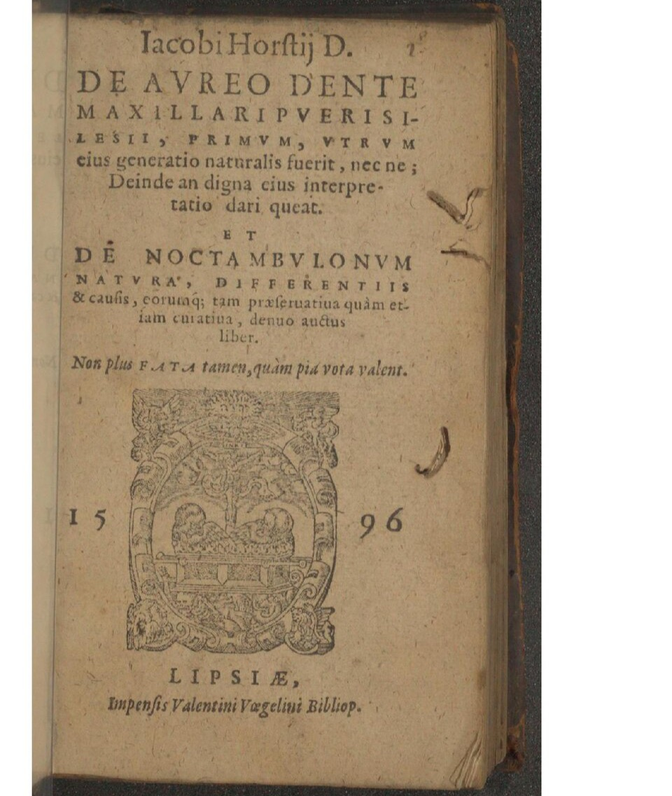
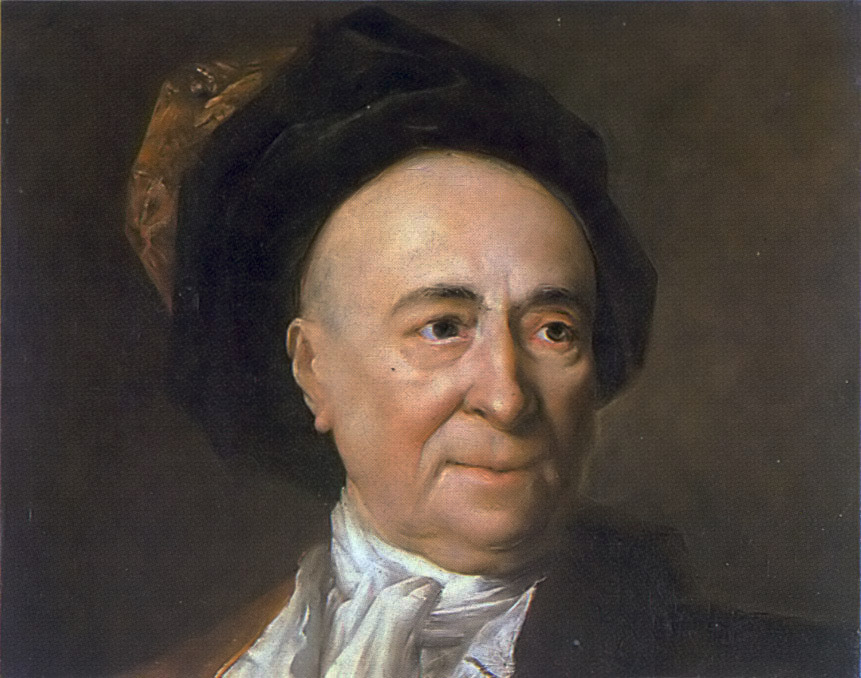

# Golden Tooth

 This work is licensed under a <a rel="license" href="http://creativecommons.org/licenses/by/4.0/">Creative Commons Attribution 4.0 International License</a>.

*[Section 1](../section1.md), session 4. Discussed together with [Salvation of Doug](salvation-of-doug.md) and [Bookworm's Journey](bookworms-journey.md).*

!!! abstract "The problem"

    This session's "problem" is a short historical reading rather than a
    puzzle. Read the passage below, which Fontenelle published in 1687
    (here in the anonymous English translation of 1688, usually attributed
    to Aphra Behn; spelling modernised and the long s resolved), and stop
    at the marked point before reading the ending.

    > Let us be assured of the matter of fact, before we trouble ourselves
    > with enquiring into the cause. It is true that this method is too slow
    > and dull for the greatest part of mankind, who run naturally to the
    > cause and pass over the truth of the matter of fact; but for my part,
    > I will not be so ridiculous as to find out a cause for what is not.
    >
    > This kind of misfortune happened so pleasantly at the end of the last
    > age to some learned Germans, that I cannot forbear speaking of it. In
    > the year 1593 there was a report that the teeth of a child of Silesia,
    > of seven years old, dropped out, and that one of gold came in the
    > place of one of his great teeth. Horstius, a physician in the
    > University of Helmstad, wrote in the year 1595 the history of this
    > tooth, and pretends that it was partly natural and partly miraculous,
    > and that it was sent from God to this infant to comfort the Christians
    > who were then afflicted by the Turks. Now fancy to yourself what a
    > consolation this was, and what this tooth could signify, either to the
    > Christians or the Turks. In the same year (that this tooth might not
    > want for historians) one Rolandus wrote a book of it. Two years after,
    > Ingolsteterus, another learned man, wrote against the opinion of
    > Rolandus concerning this golden tooth; and Rolandus presently makes a
    > learned reply. Another great man, named Libavius, collected all that
    > had been said of this tooth, to which he added his own opinion.
    >
    > **[Stop here.]**

    Before reading on, write in your GamesWorth book:

    1. Which statements in the story are *observations*, which are
       *reports of observations*, and which are *explanations*? Who
       actually saw the tooth?
    2. What is the single cheapest, most decisive thing anyone could have
       done in 1593, and who was the right person to do it?
    3. What did each successive author treat as evidence? What did the
       existence of four learned books prove about the tooth?
    4. Think of one claim you currently believe on the strength of
       secondhand report. What would "consulting the goldsmith" look like
       for it?

    (The four questions are a reconstruction by the site's editors, not
    Winfree's; the syllabus gives only the title line.)

    Then read Fontenelle's ending under "What happened" below, and compare
    it with your answer to question 2.

{ width="560" }

*Jakob Horst, De aureo dente maxillari pueri Silesii, Leipzig 1596, title page of the enlarged edition of the first learned treatise on the tooth. Wellcome Library, London, via Internet Archive and Wikimedia Commons. Public domain.*

## Why it is in the course

The syllabus line for session 4 begins "Golden Tooth: facts before explanations of facts." Those five words are Fontenelle's maxim compressed: "Let us be assured of the matter of fact, before we trouble ourselves with enquiring into the cause."

The session sits in Section 1, Detecting Nonsense, Error Checking, False Assumptions, Cherishing Mistakes. It shares its day with Salvation of Doug and Bookworm's Journey, which the syllabus labels "distinguishing things we know vs only imagine". That schedule line is everything Winfree left us about the golden tooth; the editors found no other mention of it in his surviving course pages, so we do not know which text he handed out. Fontenelle's own passage, quoted above, is the obvious choice.

The golden tooth is the cleanest historical case of a scholarly literature built on an unexamined report. Book after book appeared before anyone made the one cheap, decisive observation, and each new book treated the earlier books, not the tooth, as the thing to discuss. The lesson is not that the scholars were stupid. It is that the natural order of the mind, run to the cause and skip the fact, has to be reversed on purpose, and that the decisive check is often humble and belongs to a craftsman rather than a professor.

The story also sets up session 5, where [N-rays](n-rays.md) show the same pattern among trained physicists three centuries later. Its companions in session 4 drill the same habit on a small scale: separate what a problem states from what you imagined it said. (The syllabus says this of Bookworm's Journey; extending it to Salvation of Doug is our inference.)

## Where it comes from

Around Easter 1593 word spread from the Silesian village of Weigelsdorf that a seven-year-old boy, Christoph Müller, had lost his milk teeth and grown a gold molar. He was shown for money. Jakob Horst, professor of medicine at Helmstedt and himself a Silesian, examined the boy while in the region on private business, had the tooth tested with a touchstone, and in 1595 published *De aureo dente maxillari pueri Silesii*, enlarged in 1596. His verdict: the tooth was partly natural and partly miraculous, produced by an unusual planetary configuration at the boy's birth and sent to comfort Christians then at war with the Turks.

Martin Ruland published his own account in 1595 as well. Johann Ingolstetter attacked Ruland in 1597, and Ruland replied. Andreas Libavius reviewed the whole controversy. Horst's Helmstedt colleague Duncan Liddel argued that the tooth must be man-made. Note the dates. The fraud was found out by 1596 at the latest: a letter of 31 December 1595 already reports it, and Jütte dates the exposure to 1596. The learned quarrel therefore ran on for at least a year after the thing being explained had been shown not to exist.

Anton van Dale retold the story near the end of *De oraculis ethnicorum* (1683), quoting Daniel Sennert. Fontenelle, adapting Van Dale, moved it to the head of his argument in the *Histoire des oracles* (Paris, 1687) and gave it its famous frame. It has been a standard exhibit in discussions of scientific method ever since. Kavoussi (2009) aims it at the acupuncture literature that grew up after 1971.

{ width="560" }

*Nicolas de Largillière, Portrait of Fontenelle, 18th century, Musée des Beaux-Arts de Chartres. Public domain, via Wikimedia Commons.*

??? tip "Hints"

    - Underline every sentence in the story that reports something someone saw or measured, and every sentence that explains. Count them. Notice which kind came first.
    - Ask what the cheapest decisive test would have been, and who was competent to make it. A touchstone and a goldsmith were available in every market town.
    - Notice that Ingolstetter argued against Ruland, and Libavius summarised everyone: each author took the previous books as the thing to be discussed, not the tooth.
    - Ask who benefited. The boy was being shown for money; the professors gained reputations. Motives do not settle facts, but they tell you where to look first.
    - Fontenelle's method "is too slow and dull for the greatest part of mankind". Find a claim in your own field that you accepted from a report, and write down what consulting the goldsmith would cost.

## What happened

Fontenelle's ending (1688 translation, spelling modernised):

> In fine there wanted nothing to so many famous works, but only the truth of its being a golden tooth. For when a goldsmith had examined it, he found that it was only a thin plate of gold fixed to the tooth with a great deal of art. Thus they first went about to compile books, and afterwards they consulted the goldsmith.
>
> Nothing is more natural than to do the same thing in all other cases. And I am not so convinced of our ignorance by the things that are, and of which the reasons are unknown, as by those which are not, and for which we yet find out reasons. That is to say, as we want those principles that lead us to truth, so we have those which agree exceeding well with error and falsehood.

In the French: "Il ne manquoit autre chose à tant de beaux Ouvrages, sinon qu'il fust vray que la dent estoit d'or. Quand un Orfèvre l'eut examinée, il se trouva que c'estoit une feuille d'or appliquée à la dent avec beaucoup d'adresse; mais on commença par faire des Livres, et puis on consulta l'Orfèvre."

Two early accounts of the exposure survive, and they do not describe the same scene.

In the account that reached Daniel Sennert from Breslau, the boy was shown to an assembly of learned men. A goldsmith rubbed the tooth on a touchstone; the streak vanished when he applied a reagent. A physician then found a small hole in the crown, worked an iron spatula under it, and lifted off a thin brass shell, perhaps gilded, fitted over an ordinary tooth.

The other account is a letter of 31 December 1595, printed in the introduction to Duncan Liddel's treatise. There the plate is set so deep into the gum that the join goes unnoticed, until repeated rubbing on touchstones and ordinary chewing wear it thin. A drunken nobleman, refused a look at the tooth, stabs the boy in the cheek; the surgeon who stitches the wound finds the plate.

In both accounts the man showing the boy fled. Horst's book survives, as Spielman (2009) notes, as the first description of a moulded gold dental crown.

The lesson in Winfree's five words is the one Fontenelle drew: establish the fact, by the most direct means available, before spending an hour on its cause, and be most suspicious of explanations that come easily.

## Sources

- **Bernard le Bovier de Fontenelle**, *Histoire des oracles* (1687), édition critique par Louis Maigron (Paris, 1908); the golden tooth is Première Dissertation, ch. IV, pp. 31–33 — [Internet Archive](https://archive.org/details/histoiredesoracl00fontuoft){target=_blank} 🔓
- **Bernard le Bovier de Fontenelle**, *The history of oracles, and the cheats of the pagan priests. Made English* (London, 1688; translation attributed to Aphra Behn), first part pp. 21–23 — [Internet Archive](https://archive.org/details/historyoforacles00font){target=_blank} 🔓
- **Jakob Horst**, *De aureo dente maxillari pueri Silesii ... denuo auctus liber* (Leipzig, 1596; Latin) — [Internet Archive, Wellcome Library scan](https://archive.org/details/hin-wel-all-00001238-001){target=_blank} 🔓
- **Andrew I. Spielman**, "The boy with the golden tooth: a 1593 case report of the first molded gold crown", *Journal of Dental Research* 88(1): 8–11 (2009) — [author-hosted PDF](https://dental.nyu.edu/content/dam/nyudental/documents/about/rarebooks/GoldenToothArticleJDR.pdf){target=_blank} 🔓
- **Robert Jütte**, *Ein Wunder wie der goldene Zahn* (Ostfildern: Thorbecke, 2004) — [review in sehepunkte 5 (2005)](https://www.sehepunkte.de/2005/06/6962.html){target=_blank} 🔓 (the review is open; the book is in print, not online)
- **Micheline Ruel-Kellermann and Jacqueline Vons**, "Diagnostic, controverse et technique: l'histoire de la dent d'or (1683)", *Revue d'histoire littéraire de la France* 120(4): 831–844 (2020) — [Classiques Garnier](https://classiques-garnier.com/revue-d-histoire-litteraire-de-la-france-4-2020-120e-annee-n-4-varia-diagnosis-controversy-and-technique.html){target=_blank} 🔒
- **Alex Boese**, "The Boy with the Golden Tooth (1593)", *Museum of Hoaxes* — [hoaxes.org](https://hoaxes.org/archive/permalink/the_boy_with_the_golden_tooth){target=_blank} 🔓
- **Ben Kavoussi**, "James Reston's Tooth of Gold", *Science-Based Medicine* (25 August 2009) — [sciencebasedmedicine.org](https://sciencebasedmedicine.org/james-restons-tooth-of-gold/){target=_blank} 🔓
- **Arthur T. Winfree**, *The Art of Scientific Discovery: original course syllabus* — [PDF](https://github.com/tyson-swetnam/aosd/blob/main/docs/assets/aosd_syllabus.pdf){target=_blank} 🔓

---

*Back to [Section 1](../section1.md) · [All problems](index.md) · [The schedule](../syllabus.md#section-1-detecting-nonsense-error-checking-false-assumptions-cherishing-mistakes)*
