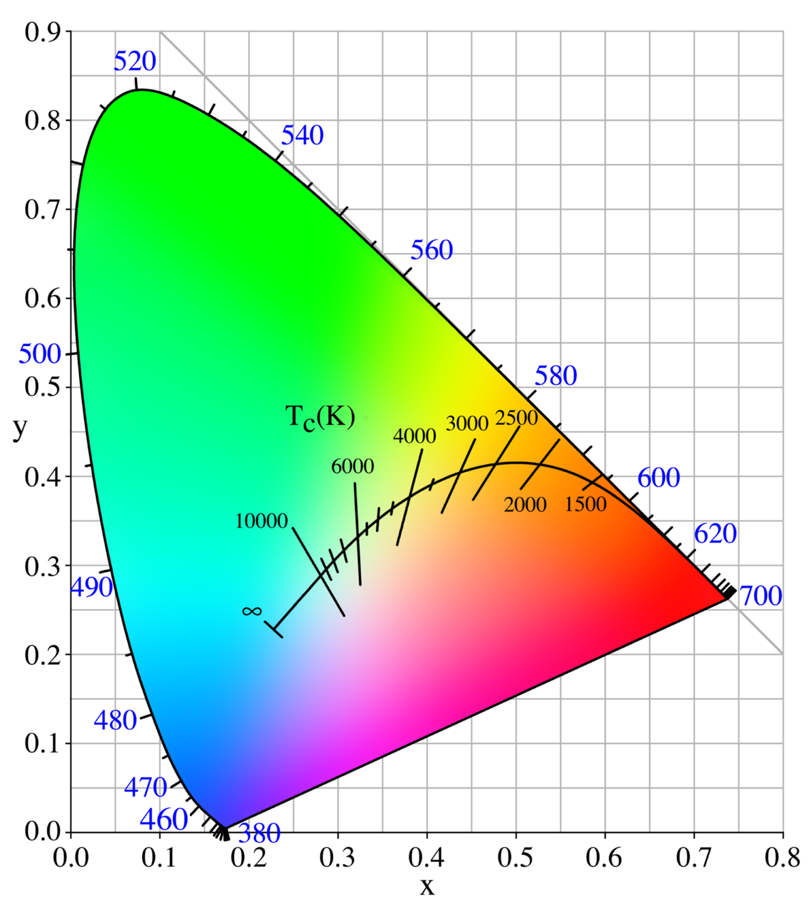

# Green Stars

 This work is licensed under a <a rel="license" href="http://creativecommons.org/licenses/by/4.0/">Creative Commons Attribution 4.0 International License</a>.

*[Section 3](../section3.md), session 16. Discussed together with [Hairy People](hairy-people.md) and [Escher Print Gallery](escher-print-gallery.md).*

!!! abstract "The problem"

    Reconstructed from the syllabus: only the title survives, so this is the
    standard question the title most likely refers to.

    On a clear night the brightest stars show colours: Betelgeuse
    reddish-orange, Arcturus orange, Capella yellow-white, Vega white, Rigel
    bluish. A star's colour is set by its surface temperature, from about
    3,000 K (red) through the Sun's 5,800 K to 30,000 K and more (blue), and
    the peak of its broad spectrum slides from the infrared through red,
    yellow and green toward the ultraviolet as it gets hotter.

    Now the observation: **nobody ever sees a green star.** Yet the Sun's own
    spectrum peaks in the green, near 500 nm. (That is per unit wavelength;
    plotted per unit frequency, the same spectrum peaks in the infrared.
    Worth a minute's thought.)

    1. Why does no star look green? Is the reason in the stars, or in us?
    2. Would a star whose spectrum peaked exactly in the green look green
       through a telescope? Through a green filter? To a camera?
    3. Sky guides sometimes call Beta Librae "greenish". Is that colour
       real? How would you test it?

    Answer from what you already know about light and colour before looking
    anything up. You may have looked at the night sky for years without asking
    why one colour is missing from it.

{ width="560" }

*Drawn for this site (CC BY 4.0). Planck's law per unit wavelength, each curve scaled to its own peak.*

## Why it is in the course

Section 3 is "Observations and Questions". On the editors' reading, all
three problems of session 16 ask about something that is not there,
continuing session 14's discussion of what isn't there ("surprisingly
hard"). In a later column Winfree noted that some things that
never happen are easy to notice and others are not
([SAS08](https://web.archive.org/web/20030114040501/http://eebweb.arizona.edu/faculty/winfree/SAS/SAS08/SAS08.html){target=_blank}).
A colour missing from the night sky is the hard kind.

The question needs only the night sky and ordinary experience of colour. It
has a tempting wrong answer ("no star has that temperature") and a right one
that means questioning the observer as well as the observed. And it keeps a
fact apart from its explanation, the habit session 04 calls "facts before
explanations of facts".

## Where it comes from

Star colours have been noticed since antiquity, and nineteenth-century
double-star observers recorded some companions as green. The physics came
with Planck's law of black-body radiation (1900) and the Harvard sequence of
spectral classes, O B A F G K M, given its modern form by Annie Jump Cannon
and Edward Pickering from 1901. "Why are there no green stars?" became a
standard teaching question, answered in *Astronomy* magazine (2007) and on
Phil Plait's Bad Astronomy blog (2008).

The syllabus schedule is the Spring 2001 course with its dates moved to
Fall 2001, where session 16 falls on Thursday 11 October. About a month
later, in November 2001, Winfree's columns worked out stellar magnitudes
from everyday observations, cited Minnaert's book on light and colour, and
picked out Sun-like stars by their colour. They show his interest in
naked-eye astronomy at the time; they are not material the class read.

??? tip "Hints"

    - Split the question in two: what a star emits, and what an eye does
      with it. Which half is the puzzle really about?
    - A star is not a one-colour lamp. How much of a "green-peaked" star's
      light is red and blue?
    - What colour does a roughly equal mix of red, green and blue light
      look like? What colour is the Sun at noon?
    - Heat a body from a dull red glow to a welding arc. Does its colour
      ever pass through green on the way from red to blue?
    - For stars reported as green: what colour usually sits beside them in
      the eyepiece, and how does the eye judge colour in dim light?

??? success "Resolution"

    A star radiates roughly as a black body: a smooth, very broad spectrum.
    Even with its peak at 500 nm, the Sun gives out nearly as much red and
    blue light as green; across the visible band its spectrum varies by only
    about a fifth. The eye's three kinds of colour receptor respond to the
    whole mixture, not to the peak, and a balanced mixture looks white.

    Cooler stars send out more red and look orange or red; hotter stars send
    out more blue and look blue-white. No temperature tips the balance toward
    green alone: on a chromaticity diagram, the curve of black-body colours
    (the Planckian locus) runs from red through white to pale blue and never
    enters the green region.

    So green-peaked stars are common; the Sun is one. The missing colour is a
    fact about broad spectra and human vision, not about the stars. Only a
    narrow spectrum, such as a green laser or a filtered beam, can look green.

    That answers part 2. A telescope gathers more light but does not change
    the mixture, so a green-peaked star still looks white. A green filter
    throws away the red and blue, so the star then looks green, as any white
    light would. A colour camera, like the eye, records the mixture, not the
    peak.

    { width="560" }

    *CIE 1931 chromaticity diagram with the Planckian locus. PlanckianLocus.png by en:User:PAR, Wikimedia Commons, public domain.*

    The "green" stars of the sky guides are perceptual. Beta Librae is a
    B-type star near 11,900 K that most observers today call white or
    blue-white; green companions of double stars are usually white or blue
    stars beside a bright orange primary. Why some observers still see Beta
    Librae as green has never been settled, so part 3 stays open.

## Sources

- **Astronomy magazine staff**, "Why are there no green stars?", *Astronomy* (1 April 2007) — [astronomy.com](https://www.astronomy.com/science/why-are-there-no-green-stars/){target=_blank} 🔓
- **Phil Plait and Monica Cull**, "Why Are There No Green Stars?", Bad Astronomy (2008, updated 2023) — [Discover](https://www.discovermagazine.com/the-sciences/why-are-there-no-green-stars){target=_blank} 🔓
- **Wikipedia contributors**, "Stellar classification" — [Wikipedia](https://en.wikipedia.org/wiki/Stellar_classification){target=_blank} 🔓 (the spectral sequence, Cannon and Pickering, and the absence of green stars in typical viewing)
- **Wikipedia contributors**, "Planckian locus" — [Wikipedia](https://en.wikipedia.org/wiki/Planckian_locus){target=_blank} 🔓 (the path of black-body colours; its figure is reproduced above)
- **Wikipedia contributors**, "Beta Librae" — [Wikipedia](https://en.wikipedia.org/wiki/Beta_Librae){target=_blank} 🔓 (temperature and the green reports)
- **M. Minnaert**, *The Nature of Light and Colour in the Open Air* (Dover, 1954) — [Internet Archive](https://archive.org/details/bwb_W9-CRB-649){target=_blank} 🔓 *(borrow)*
- **Arthur T. Winfree**, "Magnitudes of bright lights in the sky, Part 1", Adventures in Discovery (16 November 2001) — [Wayback Machine](https://web.archive.org/web/20030114043916/http://eebweb.arizona.edu/faculty/winfree/SAS/SAS02/SAS02.html){target=_blank} 🔓 (related material; does not state this problem)
- **Arthur T. Winfree**, "Little Discoveries Using Stellar Magnitudes, Part 2", Adventures in Discovery (23 November 2001) — [Wayback Machine](https://web.archive.org/web/20030214222857/http://eebweb.arizona.edu/faculty/winfree/SAS/SAS03/SAS03.html){target=_blank} 🔓 (related material; does not state this problem)
- **Arthur T. Winfree**, "Adventure of the Rainbow Moon", Adventures in Discovery (11 January 2002) — [Wayback Machine](https://web.archive.org/web/20030114040501/http://eebweb.arizona.edu/faculty/winfree/SAS/SAS08/SAS08.html){target=_blank} 🔓
- **en:User:PAR**, "PlanckianLocus.png" — [Wikimedia Commons](https://commons.wikimedia.org/wiki/File:PlanckianLocus.png){target=_blank} 🔓 (public domain)
- **Arthur T. Winfree**, *The Art of Scientific Discovery* (ECOL 479/579): course handout, archived 20 April 2002 — [Wayback Machine](https://web.archive.org/web/20020420212713/http://eebweb.arizona.edu/Faculty/Winfree/handout_479.htm){target=_blank} 🔓
- **Arthur T. Winfree**, *The Art of Scientific Discovery*: original course syllabus — [PDF](https://github.com/tyson-swetnam/aosd/blob/main/docs/assets/aosd_syllabus.pdf){target=_blank} 🔓

!!! note "How sure are we that this is Winfree's problem?"

    Probable, not certain. The syllabus gives only the title. The archived
    handout links it to a companion problem document that was never
    captured, so no Winfree text of the problem survives. The identification
    rests on the title, which matches a standard astronomy question, on
    Winfree's documented naked-eye astronomy, on the session's place in
    "Observations and Questions", and on the theme of absence that the
    editors (not Winfree) see in all three session-16 problems. The
    candidates:

    - **Why no star looks green** (most likely): the question above.
    - **The stars reported as green**, such as Beta Librae: probably part of
      the same discussion rather than a separate problem.
    - **An unrelated puzzle called "Green Stars"**: the editors found none,
      though no exhaustive search was possible.

---

*Back to [Section 3](../section3.md) · [All problems](index.md) · [The schedule](../syllabus.md#section-3-observations-and-questions)*
