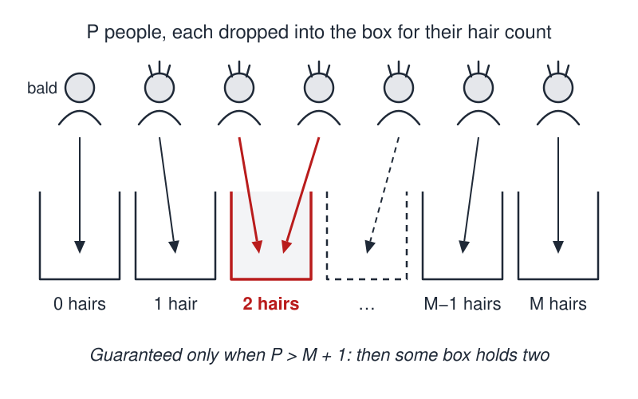
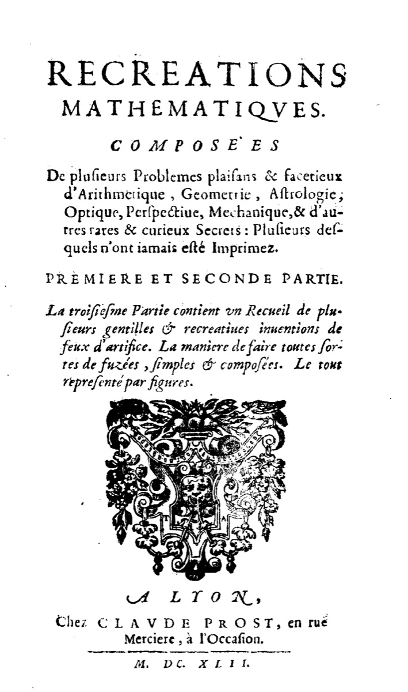

# Hairy People

 This work is licensed under a <a rel="license" href="http://creativecommons.org/licenses/by/4.0/">Creative Commons Attribution 4.0 International License</a>.

*[Section 3](../section3.md), session 16. Discussed together with [Green Stars](green-stars.md) and [Escher Print Gallery](escher-print-gallery.md).*

!!! abstract "The problem"

    Reconstructed from the syllabus: Winfree left only the name, so the
    wording, and the choice of Tucson, are the editors'.

    **The wager.** Someone bets you that, right now, at least two people in
    Tucson have *exactly* the same number of hairs on their heads. Nobody
    will count, and you may not pick the two. Should you take the bet? Can
    you prove or refute the claim from your armchair?

    1. What is the most hairs any head could carry? Estimate it, add a
       safety margin, and write the number down.
    2. Look up Tucson's population: the city, or the county? Does your
       margin still leave you an argument?
    3. Try other crowds: the world, a class of twenty. How many people must
       share one hair count?
    4. Hunt for booby traps: bald people, falling hairs, and not knowing
       *which* two match.

{ width="560" }

*Drawn for this site (CC BY 4.0).*

## Why it is in the course

Section 3 is "Observations and Questions". The hair wager states a fact no
observation could settle, since nobody can count every head in a city, yet a
short argument makes it certain. That sharpens the session 04 theme of
[Bookworm's Journey](bookworms-journey.md), "distinguishing things we know
vs only imagine". In Winfree's words, "The purpose of the puzzles (many of
them silly) is to slow you down for a few minutes so you can examine the
working of your own mind."

It is also a lesson about evidence. Session 15 assigned Judson's chapter on
*Evidence*. Here the only evidence is your own estimate of a head of hair,
and any argument you build is only as good as that estimate.

## Where it comes from

The earliest known printed form is one Latin sentence in the Jesuit Jean
Leurechon's *Selectae Propositiones* (1622). A French book of recreations
of 1624, published under the name H. van Etten, gave a full proof headed,
in Rittaud and Heeffer's translation, "That it is absolutely necessary that
two men have as many hairs or pistoles as the other." Long credited to
Leurechon, the book was written, Heeffer argues, by Jean Appier Hanzelet.

In 1737 Castel de Saint-Pierre printed Pierre Nicole's story of offering
the wager about Paris to Madame de Longueville. In Rittaud and Heeffer's
translation Nicole recalls: "She told me, I could never be sure of it until
I had counted the hairs of these two men." The principle's usual name, the
drawer principle, comes from Dirichlet, two centuries later.

{ width="560" }

*Title page of Récréations mathématiques (Lyon, 1642), a later edition of the 1624 book, credited on Commons to Jean Leurechon. Scan by the Biblioteca Europea di Informazione e Cultura (BEIC), via Wikimedia Commons. Public domain.*

??? tip "Hints"

    - Write the argument with a letter M for the most hairs any head could
      have. How large may M be before the argument fails for your city?
    - Count the possible answers to "how many hairs are on your head?": 0,
      1, 2, ... up to M. Compare with the number of people answering.
    - Picture one box per hair count and drop each person in. What if there
      are more people than boxes?
    - You never find the matching pair. Does that make the claim less
      certain, or only less observable?

??? success "Resolution"

    **The argument.** If no head has more than M hairs, the possible counts
    are 0, 1, ..., M: M + 1 boxes. With more than M + 1 people, two share a
    box. This is the pigeonhole principle.

    **Choosing M is the whole problem.** Quoted counts for a full scalp run
    from about 90,000 hairs (redheads) to 150,000 (blondes), so M = 300,000
    is defensible with room to spare.

    **Tucson.** At the 2000 census the city had 486,699 people and Pima
    County 843,746. Against 300,001 boxes the city wins by a factor of about
    1.6, so the wager is safe. But the textbook London version uses one
    million as a "safe" bound. Adopt it here and the argument collapses:
    1,000,001 boxes can hold every Tucsonan one apiece, and even the county
    cannot fill them. A bound must be both true and small.

    **Other crowds.** For a class of twenty no honest bound works. If P
    people fill M + 1 boxes, some box holds at least P / (M + 1), rounded
    up: with about 6.1 billion people (2001) and M = 300,000, at least
    20,334 people on Earth share one hair count.

    **Booby traps.** Bald heads help: they crowd box 0. Falling hairs change
    *which* people match, never whether someone does. And the argument never
    names the pair: certainty and observability are different things.

## Sources

- **Benoit Rittaud and Albrecht Heeffer**, "The Pigeonhole Principle, Two Centuries Before Dirichlet", *The Mathematical Intelligencer* 36(2), 27–29 (2014) — [authors' version, Ghent University](https://biblio.ugent.be/publication/4115264/file/4115265.pdf){target=_blank} 🔓; [publisher version](https://doi.org/10.1007/s00283-013-9389-1){target=_blank} 🔒 (source of the translations quoted above and of the Nicole anecdote)
- **H. van Etten** (attributed to Jean Leurechon; by Heeffer to Jean Appier Hanzelet), *Recreations mathematiques* (1624; 1629 Rouen printing) — [Internet Archive](https://archive.org/details/recreationsmathe00unse){target=_blank} 🔓
- **Jean Leurechon**, *Selectae propositiones in tota sparsim mathematica pulcherrimae* (1622; 1629 printing) — [Internet Archive](https://archive.org/details/bub_gb_RGwTAAAAQAAJ){target=_blank} 🔓 (the hairs sentence could not be found in this scan's poor OCR; it is reported from Rittaud and Heeffer)
- **Wikipedia contributors**, "Pigeonhole principle" — [Wikipedia](https://en.wikipedia.org/wiki/Pigeonhole_principle){target=_blank} 🔓 (the London version with its million-hair bound)
- **Wikipedia contributors**, "Jean Leurechon" — [Wikipedia](https://en.wikipedia.org/wiki/Jean_Leurechon){target=_blank} 🔓
- **Wikipedia contributors**, "Hair" — [Wikipedia](https://en.wikipedia.org/wiki/Hair){target=_blank} 🔓 (hairs per head by hair colour)
- **Wikipedia contributors**, "Tucson, Arizona" — [Wikipedia](https://en.wikipedia.org/wiki/Tucson,_Arizona){target=_blank} 🔓 (2000 census figures)
- **Wikipedia contributors**, "Hairy ball theorem" — [Wikipedia](https://en.wikipedia.org/wiki/Hairy_ball_theorem){target=_blank} 🔓
- **Eric W. Weisstein**, "Hairy Ball Theorem", MathWorld — [MathWorld](https://mathworld.wolfram.com/HairyBallTheorem.html){target=_blank} 🔓
- **Arthur T. Winfree**, *The Art of Scientific Discovery* course handout (archived 20 April 2002) — [Wayback Machine](https://web.archive.org/web/20020420212713/http://eebweb.arizona.edu/Faculty/Winfree/handout_479.htm){target=_blank} 🔓
- **Arthur T. Winfree**, *The Art of Scientific Discovery*: original course syllabus — [PDF](https://github.com/tyson-swetnam/aosd/blob/main/docs/assets/aosd_syllabus.pdf){target=_blank} 🔓

!!! note "How sure are we that this is Winfree's problem?"

    The syllabus, like the archived 2002 course handout, gives only the name
    and the session: "Discuss Hairy People, Green Stars, and Escher Print
    Gallery". The name appears on no other archived Winfree page. The
    identification is therefore **probable**, resting on the name and on the
    syllabus's note that the exercises are "mostly made from elementary
    mathematics so as to require no lab setup". Candidates:

    - **The hair-counting wager** (strongest): fits the name exactly, and
      the syllabus later schedules a "resolution of wagers" (session 26).
    - **The hairy ball theorem applied to scalps** (weaker): singularities
      were Winfree's research subject, and Escher's Print Gallery also turns
      on one. But the name points at people, not a theorem, and a scalp is
      not a whole sphere, so the theorem does not force a whorl there.
    - **A Fermi estimate** of hairs on a head: the wager's first step.

---

*Back to [Section 3](../section3.md) · [All problems](index.md) · [The schedule](../syllabus.md#section-3-observations-and-questions)*
