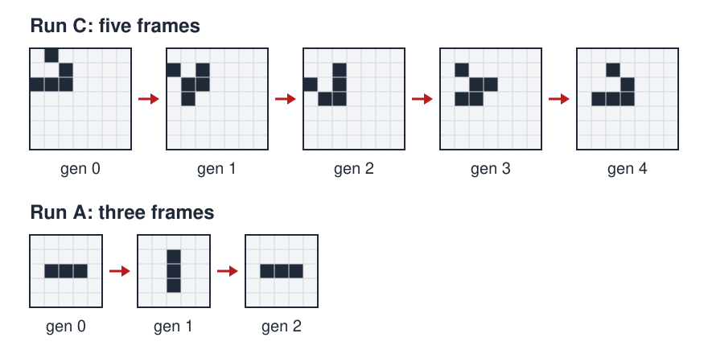

# Laws of a Toy Universe

<a rel="license" href="http://creativecommons.org/licenses/by/4.0/"></a><br />This work is licensed under a <a rel="license" href="http://creativecommons.org/licenses/by/4.0/">Creative Commons Attribution 4.0 International License</a>.

*[Section 5](../section5.md), session 28, finished in session 29. The same session deals with [The Miracle of FujiYama](miracle-of-fujiyama.md) and finishes the theory of [LoShu](loshu-lab.md).*

!!! abstract "The problem"

    A reconstruction. The syllabus names the exercise and Winfree's handout
    identifies the universe (see "Where it comes from"), but how he ran it
    in class is not recorded. The runs below were computed for this page.

    A universe is a large grid of cells, each **occupied** or **empty**.
    Time runs in ticks and the whole grid changes at once: each generation
    fixes the next completely, with no chance and no outside input.

    You are not told the law, but you may ask for any starting pattern to be
    run. **Find The Laws**: a rule that predicts every next frame from the
    present one.

    Four runs (`#` occupied, `.` empty):

    ```
    Run A
    gen 0     gen 1     gen 2
    .....     .....     .....
    .....     ..#..     .....
    .###.     ..#..     .###.
    .....     ..#..     .....
    .....     .....     .....

    Run B
    gen 0     gen 1
    ....      ....
    .##.      .##.
    .##.      .##.
    ....      ....

    Run C
    gen 0     gen 1     gen 2     gen 3     gen 4
    .#.....   .......   .......   .......   .......
    ..#....   #.#....   ..#....   .#.....   ..#....
    ###....   .##....   #.#....   ..##...   ...#...
    .......   .#.....   .##....   .##....   .###...
    .......   .......   .......   .......   .......

    Run D
    gen 0      gen 1      gen 2      gen 3
    ........   ........   ........   ........
    ........   ...#....   ...#....   ..###...
    ..###...   ..#.#...   ..###...   .#...#..
    ..###...   .#...#..   .##.##..   .#...#..
    ..###...   ..#.#...   ..###...   .#...#..
    ........   ...#....   ...#....   ..###...
    ........   ........   ........   ........
    ```

    Answer in this order:

    1. What is the law? State it so precisely that a stranger could compute
       generation 1 from generation 0 without asking you anything.
    2. What would you have to see to know your law is wrong? Construct that
       test before you look.
    3. Is your law the only one that fits everything you have seen? How
       would you tell?

{ width="560" }

*Runs C and A from the box above; dark squares are occupied cells. Drawn for this site (CC BY 4.0).*

## Why it is in the course

Section 5 is "Inferences, Hypotheses, Explanations". Its readings run from
Chamberlin's multiple working hypotheses (session 25) through Platt's
*Strong Inference* (27) to Judson's *Strong Predictions* (28). Session 28
says "Start discovering laws of a toy universe in class"; session 29, with
Feynman's *The Character of Physical Law*, says "Finish collaborative
discovery of The Laws".

A toy universe is the cleanest laboratory there is: few, exact, local laws,
free data, no instrument error. A class can hold rival rules at once, find
the pattern they disagree about, run only that, and discard what fails. It
is the kind of joint in-class problem the syllabus describes, one that needs
"lots of data-collecting, best pooled from many sources".

The lab also shows that no finite set of observations forces one law. A
class can agree on The Laws and still be wrong about a case its patterns
never visited. That is the gap the syllabus named back in session 4:
"distinguishing things we know vs only imagine".

## Where it comes from

The syllabus gives only the two schedule lines. The universe has a well-known
name, and the name gives the answer away, so the history is folded below.
Work on the runs first.

??? info "Which universe is it? (names the answer)"

    In Winfree's course handout (Wayback Machine capture, April 2002), the
    links on "toy universe" (session 28) and "The Laws" (session 29) both
    point to a bookmark named `Game_of_Life`. The bookmarks led into a
    problem document that was not archived, so Winfree's own write-up of the
    exercise does not survive.

    John Horton Conway devised the Game of Life in 1970. Martin Gardner's
    "Mathematical Games" column in *Scientific American* (October 1970) brought
    it to the public, setting out Conway's rules for survival, death and birth. The
    column started an amateur research programme: Bill Gosper's group at MIT
    won Conway's $50 prize for showing that a pattern can grow without
    limit, with the glider gun. Conway's own treatment is in *Winning Ways for Your
    Mathematical Plays* (1982), and William Poundstone's *The Recursive
    Universe* (1985) uses Life to ask how much its laws let an observer
    know.

??? tip "Hints"

    - Assume the law is local and the same everywhere; check that against
      Run D.
    - Is a neighbour one of four cells (edges) or eight (with corners)? Run A
      settles it: with four, the empty cell above the row's middle and the
      one beyond its end have equal counts, yet only one fills.
    - Ask separately when an occupied cell survives and when an empty cell
      fills.
    - Tabulate neighbour count against what happened next. The rule appears
      in the table, not the pictures.
    - When two rules survive, run the pattern they disagree about.

??? success "Resolution"

    **The Laws.** Each cell has eight neighbours (edge or corner). All cells
    update at once from the previous generation:

    - an occupied cell with **two or three** occupied neighbours stays
      occupied;
    - an occupied cell with fewer than two, or more than three, becomes
      empty (isolation, overcrowding);
    - an empty cell with **exactly three** occupied neighbours becomes
      occupied.

    In shorthand, **B3/S23**: birth on 3, survival on 2 or 3. This is
    Conway's Game of Life.

    Run A is the *blinker*: the end cells die with one neighbour, the middle
    survives on two, and the cells above and below are born on three. Run B,
    the *block*, never changes. Run C, the *glider*, regains its shape after
    four generations one cell along the diagonal. Run D's square loses its
    centre to overcrowding and opens into a ring.

    Two points matter more than the rule.

    1. *The data never forced it.* Any rule agreeing with B3/S23 on the
       cases these runs visited fits equally well; only a test of an
       unvisited case decides. These runs never show an empty cell with six
       or seven occupied neighbours, or an occupied cell with none, six or
       seven.
    2. *Knowing the law is not knowing the universe.* Life is
       Turing-complete: anything a computer can calculate can be calculated
       inside it. So there is no general shortcut for predicting whether a
       pattern dies, settles or grows forever; usually you have to run it.

    To stage it, show frames on a simulator such as Golly, never the rule,
    and name the game only after The Laws are agreed.

## Sources

- **Arthur T. Winfree**, *The Art of Scientific Discovery* (ECOL 479/579), course handout; the session 28 and 29 lines and their bookmark — [Wayback Machine capture, 20 April 2002](https://web.archive.org/web/20020420212713/http://eebweb.arizona.edu/Faculty/Winfree/handout_479.htm){target=_blank} 🔓
- **Martin Gardner**, "Mathematical Games: The fantastic combinations of John Conway's new solitaire game 'life'", *Scientific American* 223(4), 120–123 (October 1970) — [full-text reproduction](https://www.ibiblio.org/lifepatterns/october1970.html){target=_blank} 🔓 · [publisher page](https://www.scientificamerican.com/article/mathematical-games-1970-10/){target=_blank} 🔒
- **William Poundstone**, *The Recursive Universe: Cosmic Complexity and the Limits of Scientific Knowledge* (1985) — [Internet Archive](https://archive.org/details/recursiveunivers00poun){target=_blank} 🔓 *(borrow)*
- **Elwyn R. Berlekamp, John H. Conway and Richard K. Guy**, *Winning Ways for Your Mathematical Plays*, vol. 2 (1982) — [Internet Archive](https://archive.org/details/winningwaysforyo02berl){target=_blank} 🔒
- **Richard P. Feynman**, *The Character of Physical Law* (1965), the session 29 reading — [Internet Archive](https://archive.org/details/characterofphysi0000feyn){target=_blank} 🔒
- **Wikipedia contributors**, "Conway's Game of Life" — [Wikipedia](https://en.wikipedia.org/wiki/Conway%27s_Game_of_Life){target=_blank} 🔓
- **Andrew Trevorrow, Tom Rokicki and others**, *Golly*, open-source cellular-automaton explorer — [golly.sourceforge.io](https://golly.sourceforge.io/){target=_blank} 🔓
- **Edwin Martin**, *Play John Conway's Game of Life*, browser simulator — [playgameoflife.com](https://playgameoflife.com/){target=_blank} 🔓
- **Arthur T. Winfree**, *The Art of Scientific Discovery*: original course syllabus — [PDF](https://github.com/tyson-swetnam/aosd/blob/main/docs/assets/aosd_syllabus.pdf){target=_blank} 🔓

---

*Back to [Section 5](../section5.md) · [All problems](index.md) · [The schedule](../syllabus.md#section-5-inferences-hypotheses-explanations)*
