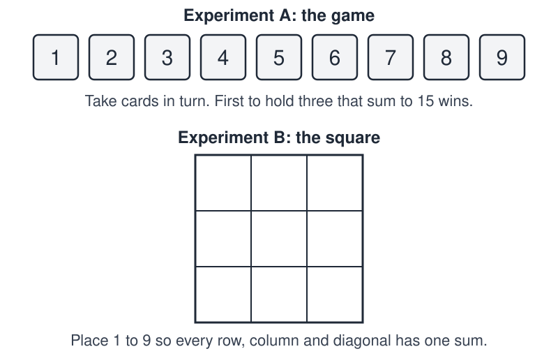
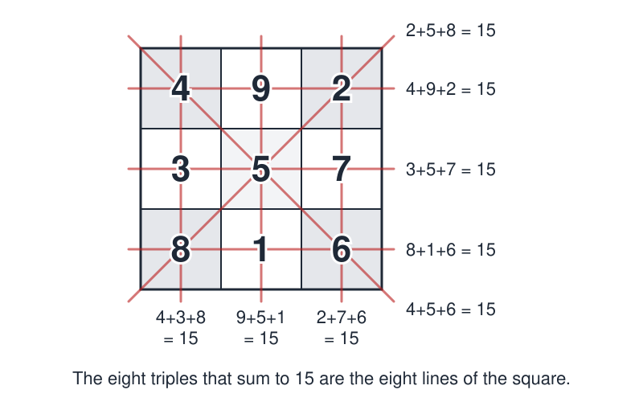

# LoShu Lab

 This work is licensed under a <a rel="license" href="http://creativecommons.org/licenses/by/4.0/">Creative Commons Attribution 4.0 International License</a>.

*[Section 5](../section5.md), session 27. The lab finishes in session 28, which also deals with [The Miracle of FujiYama](miracle-of-fujiyama.md) and starts the [laws of a toy universe](laws-of-toy-universe.md).*

!!! abstract "The problem"

    Reconstructed from the syllabus: no problem sheet survives, and this is
    the editors' wording, not Winfree's (see the note at the end).

    **Part 1: experiments (first class).** Work in pairs.

    *Experiment A, a game.* Lay nine cards numbered 1 to 9 face up. Take
    turns picking one card and keeping it. The first player to hold any
    three cards that add up to exactly 15 wins; if the cards run out first,
    it is a draw. Play at least ten games, log every pick, write hunches as
    testable statements ("5 is the best first pick"), and design games that
    could prove them wrong.

    *Experiment B, a square.* Place the digits 1 to 9 in a 3 x 3 grid so
    that all rows, columns and both diagonals have the same sum. Record
    every arrangement you find, and decide what counts as "different".

    **Part 2: a complete theory (second class).** Explain both experiments:
    the common sum and the centre digit, how many squares exist, every way
    to win the game, and the result of perfect play, with a strategy that
    guarantees it.

{ width="560" }

*The two experiments. Drawn for this site (CC BY 4.0).*

## Why it is in the course

Section 5 is "Inferences, Hypotheses, Explanations". Session 27, with Platt's *Strong Inference* due, reads "Start LoShu lab experiments in class". Session 28, with Judson's chapter "Strong Predictions" due, reads "Finish complete theory of LoShu."

A card game is a cheap laboratory. A hunch such as "the first player can force a win" can be stated, tested and killed in minutes: Platt's cycle in miniature. The experiments-then-theory shape matches the lab just before it, [Stacked Cantilevers](stacked-cantilevers-lab.md), which ends with "Theory of stacking cantilevers, resolution of wagers".

If the lab was built on the link between the square and tic-tac-toe (see the note at the end), it also carries Herbert Simon's lesson: how a problem is written down can decide whether it is hard.

## Where it comes from

**The square.** The Lo Shu ("scroll of the River Luo") is an ancient Chinese magic square of the digits 1 to 9. Legend says Yu the Great saw it on a turtle's back. Paul Carus (1908) warned that the surviving diagram is "a reconstruction of an ancient document", not the document itself. How old the arrangement is remains disputed. Later scholarship, following Schuyler Cammann's 1961 study, places a clear description of the square at about 80 CE.

**The game.** The link to tic-tac-toe is modern. In *The Sciences of the Artificial* (1969), Simon described a card game he called "number scrabble": the game above, played with the ace to nine of hearts. He used it to show problem solving as a change of representation, as did Newell and Simon in *Human Problem Solving* (1972). Donald Michie wrote that the number version is far harder for people than tic-tac-toe, although the two are logically identical. Cleve Moler recalls hearing of it, as Pick15, in the late 1960s. Who invented it is not established.

??? tip "Hints"

    - For every win in your log, note which three numbers made the 15. Can there be triples you have not seen?
    - List every set of three different numbers from 1 to 9 that adds to 15, and count how many sets each number is in.
    - Add 1 through 9. The three rows use every digit once, so what must each row add to? How many lines pass through the centre, a corner, an edge cell?
    - Compare the two sets of counts. Could you write each number in a cell so they agree everywhere? What would a winning triple look like then?

??? success "Resolution"

    **The square.** The digits 1 to 9 sum to 45, and the three rows use each once, so every line sums to 15. The four lines through the centre *c* cover every cell once and the centre three extra times: 4 x 15 = 45 + 3*c*, so *c* = 5.

    **The triples.** Exactly eight sets of three different digits sum to 15: {1,5,9}, {1,6,8}, {2,4,9}, {2,5,8}, {2,6,7}, {3,4,8}, {3,5,7}, {4,5,6}. The digit 5 is in four of them, each even digit in three, and each other odd digit in two.

    **Only one square.** A 3 x 3 grid has eight lines, so a magic square uses each triple once. The centre lies on four lines, so it holds 5; the corners lie on three, so they hold 2, 4, 6 and 8; the edges lie on two, so they hold 1, 3, 7 and 9. The top-left corner can be chosen 4 ways (fixing its opposite, which must add to 10), the other corners 2 ways, and the edges are then forced: 8 squares, the rotations and reflections of the Lo Shu.

    { width="560" }

    *Drawn for this site (CC BY 4.0).*

    **The game is tic-tac-toe.** Holding three numbers that sum to 15 is holding three Lo Shu cells in a line, so every threat, block and fork carries over. Tic-tac-toe is a draw with best play, and so is the card game: picture the square (5 is the centre, evens are corners) and play ordinary tic-tac-toe. It only feels harder because sums, unlike lines, are not visible at a glance.

## Sources

- **Arthur T. Winfree**, *The Art of Scientific Discovery* (ECOL 479/579) course handout, archived 20 April 2002 — [Wayback Machine](https://web.archive.org/web/20020420212713/http://eebweb.arizona.edu/Faculty/Winfree/handout_479.htm){target=_blank} 🔓
- **Herbert A. Simon**, *The Sciences of the Artificial*, "The Science of Design" (MIT Press, 1969) — [Internet Archive](https://archive.org/details/sciencesofartifi00simo){target=_blank} 🔓 *(borrow)*
- **Herbert A. Simon**, *The Sciences of the Artificial*, 3rd ed., pp. 131-132 (1996) — [Google Books](https://books.google.com/books?id=k5Sr0nFw7psC&pg=PA131){target=_blank} 🔒
- **Allen Newell and Herbert A. Simon**, *Human Problem Solving*, Chapter 3 (1972) — [Internet Archive](https://archive.org/details/humanproblemsolv0000newe){target=_blank} 🔓 *(borrow)*
- **Donald Michie**, *Machine Intelligence and Related Topics* (Gordon and Breach, 1982) — [Internet Archive](https://archive.org/details/machineintellige0000mich){target=_blank} 🔓 *(borrow)*
- **Mark Saul and Sian Zelbo**, *Camp Logic* (2014) — [Internet Archive](https://archive.org/details/camplogicweekofl0000saul){target=_blank} 🔒 (print-disabled access only)
- **Cleve Moler**, "TicTacToe Magic", *Experiments with MATLAB*, Chapter 11 (2011) — [Wayback Machine](https://web.archive.org/web/20161220110529/https://people.sc.fsu.edu/~jburkardt/m_src/exm_pdf/tictactoe.pdf){target=_blank} 🔓
- **Wikipedia contributors**, "Tic-tac-toe" — [Wikipedia](https://en.wikipedia.org/wiki/Tic-tac-toe){target=_blank} 🔓
- **W. S. Andrews**, *Magic Squares and Cubes*, with Paul Carus, "The Magic Square in China", pp. 122-123 (1908) — [Internet Archive](https://archive.org/details/magicsquarescube00andrrich){target=_blank} 🔓
- **Schuyler Cammann**, "The Magic Square of Three in Old Chinese Philosophy and Religion", *History of Religions* 1(1), 37-80 (1961) — [doi:10.1086/462439](https://doi.org/10.1086/462439){target=_blank} 🔒
- **Wikipedia contributors**, "Luoshu Square" (source of the 80 CE dating, citing Cammann) — [Wikipedia](https://en.wikipedia.org/wiki/Luoshu_Square){target=_blank} 🔓
- **John R. Platt**, "Strong Inference", *Science* 146, 347-353 (1964) — [doi:10.1126/science.146.3642.347](https://doi.org/10.1126/science.146.3642.347){target=_blank} 🔒
- **Arthur T. Winfree**, *The Art of Scientific Discovery*: original course syllabus — [PDF](https://github.com/tyson-swetnam/aosd/blob/main/docs/assets/aosd_syllabus.pdf){target=_blank} 🔓

!!! note "How sure are we that this is Winfree's problem?"

    The syllabus gives only two session lines. In Winfree's
    [archived handout](https://web.archive.org/web/20020420212713/http://eebweb.arizona.edu/Faculty/Winfree/handout_479.htm){target=_blank},
    the link on "LoShu" in both session lines points to a bookmark named
    `Tictactoe_LoShu`. Its target was in a companion document that was
    never archived. The label points to tic-tac-toe with the Lo Shu, but
    nothing found ties this exact exercise to him, so identification is
    probable.

    Candidates:

    - **Combined lab** (reconstructed above); Saul and Zelbo's *Camp Logic*
      has a classroom sequence of this shape.
    - **Game-first lab** in Simon's style: play cold, then find a
      representation that makes the game easy.
    - **Magic-square enumeration**, with tic-tac-toe as an aside.
    - **A different sum-to-15 tic-tac-toe** (odd numbers against even),
      which does not depend on the Lo Shu arrangement.

---

*Back to [Section 5](../section5.md) · [All problems](index.md) · [The schedule](../syllabus.md#section-5-inferences-hypotheses-explanations)*
