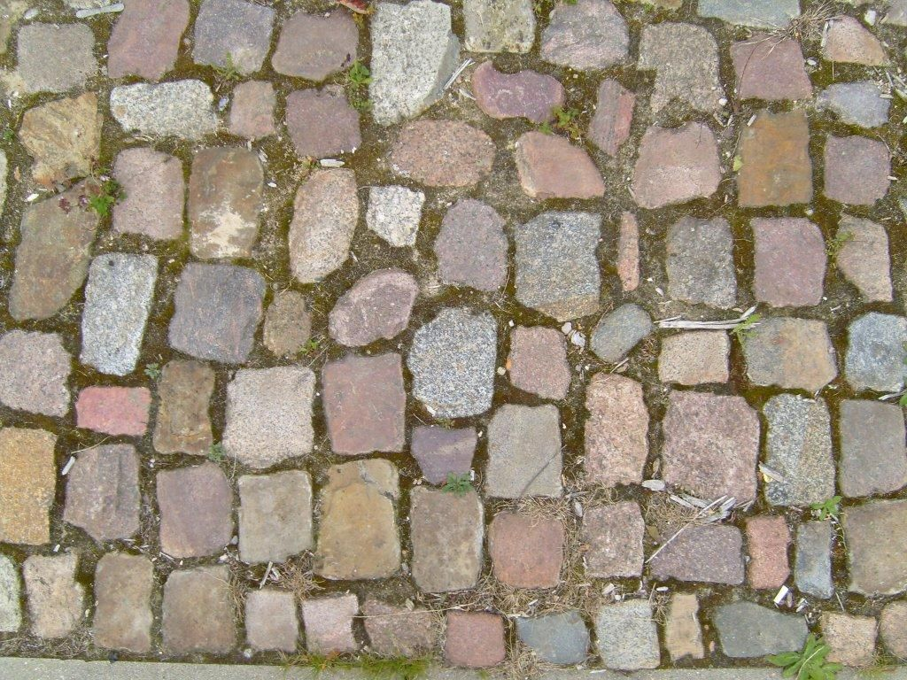

# Martian DNA

 This work is licensed under a <a rel="license" href="http://creativecommons.org/licenses/by/4.0/">Creative Commons Attribution 4.0 International License</a>.

*[Section 5](../section5.md), session 29. Dealt with together with [Antigen Invasions](antigen-invasions.md); the same session finishes the collaborative discovery of [the laws of a toy universe](laws-of-toy-universe.md).*

!!! abstract "The problem"

    Reconstructed from the syllabus: Winfree's write-up is lost. This is the
    editors' version, consistent with the surviving evidence (see the note at
    the foot of the page), not his text.

    You are handed a photograph with no scale bar. Its only caption: *"A
    high-resolution image of a stretch of Martian hereditary material. Deal
    with it."* It shows units of a few kinds packed edge to edge in rough
    rows, with occasional misfits. In your GamesWorth book:

    1. **Facts first.** Describe only what a camera records: kinds of unit,
       proportions, arrangement, where the arrangement fails.
    2. **Rules.** Propose at least two rules that could have produced it, one
       involving no code and no heredity at all.
    3. **Strong predictions.** For each rule, name a feature it forbids in the
       part you have not seen. Ask to see the part where your rules disagree.
    4. **Scale.** Which conclusions change if a unit is a nanometre, a
       centimetre or a metre across?
    5. **The label.** Mark each statement in your notes as coming from the
       picture or from the words *Martian* and *DNA*. Which set is larger?

{ width="560" }

*Drawn for this site (CC BY 4.0). A made-up specimen, not Winfree's picture: reading its middle row unit by unit turns a mosaic into a "sequence" with a repeat and one odd letter.*

## Why it is in the course

Section 5 is "Inferences, Hypotheses, Explanations". Session 29 reads: "Deal
with Antigen Invasions. Deal with Martian DNA. Finish collaborative discovery
of The Laws. ..." All three ask what rule lies behind something. In the editors'
reading, the trap in this one is the caption.

Session 4 asked for "facts before explanations of facts" and for
"distinguishing things we know vs only imagine". The syllabus also asks
students to "generate several alternative guesses, and test them for
workability". A picture labelled as alien genetic material tests all three.
Much of what a student writes in the first two minutes is not in the picture;
it is in the word *DNA*.

The day's reading, Feynman's *The Character of Physical Law*, makes the same
demand: guess a law, work out its consequences, compare them with
experiment. A guess is worth having only if something computed from it could
come out wrong.

## Where it comes from

The editors know of no published puzzle called "Martian DNA". The phrase
appears on no archived page of Winfree's lab site except the course handout.
In the handout's HTML the words are a link to an internal bookmark whose name
suggests what the object was. The write-up it pointed to does not survive in
any archived copy. The bookmark is named in the note at the foot of the page,
so try the exercise first.

Period background only: the 1996 claim that the Martian meteorite ALH84001
held traces of past life was still argued over in 2001, and Chargaff's
base ratios had helped Watson and Crick find DNA's structure in 1953.

??? tip "Hints"

    - Write down only what a camera records. "Martian" and "DNA" are not in
      the picture, and neither is the scale.
    - Count kinds, then ratios. For real DNA, Chargaff's counts of how often
      each unit occurs were an early clue to its structure.
    - For each regularity, ask whether it is a rule about meaning or about
      fitting. Things packed edge to edge obey constraints that carry no
      information.
    - A hypothesis earns its keep by forbidding something. Name what should be
      absent from the unseen part, then ask for exactly that part.
    - Which conclusions survive if the object is not Martian, not genetic and
      not alive?

??? success "Resolution"

    *What can honestly be said, given that Winfree's write-up is lost.*

    Winfree's bookmark name (see the note below) points to a cobblestone
    pavement. If that reading is right, the object billed as Martian DNA was a
    street. This is the editors' inference from the name, not a statement
    Winfree left behind.

    { width="560" }

    *A stand-in for Winfree's photograph, which does not survive. Photograph by Titus Tscharntke, public domain, via Wikimedia Commons.*

    Everything that can really be inferred from such a picture is about
    laying stones: a few kinds of unit, sizes in a narrow range, rough rows,
    defects where two patches of rows meet. None of it supports a sentence about coding,
    heredity or life; that came from the caption. A base-pairing rule for the
    stones is fine reasoning on a premise nobody tested. The productive moves
    were the ones that could have failed: counting ratios, predicting the
    unseen part, asking the scale, and imagining the picture if the caption
    were false. How Winfree ran the exercise is not recoverable.

## Sources

- **Arthur T. Winfree**, *The Art of Scientific Discovery* (ECOL 479/579): course handout, archived 20 April 2002 — [Wayback Machine](https://web.archive.org/web/20020420212713/http://eebweb.arizona.edu/Faculty/Winfree/handout_479.htm){target=_blank} 🔓 (view the page source for the session 29 link)
- **Arthur T. Winfree**, lab home page, Wayback Machine capture of 2006 — [Wayback Machine](https://web.archive.org/web/20060911203252/http://eebweb.arizona.edu/faculty/winfree/index.html){target=_blank} 🔓 (the archived site: no page other than the handout mentions the problem)
- **Richard P. Feynman**, *The Character of Physical Law* (1965), the lecture "Seeking New Laws" — [Internet Archive](https://archive.org/details/characterofphysi0000feyn){target=_blank} 🔓 *(borrow)*
- **Wikipedia contributors**, "Chargaff's rules" — [Wikipedia](https://en.wikipedia.org/wiki/Chargaff%27s_rules){target=_blank} 🔓 (period background)
- **J. D. Watson and F. H. C. Crick**, "Molecular Structure of Nucleic Acids: A Structure for Deoxyribose Nucleic Acid", *Nature* 171, 737–738 (1953) — [doi:10.1038/171737a0](https://doi.org/10.1038/171737a0){target=_blank} 🔒 (period background)
- **D. S. McKay et al.**, "Search for Past Life on Mars: Possible Relic Biogenic Activity in Martian Meteorite ALH84001", *Science* 273, 924–930 (1996) — [doi:10.1126/science.273.5277.924](https://doi.org/10.1126/science.273.5277.924){target=_blank} 🔒 (period background)
- **Titus Tscharntke**, "Old cobbles stones", public domain — [Wikimedia Commons](https://commons.wikimedia.org/wiki/File:Old_cobbles_stones.jpg){target=_blank} 🔓
- **Arthur T. Winfree**, *The Art of Scientific Discovery*: original course syllabus — [PDF](https://github.com/tyson-swetnam/aosd/blob/main/docs/assets/aosd_syllabus.pdf){target=_blank} 🔓

!!! note "How sure are we that this is Winfree's problem?"

    The syllabus gives only the name and session. In Winfree's handout, the
    link on "Martian DNA" points to a bookmark named `Pohang_cobblestones`
    (Pohang is probably the port city in South Korea). Many of his bookmark
    names simply repeat the title, but several name the content instead
    ("Paired Observations" points to `Keplers_Laws`, "Superposed filters" to
    `Polaroids`). Read the same way, this one makes a cobbled pavement the very
    likely object. His wording and procedure are lost, and no independent web
    search for the phrase was possible while this page was researched.
    Candidate readings, which can overlap:

    - **Pattern reading with a sting** (likeliest): a close-up of the pavement
      presented as Martian hereditary material; separate what is in the
      picture from what the label supplies.
    - **Sequence decoding**: a run of stones transcribed as a symbol string,
      analysed for alphabet, ratios, repeats and pairing rules.
    - **Tiling rules**: infer how the paving was laid, and which patterns need
      a rule-maker rather than packing alone.

---

*Back to [Section 5](../section5.md) · [All problems](index.md) · [The schedule](../syllabus.md#section-5-inferences-hypotheses-explanations)*
