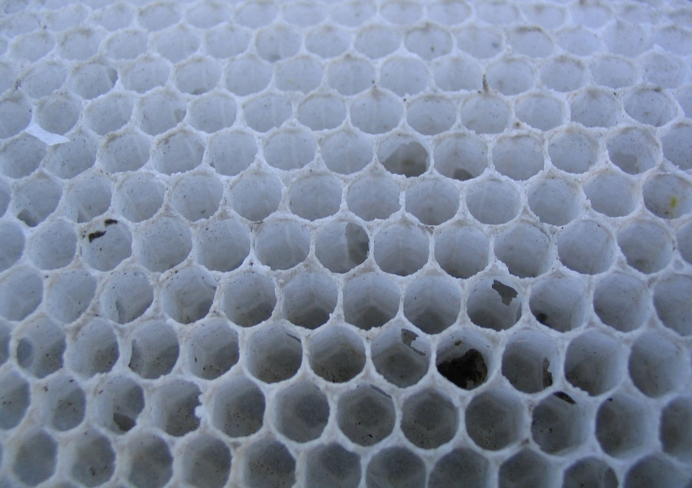
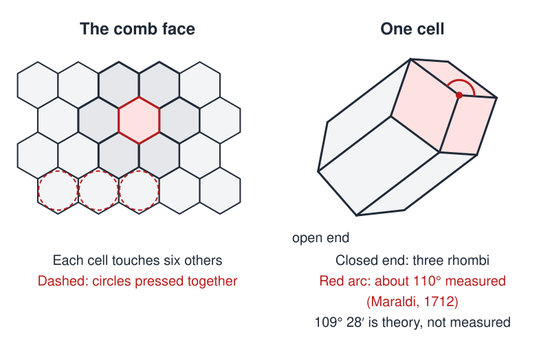

# Martian HoneyCombs

 This work is licensed under a <a rel="license" href="http://creativecommons.org/licenses/by/4.0/">Creative Commons Attribution 4.0 International License</a>.

*[Section 3](../section3.md), session 17. Discussed together with [Zygotes](zygotes.md).*

!!! abstract "The problem"

    Reconstructed from the syllabus: Winfree's own statement is lost. This
    exercise is the editors' substitute, built on the name and the section
    theme. It is not his text.

    **A. Observe.** Get a piece of real honeycomb, or a good close-up
    photograph. Before reading anything, write down what you can actually
    *see*: the openings, the closed ends, the tilt, the cell sizes, where the
    pattern breaks. In a second list, write what you "know"
    about honeycombs but did *not* see.

    **B. The Martian comb.** A probe brings back a comb built on Mars by a
    social creature that, like a bee, stores food in a mass of cells made of
    a soft material. For each feature on your lists, would you bet on finding
    it in the Martian comb? Say what each bet rests on:

    - a *mathematical* fact that holds on any planet;
    - a *physical* fact that holds if the material and building process are
      similar (Mars has about 0.38 of Earth's gravity);
    - a *biological* accident of Earth bees that a Martian need not share.

    **C. The questions.** Which of your "facts" has anyone measured, and how
    precisely could a wax cell be measured? Which are theorems, and about
    what idealised object? What would you ask before saying what a
    Martian comb *must* look like?

{ width="560" }

*Real comb for Part A: look at the openings and the cell floors. Photo by Doug Bowman, via Flickr and Wikimedia Commons, CC BY 2.0.*

{ width="560" }

*Hexagonal cells, and one cell closed by three rhombi (the facets of a rhombic dodecahedron). Drawn for this site (CC BY 4.0).*

## Why it is in the course

Section 3 is "Observations and Questions". The honeycomb is a classic case
of an observation buried under its explanations. The Martian framing forces
the separation the syllabus asks for earlier: "facts before explanations of
facts" and "distinguishing things we know vs only imagine" (session 04).

Sorting what you believe about a familiar object into mathematics, physics
and Earth biology, and seeing how little rests on your own observation, is
the exercise. The reading due that day is Ehrlich, Chapter 3.

## Where it comes from

The syllabus gives only the name. Winfree's problem write-ups were kept in a
companion document that was never archived, so his statement is lost.

The honeycomb itself has a long history. Pappus of Alexandria (about 300 CE)
wrote that bees had "wisely selected" the hexagon because it holds more
honey. In 1712 Giacomo Maraldi measured the rhombi that close the end of a
cell as about 110 and 70 degrees. D'Arcy Thompson (1917) remarked that "nobody appears to have thought of the
impossibility of measuring such a thing as the end of a bee's cell to the
nearest minute".

Darwin (1859), Thompson (1917) and the mathematicians Fejes Toth (1964) and
Thomas Hales (1999) all took up the question of why the comb has the shape
it has. Their answers are in the resolution below.

??? tip "Hints"

    - Separate what you saw from what you read. Did you look at the closed
      ends, or where small cells meet large ones?
    - For the hexagons, ask what is being optimised and by whom: a geometer
      bee, soft walls pressing together, or a theorem. Only one of these is
      planet-independent.
    - Angles quoted to the minute of arc should make you suspicious. How
      would you measure a wax facet thinner than a millimetre?
    - Gravity is the one Martian variable you can reason about. Which
      features might depend on it?

??? success "Resolution"

    No answer key survives. For this reconstruction only:

    **Mathematics (holds anywhere).** Hales proved (1999, published 2001)
    that no way of dividing the plane into equal-area regions has less total
    boundary than the regular hexagons. A Martian that tiles a flat comb with
    equal cells and saves wall material is pushed to hexagons. The theorem
    says nothing about why cells should be equal or flat.

    **Physics (holds if the process is similar).** Darwin, with the geometer
    W. H. Miller, showed that equal spheres in two staggered layers, walled
    off where they overlap, give hexagonal prisms with three-rhomb bottoms.
    Thompson added that soft wax settles like soap films, so the rhombi come
    out at about 109.5 and 70.5 degrees without any bee "knowing" them. A
    Martian packing cells of a soft material closely would be expected to get
    the same shapes. Earth cells tilt slightly upward, usually explained by
    gravity keeping liquid honey in; at 0.38 of Earth's gravity that tilt
    could differ.

    **Biology (Earth only).** Cell size, worker and drone cells, and the
    double-sided hanging comb belong to honey bees, not to combs in general.

    **The caution.** The famous 109 degrees 28 minutes was theory, not a
    measurement. And in 1964 Fejes Toth showed that the three-dimensional
    cell the bees build does not use the least possible wall area.

## Sources

- **Arthur T. Winfree**, *The Art of Scientific Discovery* (ECOL 479/579), course handout, session 17 — [Wayback Machine capture, 20 April 2002](https://web.archive.org/web/20020420212713/http://eebweb.arizona.edu/Faculty/Winfree/handout_479.htm){target=_blank} 🔓
- **D'Arcy Wentworth Thompson**, *On Growth and Form*, chapter VII, the bee's cell (1917) — [Internet Archive](https://archive.org/details/ongrowthform1917thom){target=_blank} 🔓
- **Charles Darwin**, *On the Origin of Species*, 1st ed., chapter on Instinct (1859) — [Project Gutenberg](https://www.gutenberg.org/ebooks/1228){target=_blank} 🔓
- **Thomas C. Hales**, "The Honeycomb Conjecture", *Discrete & Computational Geometry* 25, 1-22 (2001) — [arXiv](https://arxiv.org/abs/math/9906042){target=_blank} 🔓
- **Laszlo Fejes Toth**, "What the bees know and what they do not know", *Bulletin of the AMS* 70, 468-481 (1964) — [DOI](https://doi.org/10.1090/S0002-9904-1964-11155-1){target=_blank} 🔓
- **Wikipedia contributors**, "Honeycomb" — [Wikipedia](https://en.wikipedia.org/wiki/Honeycomb){target=_blank} 🔓
- **Malin Space Science Systems / NASA JPL**, "Southern Hemisphere Polygonal Patterned Ground" (2002) — [Wayback Machine](https://web.archive.org/web/20161027001241/http://www.msss.com/mars_images/moc/polygons_5_02/){target=_blank} 🔓
- **Robert Ehrlich**, *Nine Crazy Ideas in Science* (2001) — [Internet Archive](https://archive.org/details/ninecrazyideasin00ehrl){target=_blank} 🔒 *(print-disabled readers only)*
- **Arthur T. Winfree**, *The Art of Scientific Discovery: original course syllabus* — [PDF](https://github.com/tyson-swetnam/aosd/blob/main/docs/assets/aosd_syllabus.pdf){target=_blank} 🔓

!!! note "How sure are we that this is Winfree's problem?"

    Not sure. The syllabus gives the name, the session (17, with Zygotes)
    and the section theme. The phrase appears nowhere else the editors
    searched, and Winfree's write-up was never archived. The readings
    weighed:

    - **A thought experiment on honeycomb geometry** (medium confidence): the
      reconstruction above, with "Martian" stripping away Earth-bound
      assumptions.
    - **The classical bee's-cell story as a case study** (medium): angles
      "known" to the minute that nobody measured, and a design admired as
      optimal without checking.
    - **Literal Martian "honeycombs"** (low): polygonal patterned ground
      photographed by Mars Global Surveyor from 2000 onward.

---

*Back to [Section 3](../section3.md) · [All problems](index.md) · [The schedule](../syllabus.md#section-3-observations-and-questions)*
