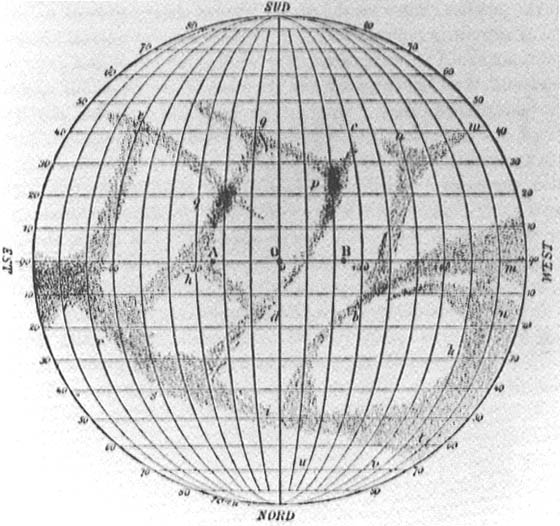

# Mercury's Mysterious Hidden Hemisphere

 This work is licensed under a <a rel="license" href="http://creativecommons.org/licenses/by/4.0/">Creative Commons Attribution 4.0 International License</a>.

*[Section 2](../section2.md), session 9. The syllabus pairs the discussion with Adams Chapter 4 on cultural blocks and Platt's Diversity.*

!!! abstract "The problem"

    Reconstructed from the syllabus; Winfree's own wording is not recorded.

    Mercury never appears more than about 28 degrees from the Sun, so it is
    seen low in a twilight sky, through turbulent air, its markings at the
    limit of vision. In the 1880s Giovanni Schiaparelli, among the finest
    planetary observers alive, concluded from those markings that Mercury
    turns once per 88-day orbit, keeping one face to the Sun as the Moon
    keeps one face to us: one hemisphere scorched, the other frozen, a
    hidden hemisphere no telescope could ever see. Tidal friction explained
    it, Antoniadi's 1934 map confirmed it, and every textbook repeated it
    for seventy-five years.

    It was wrong. Before reading **What happened**: what does a visual
    observer actually record, and how often? Mercury's *synodic* period,
    the interval between apparitions of the same kind, is about 116 days —
    is 88 days the only rotation period that would show such observers the
    same markings every time? And what measurement, not using the eye at
    all, could settle it?

![Three panels. Left: the old 1:1 picture, four positions on a circular orbit with the same face always turned to the Sun. Right: the true 3:2 resonance, six positions on one eccentric orbit with a marker that turns 90 degrees for every 60 degrees of orbit. Middle: the same marker at three successive perihelion passages, facing the Sun, then away, then toward it again. Bottom: a bar chart to scale of rotation (58.6 d), synodic period (115.9 d) and two rotations (117.3 d), the last two almost equal.](../assets/images/problems/mercurys-hidden-hemisphere.svg){ width="560" }

*Drawn for this site (CC BY 4.0).*

## Why it is in the course

Session 9 pairs Adams on cultural blocks with Platt's essay on diversity.
Mercury is a ready-made specimen: a plausible result from an authoritative
observer, which a whole field then believed for seventy-five years.

The correction came from outside, from radar astronomers asking a different
question with a different instrument — Platt's argument for diversity made
concrete. Visual astronomy could not correct itself, because its observing
schedule was aliased to the very thing it measured.

## Where it comes from

Schiaparelli, observing Mercury in daylight from Brera from 1881, found the
markings unchanged over hours and announced the 88-day period in 1889. One
system of spots had struck him as reappearing in nearly the same place at
six eastern elongations in 1882–83. Antoniadi, at Meudon in 1924–29,
named Mercury's dark and bright areas and, in Larry Krumenaker's phrase,
"firmly established (as he thought)" the period. Features that later
vanished or moved were put down to libration, poor seeing or luminescence;
the result, Krumenaker writes, "seemed quite secure, both observationally
and theoretically".

{ width="560" }

*Giovanni Schiaparelli, map of Mercury, 1889. Public domain, via Wikimedia Commons (from NASA SP-423).*

??? tip "Hints"

    - A visual observer gets a few sketches per apparition, at intervals set by the geometry of Earth and Mercury, not by Mercury's rotation. Which rotation periods return the same face to the sketch-pad every time?
    - Write the rotation period as a fraction of the 116-day synodic period. 88 days is not the only simple answer.
    - Radar returns a Doppler-shifted echo: the approaching limb shifts it up in frequency, the receding limb down. What does the *width* of that spectrum tell you?

## What happened

**The period is 58.65 days, not 88.** In June 1965 Pettengill and Dyce,
using the new 1000-foot Arecibo dish, measured the Doppler
broadening of radar echoes and got 59 ± 5 days. In the same issue of
*Nature*, Peale and Gold explained why a planet on an eccentric orbit need
not lock 1:1; Colombo then pointed out that 58.65 days is exactly
two-thirds of the 88-day orbit, and the dynamics of this 3:2 spin-orbit
resonance followed. There is no permanently dark hemisphere, and a solar
day on Mercury lasts 176 Earth days.

**Why the eye was fooled.** Twice the rotation period, 117.3 days, is
within a day of the 115.9-day synodic period, so at each apparition of the
same kind Mercury turns nearly the same face to Earth — and observers
worked mainly at the favourable apparitions. The drawings, Dyce, Pettengill
and Shapiro noted in 1967, had been made at intervals of very nearly even
multiples of Mercury's orbital period, and so could not tell 88 days from
59.

**The blocks.** Perceptual: markings at the threshold of vision, read
through a published map. Cultural: a great observer's authority, the Moon
analogy, seventy-five years of textbooks. Emotional: microwave measurements
in 1962, read on the assumption that the night side was cold, implied a
temperature under the Sun of about 1100 K where sunlight can supply about
633 K — the signature of a night side that is not cold. Howard, Barrett and Haddock reached
instead for radioactive heating or an insulating dust layer, and after 1965
others reached for heat-carrying winds. The 88-day period went
unquestioned.

**Postscript.** Mariner 10's 176-day orbit equalled two Mercury years and
three Mercury rotations, so its three flybys of 1974–75 all saw the same
sunlit face and mapped only 40–45 percent of the surface. When Winfree taught this course
more than half the planet had still never been photographed; MESSENGER's
two flybys in 2008 raised coverage to about 95 percent.

## Sources

- **G. H. Pettengill and R. B. Dyce**, "A Radar Determination of the Rotation of the Planet Mercury", *Nature* 206, 1240 (19 June 1965) — [doi:10.1038/2061240a0](https://doi.org/10.1038/2061240a0){target=_blank} 🔒
- **S. J. Peale and T. Gold**, "Rotation of the Planet Mercury", *Nature* 206, 1240–1241 (1965) — [doi:10.1038/2061240b0](https://doi.org/10.1038/2061240b0){target=_blank} 🔒
- **G. Colombo**, "Rotational Period of the Planet Mercury", *Nature* 208, 575 (6 November 1965) — [doi:10.1038/208575a0](https://doi.org/10.1038/208575a0){target=_blank} 🔒
- **G. Colombo and I. I. Shapiro**, "The Rotation of the Planet Mercury", *Astrophysical Journal* 145, 296 (1966), doi:10.1086/148762 — [free scan, NASA ADS](https://articles.adsabs.harvard.edu/cgi-bin/nph-iarticle_query?1966ApJ...145..296C&defaultprint=YES&filetype=.pdf){target=_blank} 🔓
- **P. Goldreich and S. J. Peale**, "Spin-orbit coupling in the solar system", *Astronomical Journal* 71, 425 (1966), doi:10.1086/109947 — [free scan, NASA ADS](https://articles.adsabs.harvard.edu/cgi-bin/nph-iarticle_query?1966AJ.....71..425G&defaultprint=YES&filetype=.pdf){target=_blank} 🔓
- **R. B. Dyce, G. H. Pettengill and I. I. Shapiro**, "Radar determination of the rotations of Venus and Mercury", *Astronomical Journal* 72, 351 (1967), doi:10.1086/110231 — [free scan, NASA ADS](https://articles.adsabs.harvard.edu/cgi-bin/nph-iarticle_query?1967AJ.....72..351D&defaultprint=YES&filetype=.pdf){target=_blank} 🔓
- **W. E. Howard, A. H. Barrett and F. T. Haddock**, "Measurement of Microwave Radiation from the Planet Mercury", *Astrophysical Journal* 136, 995 (1962), doi:10.1086/147451 — [free scan, NASA ADS](https://articles.adsabs.harvard.edu/cgi-bin/nph-iarticle_query?1962ApJ...136..995H&defaultprint=YES&filetype=.pdf){target=_blank} 🔓
- **Lorenzo De Piccoli and Mario Carpino**, "Friendly Stilbon, fraudful Hermes. Schiaparelli and the rotation of Mercury", *Atti del XLIV Congresso Nazionale SISFA* (2025), 199–206 — [open-access PDF](http://www.fedoabooks.unina.it/index.php/fedoapress/catalog/download/669/727/3372?inline=1){target=_blank} 🔓
- **Larry Krumenaker**, "The Planet Mercury: Drawing the Right Surface Maps of Mercury", from *A Computer Analysis of Visual Observations of Mercury* (MS thesis, Case Western Reserve University, 1976) — [hermograph.com](https://www.hermograph.com/science/cartogrf.htm){target=_blank} 🔓
- **Wikipedia contributors**, "Mercury (planet)" (overview) — [Wikipedia](https://en.wikipedia.org/wiki/Mercury_%28planet%29){target=_blank} 🔓
- **NASA History Office**, "45 Years Ago: Mariner 10 First to Explore Mercury" (2019) — [nasa.gov](https://www.nasa.gov/history/45-years-ago-mariner-10-first-to-explore-mercury/){target=_blank} 🔓
- **Wikipedia contributors**, "Mariner 10" (overview) — [Wikipedia](https://en.wikipedia.org/wiki/Mariner_10){target=_blank} 🔓
- **ScienceDaily** (source credited: NASA), "More Hidden Territory On Mercury Revealed By MESSENGER Spacecraft" (31 October 2008) — [ScienceDaily](https://www.sciencedaily.com/releases/2008/10/081030091153.htm){target=_blank} 🔓
- **Laboratory for Atmospheric and Space Physics, University of Colorado**, "MESSENGER reveals more hidden territory on Mercury" (2008) — [LASP](https://lasp.colorado.edu/2008/10/29/messenger-reveals-hidden-territory-on-mercury/){target=_blank} 🔓
- **Calvin J. Hamilton**, "Mercury", *Views of the Solar System* — [solarviews.com](https://solarviews.com/eng/mercury.htm){target=_blank} 🔓
- **A. T. Winfree**, *The Art of Scientific Discovery: course handout (EEB 479/479H/579)*, archived 2002 — the session-9 line is the only mention of Mercury in it — [Wayback Machine](https://web.archive.org/web/20020420212713/http://eebweb.arizona.edu:80/Faculty/Winfree/handout_479.htm){target=_blank} 🔓
- **Arthur T. Winfree**, *The Art of Scientific Discovery: original course syllabus* — [PDF](https://github.com/tyson-swetnam/aosd/blob/main/docs/assets/aosd_syllabus.pdf){target=_blank} 🔓

!!! note "How sure are we that this is Winfree's problem?"

    The syllabus gives the title, the session and its readings, and nothing
    more. "Mercury" occurs once in Winfree's archived course handout — in
    that one line — and nothing on the planet survives anywhere else in his
    archived pages and columns. Identification is therefore **probable**.
    The candidates:

    - **The 1889–1965 rotation episode** (high confidence): it matches every word of the title, it is a textbook cultural block, and it needs only elementary arithmetic.
    - **Mariner 10's unimaged hemisphere** (medium): also literally hidden, and still hidden in 2001, but that gap is an engineering consequence rather than a block.
    - **A geometrical puzzle** about what Earth can see of a synchronously rotating planet (low): nothing supports it over the historical reading.

---

*Back to [Section 2](../section2.md) · [All problems](index.md) · [The schedule](../syllabus.md#section-2-creative-blocks)*
