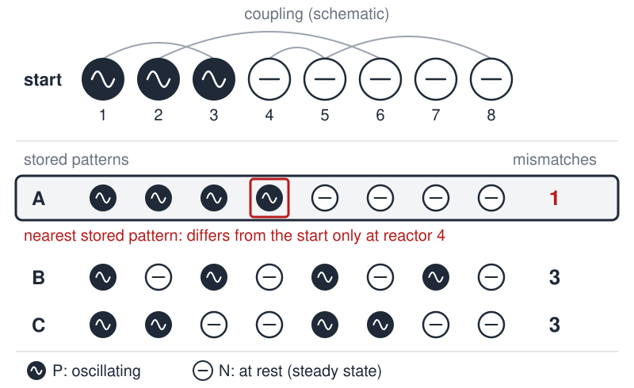

# The Miracle of FujiYama

 This work is licensed under a <a rel="license" href="http://creativecommons.org/licenses/by/4.0/">Creative Commons Attribution 4.0 International License</a>.

*[Section 5](../section5.md), session 28. The same session finishes the theory of [LoShu](loshu-lab.md) and starts on the [laws of a toy universe](laws-of-toy-universe.md).*

!!! abstract "The problem"

    A reconstruction, not Winfree's text, which is lost. The editors built
    this substitute on one reading of the only surviving clue (see *Where
    it comes from*); the patterns are their own.

    Eight chemical reactors stand in a row, numbered 1 to 8. Each is either
    **P** (oscillating) or **N** (at rest). A row of eight states is a
    *pattern*. The reactors are wired together so that the row has *stored*
    three patterns:

    - A = PPPPNNNN
    - B = PNPNPNPN
    - C = PPNNPPNN

    Started in any other pattern, the row changes until it settles. The
    builders claim it settles into **the stored pattern that differs from
    the start in the fewest places.** The figure works one case.

    1. How many patterns can the row show? How many are not stored?
    2. For each pair of stored patterns, count the places where they differ.
    3. Say in advance where the row must end, or that the claim makes no
       prediction, for (a) PNPPPNNN, (b) NNNNPPPP, (c) NNNNNNNN.
    4. For how many unstored patterns is the prediction definite? Which
       would you test first?
    5. A run started one step from A ends in B. What has been refuted, and
       what has not?

{ width="560" }

*The worked case from the reconstruction, not Winfree's problem. Drawn for this site (CC BY 4.0).*

## Why it is in the course

Session 28 assigns chapter 7 of Judson's *The Search for Solutions*,
listed in the schedule as "Strong Predictions", one session after Platt's
*Strong Inference*.

In the reconstruction, "the row settles into the nearest stored pattern"
is a strong claim in Platt's sense: it names the end state before the run,
so one run can refute it. Working the numbers also exposes its silent
zones, the ties where it predicts nothing. Knowing where your theory says
nothing is the first step to designing the test that could embarrass it.

Reduced to a table of P and N, the exercise fits the syllabus's promise
that exercises are "mostly made from elementary mathematics so as to
require no lab setup".

## Where it comes from

The syllabus gives only the title. In Winfree's handout, the link on this
item points to a bookmark named `Eight_Reactors`. The bookmarks pointed
into a companion document that was never archived, so the problem text is
lost. Elsewhere a playful title hides a plain label: "Paired
Observations" links to `Keplers_Laws`.

Which reactors is not recorded. The closest match lies in Winfree's own
field, the Belousov-Zhabotinsky oscillating reaction. In 1999
W. Hohmann, M. Kraus and F. W. Schneider wired eight such reactors together
like a Hopfield neural network, each periodic (P) or at rest (N). The
network stored three of the 256 patterns and carried some of the others to
the stored pattern they differed from least. No document links Winfree to
this paper.

Nothing found explains "FujiYama". The phrase is no known puzzle name,
though a 1916 *Outlook* article uses it plainly of the mountain seen
"against the western sky".

??? tip "Hints"

    - Count patterns as you would count eight coin tosses.
    - Write A, B and C one above another and compare them column by column.
    - For each test pattern, count its mismatches with A, B and C. A
      prediction exists only when one count is strictly smallest.
    - Each of the eight possible columns of three P/N symbols appears
      exactly once, and columns 1 and 8, 2 and 7, 3 and 6, 4 and 5 are
      opposites (every symbol flipped). Working pair by pair lets you count
      ties without listing every pattern.

??? success "Resolution"

    This resolves the reconstruction only. Counts were checked by listing
    all 256 patterns.

    1. 2^8 = 256 patterns; 253 are not stored.
    2. Every pair differs in exactly 4 places, so none is favoured.
    3. Mismatches with A, B and C: (a) 2, 2, 4: A and B tie, no prediction.
       (b) 8, 4, 4: B and C tie, no prediction. It is A with every state
       flipped; do not predict A because it "looks like" A. (c) 4, 4, 4: a
       three-way tie.
    4. Only 129 of the 253 have a single nearest pattern (43 each); 84 tie
       between two and 40 among all three. Test first the 24 patterns one
       step from a stored pattern, where a failure hurts most, then the
       ties, where the row must do something the claim does not describe.
    5. "Fewest mismatches wins" is refuted, since A was strictly nearest.
       That the row stores nothing is not shown; ask what rule it obeys.

## Sources

- **Arthur T. Winfree**, *The Art of Scientific Discovery* (ECOL/EEB 479/479H/579), course handout; the session-28 line and its bookmark — [Wayback Machine capture, 20 April 2002](https://web.archive.org/web/20020420212713/http://eebweb.arizona.edu/Faculty/Winfree/handout_479.htm){target=_blank} 🔓
- **W. Hohmann, M. Kraus, F. W. Schneider**, "Pattern Recognition by Electrical Coupling of Eight Chemical Reactors", *Journal of Physical Chemistry A* 103(38), 7606-7611 (1999) — [DOI](https://doi.org/10.1021/jp991480n){target=_blank} 🔒
- **Eliza Ruhamah Scidmore**, "Japan's Coronation Season", *The Outlook*, 26 January 1916 — [Internet Archive](https://archive.org/details/sim_new-outlook_1916-01-26){target=_blank} 🔓
- **Horace Freeland Judson**, *The Search for Solutions* (1980), chapter 7, listed in Winfree's handout as "Strong Predictions" — [Internet Archive](https://archive.org/details/searchforsolutio0000juds_r0s0){target=_blank} 🔓 *(borrow)*
- **John R. Platt**, "Strong Inference", *Science* 146(3642), 347-353 (1964) — [DOI](https://doi.org/10.1126/science.146.3642.347){target=_blank} 🔒
- **Wikipedia contributors**, "Natural nuclear fission reactor" — [Wikipedia](https://en.wikipedia.org/wiki/Natural_nuclear_fission_reactor){target=_blank} 🔓
- **Wikipedia contributors**, "Paul Kuroda" — [Wikipedia](https://en.wikipedia.org/wiki/Paul_Kuroda){target=_blank} 🔓
- **Greater Yellowstone Interagency Brucellosis Committee**, *GYIBC Annual Report 2005* — [Internet Archive](https://archive.org/details/gyibcannualrepor2005grea){target=_blank} 🔓
- **Arthur T. Winfree**, *The Art of Scientific Discovery*: original course syllabus — [PDF](https://github.com/tyson-swetnam/aosd/blob/main/docs/assets/aosd_syllabus.pdf){target=_blank} 🔓

!!! note "How sure are we that this is Winfree's problem?"

    Not sure. Which kind of reactor the item concerned is unknown. The
    readings weighed, all low confidence:

    - **Eight coupled chemical reactors**, as in the 1999 experiment: the
      reconstruction above. Nothing ties Winfree to the paper.
    - **Nuclear reactors.** The best nuclear fit is the Japanese-born
      chemist Paul Kuroda's 1956 proposal of natural fission reactors,
      confirmed at Oklo, Gabon, in 1972: a strong prediction, but with no
      eight and no Fuji.
    - **Diagnostic "reactors"**, subjects that test positive, as in a 2005
      brucellosis report of eight reactors in one herd. Nothing links it
      to Winfree.

    Earlier guesses from the title alone (a sky wonder at the summit, the
    monk-on-the-mountain puzzle) are disfavoured: none involves reactors.

---

*Back to [Section 5](../section5.md) · [All problems](index.md) · [The schedule](../syllabus.md#section-5-inferences-hypotheses-explanations)*
