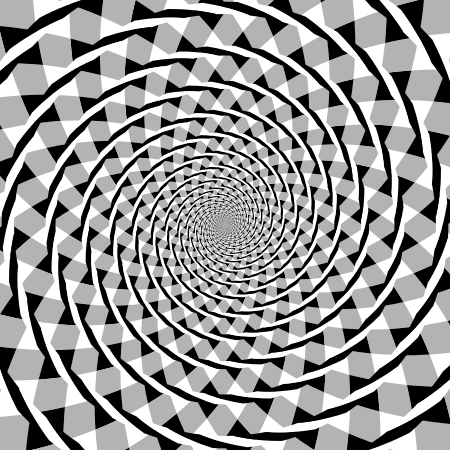

# Mother Nature as Magician; Hallucinations

 This work is licensed under a <a rel="license" href="http://creativecommons.org/licenses/by/4.0/">Creative Commons Attribution 4.0 International License</a>.

*[Section 3](../section3.md), session 15, with Judson Chapter 8: Evidence. The same session takes the last observations in the [chemical pattern-formation lab](chemical-pattern-formation-lab.md) and discusses [Rainbow Moon](rainbow-moon.md).*

!!! abstract "The problem"

    *A reconstruction.* The syllabus gives only the title and the reading.
    The examples below are standard illusions and observations from
    Winfree's own writing, most of it from after the course (dates under
    "Where it comes from"). Work them before reading "What happened".

    **The magician.** A stage magician breaks no law of nature: everything
    the audience sees is real, but the obvious inference is false. Nature
    plays the same trick on careful observers. Check each case yourself:

    1. **The Moon at the horizon** looks far bigger than the Moon high in the
       sky. Hold a coin at arm's length so it just covers the high Moon, then
       try it at moonrise.
    2. **A taut shoestring**, held level at arm's length along the horizon,
       looks straight. Raise it, still level, about 30 degrees higher: its
       middle now seems to bow upward.
    3. **The Fraser spiral** in the figure below. Trace one of its "spiral"
       arms with a finger.

    For each, write down what you observed, what you inferred, where in the
    chain *object, light, eye, brain* the trick happens, and what test would
    show it.

    **The hallucination.** An outdoor fluorescent lamp in a white globe is
    switched on by a light sensor. At dusk it flickers, because its own light
    keeps turning it off. The globe seems covered with shifting purple blotches
    and squirming yellow worms. Are they on the lamp, or in you? You cannot
    photograph them. Plan observations that would (a) locate the patterns,
    (b) measure something about them, and (c) let someone else check your
    claim.

{ width="560" }

*Drawn for this site (CC BY 4.0).*

{ width="560" }

*Fraser spiral illusion, redrawn by Mysid after James Fraser (1908). Wikimedia Commons, public domain.*

## Why it is in the course

Section 3 is "Observations and Questions", and the reading for session 15
is Judson's chapter "Evidence". Earlier sessions set the ground rules:
"facts before explanations of facts" with the
[Golden Tooth](golden-tooth.md), and "distinguishing things we know vs only
imagine" with [Bookworm's Journey](bookworms-journey.md).
[N-Rays](n-rays.md) showed a whole laboratory fooling itself.

This session moves the deception into perception itself: the audience sees
truly and concludes falsely. The exercise is to split observation from
inference and find where they came apart. A hallucination makes the
evidence problem sharpest: when the thing exists only in the observer, what
takes the place of a photograph?

## Where it comes from

The idea is old. Feynman's "Cargo Cult Science", read in session 2, says:
"The first principle is that you must not fool yourself, and you are the
easiest person to fool." The Moon illusion is mentioned by Aristotle, and
Purkinje described flicker patterns in 1819. Ermentrout and Cowan (1979)
explained the geometric forms of drug-induced hallucinations as patterns
that appear when activity in the visual cortex becomes unstable.

Only one piece of Winfree's own material predates the session: the lamp
observation, which he dates to January 2001. In a column of 19 April 2002
he posed the question it raised: "How do you investigate, how do you
communicate to others, and how do you describe without pictures, something
that has no 'objective' existence?"

The rest of his material is later. The shoestring observation is dated 23
October 2001, and his explanation of it appeared on 7 December 2001. His
tests on the lamp are undated and were published only in April 2002. In a
column of 22 February 2002 he took up another case of Nature seeming to
cheat: the Moon plainly circles the sky once a month, yet the "phase angle"
in every ephemeris never reaches 180 degrees. None of these columns records
what the class discussed.

??? tip "Hints"

    - Write the observation and the inference on separate lines. The trick lives in the gap between them.
    - Check each link with something that cannot be fooled the same way: a ruler on the object, a light meter on the light, a camera in place of your eye, another person in place of your brain.
    - For a percept with no outside cause, first measure the stimulus with an instrument that cannot hallucinate.
    - "Objective" is a claim about other observers. Bring one who does not know what to expect, and vary the stimulus until the effect comes and goes.

## What happened

Nothing records what the class concluded; the examples resolve like this.

- **Moon illusion.** The coin covers the Moon equally well at the horizon
  and overhead: about half a degree. The enlargement is made in the head, by
  a mechanism still debated.
- **Shoestring.** Winfree argued (7 December 2001) that we build the visual
  world as a sphere of directions, on which a straight line becomes a
  great-circle arc: straight in space, curved in the view.
- **Fraser spiral.** The finger comes back to where it started: the figure
  is concentric circles. The tilted strands mislead local orientation, and
  the brain joins them into a spiral.
- **The flickering lamp.** Winfree's answer (April 2002): an oscilloscope
  showed the flicker had period-doubled to 30 Hz; a strobe on a white wall
  made the same blotches between about 30 and 18 Hz only; an uninformed
  graduate student saw them too. Made by eye and brain, yet measured and
  confirmed. Such patterns are now modelled as pattern formation in the
  visual cortex (Rule, Stoffregen and Ermentrout, 2011).

## Sources

- **Arthur T. Winfree**, "Vibrating the Brain", *Adventures in Discovery* column, Society for Amateur Scientists E-Bulletin (19 April 2002) — [Wayback Machine](https://web.archive.org/web/20030114043354/http://eebweb.arizona.edu/faculty/winfree/SAS/SAS15/SAS15.html){target=_blank} 🔓
- **Arthur T. Winfree**, "Are straight lines curved in the sky?", *Adventures in Discovery* column (9 November 2001) — [Wayback Machine](https://web.archive.org/web/20030114041445/http://eebweb.arizona.edu/faculty/winfree/SAS/SAS01/SAS01.html){target=_blank} 🔓
- **Arthur T. Winfree**, "A Personal Encounter with Non-Euclidean Geometry", *Adventures in Discovery* column (7 December 2001) — [Wayback Machine](https://web.archive.org/web/20030114051703/http://eebweb.arizona.edu/faculty/winfree/SAS/SAS05/SAS05.html){target=_blank} 🔓
- **Arthur T. Winfree**, "Moon and Sun Violate Reason? Nope: 'Reason' Takes a Lesson From Them", *Adventures in Discovery* column (22 February 2002) — [Wayback Machine](https://web.archive.org/web/20030114041649/http://eebweb.arizona.edu/faculty/winfree/SAS/SAS11/SAS11.html){target=_blank} 🔓
- **Arthur T. Winfree**, *The Art of Scientific Discovery* (ECOL 479/579), course handout, archived 20 April 2002 — [Wayback Machine](https://web.archive.org/web/20020420212713/http://eebweb.arizona.edu/Faculty/Winfree/handout_479.htm){target=_blank} 🔓
- **Horace Freeland Judson**, *The Search for Solutions* (Holt, Rinehart and Winston, 1980), Chapter 8: Evidence — [Internet Archive](https://archive.org/details/searchforsolutio0000juds_r0s0){target=_blank} 🔓 *(borrow)*
- **Richard P. Feynman**, "Cargo Cult Science", Caltech commencement address (1974) — [Caltech](https://calteches.library.caltech.edu/51/2/CargoCult.htm){target=_blank} 🔓
- **G. B. Ermentrout and J. D. Cowan**, "A mathematical theory of visual hallucination patterns", *Biological Cybernetics* 34, 137–150 (1979) — [doi:10.1007/BF00336965](https://doi.org/10.1007/BF00336965){target=_blank} 🔒
- **P. C. Bressloff, J. D. Cowan, M. Golubitsky, P. J. Thomas and M. C. Wiener**, "Geometric visual hallucinations, Euclidean symmetry and the functional architecture of striate cortex", *Phil. Trans. R. Soc. Lond. B* 356, 299–330 (2001) — [PubMed Central](https://pmc.ncbi.nlm.nih.gov/articles/PMC1088430/){target=_blank} 🔓
- **M. Rule, M. Stoffregen and B. Ermentrout**, "A Model for the Origin and Properties of Flicker-Induced Geometric Phosphenes", *PLoS Computational Biology* 7, e1002158 (2011) — [PLoS](https://journals.plos.org/ploscompbiol/article?id=10.1371/journal.pcbi.1002158){target=_blank} 🔓
- **Arthur T. Winfree**, "Spiral Waves of Chemical Activity", *Science* 175, 634–636 (1972) — [doi:10.1126/science.175.4022.634](https://doi.org/10.1126/science.175.4022.634){target=_blank} 🔒
- **Wikipedia contributors**, "Moon illusion", "Fraser spiral illusion", "Form constant" and "Hallucination" — [Moon illusion](https://en.wikipedia.org/wiki/Moon_illusion){target=_blank}, [Fraser spiral](https://en.wikipedia.org/wiki/Fraser_spiral_illusion){target=_blank}, [Form constant](https://en.wikipedia.org/wiki/Form_constant){target=_blank}, [Hallucination](https://en.wikipedia.org/wiki/Hallucination){target=_blank} 🔓
- **Mysid, after James Fraser (1908)**, "Fraser spiral illusion", public domain — [Wikimedia Commons](https://commons.wikimedia.org/wiki/File:Fraser_spiral.svg){target=_blank} 🔓
- **Arthur T. Winfree**, *The Art of Scientific Discovery*: original course syllabus — [PDF](https://github.com/tyson-swetnam/aosd/blob/main/docs/assets/aosd_syllabus.pdf){target=_blank} 🔓

!!! note "How sure are we that this is Winfree's problem?"

    The identification is **probable**. The syllabus gives the title, the
    session and the reading. The phrase appears nowhere except Winfree's
    handout, no document records what was said in class, and his archived
    site holds related material only, so the examples above are a
    reconstruction. The candidates:

    - **Perceptual evidence** (medium confidence): Nature as a conjuror who misleads honest observers, with hallucination as the limiting case. Fits the title, the reading, the section and Winfree's January 2001 lamp; used on this page.
    - **Chemical spirals to hallucinated spirals** (low confidence): hallucinated spiral forms (Bressloff and colleagues, 2001) resemble the chemical spiral waves Winfree studied (1972). Nothing on his archived pages makes this link.
    - **Pattern-seeking and coincidence** (low confidence): apophenia and confirmation bias; no Winfree document supports it.

---

*Back to [Section 3](../section3.md) · [All problems](index.md) · [The schedule](../syllabus.md#section-3-observations-and-questions)*
