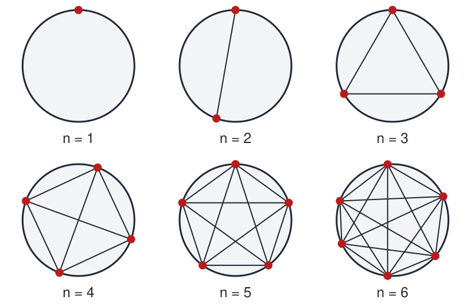

# N Dots on the Rim of a Circle

 This work is licensed under a <a rel="license" href="http://creativecommons.org/licenses/by/4.0/">Creative Commons Attribution 4.0 International License</a>.

*[Section 4](../section4.md), session 19. Discussed together with [Presidents and States](presidents-and-states.md).*

!!! abstract "The problem"

    *The editors' statement of the standard puzzle, in the terms the
    syllabus uses. Winfree's own wording is not recorded.*

    Mark **n** dots on the rim of a circle. Draw every chord joining one dot
    to another, so that each pair of dots is connected by a straight line.
    The chords cut the disk into separate pieces.

    **How many pieces do you get?**

    Draw and count n = 1 to 5 by hand, with a big circle and a sharp pencil.
    Then predict n = 6 **before** you draw or count it, write the
    prediction down, and check it. (The figure below shows the chords but
    not the counts.) Does the count depend on where the dots sit, or only on
    how many there are? Find a rule for any n, and give a reason it must be
    true, not just that it fits your drawings.

{ width="560" }

*The construction for n = 1 to 6, counts left for you. Drawn for this site (CC BY 4.0).*

## Why it is in the course

Session 19 opens Section 4, "Patterns, Empirical Generalizations", with
Judson's chapter "Pattern". The syllabus pairs this puzzle with
[Presidents and States](presidents-and-states.md), another pattern that looks
like a law.

The puzzle is about the gap between a pattern you have *observed* and one
you can *explain*. The first few counts suggest a rule so strongly that most
people announce it; whether it survives the next case is the exercise.
The syllabus says its exercises are "contrived much as the organizers of an
Easter Egg Hunt do in the hour before little kids arrive with their
baskets", and this one has more than one egg hidden in it.

It also carries forward a Section 1 phrase, "distinguishing things we know
vs only imagine": a rule that fits five drawings is imagined until you can
say why it holds. Committing to a prediction before drawing n = 6 is a good
moment to record in the GamesWorth notebook.

## Where it comes from

The puzzle is usually called **Moser's circle problem**, after the Canadian
mathematician Leo Moser, who published it with W. Bruce Ross in the
"Mathematical Miscellany" column of *Mathematics Magazine* in 1949. The OEIS
bibliography gives that column the subtitle "On the Danger of Induction".
The same numbers had turned up earlier for a different question: the most
pieces that flat cuts can divide four-dimensional space into. Moser's
contribution was a construction anyone can draw.

It became a standard cautionary tale. Richard Guy placed it among the opening
examples of "The Strong Law of Small Numbers" (1988). Books by Honsberger,
Gardner, and Conway with Guy treat it or a close variant; Marc Noy published
a short proof in 1996.

The syllabus line for session 19 reads "discuss n dots on rim of circle,
connected to slice the disk". In Winfree's
[course handout](https://web.archive.org/web/20020420212713/http://eebweb.arizona.edu/Faculty/Winfree/handout_479.htm){target=_blank}
(archived 2002), the link on "slice the disk" points to a bookmark named
`Sliced_Disk`, which fits this reading. The document that bookmark pointed
into was not archived, so how Winfree posed the problem is not recorded.

??? tip "Hints"

    - Draw big and number each region as you count it: the thin slivers
      next to the rim are the ones people miss.
    - Try n = 6 twice: once with the six dots evenly spaced, once with them
      scattered unevenly. If the two counts differ, find what is special
      about the symmetric picture, and decide which drawing deserves to be
      called the answer.
    - Count things other than regions. How many chords are there? How many
      crossing points inside the disk, if no three chords meet at one point?
      Both are simple combinations of n.
    - Add the chords one at a time. A new chord that crosses k existing
      chords inside the disk splits how many regions?

??? success "Resolution"

    **The pattern breaks at n = 6.** The counts are 1, 2, 4, 8, 16, **31**,
    57, 99, 163, 256, ... and not 1, 2, 4, 8, 16, 32 (OEIS A000127). The
    tempting rule, `2^(n-1)`, is wrong.

    The maximum number of pieces for n dots is `C(n,4) + C(n,2) + 1`, where
    `C(n,k)` is the number of ways to choose k things from n.

    **Why.** Two counts do the work.

    - Every set of 4 dots gives exactly one pair of crossing chords, so there
      are `C(n,4)` crossing points inside the disk, provided no three chords
      meet at one point.
    - Every set of 2 dots gives one chord, so there are `C(n,2)` chords.

    Add the chords one at a time. A chord that crosses k chords already drawn
    is cut into k + 1 segments, and each segment splits a region in two. Over
    all chords, the regions added total (chords) + (crossings). Starting from
    one region, the disk ends with `1 + C(n,2) + C(n,4)`.

    **Why it looks like doubling.** The formula equals
    `C(n-1,0) + C(n-1,1) + C(n-1,2) + C(n-1,3) + C(n-1,4)`, the first five
    terms of the binomial sum for `2^(n-1)`. For n up to 5 those are all the
    terms; from n = 6 on, doubling has extra terms and overshoots.

    **The symmetry trap.** Six evenly spaced dots give only **30** regions,
    because the three long diagonals of a regular hexagon all pass through
    the centre. Nudge one dot and a tiny triangle opens up there: 31.
    Eight evenly spaced dots give 88 instead of 99 (OEIS A006533).

    **The moral.** Agreement over the first few cases is weak evidence. A
    pattern is not a law until you can say why it must hold.

## Sources

- **Leo Moser and W. Bruce Ross**, "Mathematical Miscellany" ("On the Danger of Induction"), *Mathematics Magazine* 23(2), 109–114 (1949) — [JSTOR](https://www.jstor.org/stable/3219224){target=_blank} 🔒 (the editors could not read it directly; the citation is confirmed by Wikipedia and OEIS)
- **Richard K. Guy**, "The Strong Law of Small Numbers", *American Mathematical Monthly* 95(8), 697–712 (1988) — [doi:10.1080/00029890.1988.11972074](https://doi.org/10.1080/00029890.1988.11972074){target=_blank} 🔒 (not read directly; details confirmed through Crossref)
- **Marc Noy**, "A Short Solution of a Problem in Combinatorial Geometry", *Mathematics Magazine* 69(1), 52–53 (1996) — [doi:10.1080/0025570X.1996.11996383](https://doi.org/10.1080/0025570X.1996.11996383){target=_blank} 🔒 (not read directly; details confirmed through Crossref)
- **John H. Conway and Richard K. Guy**, *The Book of Numbers*, "How Many Regions", pp. 76–79 (Springer, 1996) — [Springer](https://link.springer.com/book/10.1007/978-1-4612-4072-3){target=_blank} 🔒
- **Ross Honsberger**, *Mathematical Gems I*, ch. 9, "A Problem in Combinatorics", pp. 99–107 (MAA, 1973) — [Internet Archive](https://archive.org/details/mathematicalgems0001hons_m1e8){target=_blank} 🔓 *(borrow)*
- **Martin Gardner**, *Mathematical Circus*, pp. 177, 180–181 (Knopf, 1979) — [Internet Archive](https://archive.org/details/mathematicalcirc00gard){target=_blank} 🔓 *(borrow)*
- **Horace Freeland Judson**, *The Search for Solutions*, ch. 2, "Pattern" (1980), the reading due this session — [Internet Archive](https://archive.org/details/searchforsolutio00juds){target=_blank} 🔓 *(borrow)*
- **N. J. A. Sloane, ed.**, OEIS A000127, maximal number of regions from joining n points around a circle — [OEIS](https://oeis.org/A000127){target=_blank} 🔓
- **N. J. A. Sloane, ed.**, OEIS A006533, regions from n equally spaced points — [OEIS](https://oeis.org/A006533){target=_blank} 🔓
- **Eric W. Weisstein**, "Circle Division by Chords", MathWorld — [MathWorld](https://mathworld.wolfram.com/CircleDivisionbyChords.html){target=_blank} 🔓
- **Wikipedia contributors**, "Moser's circle problem" — [Wikipedia](https://en.wikipedia.org/wiki/Moser%27s_circle_problem){target=_blank} 🔓
- **Grant Sanderson (3Blue1Brown)**, "This pattern breaks, but for a good reason | Moser's circle problem" (2023), a visual derivation — [YouTube](https://www.youtube.com/watch?v=YtkIWDE36qU){target=_blank} 🔓
- **Arthur T. Winfree**, *The Art of Scientific Discovery* (ECOL 479/579): course handout, archived 20 April 2002 — [Internet Archive](https://web.archive.org/web/20020420212713/http://eebweb.arizona.edu/Faculty/Winfree/handout_479.htm){target=_blank} 🔓
- **Arthur T. Winfree**, *The Art of Scientific Discovery*: original course syllabus — [PDF](https://github.com/tyson-swetnam/aosd/blob/main/docs/assets/aosd_syllabus.pdf){target=_blank} 🔓

---

*Back to [Section 4](../section4.md) · [All problems](index.md) · [The schedule](../syllabus.md#section-4-patterns-empirical-generalizations)*
