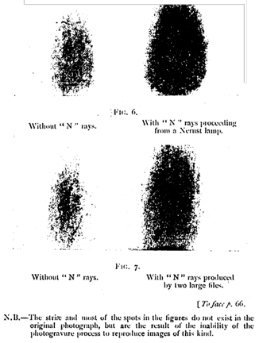

# N-Rays

 This work is licensed under a <a rel="license" href="http://creativecommons.org/licenses/by/4.0/">Creative Commons Attribution 4.0 International License</a>.

*[Section 1](../section1.md), session 5. Read together with Langmuir's "Pathological Science"; discussed alongside [Phone Cord Problem](phone-cord-problem.md) and [Stockholm Restrooms](stockholm-restrooms.md).*

!!! abstract "The problem"

    This is a case study rather than a puzzle. Read the situation as it
    looked in 1904, **before** looking at what happened, and decide what
    you would have done.

    **The situation as reported.** In March 1903 René Blondlot, professor
    of physics at the University of Nancy, a corresponding member of the
    Institute of France and an experienced experimenter on electromagnetic
    waves, announced a new kind of radiation, which he named **N rays**
    after his town. He said the rays came from an X-ray tube, from a gas
    mantle, from a hot platinum wire, from the Sun, and later from
    hardened steel, unannealed glass and other bodies under strain; they
    passed through metals, wood and black paper but were stopped by wet
    paper and by water; they could be refracted by an aluminium prism into
    a spectrum of lines and focused by an aluminium lens.

    The detector was the human eye. A small electric spark, a tiny gas
    flame, or a screen of phosphorescent calcium sulphide was viewed in a
    nearly dark room; when the rays fell on it, it was said to glow a
    little more brightly. There was no meter and no photographic effect
    that survived scrutiny. Blondlot himself reported that a thermopile
    registered nothing: "The action of 'N' rays on this apparatus was
    absolutely nil, even in the most favorable conditions, though a candle
    placed 12 metres away from the thermopile gave a deflection of about
    0.5 mm. on the scale."

    By the first half of 1904 nearly a hundred papers on N rays had
    appeared in the *Comptes rendus* of the Academy alone. Other workers
    reported N rays from muscle, nerves and the brain, from a vibrating
    tuning fork, from growing plants, even from a corpse; one claimed that
    metals could be anaesthetized with ether, after which they stopped
    emitting. Physicists in Germany, England and America tried to repeat
    the experiments and saw nothing. The Academy nevertheless awarded
    Blondlot a major prize for 1904.

    Blondlot's instructions for observers (1905 English edition of his
    papers, public domain) ran, in part:

    > "...in no way to try to fix the eye upon the luminous source, whose
    > variations in glow one wishes to ascertain. On the contrary, one
    > must, so to say, see the source without looking at it, and even
    > direct one's glance vaguely in a neighbouring direction. The observer
    > must play an absolutely passive part, under penalty of seeing
    > nothing. Silence should be observed as much as possible. Any smoke,
    > and especially tobacco smoke, must be carefully avoided... the
    > observer should accustom himself to look at the screen just as a
    > painter, and in particular an 'impressionist' painter, would look at
    > a landscape. To attain this requires some practice, and is not an
    > easy task. Some people, in fact, never succeed."

    **Your task.**

    1. You are a visiting physicist, invited to spend one evening in
       Blondlot's darkened laboratory. You cannot see any of the effects
       yourself, and your host says that is because your eyes are not
       sensitive enough. **Design tests you could carry out on the spot,
       with the apparatus already in the room, that would distinguish a
       real radiation from an observer's expectation.** Say exactly what
       you would change, what the observers must not know, and what result
       would count as evidence either way.
    2. List the features of the whole affair, as reported above, that
       should have raised suspicion **before** anyone travelled to Nancy.
       Which of them are general warning signs that could apply to a claim
       in your own field today?
    3. Blondlot and most of his confirmers were honest, competent, and
       sincere. Explain how a laboratory full of such people can go on
       seeing something that is not there for more than a year, and what,
       in the way experiments were arranged, made it possible.

    Only then read "What happened" and compare your list with Wood's tests
    and with Langmuir's six symptoms.

    *Reconstructed for the course from Wood's 1904 letter to Nature, from
    Blondlot's own 1905 volume, and from Seabrook's 1941 memoir of Wood.
    The three numbered tasks are editorial framing, not Winfree's words:
    the syllabus gives only the title line.*

{ width="560" }

*Blondlot's N-ray spectroscope, drawn for this site (CC BY 4.0) from his own description in "N" Rays (1905) and from Wood's account in Nature, 29 September 1904.*

## Why it is in the course

The syllabus lists the session-5 reading as "N-Rays" and Langmuir's *Pathological Science*, in the section headed Detecting Nonsense, Error Checking, False Assumptions, Cherishing Mistakes. The session before was "[Golden Tooth](golden-tooth.md): facts before explanations of facts"; the session after brings "some ways to check for errors" and "hidden assumptions". N rays are the physicist's golden tooth: a year of increasingly elaborate explanations (refraction, dispersion into spectral lines, rays from hardened steel, from anaesthetized metals, from nerves and the brain) built on a "fact" that had never been checked.

The episode shows three things. First, honest and skilled people are the easiest to deceive when the detector is their own expectation and the signal sits at the threshold of perception. Langmuir's six symptoms are a checklist for spotting such cases from outside. Second, error-checking is a procedure you can design. Wood's tests — blind trials, silent removal of the essential component, substitution of an inert object, and the sealed-screen photograph he proposed but never ran — are a model for the next session's "ways to check for errors". Third, there is a social cost to objecting. The syllabus describes class practice as "braving social opprobrium by blurting out nutty ideas, and risking devastating counter-attack by publicly objecting to nonsense blurted by others"; dozens of scientists confirmed the rays instead, and it took an outsider with nothing at stake to say so in print.

## Where it comes from

Prosper-René Blondlot (1849-1930) came upon the supposed rays while trying to detect polarization of X rays with a small spark as the detector, and announced them on 23 March 1903 in a note titled "On a New Species of Light". He published about twenty papers over the next two years; Augustin Charpentier added about twenty more and Jean Becquerel about ten. Later tallies give some 300 papers by about 120 authors in all. Blondlot collected his own in *"N" Rays* (Paris 1904; English translation by J. Garcin, 1905), which closes with a section headed "How the Action of 'N' Rays should be observed".

Heinrich Rubens in Berlin could see nothing; by Wood's account the Kaiser had commanded him to demonstrate the rays at Potsdam, and after two weeks he had to confess he could not. At the British Association meeting in Cambridge, Rubens urged Robert W. Wood of Johns Hopkins to go to Nancy in his place. Wood's letter, written from Brussels and printed in *Nature* on 29 September 1904, named neither Blondlot nor the laboratory. The *Revue scientifique* ran an inquiry; of about forty published replies only about half a dozen backed Blondlot. Accounts of his prize differ — the Prix Leconte of 50,000 francs in one telling, the Lalande prize and a gold medal in Wood's — but both agree that the citation read at the December 1904 meeting honoured his life's work rather than N rays. Foreign belief evaporated by 1905, and Blondlot stepped down from his Nancy chair in 1910. Seabrook's claim that the exposure drove Blondlot mad is not supported by later historians; he died at Nancy in 1930, aged 81.

On 18 December 1953 Irving Langmuir, Nobel laureate in chemistry, gave a colloquium at General Electric's Knolls Research Laboratory on what he called "pathological science", "the science of things that aren't so", using the Davis-Barnes effect, N rays, mitogenetic rays, the Allison effect, ESP and flying saucers as examples. R. N. Hall's transcript circulated as a GE report in 1968 and was published in *Physics Today* in October 1989. The syllabus names only "N-Rays" and "Langmuir, *Pathological Science*"; which text Winfree photocopied for the first item is not recorded.

{ width="560" }

*Blondlot's Figs. 6 and 7, from the English edition of his collected papers: a spark photographed "without" and "with" N rays, the rays said to come first from a Nernst lamp and then from two large files. This is the kind of evidence Wood criticised as built from hand-alternated exposures. R. Blondlot, 1904, public domain, via Wikimedia Commons.*

??? tip "Hints"

    - Ask what the detector is. If every reported effect is "the screen looked a little brighter to the observer", the observer, not the screen, is the instrument, and it is the observer who must be calibrated.
    - Every test you propose should have a version in which the observer does not know whether the "cause" is present. What could you silently remove, cover or replace in a dark room?
    - Blondlot claimed to resolve spectrum lines less than 0.1 mm apart through a slit 2-3 mm wide. Before thinking about new physics, ask whether the numbers are even consistent with the apparatus.
    - Notice the asymmetry: ten bricks give no more effect than one, a stronger source gives no stronger signal, and every failure to see the rays is explained by the observer's insensitivity or fatigue. What kind of claim can never be refuted this way?
    - Ask who was confirming the rays and who was not, and what each group had to gain or lose. Then ask why it took an outsider to run the decisive test.

## What happened

Wood spent about three hours in Blondlot's laboratory in September 1904. His own account, from the *Nature* letter (public domain):

> "I suggested that the attempt be made to announce the exact moments at which I introduced my hand into the path of the rays, by observing the screen. In no case was a correct answer given, the screen being announced as bright and dark in alternation when my hand was held motionless in the path of the rays, while the fluctuations observed when I moved my hand bore no relation whatever to its movements."

On the spectroscope, maxima less than 0.1 mm apart were being read from a ray bundle 3 mm wide. Wood said he was surprised, and "was told that this was one of the inexplicable and astounding properties of the rays":

> "...I subsequently found that the removal of the prism (we were in a dark room) did not seem to interfere in any way with the location of the maxima and minima in the deviated (!) ray bundle. I then suggested that an attempt be made to determine by means of the phosphorescent screen whether I had placed the prism with its refracting edge to the right or the left, but neither the experimenter nor his assistant determined the position correctly in a single case (three trials were made). This failure was attributed to fatigue."

A steel file was supposed to emit N rays that made a dimly lit clock face easier to see: "the substitution of a piece of wood of the same size and shape as the file in no way interfered with the experiment. The substitution was of course unknown to the observer." Wood concluded that all the changes in luminosity "are purely imaginary", and proposed a properly blinded test: a dozen photographs taken through two sealed aluminium screens, one holding wet paper and one dry, by a person who never knew which was in use.

In Seabrook's biography Wood added a detail he left out of the letter. The assistant, grown suspicious, asked to repeat a reading himself; Wood walked audibly toward the prism but did not touch it, and the assistant announced that he saw no spectrum because "the American has made some derangement". Wood says there that he put the prism back before the lights came up, so Langmuir's retelling, in which Wood pockets it, is an embellishment.

Why did they see it? Every effect sat at the threshold of visibility, where, as Langmuir put it, "you really don't know whether you are seeing it or not". The observers always knew when the rays were supposed to be on, and no one had run a blind trial. The photographs were no better: they were built from five-second exposures alternated by hand by an experimenter who knew which image was which, on a spark whose brightness Wood estimated varied by 25 per cent on its own.

Langmuir's symptoms of pathological science (Table I of the Hall transcript; items 3 to 5 are his exact wording, the others lightly condensed):

1. The maximum effect is produced by a causative agent of barely detectable intensity, and the magnitude of the effect is substantially independent of the intensity of the cause.
2. The effect remains close to the limit of detectability, or many measurements are needed because of the very low statistical significance of the results.
3. Claims of great accuracy.
4. Fantastic theories contrary to experience.
5. Criticisms are met by ad hoc excuses thought up on the spur of the moment.
6. The ratio of supporters to critics rises to somewhere near 50 percent and then falls gradually to oblivion.

Langmuir stressed that "these are cases where there is no dishonesty involved", but where people are "led astray by subjective effects, wishful thinking or threshold interactions". Every symptom can be checked against the story: "Ten bricks didn't have any more effect than one" (1), the 0.1 mm maxima read through a slit a few millimetres wide (3), rays from anaesthetized metals and from a corpse (4), "your eyes are not sensitive enough" and "fatigue" (5), the collapse after 1904 (6).

The lesson for the course: a fact must be established before it is explained, and the way to establish it is a test whose outcome the observer cannot anticipate. Wood did not argue about the theory of N rays at all. He changed one thing the observers could not see and watched whether their reports changed with it.

## Sources

- **R. W. Wood**, "The n-Rays", *Nature* 70 (no. 1822): 530–531 (29 September 1904) — [doi:10.1038/070530a0](https://doi.org/10.1038/070530a0){target=_blank} 🔒 (the text itself is public domain; full scan below)
- **Nature, vol. 70, no. 1822 (29 September 1904)**, full issue scan containing Wood's letter, Lower Silesian Digital Library — [Internet Archive](https://archive.org/details/dbc.wroc.pl.023949){target=_blank} 🔓
- **Irving Langmuir**, "Pathological Science", colloquium at the Knolls Research Laboratory, 18 December 1953, transcribed by R. N. Hall (GE report 68-C-035, 1968) — [full transcript, Princeton](https://www.cs.princeton.edu/~ken/Langmuir/langmuir.htm){target=_blank} 🔓
- **Irving Langmuir, edited by Robert N. Hall**, "Pathological Science", *Physics Today* 42(10): 36–48 (October 1989) — [free PDF](https://aip.brightspotcdn.com/PTO.v42.i10.36_1.online.pdf){target=_blank} 🔓
- **R. Blondlot**, *"N" Rays: a collection of papers communicated to the Academy of Sciences*, translated by J. Garcin (Longmans, Green, 1905) — [Internet Archive](https://archive.org/details/nrayscollectiono00blonrich){target=_blank} 🔓
- **William Seabrook**, *Doctor Wood, Modern Wizard of the Laboratory* (Harcourt, Brace, 1941), chapter 17 — [Internet Archive](https://archive.org/details/doctor-wood){target=_blank} 🔓
- **Mary Jo Nye**, "N-Rays: An Episode in the History and Psychology of Science", *Historical Studies in the Physical Sciences* 11(1): 125–156 (1980) — [doi:10.2307/27757473](https://doi.org/10.2307/27757473){target=_blank} 🔒
- **Irving M. Klotz**, "The N-Ray Affair", *Scientific American* 242(5): 168–175 (May 1980) — [doi:10.1038/scientificamerican0580-168](https://doi.org/10.1038/scientificamerican0580-168){target=_blank} 🔒
- **R. T. Lagemann**, "New light on old rays: N rays", *American Journal of Physics* 45(3): 281–284 (1977) — [doi:10.1119/1.10643](https://doi.org/10.1119/1.10643){target=_blank} 🔒
- **Wikipedia contributors**, "N-ray" (overview) — [Wikipedia](https://en.wikipedia.org/wiki/N-ray){target=_blank} 🔓
- **Arthur T. Winfree**, *The Art of Scientific Discovery: original course syllabus* — [PDF](https://github.com/tyson-swetnam/aosd/blob/main/docs/assets/aosd_syllabus.pdf){target=_blank} 🔓

---

*Back to [Section 1](../section1.md) · [All problems](index.md) · [The schedule](../syllabus.md#section-1-detecting-nonsense-error-checking-false-assumptions-cherishing-mistakes)*
