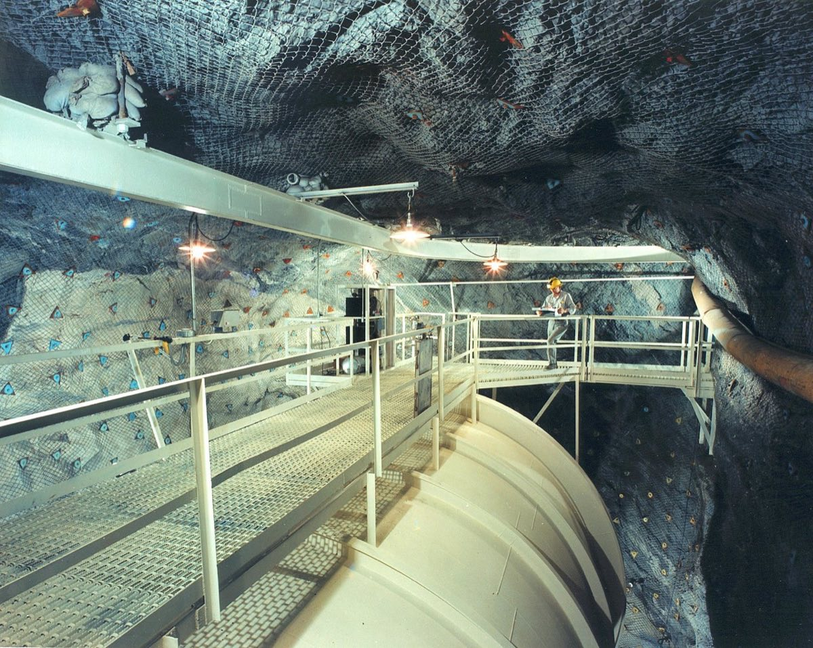
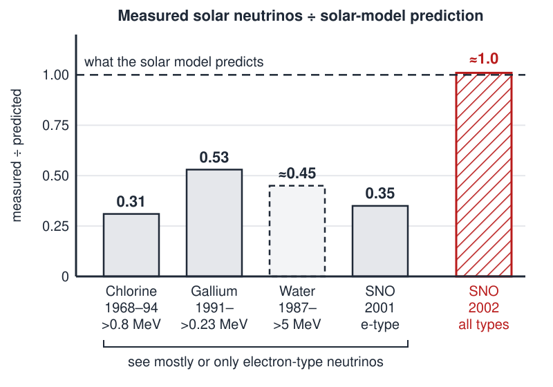

# Neutrinos

 This work is licensed under a <a rel="license" href="http://creativecommons.org/licenses/by/4.0/">Creative Commons Attribution 4.0 International License</a>.

*[Section 4](../section4.md), session 21. The same session deals with [Paired Observations](paired-observations.md) and continues the [Cell Shapes](cell-shapes-lab.md) experiments.*

!!! abstract "The problem"

    The syllabus gives only the name. No description of the problem
    survives, so this statement is the editors' reconstruction, built on the
    historical numbers.

    The Sun's fusion reactions release neutrinos, uncharged particles that pass
    through the Sun, the Earth and you almost without a trace. A model of the
    solar interior predicts how many should reach the Earth, and at what
    energies. Detectors began counting
    them in 1968. Each is blind below some energy, so each samples a different
    slice of the spectrum. (1 SNU is one capture per second per 10^36^ target
    atoms.)

    | Detector | Sees neutrinos above | Measured | Predicted |
    | :-- | :-- | :-- | :-- |
    | Chlorine, Homestake mine, South Dakota (1968–1994) | about 0.8 MeV | 2.6 ± 0.2 SNU | about 8.5 SNU |
    | Gallium, GALLEX/GNO (Italy) and SAGE (Russia), from 1991 | about 0.23 MeV | 69 ± 4 SNU | about 131 SNU |
    | Water, Kamiokande and Super-Kamiokande (Japan), from 1987 | roughly 5 MeV | roughly half the prediction | — |

    Repeated for decades, the shortfall never went away.

    **Your task.**

    1. State the pattern as precisely as the numbers allow. Does the shortfall depend on energy?
    2. List every explanation you can and sort them into a few classes.
    3. For each class, name an observation that would kill it.
    4. What single measurement could decide among the classes without trusting the solar model at all?
    5. Put yourself in the early 1990s with this table. Which class would you bet on? Write it down before reading "What happened".

## Why it is in the course

Section 4 is "Patterns, Empirical Generalizations". Session 19's
[n dots on a circle](n-dots-on-circle.md) shows a pattern that betrays you
(1, 2, 4, 8, 16, then 31). The
neutrino deficit is the opposite: a pattern that survived every attempt to
break it.

The syllabus labels its session-04 problems "facts before explanations of
facts" and "distinguishing things we know vs only imagine". Here the fact, too
few neutrinos, stood for thirty years, while the explanation most people
imagined, a faulty calculation or experiment, was wrong.

The day's reading, Ehrlich's chapter 6, "The Solar System Has Two Suns", takes
up a companion star proposed to explain a claimed periodicity in mass
extinctions. And in Winfree's handout the link on
[Paired Observations](paired-observations.md) points to a bookmark named
`Keplers_Laws`. If that exercise was Kepler's laws, as the name suggests, the
session set a pattern that meant what it looked like beside one that did not.

## Where it comes from

In 1964 John Bahcall calculated how many argon-37 atoms solar neutrinos should
make in a tank of chlorine-rich cleaning fluid. Raymond Davis Jr. built the tank
a mile underground in the Homestake gold mine. His 1968 paper gave only an upper
limit, already below the prediction; later runs found about a third of it.

{ width="560" }

*The chlorine tank of Brookhaven National Laboratory's solar neutrino experiment in the Homestake mine. U.S. Department of Energy photograph, public domain, via Wikimedia Commons.*

Bahcall later named three classes of explanation: the calculation was wrong,
the experiment was wrong, or, "the most daring and least discussed possibility",
physicists misunderstood neutrinos. Gribov and Pontecorvo had proposed that in
1969; few took it seriously. In 1997 helioseismology measured the speed of sound
inside the Sun and found it matched the solar model's to within 0.1 percent.

The schedule places session 21 on Tuesday 30 October 2001, four months after
the Sudbury Neutrino Observatory (SNO) submitted its first result in June 2001.
But the syllabus calls the schedule "a retrospective syllabus of Spring 2001,
with dates changed to reflect the future", so the problem may first have been
set before that result.

??? tip "Hints"

    - Chlorine sees about a third, gallium about half. Could one mistake, or a Sun dimmer by a fixed factor, explain both?
    - Sort explanations by what they attack: the Sun, the detector, or the particles on their eight-minute trip. Which was almost unmentionable?
    - Is there a measurement that compares neutrinos with neutrinos, rather than with a prediction?

## What happened

The data were right; a hidden assumption was wrong. Neutrinos have mass, so one
born as an electron-type neutrino in the Sun can arrive as a muon- or tau-type
neutrino, a change amplified inside the Sun by the matter effect of Mikheyev,
Smirnov and Wolfenstein. The detectors saw mostly or only electron-type
neutrinos, so all counted low, by an amount that depends on energy. That is
why chlorine and gallium disagree with each other as well as with the model.

{ width="560" }

*Drawn for this site (CC BY 4.0). SNO fluxes are compared with about 5.05 million per cm² per second predicted for the boron-8 branch.*

SNO's heavy water allows one reaction that only electron-type neutrinos drive
and another that all three types drive. In 2001 its electron-neutrino flux, 1.75
million per cm² per second, differed from Super-Kamiokande's rate by 3.3 sigma.
In 2002 it measured all three types together: 5.09 million, as the solar model
predicted. The missing two-thirds had changed identity.

Davis and Masatoshi Koshiba shared half of the 2002 Nobel Prize in Physics;
Takaaki Kajita and Arthur McDonald shared the 2015 prize. Why so slow?
Bahcall quotes Sidney Drell: "the success of the Standard Model (of particle
physics) was too dear to give up."

## Sources

- **Arthur T. Winfree**, *The Art of Scientific Discovery* (ECOL 479/579): course handout, archived 20 April 2002 — [Wayback Machine](https://web.archive.org/web/20020420212713/http://eebweb.arizona.edu/Faculty/Winfree/handout_479.htm){target=_blank} 🔓 (session 21 line and date; the Keplers_Laws bookmark on Paired Observations)
- **John N. Bahcall**, "Solving the Mystery of the Missing Neutrinos" (2004) — [arXiv:physics/0406040](https://arxiv.org/abs/physics/0406040){target=_blank} 🔓; also at [nobelprize.org](https://www.nobelprize.org/prizes/themes/solving-the-mystery-of-the-missing-neutrinos/){target=_blank} 🔓
- **Raymond Davis Jr., Don S. Harmer and Kenneth C. Hoffman**, "Search for Neutrinos from the Sun", *Physical Review Letters* 20, 1205–1209 (1968) — [doi:10.1103/PhysRevLett.20.1205](https://doi.org/10.1103/PhysRevLett.20.1205){target=_blank} 🔒
- **SNO Collaboration (Q. R. Ahmad et al.)**, charged-current rate from boron-8 solar neutrinos, *Physical Review Letters* 87, 071301 (2001) — [arXiv:nucl-ex/0106015](https://arxiv.org/abs/nucl-ex/0106015){target=_blank} 🔓
- **SNO Collaboration (Q. R. Ahmad et al.)**, "Direct Evidence for Neutrino Flavor Transformation from Neutral-Current Interactions in the Sudbury Neutrino Observatory", *Physical Review Letters* 89, 011301 (2002) — [arXiv:nucl-ex/0204008](https://arxiv.org/abs/nucl-ex/0204008){target=_blank} 🔓
- **John N. Bahcall and Carlos Peña-Garay**, "Solar models and solar neutrino oscillations", *New Journal of Physics* 6, 63 (2004) — [arXiv:hep-ph/0404061](https://arxiv.org/abs/hep-ph/0404061){target=_blank} 🔓 (the capture rates in the table)
- **Royal Swedish Academy of Sciences**, Nobel Prize in Physics press releases — [2002](https://www.nobelprize.org/prizes/physics/2002/press-release/){target=_blank} 🔓, [2015](https://www.nobelprize.org/prizes/physics/2015/press-release/){target=_blank} 🔓
- **Robert Ehrlich**, *Nine Crazy Ideas in Science: A Few Might Even Be True* (2001), chapter 6, "The Solar System Has Two Suns" — [doi:10.1515/9780691187839-007](https://doi.org/10.1515/9780691187839-007){target=_blank} 🔒; whole book at the [Internet Archive](https://archive.org/details/ninecrazyideasin00ehrl){target=_blank} 🔒 *(print-disabled readers only)*
- **Publishers Weekly**, review of *Nine Crazy Ideas in Science* (2001) — [publishersweekly.com](https://www.publishersweekly.com/9780691070018){target=_blank} 🔓
- **David M. Raup and J. John Sepkoski Jr.**, "Periodicity of extinctions in the geologic past", *PNAS* 81, 801–805 (1984) — [PubMed Central](https://pmc.ncbi.nlm.nih.gov/articles/PMC344925/){target=_blank} 🔓 (the pattern behind the session's Ehrlich chapter)
- **U.S. Department of Energy**, photograph of the Homestake tank — [Wikimedia Commons](https://commons.wikimedia.org/wiki/File:U.S._Department_of_Energy_-_Science_-_390_002_007_(9952118384).jpg){target=_blank} 🔓
- **Arthur T. Winfree**, *The Art of Scientific Discovery*: original course syllabus — [PDF](https://github.com/tyson-swetnam/aosd/blob/main/docs/assets/aosd_syllabus.pdf){target=_blank} 🔓

!!! note "How sure are we that this is Winfree's problem?"

    The syllabus says only "Deal with Neutrinos", and no surviving Winfree
    material describes the problem. Identification is **probable**:

    - **The solar neutrino problem** (high confidence): what "the neutrino problem" meant in 2001, the year SNO's first result began to settle it.
    - **Ehrlich's case that neutrinos travel faster than light** (low): neutrinos are Ehrlich's own field (Publishers Weekly notes it), but that is his chapter 9, which the syllabus never assigns.
    - **A claimed periodicity in the neutrino counts** (low): it would echo chapter 6, but no Winfree material mentions it.

---

*Back to [Section 4](../section4.md) · [All problems](index.md) · [The schedule](../syllabus.md#section-4-patterns-empirical-generalizations)*
