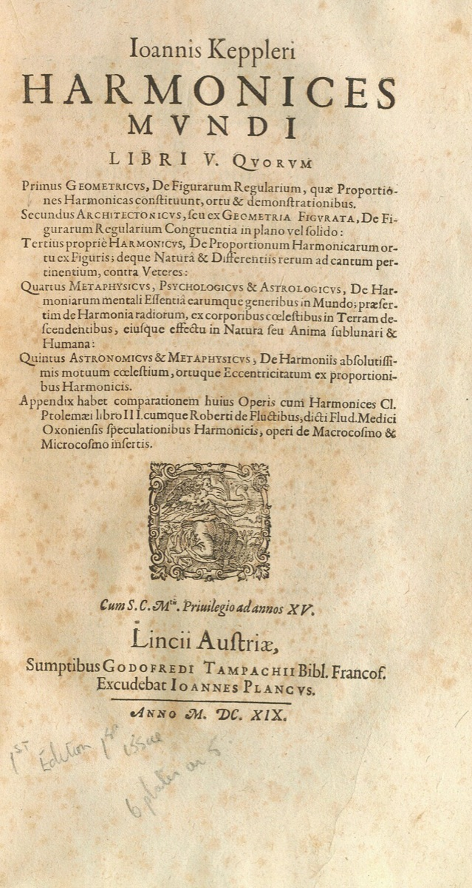
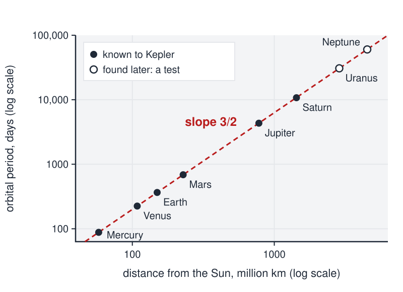

# Paired Observations

 This work is licensed under a <a rel="license" href="http://creativecommons.org/licenses/by/4.0/">Creative Commons Attribution 4.0 International License</a>.

*[Section 4](../section4.md), session 21. The same session continues the collaborative experiments on [Cell Shapes](cell-shapes-lab.md) and deals with [Neutrinos](neutrinos.md).*

!!! abstract "The problem"

    Reconstructed from the syllabus: Winfree's problem sheet has not
    survived, so this is the editors' reading of the one clue in his handout
    (see below). The numbers are modern NASA values, not Winfree's.

    **Part 1. A table with no labels.** Each row is a pair of measurements
    made on one object.

    | Object | x | y |
    | :-- | --: | --: |
    | A | 57.909 | 87.969 |
    | B | 108.210 | 224.701 |
    | C | 149.598 | 365.256 |
    | D | 227.956 | 686.980 |
    | E | 778.479 | 4332.589 |
    | F | 1432.041 | 10755.699 |

    y grows with x, but not in proportion. Find a rule y = f(x) that fits
    every row to better than one per cent, and record how you searched,
    including the rules you threw away. Do this before reading on.

    **Part 2. The labels.** x is a planet's mean distance from the Sun
    (million km); y is its orbital period (days). The rows are Mercury,
    Venus, Earth, Mars, Jupiter and Saturn. Does knowing this change your
    confidence in the rule?

    **Part 3. Tests the rule did not see.** Two planets unknown in 1619 lie
    at 2867.043 and 4514.953 million km from the Sun. Predict their periods
    before looking them up. Then try Jupiter's four large moons, with
    distance measured from Jupiter:

    | Moon | distance (thousand km) | period (days) |
    | :-- | --: | --: |
    | Io | 421.8 | 1.769138 |
    | Europa | 671.1 | 3.551181 |
    | Ganymede | 1070.4 | 7.154553 |
    | Callisto | 1882.7 | 16.689017 |

    Does the same form of rule work, with the same constant? And what does
    your rule leave unexplained?

## Why it is in the course

Section 4 is "Patterns, Empirical Generalizations", and this is the model
case of one. Kepler's rule for the planets was found in a table of numbers,
and it was right for decades before anyone could say why.

The exercise trains three habits. Search the space of possible rules on
purpose: ratios, powers and logarithms make a hidden regularity show up as a
constant or a straight line. Treat a rule fitted to six rows as unproven
until it predicts rows it has not seen. And remember that a correct
empirical generalization says *that*, not *why*. (The day's reading,
Ehrlich's Chapter 6, "The Solar System Has Two Suns", is also about orbits;
that link is the editors' observation.)

## Where it comes from

In Winfree's handout, the link on this item points to a bookmark named
`Keplers_Laws`. No archived capture contains the target, so the link text and
the bookmark name are all that survive of the exercise. Kepler was also on his reading list:
the syllabus puts "Arthur Koestler, *The Watershed*, biography of Johannes
Kepler (a chapter of *The Sleepwalkers*)" on reserve.

From Tycho Brahe's observations of Mars, Johannes Kepler found his first
two laws in *Astronomia nova* (1609). The
third came a decade later. In Book V of *Harmonices mundi* (Linz, 1619) he
states an exact proportion between the periodic times of any two planets
and their mean distances, found in the spring of 1618 after a false start.
It stood as an empirical law with no accepted explanation until Newton's
gravitation.

{ width="560" }

*Johannes Kepler, Harmonices mundi libri V (Linz, 1619), title page; scan from the Posner Library, Carnegie Mellon University. Public domain, via Wikimedia Commons.*

The law later became a benchmark for studying discovery: the BACON programs
of Pat Langley and colleagues rediscovered versions of it from data (1981,
1987), and when Yulin Qin
and Herbert Simon gave fourteen people the numbers unlabelled (1990), four
found it.

??? tip "Hints"

    - By what factor do x and y each grow from first row to last?
    - For two rows, find p with (ratio of y) = (ratio of x) to the power p. Same p for another pair?
    - Logarithms turn powers into slopes: plot log y against log x.
    - Build a quantity from x and y that should be the same in every row, and check it.

??? success "Resolution"

    **The rule.** A least-squares line through the six points
    (log x, log y) has slope 1.4985, very close to 3/2. So y goes as x to
    the power 3/2: the period squared is proportional to the distance
    cubed. That is Kepler's third law. In these units, x cubed divided by
    y squared stays between 25.09 and 25.39 for all six rows. Scaling from
    the Earth's row, the rule predicts every period to within 0.6 per cent.

    **The tests.** Scaling from the Earth, y = 365.256 (x / 149.598)^(3/2)
    predicts 30,645 days for Uranus (actual 30,685.4) and 60,560 for
    Neptune (actual 60,189.0), errors of 0.13 and 0.6 per cent. Jupiter's
    moons give slope 1.5002, the same form, but a constant of about 0.024
    in the planets' units instead of 25.1. Why each centre has its own
    constant, the law cannot say; that waited for Newton.

    { width="560" }

    *Period against distance for the eight planets, log scales, NASA fact-sheet values. Drawn for this site (CC BY 4.0).*

## Sources

- **Arthur T. Winfree**, *The Art of Scientific Discovery* (ECOL 479/579), course handout; the session-21 schedule line and its link markup — [Wayback Machine capture, 20 April 2002](https://web.archive.org/web/20020420212713/http://eebweb.arizona.edu/Faculty/Winfree/handout_479.htm){target=_blank} 🔓
- **Johannes Kepler**, *Harmonices mundi libri V* (Linz, 1619), Book V, chapter 3 — [Internet Archive](https://archive.org/details/ioanniskepplerih00kepl){target=_blank} 🔓
- **Johannes Kepler**, *Astronomia nova* (1609) — [Internet Archive](https://archive.org/details/Astronomianovaa00Kepl){target=_blank} 🔓
- **Pat Langley**, "Data-Driven Discovery of Physical Laws", *Cognitive Science* 5(1), 31–54 (1981) — [doi:10.1111/j.1551-6708.1981.tb00869.x](https://doi.org/10.1111/j.1551-6708.1981.tb00869.x){target=_blank} 🔒
- **Patrick W. Langley, Herbert A. Simon, Gary Bradshaw and Jan M. Zytkow**, *Scientific Discovery: Computational Explorations of the Creative Processes* (MIT Press, 1987) — [doi:10.7551/mitpress/6090.001.0001](https://doi.org/10.7551/mitpress/6090.001.0001){target=_blank} 🔒
- **Yulin Qin and Herbert A. Simon**, "Laboratory Replication of Scientific Discovery Processes", *Cognitive Science* 14(2), 281–312 (1990) — [doi:10.1207/s15516709cog1402_4](https://doi.org/10.1207/s15516709cog1402_4){target=_blank} 🔒
- **Robert Ehrlich**, *Nine Crazy Ideas in Science: A Few Might Even Be True* (Princeton University Press, 2001), Chapter 6 — [Internet Archive](https://archive.org/details/ninecrazyideasin00ehrl){target=_blank} 🔒 *(print-disabled readers only)*
- **Arthur Koestler**, *The Watershed: A Biography of Johannes Kepler* (Anchor Books, 1960) — [Internet Archive](https://archive.org/details/watershedbiograp00koes){target=_blank} 🔓 *(borrow)*
- **David R. Williams**, NASA Space Science Data Coordinated Archive, Planetary Fact Sheets (per-planet sheets, sidereal periods) — [nssdc.gsfc.nasa.gov](https://nssdc.gsfc.nasa.gov/planetary/factsheet/){target=_blank} 🔓
- **David R. Williams**, NASA Space Science Data Coordinated Archive, Jovian Satellite Fact Sheet — [nssdc.gsfc.nasa.gov](https://nssdc.gsfc.nasa.gov/planetary/factsheet/joviansatfact.html){target=_blank} 🔓
- **Herman Gordon**, *Scientific Problem Solving*, the successor course to Winfree's: Modules index — [scientificproblemsolving.com](https://scientificproblemsolving.com/Mods/ModsIndex.html){target=_blank} 🔓
- **Arthur T. Winfree**, *The Art of Scientific Discovery*, original course syllabus — [PDF](https://github.com/tyson-swetnam/aosd/blob/main/docs/assets/aosd_syllabus.pdf){target=_blank} 🔓

!!! note "How sure are we that this is Winfree's problem?"

    The handout's link names a topic, not a task, and no other document
    checked (including Herman Gordon's successor course) describes the
    exercise. Identification is therefore **probable**. The candidates:

    - **Finding Kepler's third law from paired distances and periods** (likeliest): the data are pairs, one distance and one period per planet, and the task needs only arithmetic or a log-log plot.
    - **Kepler's sightings of Mars taken 687 days apart** in *Astronomia nova*: also under Kepler's laws, but geometrically heavy and built on sets of three or four sightings.
    - **The class's paired GamesWorth judgements** (unlikely): a paired design in Winfree's own course, but his link points to Kepler.
    - **A matched-pairs statistics exercise** (unlikely): standard vocabulary, with nothing linking it to Winfree.

---

*Back to [Section 4](../section4.md) · [All problems](index.md) · [The schedule](../syllabus.md#section-4-patterns-empirical-generalizations)*
