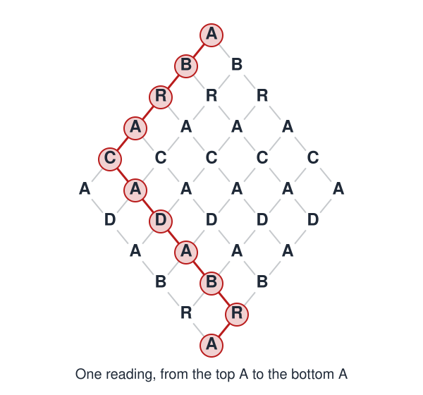

# Paths Through Mazes

<a rel="license" href="http://creativecommons.org/licenses/by/4.0/"></a><br />This work is licensed under a <a rel="license" href="http://creativecommons.org/licenses/by/4.0/">Creative Commons Attribution 4.0 International License</a>.

*[Section 2](../section2.md), session 10. Discussed together with [Taboo Questions](taboo-questions.md).*

!!! abstract "The problem"

    Reconstruction, based on the syllabus title and a bookmark in Winfree's
    handout: his own statement is lost (see the note below). This diamond
    follows George Polya (1962); the array as typed and the wording are the
    editors'.

    ```
              A
             B B
            R R R
           A A A A
          C C C C C
         A A A A A A
          D D D D D
           A A A A
            B B B
             R R
              A
    ```

    Start at the top A. Read downwards, each time stepping to one of the two
    letters just below, left or right (from the widest row down, a letter
    on the edge has only one), ending at the bottom A.

    1. **In how many different ways can the word be read?**
    2. Treat the diamond as a map of streets, each letter a corner and each
       step one block. What does your count say about routes?
    3. Find the answer a second, independent way.
    4. How many shortest routes cross a grid *m* blocks by *n* blocks, corner
       to opposite corner?

    In your GamesWorth book, record your first strategy and why you dropped
    it.

{ width="560" }

*One reading of the word. Drawn for this site (CC BY 4.0).*

## Why it is in the course

The syllabus sets this beside [Taboo Questions](taboo-questions.md) in session 10, "Adams Chapter 5: Intellectual blocks". Adams's chapter is about tackling a problem in the wrong "language" and sticking with an inadequate strategy.

The natural first attack is to trace routes with a pencil. The routes pile up, and the count never settles. The block is treating the puzzle as a picture to trace instead of a structure to count. Polya's way out: restate it as shortest paths through a street grid, solve simpler cases, and find the law that links them.

Winfree's instruction applies: "Write down your approaches, your lucky insights, how you got into and out of blind alleys. This is the main thing, not the 'answers'." Why he called it "mazes" is not known.

## Where it comes from

ABRACADABRA began as a charm. A Roman medical poem attributed to Quintus Serenus Samonicus (third century AD) prescribes it against fever, written in a shrinking cone of letters (Neuburger, 1910).

The puzzle form is older than Polya. H. E. Dudeney's "The Amulet" (*The Canterbury Puzzles*, 1907) asks how many ways the word can be read down an 11-row triangle.

Polya's *Mathematical Discovery*, vol. 1 (1962), section 3.5 "Abracadabra", puts the word in a diamond and recasts it as counting shortest zigzag paths through city blocks; section 3.6 names the resulting numbers the Pascal triangle.

??? tip "Hints"

    - Don't trace every route. How many ways reach one letter a row or two down?
    - Each letter is entered only from the letters directly above it. How does its count depend on theirs?
    - Write the counts row by row. Have you seen the top half before?
    - For a check: every reading is ten steps, each down-left or down-right. How many of each?

??? success "Resolution"

    **The count.** Label each letter with the number of ways to reach it.
    From the top down to the widest row, edge letters have only one letter
    above them, so they count 1. Every other letter gets the sum of the two
    letters above it:

    ```
    A            1
    B           1 1
    R          1 2 1
    A         1 3 3 1
    C        1 4 6 4 1
    A      1 5 10 10 5 1
    D       6 15 20 15 6
    A        21 35 35 21
    B          56 70 56
    R           126 126
    A              252
    ```

    The word can be read in **252** ways, Polya's answer.

    **As streets.** Each reading is a shortest route, ten blocks long,
    between opposite corners of a 5-by-5 grid of blocks stood on one
    corner, so 5 blocks go down-left and 5 down-right. The addition rule
    holds because every shortest route to a corner passes through exactly
    one of the two corners just above it.

    **Second method.** A route is fixed by choosing which 5 of its 10 steps
    go down-left: C(10,5) = 10!/(5!·5!) = 252. The two methods agree.

    **Generalization.** For a grid *m* blocks by *n* blocks, the number of
    shortest corner-to-corner routes is C(m+n, m) = (m+n)!/(m!·n!).

    **The triangle variant.** In Dudeney's 11-row triangle a reading may end
    on any A in the bottom row. Every letter above the bottom row has two
    letters below it, so each step doubles the count: 2^10 = **1024**. The bottom row of the
    Pascal triangle sums to the same total. Same word, same rule, different
    shape, different answer: the array is part of the problem.

## Sources

- **Arthur T. Winfree**, *The Art of Scientific Discovery* course handout (archived 2002) — [Wayback Machine](https://web.archive.org/web/20020420212713/http://eebweb.arizona.edu/Faculty/Winfree/handout_479.htm){target=_blank} 🔓
- **George Polya**, *Mathematical Discovery*, vol. 1, sections 3.5-3.6, pp. 68-70 (1962) — [Internet Archive](https://archive.org/details/mathematicaldisc0000geor){target=_blank} 🔓 *(borrow)*
- **Henry Ernest Dudeney**, *The Canterbury Puzzles*, no. 38 "The Amulet" (1907; 1919 edition online) — [Project Gutenberg](https://www.gutenberg.org/ebooks/27635){target=_blank} 🔓
- **Max Neuburger**, *History of Medicine*, vol. 1, trans. Ernest Playfair (1910) — [Internet Archive](https://archive.org/details/historyofmedicin01neub){target=_blank} 🔓
- **James L. Adams**, *Conceptual Blockbusting*, Chapter 5 (1974; 5th ed. 2019) — [publisher](https://www.hachette.co.uk/titles/james-l-adams/conceptual-blockbusting-fifth-edition/9781541674042/){target=_blank} 🔒
- **Arthur T. Winfree**, original course syllabus — [PDF](https://github.com/tyson-swetnam/aosd/blob/main/docs/assets/aosd_syllabus.pdf){target=_blank} 🔓

!!! note "How sure are we that this is Winfree's problem?"

    The syllabus gives only the title. In Winfree's archived course handout
    (2002 capture, listed in Sources), the link on this item points to a
    bookmark named `abracadabra`. The bookmark's target is not in the
    capture, and no companion document has been found, so no Winfree
    wording survives. From the name, the editors infer the ABRACADABRA
    path-counting puzzle. That fixes the kind of puzzle, not his array or
    intended answer, so identification is probable.

    Candidates:

    - **Polya's diamond**, reconstructed above. It is literally about paths
      through streets, and Winfree's syllabus puts two other Polya books,
      *Induction and Analogy in Mathematics* and *Patterns of Plausible
      Inference*, on reserve. Leading with it is an editorial judgement.
    - **Dudeney's triangle**, the older version. The bookmark fits it
      equally well, and it gives a different answer.
    - **An exercise from Adams's Chapter 5.** A full-text search found no
      sign of the puzzle there, but the chapter itself could not be read,
      so this is not ruled out.

    Before the bookmark was found, the editors read the title literally, as
    a maze-threading exercise. The bookmark points to counting paths
    instead, so that reading has been dropped.

---

*Back to [Section 2](../section2.md) · [All problems](index.md) · [The schedule](../syllabus.md#section-2-creative-blocks)*
