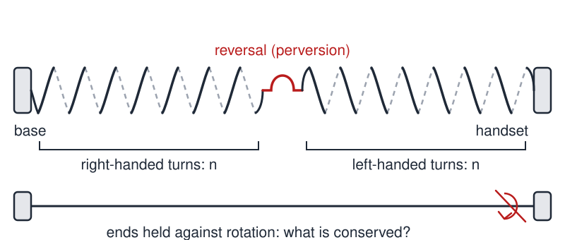
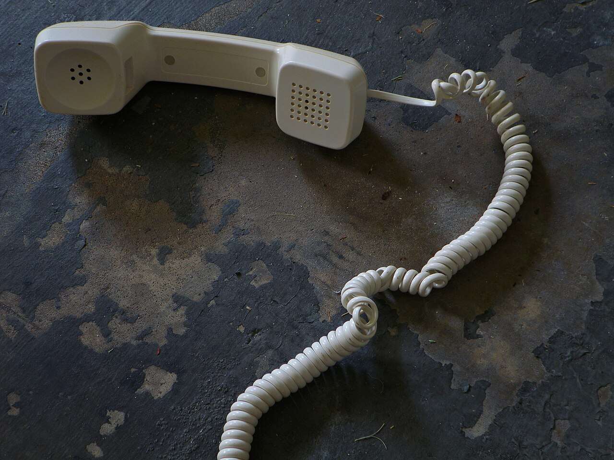

# Phone Cord Problem

 This work is licensed under a <a rel="license" href="http://creativecommons.org/licenses/by/4.0/">Creative Commons Attribution 4.0 International License</a>.

*[Section 1](../section1.md), session 5. Discussed together with [Stockholm Restrooms](stockholm-restrooms.md), in the session whose readings are [N-Rays](n-rays.md) and Langmuir's "Pathological Science".*

!!! abstract "The problem"

    Reconstructed from the syllabus: Winfree's schedule says only "discuss phone cord problem". The statement below is built from that name, from the session's theme, and from the everyday form of the puzzle.

    An old-fashioned desk telephone joins its handset to its base by a coiled cord: a long helical spring of wire, made so that it "wants" to lie in a neat spiral of, say, right-handed turns. One plug is fixed in the base, the other in the handset, and neither plug can rotate in its socket.

    Over a few weeks of ordinary use the cord changes. It no longer hangs as a tidy spiral. Its coils wrap around one another, it shortens and stiffens, and somewhere along its length a peculiar loop appears: on one side of it the spiral winds one way, on the other side the opposite way. Left alone, the tangle only gets worse.

    Everyone who has used such a phone "knows" why this happens. Before accepting any explanation, separate what you actually know from what you merely imagine, and then work out:

    1. Neither plug ever turns in its socket. How, physically, can any twist get into the cord at all? Trace the handset through one complete call, from cradle to ear to cradle, and keep track of its orientation.
    2. Why does the cord answer with loops and knots rather than simply twisting up uniformly along its length?
    3. Why does a loop form at which the handedness of the spiral reverses? Count the turns on either side of such a loop. Is anything conserved? Do the reversals come singly or in pairs?
    4. Design a test of your explanation that you could carry out with a real cord in five minutes (a helical spring, a Slinky, or a coiled cord from a thrift shop will do). Predict, before you look, which way the accumulated twist will run for a right-handed user, and what will happen if one end is unplugged and left to hang free.
    5. What part of the tangle can be removed without unplugging either end, and what part cannot? Say which, and why, before you try it.

{ width="560" }

*The reversal loop, and the constraint that produces it. Drawn for this site (CC BY 4.0).*

{ width="560" }

*A real one, with two reversals. Photo "Touch me and I end up singing" by Daniel Oines (Flickr), CC BY 2.0, via Wikimedia Commons.*

## Why it is in the course

Session 5 belongs to the section on "Detecting Nonsense, Error Checking, False Assumptions, Cherishing Mistakes". Its readings are the N-ray affair and Langmuir's "Pathological Science": cases in which competent observers saw what they expected to see. The session before asked for "facts before explanations of facts" and for "distinguishing things we know vs only imagine". The phone cord drills exactly that. Everyone has a confident story about why the cord tangles ("I twist it when I pick up the phone"), yet almost nobody has looked at a cord closely enough to know which way the coil winds, where the twist accumulates, whether the reversal loops come singly or in pairs, or whether the story predicts anything checkable.

The problem also carries a hidden false assumption: that a cord must have been twisted before it can kink. It need not have been. A reversal loop is what a cord that wants to be a helix does when its ends are held and it carries no net twist at all. The problem offers error-checking by conservation too: Darwin's observation that the turns on the two sides of a reversal are equal is a bookkeeping check of the kind the course prizes.

It also suits the syllabus's rule that exercises should "depend as little as possible on knowledge of any particular subject area". The whole investigation takes five minutes with a real cord, a pen line drawn along it, and a tally of how the handset is handled.

## Where it comes from

The phenomenon is older than the telephone. In *The Movements and Habits of Climbing Plants* (1865), Charles Darwin reported that a tendril which has caught a support "invariably becomes twisted in one part in one direction, and in another part in the opposite direction; the oppositely turned spires being separated by a short straight portion. This curious and symmetrical structure has been noticed by several botanists, but has not been sufficiently explained." He gathered "ten attached tendrils of the Bryony, the longest with 33, and the shortest with only 8 spiral turns", and found the number of turns in one direction "in every case the same (within one) as in the opposite direction". Reversals need not come singly: he had "seen a tendril with the spires alternately turning five times in opposite directions, with straight pieces between them". He then explained the structure mechanically, with a bundle of strings wound round a stick, a line painted along twining stems, and paper vanes fixed to tendril tips. According to the Wikipedia overview, the word "perversion" for the passage from one handedness to the other goes back to the topologist J. B. Listing and was used by James Clerk Maxwell in *A Treatise on Electricity and Magnetism* (1873); that attribution rests on the overview alone and has not been checked against Maxwell's text.

The coiled handset cord, in use from about the middle of the twentieth century, put Darwin's tendril on every office desk, and the reversal loop became a household nuisance. The mathematics behind it, the conservation of a ribbon's linking number as the sum of twist and writhe, was worked out in the 1960s and 1970s and is now standard in the study of DNA supercoiling.

On 16 February 1998 Alain Goriely, of the Universite Libre de Bruxelles, and Michael Tabor, of the University of Arizona's Program in Applied Mathematics, published "Spontaneous Helix Hand Reversal and Tendril Perversion in Climbing Plants" in *Physical Review Letters*. Modelling a tendril as a thin elastic rod with intrinsic curvature whose ends cannot rotate, they showed the reversal to be "a paradigm for curvature induced morphogenesis in which symmetry breaking is constrained by a global invariant", and coined the phrase "tendril perversion". *Science News* reported the work on 28 February 1998 and the *Baltimore Sun* in April, both with the kinked phone cord as the everyday example. A fuller treatment followed from McMillen and Goriely in 2002. Winfree's Spring 2001 course listed the phone cord problem three years later, beside N-rays and pathological science.

??? tip "Hints"

    - Do not start with a theory. Get a real coiled cord (or a helical spring or Slinky) and record what you see: which way does the spiral wind? Where is the kink? How many turns lie on each side of it? Draw a straight pen line along the relaxed cord, then handle it, and watch what the line does.
    - Track the handset through one complete call. Does it return to the cradle in the same orientation it left, or has it been turned about the cord's axis? What if the same small turn happens at every call for a right-handed user?
    - Think of the cord as a ribbon whose ends are held so they cannot rotate. Then one quantity is fixed: the sum of twist (rotation of the ribbon about its centreline) and writhe (the centreline coiling and looping in space). What does a spring do when you force twist into it?
    - Darwin's demonstration: hold a bundle of parallel strings in one hand and turn them round and round with the other, and they do not become twisted; but hold a stick among them so that they wind spirally around it, and "they will inevitably become twisted". So a helix cannot form from a straight segment held at both ends without either twisting the wire along its length or letting one end spin once per turn. What third possibility remains?
    - Try the experiment with no net twist at all: stretch a coiled cord straight between two hands that you do not allow to rotate, then let it relax. What does it do, and does it need any stored twist to do it?
    - If a reversal loop is the cord's way of keeping zero net twist, what would remove one, and what would merely move it somewhere else? Does it matter whether two neighbouring loops wind the same way or opposite ways?

??? success "Resolution"

    Two separate things are going on, and the usual confident explanation covers only one of them.

    **The net twist, and where it goes.** The plugs do not turn, but the handset does. During a call it is lifted, brought to one ear, passed to the other hand, tucked against a shoulder and set down, often rotated about the cord's axis relative to how it was picked up. Because the base is fixed, each such rotation feeds a turn of twist into the cord, and a user with consistent habits adds turns of the same sign call after call, so they accumulate instead of cancelling. In the spirit of the course this is a hypothesis, not a fact, and it predicts things you can check: cords used by consistently right- and left-handed users should carry twist of opposite signs, and a handset end unplugged and left to dangle should spin as the cord sheds its stored turns. Once the twist is in, it has nowhere cheap to go. With both ends held, the sum of twist and writhe is fixed, and twisting the wire is expensive, so the cord trades twist for writhe: the coils wrap around one another and the cord bunches and knots, exactly as supercoiled DNA does (the explanation given on the AMSI page). That is the tangle.

    **The reversal loop, which needs no twist at all.** This is the part the folk explanation misses, and the part Darwin analysed in 1865 and Goriely and Tabor modelled in 1998. A coiled cord has *intrinsic curvature*: relaxed, it wants to be a helix. Stretch a section straight, as a long call across the desk does, then let it go while both ends are prevented from rotating. It cannot recoil into a helix all of one handedness, because forming each turn of a helix requires the free end to make one full rotation, or else the filament must twist about its own axis. Darwin verified the rotation by "affixing little paper vanes to the extreme points of the tendrils", and noted that for a tendril of thirty spires the alternative twisting "would burst the tendril before the thirty turns were completed". Instead the cord recoils into two helices of opposite handedness joined by a short straight or kinked segment, so the turns cancel and the net twist stays zero. Darwin: "there are as many turns in the one direction as in the other". Tabor called the result a "twistless spring": a spring that starts by coiling one way, reverses, and so has a net twist of zero. So a perversion is not evidence that anyone twisted the cord.

    **Fixing it.** The two parts come apart here too, which is the answer to question 5. Reversals are made in cancelling pairs, so two neighbouring loops of opposite handedness can annihilate each other and vanish without either plug being touched. That is why they so often appear in pairs, and why a lone loop is so stubborn. Net twist is different: it cannot leave a cord whose ends are both fixed, only move about or convert between twist and writhe. To be rid of it, an end must be allowed to rotate. The Baltimore Sun's 1998 account gives the practical version, "Just unplug one end of the cord and retwist the coil, from the kink out, reversing its twist." A swivel connector, or handling the handset the same way every time, prevents recurrence.

    The point is less the answer than the method: the first confident explanation ("I twist it when I pick it up") explains the tangle but not the kink, and both halves can be tested in minutes by counting turns, drawing a line along the cord, and stretching a cord straight and letting it go.

## Sources

- **A. T. Winfree**, *The Art of Scientific Discovery, EEB 479/479H/579 course handout*; the schedule on it is "a retrospective syllabus of Spring 2001" — [Wayback Machine, 20 April 2002](https://web.archive.org/web/20020420212713/http://eebweb.arizona.edu/Faculty/Winfree/handout_479.htm){target=_blank} 🔓
- **Charles Darwin**, *The Movements and Habits of Climbing Plants* (1865; 2nd ed. 1875), chapter IV — [Project Gutenberg #2485](https://www.gutenberg.org/ebooks/2485){target=_blank} 🔓
- **Alain Goriely and Michael Tabor**, "Spontaneous Helix Hand Reversal and Tendril Perversion in Climbing Plants", *Physical Review Letters* 80, 1564–1567 (1998) — [doi:10.1103/PhysRevLett.80.1564](https://doi.org/10.1103/PhysRevLett.80.1564){target=_blank} 🔒
- **T. McMillen and A. Goriely**, "Tendril Perversion in Intrinsically Curved Rods", *Journal of Nonlinear Science* 12, 241–281 (2002) — [doi:10.1007/s00332-002-0493-1](https://doi.org/10.1007/s00332-002-0493-1){target=_blank} 🔒
- **Baltimore Sun**, "Science and math, with a twist: Kinks" (22 April 1998) — [baltimoresun.com](https://www.baltimoresun.com/1998/04/22/science-and-math-with-a-twist-kinks-researchers-are-studying-the-characteristics-that-make-materials-live-and-inorganic-develop-natural-coils-and-twists/){target=_blank} 🔓
- **M. N. Jensen**, "Mathematicians Describe Tendril Perversion", *Science News* 153 no. 9, 134 (28 February 1998) — [sciencenews.org](https://www.sciencenews.org/archive/mathematicians-describe-tendril-perversion){target=_blank} 🔓 *(the landing page prompts for a subscription; the scanned page it embeds is served openly)*
- **Will Stavely** (AMSI Research and Higher Education, Monash University), "Why do phone cords get tangled?" (2015) — [rhed.amsi.org.au](https://rhed.amsi.org.au/phone-cords-get-tangled/){target=_blank} 🔓
- **Wikipedia**, "Tendril perversion" — [en.wikipedia.org](https://en.wikipedia.org/wiki/Tendril_perversion){target=_blank} 🔓
- **P. E. S. Silva and others**, "Perversions with a twist", *Scientific Reports* 6, 23413 (2016), CC BY 4.0 — [doi:10.1038/srep23413](https://doi.org/10.1038/srep23413){target=_blank} 🔓
- **AnandTech Forums users**, "Topology of Phone cord twist" (thread, 2004) — [forums.anandtech.com](https://forums.anandtech.com/threads/topology-of-phone-cord-twist.1452427/){target=_blank} 🔓
- **Arthur T. Winfree**, *The Art of Scientific Discovery: original course syllabus* (2001) — [PDF](https://github.com/tyson-swetnam/aosd/blob/main/docs/assets/aosd_syllabus.pdf){target=_blank} 🔓

!!! note "How sure are we that this is Winfree's problem?"

    The syllabus gives only the name, "discuss phone cord problem", in session 5 beside N-rays, Langmuir's "Pathological Science" and the unidentified Stockholm Restrooms. Winfree's archived lab pages, including the course handout and his "Adventures in Discovery" columns, were searched and say nothing more. That the item concerns the twisted coiled handset cord is probable from the name alone; the emphasis on the handedness-reversal loop is the editors' elaboration. It rests on two things: the cord is a no-prerequisites puzzle of the kind the syllabus describes, and the 1998 paper that named the phenomenon came from Michael Tabor on Winfree's own campus, with the press reporting it through the kinked phone cord. Nothing in Winfree's own writing connects him to it. Candidate readings:

    - Explain, from observation, why a coiled cord fixed at both ends becomes twisted and tangled and develops a reversal loop, and how to test the explanation (medium confidence; the reading used above).
    - A pencil-and-paper topology puzzle: a cord has accumulated many turns of twist while both ends stay plugged in; can the twist be removed without unplugging, and if not, why not? (medium confidence; largely a facet of the first reading.)
    - Dirac's belt trick demonstrated with a phone cord: a 720-degree twist between fixed ends can be undone without rotating either end, a 360-degree twist cannot (low confidence; no link to the session's theme and no source connects it to the course).

---

*Back to [Section 1](../section1.md) · [All problems](index.md) · [The schedule](../syllabus.md#section-1-detecting-nonsense-error-checking-false-assumptions-cherishing-mistakes)*
