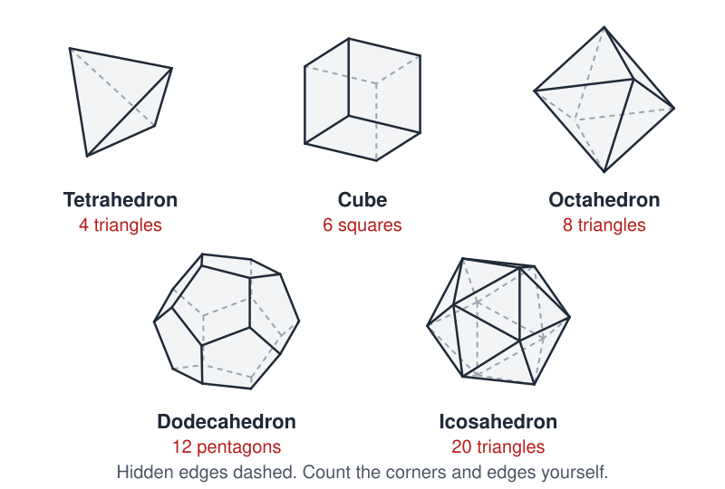
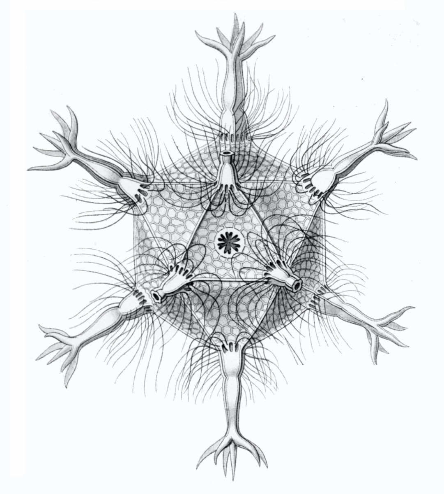

# Platonic Solids and Applications

 This work is licensed under a <a rel="license" href="http://creativecommons.org/licenses/by/4.0/">Creative Commons Attribution 4.0 International License</a>.

*[Section 4](../section4.md), session 22. The same session holds further experiments in the [Cell Shapes](cell-shapes-lab.md) lab and the [Egg Pouches](egg-pouches-lab.md) lab.*

!!! abstract "The problem"

    Reconstructed from the syllabus, which says only "Platonic Solids and
    applications"; the worksheet is lost, and this is the editors' version
    of the standard exercise. Straws or cardboard help.

    **1. The five solids.** A regular (Platonic) solid is a convex solid
    whose faces are identical regular polygons, the same number meeting
    at every corner. Sketch or build all five and count each one's
    vertices *V*, edges *E* and faces *F*. Do not look the numbers up.

    **2. Find the pattern.** Find a rule connecting *V*, *E* and *F* that
    holds for all five. Test it on a prism, a pyramid, a cube with one
    corner sliced off. Then build a solid for which it fails; one exists.

    **3. Why only five?** Use your rule, or the angles that meet at a
    corner, to prove that no sixth regular solid can exist.

    **4. Applications.**

    - A soccer ball is sewn from pentagons and hexagons, three panels at
      each corner. How many pentagons must it have?
    - Can a closed shell be tiled with hexagons alone, three at each corner?
    - Some radiolarian skeletons, many virus coats and the C60 molecule
      have the symmetry of the icosahedron. Why might the regular
      dodecahedron and icosahedron appear among tiny skeletons but never
      as mineral crystals?
    - In 1596 Kepler proposed that the five solids, nested between the
      planetary spheres, explain the spacing of the six known planets. Judge
      it as an empirical generalization: what pattern was observed, what
      would count as a test, and what happened to the theory?

{ width="560" }

*The five regular solids, projected from exact coordinates. Drawn for this site (CC BY 4.0).*

## Why it is in the course

Section 4 is "Patterns, Empirical Generalizations", and this exercise runs
the cycle in miniature: count, notice a regularity, hunt for the exception,
decide whether it kills the rule or only marks its limits, then prove the
rule and use it. It also fits the syllabus: "The discovery exercises are mostly
made from elementary mathematics so as to require no lab setup".

The reading due that day is "Adams Chapter 6: Alternative thinking
languages". Counting the edges of an icosahedron you cannot see all at once
is where a sketch or a straw model beats words.

A counting argument explains the soccer ball and the virus; Kepler's
nested solids fit the numbers roughly and explain nothing. Applied to a flat
sheet of cells meeting three at a corner, the same rule gives an average of
six sides per cell. That may be why the session sits among the Cell Shapes
experiments, but the link is the editors' inference.

## Where it comes from

The regular solids are older than Plato, but his *Timaeus* (about 360 BC)
builds four of them from triangles for fire, air, water and earth, adding
that "There was yet a fifth combination which God used in the delineation
of the universe" (Jowett's translation). Euclid's *Elements* ends with
their construction and the remark, after Book XIII, Proposition 18, that
"No other figure, besides the said five figures, can be constructed by
equilateral and equiangular figures equal to one another."

Kepler used them for his planetary model in the *Mysterium Cosmographicum*
(1596). Euler found the counting rule in 1750 and published it in 1758,
with a proof in a companion paper that was later found to be flawed. Lakatos's *Proofs and Refutations* (1976) turns its
history of counterexamples into a classroom dialogue.

D'Arcy Thompson's *On Growth and Form* (1917) found all five solids among
Haeckel's radiolarians and noted that the regular dodecahedron and
icosahedron never occur as crystals. Caspar and Klug (1962) explained why
so many virus coats are icosahedral, and Kroto and colleagues (1985)
proposed the soccer-ball shape for C60.

{ width="560" }

*Ernst Haeckel, Circogonia icosahedra, from Kunstformen der Natur (1904), plate 1. CC0 / public domain, via Wikimedia Commons.*

??? tip "Hints"

    - Check each count a second way: every edge borders exactly two faces,
      so *E* = *F* × (edges per face) ÷ 2.
    - Add and subtract the three columns in different combinations. The
      rule is linear and gives the same small number for all five solids.
    - Do not stop at solids that confirm the rule. Build the ugliest
      polyhedron you can, then one with a hole through it.
    - For the soccer ball, write *P* for pentagons and *H* for hexagons and
      count edges and corners two ways.
    - For "why only five", ask what the flat angles meeting at one corner
      must add up to if the corner is to stick out at all.

??? success "Resolution"

    **The rule.** Tetrahedron *V*, *E*, *F* = 4, 6, 4; cube 8, 12, 6;
    octahedron 6, 12, 8; dodecahedron 20, 30, 12; icosahedron 12, 30, 20.
    Each time *V* − *E* + *F* = 2. It holds for any polyhedron whose
    surface is a deformed sphere, including the soccer ball
    (60 − 90 + 32 = 2). It fails for a square picture frame of four bricks
    (16 − 32 + 16 = 0); a surface with *g* holes gives 2 − 2*g*. The
    counterexample marks the rule's domain rather than destroying it.

    **Why only five.** At least three faces meet at a corner, and their flat
    angles must total less than 360°. That allows 3, 4 or 5 triangles
    (60° each), 3 squares (90°) or 3 pentagons (108°), and nothing else:
    six triangles, four squares or three hexagons lie flat. With the rule
    instead: if each face has *p* edges and *q* faces meet at each corner,
    then *pF* = 2*E* = *qV*. Substituting into *V* − *E* + *F* = 2 gives
    1/*p* + 1/*q* = 1/2 + 1/*E* > 1/2, whose only solutions with *p*, *q* ≥ 3
    are (3,3), (4,3), (3,4), (5,3) and (3,5): the five solids.

    **Twelve pentagons.** With *F* = *P* + *H* and
    2*E* = 3*V* = 5*P* + 6*H*, the rule reduces to *P*/6 = 2, so
    *P* = 12 whatever the number of hexagons (20 on a standard ball, none on
    a dodecahedron). With *P* = 0 it reads 0 = 2: hexagons alone cannot
    close a shell.

    **Crystals and radiolaria.** A crystal lattice repeats by translation,
    and no such lattice can have a five-fold axis, so the regular
    dodecahedron and icosahedron are impossible crystal forms. A radiolarian
    skeleton is a single closed shell, not a lattice, so nothing forbids
    five-fold symmetry. Same shape, different constraints.

    **Kepler.** The nesting matched the orbits only roughly, offered no
    mechanism, and did not survive his own elliptical orbits or Uranus
    (1781): a striking pattern, not a law.

## Sources

- **Euclid**, *Elements*, Book XIII, ed. D. E. Joyce (Clark University) — [Book XIII](https://mathcs.clarku.edu/~djoyce/java/elements/bookXIII/bookXIII.html){target=_blank} 🔓
- **Plato**, *Timaeus*, trans. Benjamin Jowett — [Project Gutenberg](https://www.gutenberg.org/ebooks/1572){target=_blank} 🔓
- **Leonhard Euler**, "Elementa doctrinae solidorum", *Novi Commentarii academiae scientiarum Petropolitanae* 4, 109–140 (1758) — [Euler Archive E230](https://scholarlycommons.pacific.edu/euler-works/230/){target=_blank} 🔓
- **Leonhard Euler**, "Demonstratio nonnullarum insignium proprietatum, quibus solida hedris planis inclusa sunt praedita", same volume, 140–160 (1758) — [Euler Archive E231](https://scholarlycommons.pacific.edu/euler-works/231/){target=_blank} 🔓
- **D'Arcy Wentworth Thompson**, *On Growth and Form* (1917), chapter IX, pp. 479–485 — [Internet Archive](https://archive.org/details/ongrowthform1917thom){target=_blank} 🔓
- **Imre Lakatos**, *Proofs and Refutations: The Logic of Mathematical Discovery*, ed. J. Worrall and E. Zahar (1976) — [doi:10.1017/CBO9781139171472](https://doi.org/10.1017/CBO9781139171472){target=_blank} 🔒
- **David S. Richeson**, *Euler's Gem: The Polyhedron Formula and the Birth of Topology* (2008) — [doi:10.1515/9781400838561](https://doi.org/10.1515/9781400838561){target=_blank} 🔒 (the formula's later history, from Euler's flawed proof to the Euler characteristic)
- **D. L. D. Caspar and A. Klug**, "Physical Principles in the Construction of Regular Viruses", *Cold Spring Harbor Symposia on Quantitative Biology* 27, 1–24 (1962) — [doi:10.1101/sqb.1962.027.001.005](https://doi.org/10.1101/sqb.1962.027.001.005){target=_blank} 🔒
- **H. W. Kroto, J. R. Heath, S. C. O'Brien, R. F. Curl and R. E. Smalley**, "C60: Buckminsterfullerene", *Nature* 318, 162–163 (1985) — [doi:10.1038/318162a0](https://doi.org/10.1038/318162a0){target=_blank} 🔒
- **Eric W. Weisstein**, "Polyhedral Formula", MathWorld — [MathWorld](https://mathworld.wolfram.com/PolyhedralFormula.html){target=_blank} 🔓
- **Wikipedia contributors**, "Platonic solid" — [Wikipedia](https://en.wikipedia.org/wiki/Platonic_solid){target=_blank} 🔓
- **Wikipedia contributors**, "Euler characteristic" — [Wikipedia](https://en.wikipedia.org/wiki/Euler_characteristic){target=_blank} 🔓 (the twelve-pentagon count for a football)
- **Arthur T. Winfree**, *The Art of Scientific Discovery*: original course syllabus — [PDF](https://github.com/tyson-swetnam/aosd/blob/main/docs/assets/aosd_syllabus.pdf){target=_blank} 🔓

!!! note "How sure are we that this is Winfree's problem?"

    Sure of the topic, not of the exercise. The syllabus says "Deal with
    Platonic Solids and applications"; no other Winfree text on it
    survives. The Euler-formula exercise is the editors' reconstruction,
    chosen to fit the section theme, the Adams reading and the Cell Shapes
    lab. The candidates:

    - **Count, find *V* − *E* + *F* = 2, test and prove it, then apply it** to soccer balls, viruses, radiolaria and foams. Medium confidence.
    - **The biological applications**: radiolaria, virus coats, C60, crystals, foams. Medium confidence; probably part of the same session.
    - **Kepler's nested solids** as a beautiful pattern that proved false. Medium confidence; probably part rather than whole.
    - **A pure geometry proof** that exactly five regular solids exist. Low confidence as the whole session.

---

*Back to [Section 4](../section4.md) · [All problems](index.md) · [The schedule](../syllabus.md#section-4-patterns-empirical-generalizations)*
