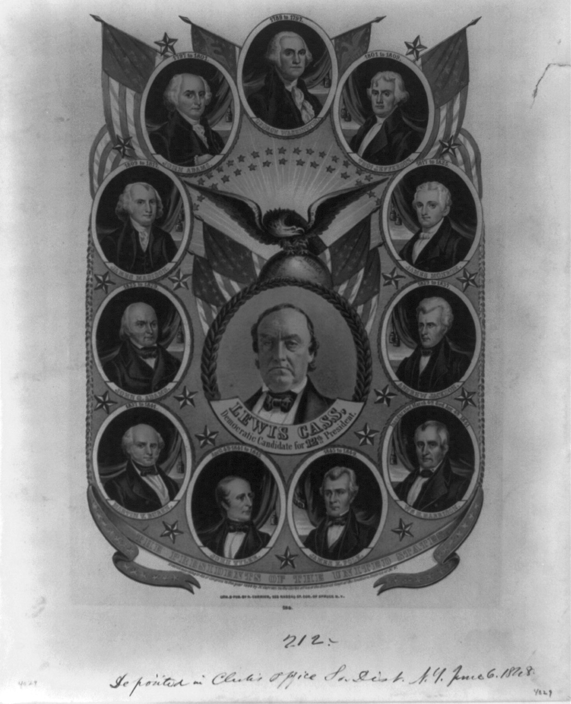

# Presidents and States

 This work is licensed under a <a rel="license" href="http://creativecommons.org/licenses/by/4.0/">Creative Commons Attribution 4.0 International License</a>.

*[Section 4](../section4.md), session 19. Discussed together with [n dots on the rim of a circle](n-dots-on-circle.md).*

!!! abstract "The problem"

    Reconstructed from the syllabus: Winfree's handout for this exercise
    has not survived. The two patterns below were chosen by the editors
    as examples of the kind the session is about, not as his.

    **Presidents.** Every president elected in a year divisible by twenty
    from 1840 to 1960 died in office: Harrison, Lincoln, Garfield,
    McKinley, Harding, Franklin Roosevelt and Kennedy. Only one other
    president had died in office: Zachary Taylor, elected in 1848, who
    died in 1850.

    **States.** Maine voted for state offices in September, two months
    before the presidential vote. From 1820 to 1932 that result matched
    the party of the next president in 21 of 28 cycles: "As Maine goes, so
    goes the nation". Missouri voted for the winner in every presidential
    election from 1904 through 2004 except 1956.

    **Your task.** Is each regularity a pattern, an accident or a law, and
    what mechanism could produce it? Imagining it is 1970, give odds that
    the president elected in 1980 will die in office, and say how you got
    them. How many other rules of this shape could you have searched for?

{ width="560" }

*Drawn for this site (CC BY 4.0). Small squares mark the other elections; the filled one is Taylor's.*

## Why it is in the course

Session 19 opens Section 4, "Patterns, Empirical Generalizations", with
Judson's chapter *Pattern*, and pairs this exercise with
[n dots on the rim of a circle](n-dots-on-circle.md). The disk gives a
number pattern you can test by drawing the next case; history offers no
next case on demand. Both ask how many confirmations a generalization
needs.

Session 4 asked for "facts before explanations of facts" and for
"distinguishing things we know vs only imagine". That seven zero-year
presidents died in office is a fact. A curse is an explanation, and
accepting it is a separate step from checking the record.

## Where it comes from

*Ripley's Believe It or Not!* noted the zero-year pattern in 1931 and
again in 1948. It came to be blamed on a curse laid by the Shawnee leader
Tenskwatawa after his brother's defeat by Harrison at Tippecanoe in 1811,
hence the name "Curse of Tippecanoe".

Maine's reputation dates to 1840. In 1936 Maine voted Republican in
September, and in November Landon carried only Maine and Vermont, which
prompted James Farley's quip "As Maine goes, so goes Vermont". A 1959 law
moved Maine's elections to November. Missouri then inherited the
reputation.

{ width="560" }

*Popular Graphic Arts, "The Presidents of the United States" (1848), Library of Congress, via Wikimedia Commons. Public domain. A campaign banner for Lewis Cass.*

??? tip "Hints"

    - How many presidents had there been by 1970, and how many had died in
      office? Only then ask how remarkable the zero-year list is.
    - State the rule so exactly that someone in 1970 could apply it.
      Lincoln and Roosevelt each died in a term won in a later election.
      Does the rule still count them?
    - A pattern found by searching many possible rules must be judged
      against the number of rules searched.
    - One state has a story for why its record worked, and the story
      predicts when it should stop working. Which state?

??? success "Resolution"

    **The presidents.** The run broke in 1980: Reagan was shot in March
    1981 and survived, and Bush (2000) and Biden (2020) served out their
    terms. It should not have been very surprising. About one in five of
    the presidents before Reagan had died in office. The rule was stated
    after the fact, with a free choice of interval, starting year and
    criterion. Let the zero year be a year of death as well as of election,
    and Taylor, who died in 1850, fits too. Nobody publishes the patterns
    that fail. Diaconis and Mosteller name the two traps the multiplicity
    of endpoints and the law of truly large numbers: a rule that may count
    many outcomes as hits is far less improbable than it looks. A rule with
    no mechanism earns no credit for the next case, so honest odds in 1970
    were near the base rate, not near certainty.

    **The states.** Maine's record had a mechanism: its early election
    sampled the same national mood as the November vote. That explains the
    record and its end, since the 1936 landslide showed the sample could
    mislead and the 1959 move to November removed it. Missouri had no such
    mechanism beyond resembling the country for a while, and its run ended
    with the 2008 election without any change in the rule.

    **The moral.** Rules that survive, such as Kepler's third law in
    [Paired Observations](paired-observations.md), rest on a mechanism, not
    on a longer run of confirmations.

## Sources

- **Arthur T. Winfree**, *The Art of Scientific Discovery* (ECOL 479/579): course handout, archived 20 April 2002 — [Internet Archive](https://web.archive.org/web/20020420212713/http://eebweb.arizona.edu/Faculty/Winfree/handout_479.htm){target=_blank} 🔓
- **Wikipedia contributors**, "Curse of Tippecanoe" — [Wikipedia](https://en.wikipedia.org/wiki/Curse_of_Tippecanoe){target=_blank} 🔓
- **Wikipedia contributors**, "As Maine goes, so goes the nation" — [Wikipedia](https://en.wikipedia.org/wiki/As_Maine_goes,_so_goes_the_nation){target=_blank} 🔓
- **Wikipedia contributors**, "Missouri bellwether" — [Wikipedia](https://en.wikipedia.org/wiki/Missouri_bellwether){target=_blank} 🔓
- **Wikipedia contributors**, "Bellwether (politics)" — [Wikipedia](https://en.wikipedia.org/wiki/Bellwether_(politics)){target=_blank} 🔓 (the end of Missouri's run)
- **Persi Diaconis and Frederick Mosteller**, "Methods for Studying Coincidences", *Journal of the American Statistical Association* 84(408), 853–861 (1989) — [PDF](https://www.stat.berkeley.edu/~aldous/157/Papers/diaconis_mosteller.pdf){target=_blank} 🔓
- **Wikipedia contributors**, "List of presidents of the United States by home state" — [Wikipedia](https://en.wikipedia.org/wiki/List_of_presidents_of_the_United_States_by_home_state){target=_blank} 🔓
- **Horace Freeland Judson**, *The Search for Solutions* (1980), chapter 2, "Pattern" — [Internet Archive](https://archive.org/details/searchforsolutio0000juds_r0s0){target=_blank} 🔓 *(borrow)*
- **Arthur T. Winfree**, *The Art of Scientific Discovery*: original course syllabus — [PDF](https://github.com/tyson-swetnam/aosd/blob/main/docs/assets/aosd_syllabus.pdf){target=_blank} 🔓

!!! note "How sure are we that this is Winfree's problem?"

    Not sure. The syllabus and Winfree's archived handout give only the
    name and the session, and no other source names the exercise.
    Candidate readings:

    - **Bellwether states** such as Maine and Missouri, which join both
      nouns in the title.
    - **The zero-year presidents**, the closest match to the disk
      problem's run of confirmations followed by failure, but with no
      obvious "states".
    - **A table of presidents against states** to search for patterns.
      Eight presidents were born in Virginia, yet by home state New York
      leads with seven, so the headline depends on the column you read.
    - **Two datasets side by side**, one about presidents and one about
      states. The reconstruction above takes this reading.

---

*Back to [Section 4](../section4.md) · [All problems](index.md) · [The schedule](../syllabus.md#section-4-patterns-empirical-generalizations)*
