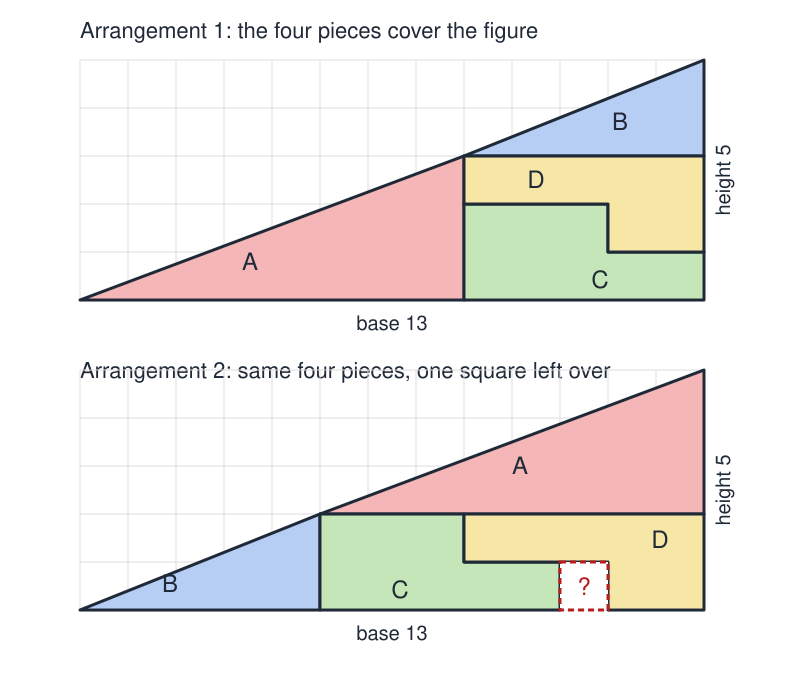
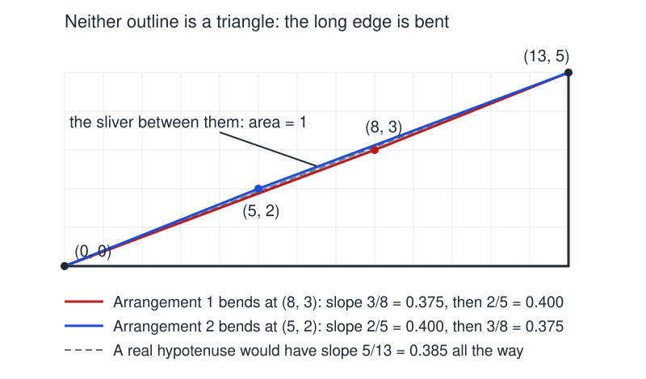

# Rearranged Triangle

 This work is licensed under a <a rel="license" href="http://creativecommons.org/licenses/by/4.0/">Creative Commons Attribution 4.0 International License</a>.

*[Section 2](../section2.md), session 7. Discussed with [Weird Organism](weird-organism.md); the same session starts the group lab on [Dominoes](dominoes-lab.md).*

!!! abstract "The problem"

    The syllabus gives only the name. No text of Winfree's describing this problem survives, so the statement below is an editors' reconstruction, following the standard version of the puzzle that Martin Gardner published in 1956.

    On graph paper, mark out a right triangle with a base of 13 units and a height of 5 units, the right angle at the lower left. Cut out four pieces:

    - **A**: a right triangle with legs 8 (horizontal) and 3 (vertical).
    - **B**: a right triangle with legs 5 (horizontal) and 2 (vertical).
    - **C**: an L of 8 unit squares: a row of 5 with a row of 3 on top of its left end.
    - **D**: an L of 7 unit squares: a row of 5 with a row of 2 under its right end.

    **Arrangement 1.** Put A in the lower left corner, its 8-unit leg along the base, so its sloping edge runs from the corner up to the point 8 across and 3 up. Put B above and to its right, so B's sloping edge carries on from (8, 3) to (13, 5). The space below B is a 5-by-3 rectangle; fill it with C and D. The figure looks like a 13-by-5 right triangle, completely covered.

    **Arrangement 2.** Swap the two small triangles. B now sits in the lower left corner, its edge running from (0, 0) to (5, 2), and A sits above and to its right, carrying on to (13, 5). The space below A is now an 8-by-2 rectangle; fit C and D into it. The outline looks like the same 13-by-5 triangle, but this time one unit square is left uncovered.

    The same four pieces cover the figure one way and leave a hole the other way. Where did the square go? Do not stop at "it is an optical illusion". Say exactly what is wrong with the picture, and check your answer with arithmetic.

{ width="560" }

*The two arrangements. Drawn for this site (CC BY 4.0).*

## Why it is in the course

Session 7 opens Section 2, "Creative Blocks", with Adams's Chapter 2 on *perceptual* blocks: seeing what you expect to see, failing to use all your senses, and not isolating the real problem. The rearranged triangle is a pure specimen of the first of those. Nothing in the drawing is a lie. The only false thing in the room is the reading your eye imposes on it.

The cure is what Section 1 practised: stop looking and start counting. Add up the four pieces. Compare that with the area of the triangle you think you see. Write the two small triangles' slopes as fractions and compare them. Any one of those three checks kills the paradox, and none of them depends on the others. The syllabus calls the session-12 problem [Sums of Integers](sums-of-integers.md) "like a jig-saw puzzle of cross-checks"; three independent checks on one figure work the same way.

The session's other item, [Weird Organism](weird-organism.md), makes the same point in biology: a habit of perception decides what the observer believes is there.

## Where it comes from

Dissection paradoxes, in which pieces are shuffled and area seems to appear or vanish, are centuries old. Edme-Gilles Guyot printed one in 1769, and William Hooper copied it, mis-drawn figure and all, as "The geometric money" in *Rational Recreations* (1774; corrected in 1782). The best-known ancestor is the chessboard paradox: an 8-by-8 square cut into four pieces that reassemble into a 5-by-13 rectangle, 64 apparently becoming 65. Oskar Schloemilch published it in 1868. Sam Loyd claimed to have shown it at a chess congress in 1858, a claim no record confirms, and it appears in his posthumous *Cyclopedia of Puzzles* (1914).

The triangle form is much newer. Paul Curry, a New York amateur magician, devised it in 1953, and Martin Gardner popularised it in *Mathematics, Magic and Mystery* (1956), whose chapter 8, "Geometrical Vanishes, Part II", remains the standard history. By the late 1990s the puzzle was circulating online as two coloured drawings and a one-line challenge. That is a plausible but unproven guess at how a class in 2001 met it.

??? tip "Hints"

    - Before explaining anything, compute. What is the area of a genuine 13-by-5 right triangle? What is the total area of the four pieces?
    - Compare the two small triangles. Are they similar? Work out the slope of each sloping edge as a fraction.
    - Lay a straightedge along the long edge of each arrangement, or draw the true line from (0, 0) to (13, 5) on the graph paper and see which pieces cross it.
    - The numbers 2, 3, 5, 8, 13 are not an accident. Find out what family they belong to, and why consecutive members are so easy to confuse.

??? success "Resolution"

    Neither figure is a triangle. The two small triangles are not similar: A's sloping edge has slope 3/8 = 0.375 and B's has slope 2/5 = 0.400, while a true 13-by-5 hypotenuse would have slope 5/13 = 0.385 the whole way. The long edge is therefore a bent line, with its corner at (8, 3) in the first arrangement and at (5, 2) in the second. In Arrangement 1 the bend sags just below the true diagonal; in Arrangement 2 it bulges just above it.

    { width="560" }

    *Where the square goes. Drawn for this site (CC BY 4.0).*

    The two outlines differ by a long thin parallelogram with corners (0, 0), (5, 2), (13, 5) and (8, 3). Its area is exactly 1 square unit. That is the missing square.

    The arithmetic agrees. The pieces total 12 + 5 + 8 + 7 = 32 squares, while a real 13-by-5 triangle has area 32.5. The first outline encloses 32, half a square short of a real triangle, and the pieces fill it exactly. The second encloses 33, half a square over, so one square is left bare. The bend is only about 1.2 degrees, far too small to see, especially with thick lines drawn on the diagram.

    Why these numbers? 2, 3, 5, 8, 13 are consecutive Fibonacci numbers, and Cassini's identity guarantees a discrepancy of exactly one unit. Use larger Fibonacci numbers and the slopes come closer together, so the illusion gets better.

## Sources

- **Martin Gardner**, *Mathematics, Magic and Mystery* (Dover, 1956), chapter 8, "Geometrical Vanishes, Part II" — [Internet Archive](https://archive.org/details/magicmathematics0000unse){target=_blank} 🔓 *(borrow)*
- **Alexander Bogomolny**, "Curry's Paradox", Cut-the-Knot — [cut-the-knot.org](https://www.cut-the-knot.org/Curriculum/Fallacies/CurryParadox.shtml){target=_blank} 🔓
- **Eric W. Weisstein**, "Triangle Dissection Paradox", MathWorld — [mathworld.wolfram.com](https://mathworld.wolfram.com/TriangleDissectionParadox.html){target=_blank} 🔓
- **Wikipedia contributors**, "Missing square puzzle" — [en.wikipedia.org](https://en.wikipedia.org/wiki/Missing_square_puzzle){target=_blank} 🔓
- **Wikipedia contributors**, "Chessboard paradox" — [en.wikipedia.org](https://en.wikipedia.org/wiki/Chessboard_paradox){target=_blank} 🔓
- **Wikipedia contributors**, "Hooper's paradox" — [en.wikipedia.org](https://en.wikipedia.org/wiki/Hooper%27s_paradox){target=_blank} 🔓
- **William Hooper**, *Rational Recreations*, vol. 4 (1782), "Recreation CVI. The geometric money", p. 286 — [Internet Archive](https://archive.org/details/rationalrecreat00davigoog){target=_blank} 🔓
- **Sam Loyd** (ed. Sam Loyd Jr.), *Cyclopedia of 5000 Puzzles, Tricks and Conundrums* (1914), chessboard dissection p. 288 — [Internet Archive](https://archive.org/details/CyclopediaOfPuzzlesLoyd){target=_blank} 🔓
- **Torsten Sillke**, "Jigsaw Paradox" (annotated bibliography) — [math.uni-bielefeld.de](https://www.math.uni-bielefeld.de/~sillke/PUZZLES/jigsaw-paradox.html){target=_blank} 🔓
- **The Math Doctors**, "Disappearing Area?" (2020) — [themathdoctors.org](https://www.themathdoctors.org/disappearing-area/){target=_blank} 🔓
- **Pat Ballew**, "Geometric Vanishes, A Little History" (2022) — [pballew.blogspot.com](https://pballew.blogspot.com/2022/02/geometric-vanishes-little-history.html){target=_blank} 🔓
- **James L. Adams**, *Conceptual Blockbusting: A Guide to Better Ideas*, chapter 2, "Perceptual Blocks" (Perseus, 2001 printing, 3rd ed.; which edition the course used is not known) — [Internet Archive](https://archive.org/details/conceptualblockb00adam_0){target=_blank} 🔓 *(borrow)*
- **Arthur T. Winfree**, *The Art of Scientific Discovery*, original course syllabus — [PDF](https://github.com/tyson-swetnam/aosd/blob/main/docs/assets/aosd_syllabus.pdf){target=_blank} 🔓

!!! note "How sure are we that this is Winfree's problem?"

    The syllabus gives only a name and a session. Under Tuesday 11 September it lists "Adams Chapter 2: Perceptual blocks", then "Discuss Weird Organism", "Discuss Rearranged Triangle" and "Start group lab on Dominoes". The syllabus is the only Winfree source for this problem: nothing on his archived web site mentions the puzzle or any dissection paradox. The identification rests on the name, the pairing with Adams's chapter on perceptual blocks, and the puzzle's fame in 2001 — not on any text of Winfree's describing it.

    The candidates the editors weighed:

    - **Curry's triangle, the missing-square paradox** (the reading above). The name says a triangle is rearranged, the force of the puzzle is perceptual, and it needs nothing but graph paper. The likeliest reading.
    - **The chessboard version**, 64 apparently becoming 65. Same mechanism, same lesson, and older, so Winfree may have used it instead or as well. But the syllabus says "Triangle", not square.
    - **Dudeney's Haberdasher's Puzzle** (1902): an equilateral triangle cut into four pieces that rearrange into a square. Literally a rearranged triangle, but a construction problem rather than an illusion, so it does not illustrate a perceptual block. Unlikely.
    - **The coin-triangle inversion puzzle**: ten coins in a triangle, to be turned upside down by moving three. Also a triangle rearranged, and a stock creativity exercise, but it tests insight, not perception. Unlikely.

    If a Winfree handout ever turns up showing a different figure, this page should be revised.

---

*Back to [Section 2](../section2.md) · [All problems](index.md) · [The schedule](../syllabus.md#section-2-creative-blocks)*
