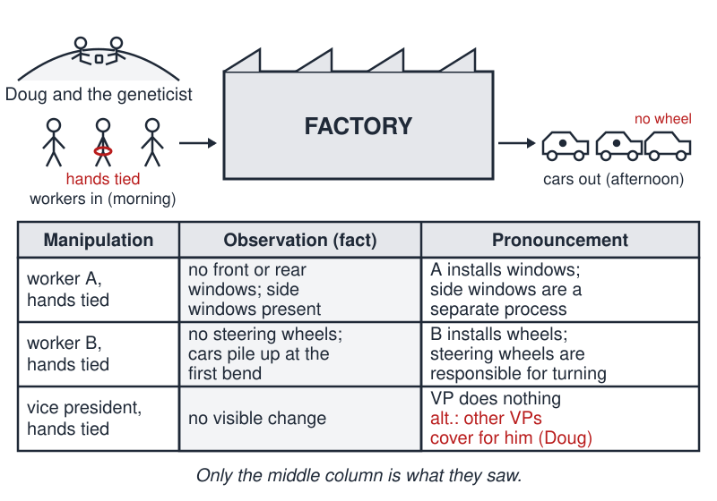
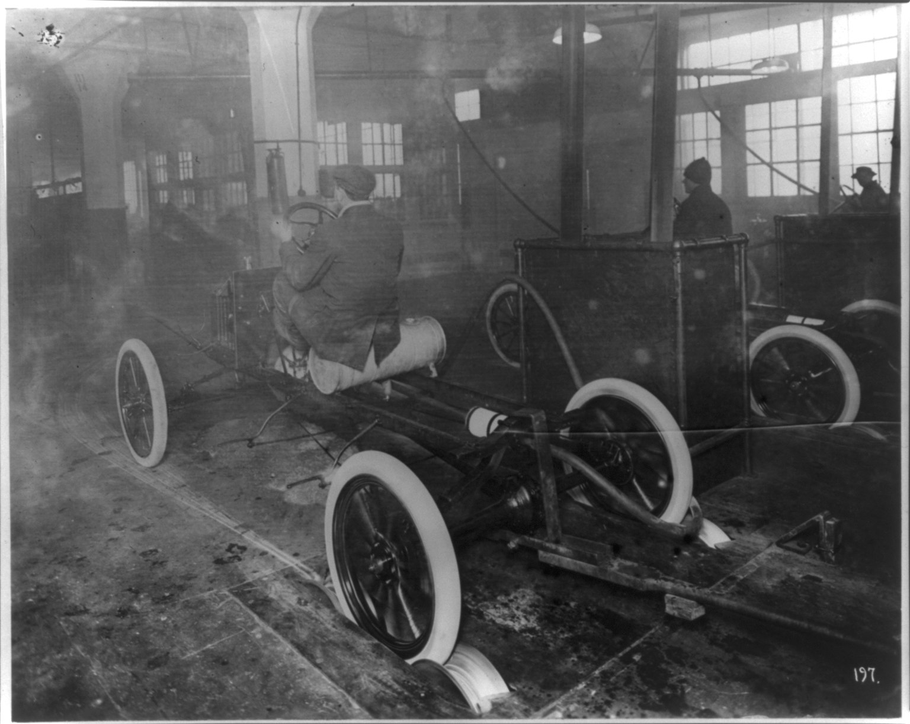

# Salvation of Doug

 This work is licensed under a <a rel="license" href="http://creativecommons.org/licenses/by/4.0/">Creative Commons Attribution 4.0 International License</a>.

*[Section 1](../section1.md), session 4. Discussed together with [Golden Tooth](golden-tooth.md) and [Bookworm's Journey](bookworms-journey.md).*

!!! abstract "The problem"

    This session's item is a reading, not a puzzle: William T. Sullivan's two-page parable **"The Salvation of Doug"**, free at the links under Sources. The *UC Santa Cruz Review* page prints Douglas Kellogg's reply, **"The Demise of Bill"**, beneath it. The parable is copyrighted, so it is summarised rather than reproduced here.

    **In brief (paraphrased).** Doug, a retired biochemist, and a retired geneticist watch an automobile factory from a hill: workers in each morning, cars out each afternoon. Neither knows how a car works. Doug grinds up a hundred cars, finds a car is about 10% glass, 25% plastic, 60% steel and 5% unidentified, then tries to mix the fractions back with a blowtorch to recover some "activity". The geneticist instead ties one worker's hands each morning and reads that afternoon's cars: no front or rear windows one day, though the side windows are there; no steering wheels the next, the cars piling up on the lawn at the first bend; and, when he ties a vice president's hands, no change at all. From each day he announces what he has learned, ending with the verdict that the vice president does nothing. Doug objects that several vice presidents may cover for one another. Next morning the geneticist heads down with a rope for every man in a suit, and Doug abandons his blowtorch and follows: his "salvation".

    As you read, keep two columns: what the two men actually *saw* each day, and what the geneticist *said he had learned*. (That exercise is the course editors' reconstruction; the syllabus gives only the title.)

{ width="560" }

*The geneticist's ledger. Only the middle column records what the two men saw. Drawn for this site (CC BY 4.0).*

{ width="560" }

*"Model T's coming off the assembly line at the Highland Park plant." Library of Congress Prints and Photographs Division, LCCN 2011661047, via Wikimedia Commons. Public domain.*

## Why it is in the course

Session 4 has three items in the syllabus: [Golden Tooth](golden-tooth.md), "facts before explanations of facts"; this reading, with no description at all; and [Bookworm's Journey](bookworms-journey.md), "distinguishing things we know vs only imagine". The Golden Tooth is the story of learned men explaining a child's gold tooth before anyone checked that it was gold: explanation outrunning fact. Sullivan's parable is a laboratory version of the same error. Winfree left no note on how he used the reading; what follows is read from those two neighbours.

Each afternoon delivers one plain observation; each evening the geneticist turns it into a confident causal claim. Some of those claims are sound, one overreaches, one is a classic false negative. Sorting them apart is the exercise. The ending shows how to settle the disagreement that follows: with a discriminating experiment, not a vote.

## Where it comes from

William T. (Bill) Sullivan is a Drosophila geneticist at UC Santa Cruz. He says on his lab page that he uses the story in introductory genetics "to explain the rationale behind mutational analysis and to show younger students the basic differences between genetics and biochemistry". It took him about an hour to write, he told the *UC Santa Cruz Review*, against two years for a scientific paper.

The Doug of the title is the biochemist Douglas R. Kellogg, who shared a laboratory with Sullivan at UC San Francisco: Sullivan a postdoctoral fellow, Kellogg a graduate student. Kellogg answered with "The Demise of Bill", in which the hand-tying geneticist declares seat belts "vestigial" because cars without them drive fine, then drives into a tree after a fruit fly crawls into his eye. Both parables were published in the 1990s and reprinted together by the *UC Santa Cruz Review* in 2004. Vincent, Estrada and DePace (2016) cite the original as *Generations* 1(3), 1993 — the only formal citation found, and one the editors could not check against the newsletter itself.

The factory is the parable's engine: workers are genes, the parts they install are gene products, hand-tying is a loss-of-function mutation, and the cars on the lawn are a mutant phenotype.

??? tip "Hints"

    - Separate the manipulation (whose hands were tied), the observation (what the cars did) and the pronouncement (what he said he had learned). Only the middle one is a fact.
    - For the steering-wheel day, ask what else was missing from those cars. Did anyone look?
    - For the vice-president day, list every state of the world in which tying one suit's hands leaves the cars unchanged. Redundancy is one; a delayed effect is another.

## What happened

There is no answer key; the reading is the lesson.

**What was known.** One worker disabled, no front or rear windows but side windows as usual. Another disabled, no steering wheels and cars that fail the first turn. A vice president disabled, nothing changed. Everything else is inference, though "this worker is *needed* for the windows" follows closely.

**The overreach.** "Steering wheels are responsible for turning the car" adds a mechanism to a correlation: a missing part upstream of the wheel would give the same lawn full of cars. A mutant phenotype tells you a gene is *required* for a process, not that it *performs* it.

**The false negative.** "No effect, therefore the vice president does nothing" is the central mistake; Doug's redundancy objection is the standard rejoinder for knockouts with no phenotype. Tying all the suits at once is the right move: a multiple mutant rather than an argument.

**Doug's side.** His percentages are real, but they answer what a car is made of, not how it works. Kellogg's reply gives the biochemist a better programme: take one car apart and trace the spark plug and its wiring. The moral of the session's placement is not that genetics beats biochemistry. It is: record the observation before the explanation, list the alternatives, then design the experiment that tells them apart.

## Sources

- **William T. Sullivan**, "Salvation of Doug" (1993; author's lab page, undated) — [Sullivan Lab, UC Santa Cruz](https://sullivanlab.sites.ucsc.edu/salvation-of-doug/){target=_blank} 🔓
- **William T. Sullivan; Douglas R. Kellogg**, "The Salvation of Doug: A Tale of Two Retired Scientists and Some Rope" and "The Demise of Bill", *UC Santa Cruz Review* (Spring 2004 reprint of both stories) — [review.ucsc.edu](https://review.ucsc.edu/spring04/bio-debate.html){target=_blank} 🔓
- **Tim Stephens**, "The Geneticist & the Biochemist: How a friendly rivalry illustrates the two cornerstones of biomedical research", *UC Santa Cruz Review* (2004) — [review.ucsc.edu](https://review.ucsc.edu/spring04/twoversions.html){target=_blank} 🔓
- **Tim Stephens (writer); Jim Burns (ed.)**, *UC Santa Cruz Review*, Vol. 41, No. 4 (March 2004), print PDF — [review.ucsc.edu](https://review.ucsc.edu/spring04/UCSC_Review-spring04.pdf){target=_blank} 🔓
- **Ben J. Vincent, Javier Estrada, Angela H. DePace**, "The appeasement of Doug: a synthetic approach to enhancer biology", *Integrative Biology* 8(4), 475–484 (2016) — [doi:10.1039/c5ib00321k](https://doi.org/10.1039/c5ib00321k){target=_blank} 🔒
- **Mrs. Lau (high-school science teacher)**, "The Salvation of Doug and the Demise of Bill: What Genetics and Biochemistry Are All About" (2015) — [Science with Mrs. Lau](https://www.scienceandmathwithmrslau.com/2015/03/the-salvation-of-doug-and-the-demise-of-bill-what-genetics-and-biochemistry-are-all-about/){target=_blank} 🔓
- **Arthur T. Winfree**, *The Art of Scientific Discovery: original course syllabus* — [PDF](https://github.com/tyson-swetnam/aosd/blob/main/docs/assets/aosd_syllabus.pdf){target=_blank} 🔓

---

*Back to [Section 1](../section1.md) · [All problems](index.md) · [The schedule](../syllabus.md#section-1-detecting-nonsense-error-checking-false-assumptions-cherishing-mistakes)*
