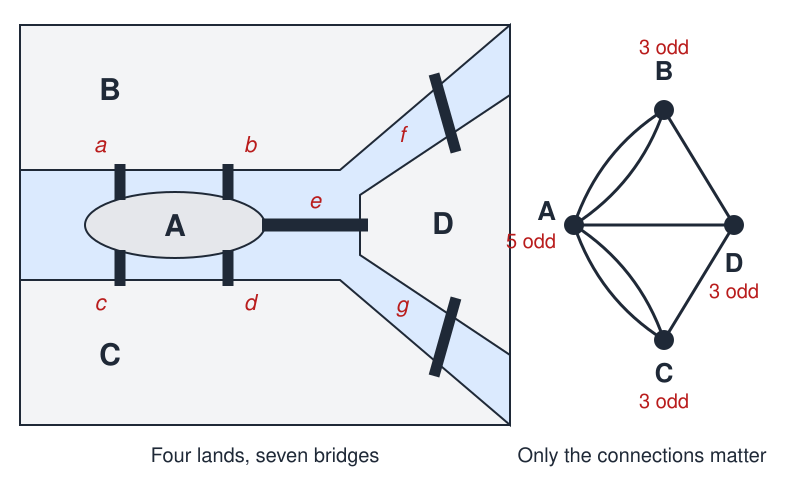
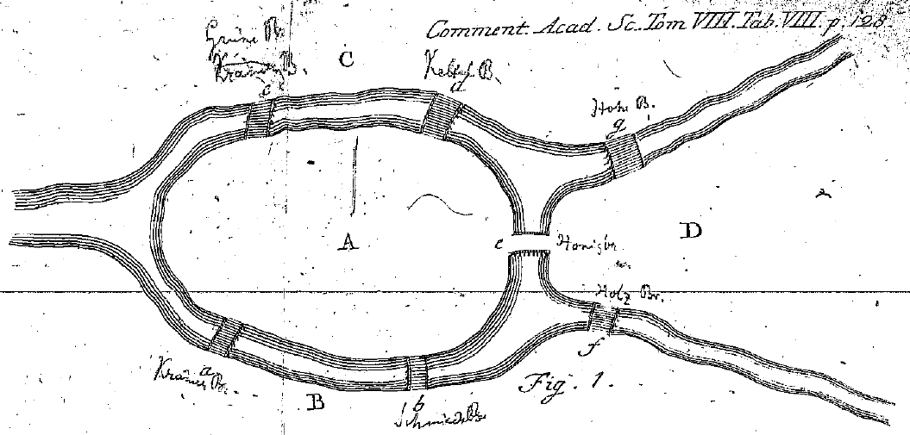

# Seven Bridges of Königsberg

 This work is licensed under a <a rel="license" href="http://creativecommons.org/licenses/by/4.0/">Creative Commons Attribution 4.0 International License</a>.

*[Section 3](../section3.md), session 13. Discussed together with [Ant Walk](ant-walk.md); the same session takes up outdoor observations on the [Pedestrian Crosswalk Mystery](pedestrian-crosswalk-mystery.md) and starts the [chemical pattern-formation lab](chemical-pattern-formation-lab.md).*

!!! abstract "The problem"

    *The setting below is the editors' summary of Euler's own description of
    the city and its bridges. Nothing in it is a quotation.*

    The Prussian city of Königsberg (today Kaliningrad, Russia) stood on the
    river Pregel. In the middle of the city the river runs in two branches
    around the island of Kneiphof, and a second island, the Lomse, lies
    between the same two branches. Seven bridges joined these four pieces of
    land: the island Kneiphof (call it A), the mainland bank on one side
    (B), the mainland bank on the other (C) and the second island (D). Two
    bridges (a and b) joined A to B, two (c and d) joined A to C, one (e)
    joined A to D, one (f) joined B to D and one (g) joined C to D.

    Euler opens his 1741 paper by reporting the puzzle as it reached him:
    could anyone plan a walk that crosses every one of the seven bridges
    exactly once? He adds that he was told some people denied it was
    possible and others doubted it, but that nobody asserted it.

    **Your task.** Find such a walk, or explain convincingly why none
    exists. You may start and finish anywhere, and need not return to your
    starting point.

    **Then the wider question**, also Euler's: whatever the shape of the
    river and however many bridges there are, state a rule that decides the
    matter for any map, without listing all the possible walks.

{ width="560" }

*Drawn for this site (CC BY 4.0). Schematic: it keeps the connections of
Euler's own figure, not the shapes or distances of the real city, and like
his figure it draws D as an open wedge of land between the two branches.*

## Why it is in the course

Section 3 is "Observations and Questions", and session 13 pairs Seven
Bridges with [Ant Walk](ant-walk.md). Königsberg is a clean case of
observations piling up while the right question goes unasked. The townspeople
had plenty of data — many attempted walks, none successful — and Euler records
where that left them: some denied a walk was possible, others doubted it,
nobody asserted it.

That is not yet knowledge. Failed attempts are facts, but "nobody has found a
walk" is not the same claim as "no walk exists". The syllabus makes that
distinction the work of session 04, where
[Bookworm's Journey](bookworms-journey.md) is about "distinguishing things we
know vs only imagine".

Euler refused the brute search. In §3 he considers listing every possible
route and rejects it: too laborious, hopeless for larger maps, and it turns
up a great deal nobody asked for. He asked instead what property of the map
decides the matter, and threw away everything that could not matter —
distances, the shapes of the banks, the streets — until only the four lands
and the number of bridges at each one remained. That stripping down, and the
small counting argument it makes possible, is the point of the session. A
good question turns a heap of observations into a rule you can check, one
that settles every similar map at once.

## Where it comes from

Königsberg's townspeople had argued over the question for some time before it
reached a mathematician. It came to Euler, then at the St Petersburg Academy,
through Carl Gottlieb Ehler, an astronomer who later became mayor of Danzig.
In a letter of March 1736 Ehler asked Euler for his solution to the problem
of the seven Königsberg bridges, with a proof, presenting it as a fine
specimen of the calculus of position. Euler's reply played the problem down:
its solution, he said, had little to do with mathematics and rested on reason
alone, and he admitted he did not know what Leibniz and Wolff had meant by a
geometry of position. (The letters are published in translation by Hopkins and
Wilson, p. 202; the editors report them here at second hand and do not quote
them.)

He had in fact already dealt with it. "Solutio problematis ad geometriam
situs pertinentis" — "solution of a problem belonging to the geometry of
position" — was presented to the Academy on 26 August 1735 and printed in
1741 in the *Commentarii academiae scientiarum Petropolitanae*, volume 8,
pages 128–140. It is now read as the first paper in graph theory and one of
the first in topology, because nothing in it depends on distance or shape,
only on what is connected to what.

{ width="560" }

*Leonhard Euler, Fig. 1 of "Solutio problematis ad geometriam situs pertinentis" (1741). Public domain, via Wikimedia Commons.*

??? tip "Hints"

    - Before searching for a walk, say what a walk really is. Does the route
      through the streets matter, or only the order in which you visit the
      four pieces of land? Try writing a walk as a string of letters A, B,
      C, D.
    - If a walk crosses seven bridges, how many letters does its string
      have? Each crossing adds one letter.
    - Count the bridges touching each piece of land. Every time you pass
      through a land you use two of its bridges, one in and one out. What
      does an odd count force about starting or finishing there?
    - How many lands can be the start or the finish of a single walk?
      Compare that with how many lands at Königsberg have an odd number of
      bridges.
    - Test your rule on a map you invent: add one bridge to Königsberg and
      ask whether the walk becomes possible, and where it must then begin.

## What happened

No such walk exists. Describe a walk by the sequence of lands it visits: one
letter for the land you start in, one more for each bridge crossed, so a walk
over the seven bridges is written with eight letters. Each time the walker
passes through a land, arriving and leaving, two of that land's bridges are
used — so a land reached by an odd number of bridges must
be either the start or the end of the walk. A walk has one start and one end,
so at most two lands may have an odd count. At Königsberg the island A has
five bridges and B, C and D have three each: four odd lands, and therefore no
walk that crosses every bridge exactly once.

Euler's own bookkeeping (§9) makes the clash visible. A land reached by five
bridges forces its letter to appear three times in the record of the walk, and
a land reached by three bridges forces two appearances: 3 + 2 + 2 + 2 = 9
letters, in a word with only eight places. The word cannot be built, so the
walk cannot be taken.

Euler's general rule (§20, in paraphrase): if more than two regions have an
odd number of bridges, no such crossing exists; if exactly two do, the
crossing can be made, provided the walk begins in one of those two; if none
do, it can be made beginning anywhere. Euler proved the impossibility half
and asserted the rest; Carl Hierholzer gave the first full proof of the other
cases, published after his death in 1873. In today's language, a connected
graph has an Eulerian trail exactly when it has zero or two vertices of odd
degree.

Only the pattern of connections carried the answer. Euler called that new
kind of geometry the geometry of position; we call it topology and graph
theory.

A postscript. Two of the seven bridges did not survive the bombing of
Königsberg in the Second World War, and two more were later demolished for a
highway, leaving five at the old sites. With that layout only two lands have
an odd count, so the walk is now possible — but it must begin on one island
and end on the other. (This present-day account comes from the Wikipedia
overview listed below, consulted in September 2026 and not checked on the
ground.)

## Sources

- **Leonhard Euler**, "Solutio problematis ad geometriam situs pertinentis", *Commentarii academiae scientiarum Petropolitanae* 8, 128–140 (1741; presented 1735) — [Euler Archive E53](https://scholarlycommons.pacific.edu/euler-works/53/){target=_blank} 🔓
- **Leonhard Euler**, the full Latin text with Euler's three figures, republished by Michael Behrend — [cantab.net](https://www.cantab.net/users/michael.behrend/repubs/maze_maths/pages/euler.html){target=_blank} 🔓 (the §§1–4, 9 and 20 used above were read there, in the Latin and in the companion English translation; that translation names no translator and carries no licence, so this page paraphrases it and quotes nothing from it)
- **Brian Hopkins and Robin J. Wilson**, "The Truth about Königsberg", *The College Mathematics Journal* 35(3), 198–207 (2004) — [doi:10.2307/4146895](https://doi.org/10.2307/4146895){target=_blank} 🔒 (the scholarly source for the Ehler–Euler letters; the editors could not read it directly)
- **Wikipedia contributors**, "Carl Gottlieb Ehler" — [Wikipedia](https://en.wikipedia.org/wiki/Carl_Gottlieb_Ehler){target=_blank} 🔓 (renders the 1736 letters from Hopkins and Wilson, p. 202; the second-hand basis for the account above)
- **Wikipedia contributors**, "Seven Bridges of Königsberg" — [Wikipedia](https://en.wikipedia.org/wiki/Seven_Bridges_of_K%C3%B6nigsberg){target=_blank} 🔓 (dates, the Kneiphof and Lomse, and the fate of the bridges after 1945)
- **Wikipedia contributors**, "Eulerian path" — [Wikipedia](https://en.wikipedia.org/wiki/Eulerian_path){target=_blank} 🔓 (Hierholzer's 1873 proof; the modern statement of the rule)
- **J. J. O'Connor and E. F. Robertson**, "A history of Topology", MacTutor History of Mathematics (1996) — [MacTutor](https://mathshistory.st-andrews.ac.uk/HistTopics/Topology_in_mathematics/){target=_blank} 🔓
- **MacTutor History of Mathematics**, "Königsberg bridges": historic pictures of the city and its bridges (2000) — [MacTutor Extras](https://mathshistory.st-andrews.ac.uk/Extras/Konigsberg/){target=_blank} 🔓
- **Rob Shields**, "Cultural Topology: The Seven Bridges of Königsburg [sic], 1736", *Theory, Culture & Society* 29(4–5), 43–57 (2012) — [doi:10.1177/0263276412451161](https://doi.org/10.1177/0263276412451161){target=_blank} 🔒
- **Arthur T. Winfree**, *The Art of Scientific Discovery*: original course syllabus — [PDF](https://github.com/tyson-swetnam/aosd/blob/main/docs/assets/aosd_syllabus.pdf){target=_blank} 🔓

---

*Back to [Section 3](../section3.md) · [All problems](index.md) · [The schedule](../syllabus.md#section-3-observations-and-questions)*
