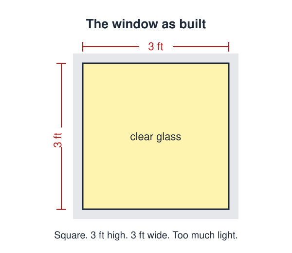
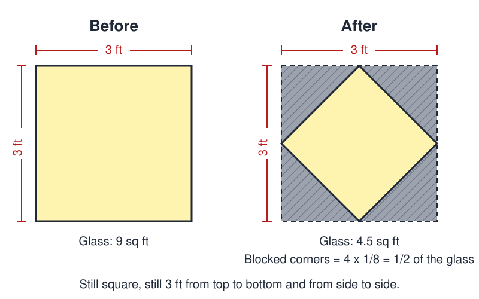

# Square Windows

 This work is licensed under a <a rel="license" href="http://creativecommons.org/licenses/by/4.0/">Creative Commons Attribution 4.0 International License</a>.

*[Section 1](../section1.md), session 3. The only problem the syllabus lists for this session, a solo problem discussed alongside Judson's chapter "The Rage to Know".*

!!! abstract "The problem"

    Lewis Carroll set this puzzle in a letter to a young friend, Helen Feilden, from Christ Church, Oxford, on 15 March 1873 (printed in *The Lewis Carroll Picture Book*, 1899, now in the public domain):

    > "A gentleman (a nobleman let us say, to make it more interesting) had a sitting-room with only one window in it — a square window, 3 feet high and 3 feet wide. Now he had weak eyes, and the window gave too much light, so (don't you like 'so' in a story?) he sent for the builder, and told him to alter it, so as only to give half the light. Only, he was to keep it square — he was to keep it 3 feet high — and he was to keep it 3 feet wide. How did he do it? Remember, he wasn't allowed to use curtains, or shutters, or coloured glass, or anything of that sort."

    In plain terms: the builder must produce a new window that is (1) square, (2) 3 feet high, (3) 3 feet wide, and (4) admits exactly half as much light as the old one, using ordinary clear glass and solid wall and nothing else. Before you reach for an answer, write down every condition the puzzle actually states, and then every condition you have silently added. The problem is only hard while the two lists are confused.

    Dudeney's later version (*Puzzles and Curious Problems*, 1931, no. 205) is shorter: a man had a window a yard square that let in too much light; he blocked up one half of it and still had a square window a yard high and a yard wide. How?

    Winfree's own statement of the problem has not survived; the wording above comes from the historical sources, not from his course materials.

{ width="560" }

*The window before the alteration. Drawn for this site (CC BY 4.0).*

## Why it is in the course

Session 3 falls early in Section 1, "Detecting Nonsense, Error Checking, False Assumptions, Cherishing Mistakes", and the syllabus assigns it a single task: "discuss Square Windows solo problem". Read as the Carroll and Dudeney puzzle, it is about the cleanest demonstration of a false assumption there is. Nothing in the statement says the window's sides run horizontal and vertical. Nearly everyone imports that condition anyway, and then declares the problem impossible.

The syllabus describes the purpose of its puzzles in Winfree's own words: "The purpose of the puzzles (many of them silly) is to slow you down for a few minutes so you can examine the working of your own mind." The square window takes a few minutes, needs no apparatus, and rewards exactly that kind of self-examination. It also sets up the next session, where [Bookworm's Journey](bookworms-journey.md) is labelled "distinguishing things we know vs only imagine": the constraint that blocks you here is imagined, not given.

The habit it rehearses recurs all term: separate the conditions that were actually stated from the ones you supplied, and test which of your own "facts" are really facts. (This reading is our reconstruction from the syllabus wording and the section title; Winfree left nothing on the problem beyond the one schedule line.)

## Where it comes from

The earliest dated appearance found is Charles L. Dodgson's letter of 15 March 1873 to Helen Feilden, written at Christ Church, Oxford, and printed by his nephew Stuart Dodgson Collingwood in *The Lewis Carroll Picture Book* (1899). Dodgson ends the letter with a rueful story about reducing a small girl to tears with the fox-goose-corn puzzle at a dinner party, and hopes that the square window will not have any awful effect on his correspondent. The book prints the puzzle without an answer.

Henry Ernest Dudeney included it as "The Square Window", no. 205, in *Puzzles and Curious Problems* (1931), the posthumous collection assembled by his widow Alice Dudeney, whose prefatory note of 24 April 1931 thanks the *Daily News* and the *Strand Magazine*. Donald Knuth's index of Dudeney's 1896-1904 *Weekly Dispatch* columns lists a puzzle of 4 October 1896 called "A remarkable window", marked "trick question", which may be an earlier printing; that has not been confirmed.

The puzzle has circulated in popular collections ever since, usually without attribution. Richard Wiseman's Friday Puzzle no. 153 of April 2012 restates it with a window one metre by one metre and names neither Carroll nor Dudeney. Whatever the wording, the point is the same. "High" and "wide" measure the extent of the opening, not necessarily the length of its sides.

??? tip "Hints"

    - Write the four stated conditions (square; 3 feet high; 3 feet wide; half the light) on one side of a page, and on the other side everything you have assumed but were not told. Compare the lists.
    - "Three feet high" says how far the opening reaches from bottom to top; it does not say that a 3-foot edge runs along the bottom.
    - Ask what other squares could touch all four sides of the original 3 ft by 3 ft square, then ask how much glass each one contains.
    - Draw the original square and both of its diagonals. They cut it into eight equal pieces. How many must you keep, and can the ones you keep make a square?
    - Dudeney's phrasing gives a strong nudge: the builder "blocked up one half of it". Which half, and in what shape?

??? success "Resolution"

    Keep the same 3 ft by 3 ft opening but turn the square through 45 degrees. The new window is the square whose four corners are the midpoints of the old window's four sides, and the four corner triangles outside it are bricked up. Its diagonals are the old window's horizontal and vertical midlines, so it is still exactly 3 feet from side to side and 3 feet from top to bottom, and it is still a square.

    Each blocked corner triangle is one-eighth of the original area (its legs are half-sides), so the four together remove exactly half the glass. Equivalently, a square with a 3 ft diagonal has area 3 x 3 / 2 = 4.5 square feet, half of 9.

    { width="560" }

    *Before and after. Drawn for this site (CC BY 4.0).*

    Dudeney's 1931 solution is the same picture. Of his own diagram he writes: "After he had blocked out the four triangles indicated by the dotted lines, he still had a square window, as seen, measuring a yard in height and a yard in breadth." The lesson is not the geometry but the moment of noticing that "high" and "wide" were never promised to be side lengths.

## Sources

- **Charles L. Dodgson (Lewis Carroll)**, letter to Helen Feilden, Christ Church, 15 March 1873, in S. D. Collingwood (ed.), *The Lewis Carroll Picture Book* (1899), pp. 212-215 — [Internet Archive](https://archive.org/details/lewiscarrollpict00carruoft){target=_blank} 🔓
- **Henry Ernest Dudeney** (ed. Alice Dudeney), *Puzzles and Curious Problems* (1931), no. 205 "The Square Window", p. 62 — [Internet Archive](https://archive.org/details/in.ernet.dli.2015.219121){target=_blank} 🔓
- **ProofWiki**, "Henry Ernest Dudeney / Puzzles and Curious Problems / Geometrical Problems" — [proofwiki.org](https://proofwiki.org/wiki/Henry_Ernest_Dudeney/Puzzles_and_Curious_Problems/Geometrical_Problems){target=_blank} 🔓
- **Henry Ernest Dudeney**, ed. Martin Gardner, *536 Puzzles and Curious Problems* (1967) — the standard modern edition of Dudeney's later puzzles; not checked for this one — [Internet Archive](https://archive.org/details/536puzzlescuriou0000henr){target=_blank} 🔓 *(borrow)*
- **Donald E. Knuth**, "Dudeney's columns in The Weekly Dispatch" (index, 2001) — [Stanford](https://www-cs-faculty.stanford.edu/~knuth/dudeney-twd.txt){target=_blank} 🔓
- **Lewis Carroll**, ed. Edward Wakeling, *Lewis Carroll's Games and Puzzles* (1992) — the standard collection of Carroll's puzzles; not checked for this one — [Internet Archive](https://archive.org/details/lewiscarrollsgam0000carr){target=_blank} 🔓 *(borrow)*
- **Richard Wiseman**, "Answer to the Friday Puzzle (no. 153)" (2012) — [richardwiseman.wordpress.com](https://richardwiseman.wordpress.com/2012/04/30/answer-to-the-friday-puzzle-153/){target=_blank} 🔓
- **Arthur T. Winfree**, faculty web site, Wayback Machine capture of 25 December 2002 — searched by the editors; it links the course handout but states this problem nowhere — [web.archive.org](https://web.archive.org/web/20021225142609/http://eebweb.arizona.edu/faculty/winfree/){target=_blank} 🔓
- **Arthur T. Winfree**, *The Art of Scientific Discovery*, original course syllabus — [PDF](https://github.com/tyson-swetnam/aosd/blob/main/docs/assets/aosd_syllabus.pdf){target=_blank} 🔓

!!! note "How sure are we that this is Winfree's problem?"

    The syllabus gives only the name and the session: "discuss Square Windows solo problem" on Tuesday 28 August, between the [Conscious Machines](conscious-machines.md) challenge and the [Golden Tooth](golden-tooth.md). That one line is the whole of the Winfree record. The copy of the same handout archived on his faculty web site adds nothing to it, and no other page there mentions the problem. The identification therefore rests on the name and the context, not on any statement of the problem by Winfree.

    The candidates the editors weighed:

    - **The Carroll / Dudeney "Square Window" puzzle** (the reading given above). The title matches Dudeney's exactly, it is a one-paragraph solo puzzle with no apparatus, and its whole point is a hidden assumption, which fits the section's "False Assumptions" theme. The plural "Windows" fits a problem that compares two windows meeting the same verbal specification. This is the likeliest reading.
    - **Dudeney's companion puzzle no. 204, "The Donjon Keep Window"**, which sits immediately before "The Square Window" in the 1931 book and also turns on something understood but not stated. Its name does not match and it needs more geometry, but Winfree may have handed out both together, which would also explain the plural.
    - **The de Havilland Comet**, the first jet airliner, whose square-cornered windows concentrated stress and contributed to fatal metal-fatigue break-ups in 1953-54. A genuine "cherishing mistakes" episode, but a "solo problem" to "discuss" points to a puzzle rather than a case history, and nothing in Winfree's materials mentions the Comet.

---

*Back to [Section 1](../section1.md) · [All problems](index.md) · [The schedule](../syllabus.md#section-1-detecting-nonsense-error-checking-false-assumptions-cherishing-mistakes)*
