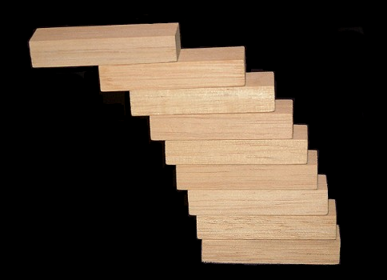
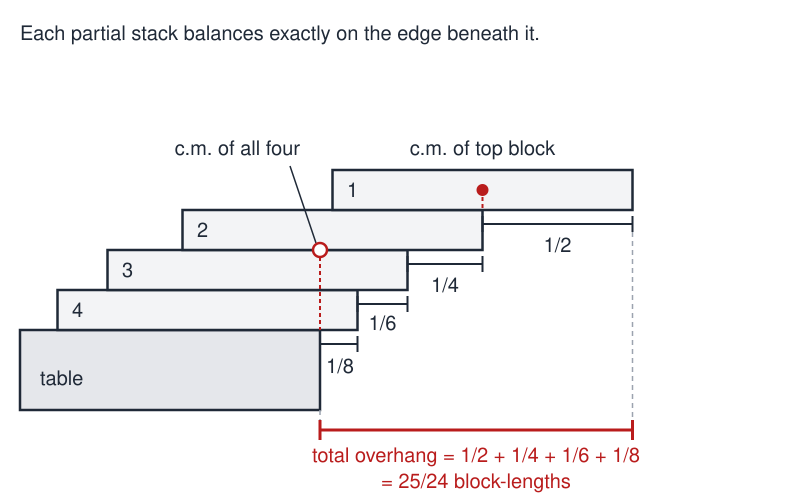

# Stacked Cantilevers Lab

 This work is licensed under a <a rel="license" href="http://creativecommons.org/licenses/by/4.0/">Creative Commons Attribution 4.0 International License</a>.

*[Section 5](../section5.md), session 24. The lab starts in session 24, continues in session 25 and closes in session 26, which also takes up [Summing a Series](summing-a-series.md) and [Stalactites](stalactites.md).*

!!! abstract "The problem"

    Reconstructed: the syllabus gives only the lab's name and schedule, so
    the setup and questions below are the editors'.

    You have many identical blocks (or books, or playing cards) and a table.
    Stack them one on another, the bottom block on the table, so that the
    pile leans out over the edge as far as it can without toppling. The
    *overhang* is the horizontal distance from the table edge to the far end
    of the top block, in block-lengths.

    1. Can the top block lie entirely beyond the table edge? With how few
       blocks?
    2. Can the overhang reach two block-lengths? Three? Is there any limit?
    3. Write down a rule for the best overhang with *n* blocks and test it
       against the class's pooled measurements.

    An early printed version is in William Walton's mechanics problem book
    of 1855: "A pack of cards is laid on a table; each projects in the
    direction of the length of the pack beyond the one below it: if each
    projects as far as possible, prove that the distances between the
    extremities of the successive cards will form an harmonic progression."

## Why it is in the course

This hands-on lab runs across three sessions. The syllabus schedules "Start
Stacked Cantilevers lab" for session 24, the last session of Section 4
(Patterns, Empirical Generalizations); "Further collaborations on Stacked
Cantilevers" for session 25, the day Chamberlin's *The Method of Multiple
Working Hypotheses* is due; and "Theory of stacking cantilevers, resolution
of wagers" for session 26.

That sequence walks from measurement to explanation. How the class ran it
is not recorded, so what follows is the editors' reading. One group's stacks
give noisy numbers, but, as the syllabus says of class meetings, "if we pool
data, reality will come into focus". With pooled data on the board, the next
step, in Chamberlin's spirit, is to hold several candidate rules at once:
does the overhang level off, or keep growing, and how fast? Wagers placed
before the theory force everyone to commit to an intuition, and the theory
then settles them.

## Where it comes from

The problem has been a statics exercise in British mechanics texts since at
least the mid-nineteenth century (Walton, 1855). Paul B. Johnson's note
"Leaning Tower of Lire" (1955) gave it its best-known nickname, and R. P.
Boas's "Cantilevered Books" (1973) is the published title closest to
Winfree's name for the lab. Gamow and Stern's *Puzzle-Math* (1958) and
Martin Gardner's *Scientific American* column of November 1964 made it
widely known; Paterson and Zwick (2009) trace the history.

{ width="560" }

*Photo by Anton (German Wikipedia user), derived from File:Harmonischebrueckerp.jpg; CC BY 2.5, via [Wikimedia Commons](https://commons.wikimedia.org/wiki/File:CantileverBlocks.png){target=_blank}.*

??? tip "Hints"

    - Start at the top. How far can one block stick out beyond the block it
      rests on? Where must its centre of mass be?
    - Treat the top *k* blocks as one rigid object: its combined centre of
      mass must lie above the block beneath. Find the best offsets for
      k = 1, 2, 3.
    - For the wagers, ask whether your offsets add up to something bounded
      as blocks are added. If the sum involves 1 + 1/2 + 1/3 + 1/4 + ...,
      group it as 1 + 1/2 + (1/3 + 1/4) + (1/5 + ... + 1/8) + ... and
      estimate each bracket.
    - If real stacks fall short of your rule, ask what it assumes about the
      blocks, and about how many blocks may rest on any one block.

??? success "Resolution"

    Number the blocks from the top. The top block's centre of mass is at its
    middle, so it can project 1/2 beyond block 2. With the top block at that
    brink, the centre of mass of the top two sits 1/4 in from block 2's outer
    end, so the pair can project 1/4 beyond block 3. In general, suppose the
    top *k* blocks have their combined centre of mass exactly over the outer
    end of block *k*+1. Block *k*+1's own centre of mass is 1/2 behind that
    end, so the centre of mass of all *k*+1 blocks is (1/2)/(*k*+1) behind
    it. That is how far those *k*+1 blocks can project beyond the block
    below. The offsets are 1/2, 1/4, 1/6, ..., 1/(2*n*), and with *n* blocks
    the overhang is

    (1/2)(1 + 1/2 + 1/3 + ... + 1/*n*)

    block-lengths: 1/2, 3/4, 11/12, 25/24, ... This is Walton's harmonic
    progression.

    { width="560" }

    *Drawn for this site (CC BY 4.0).*

    **The wagers.** With four blocks the top block already clears the table
    edge, by 1/24 of a block-length. Two block-lengths need 31 blocks (an
    overhang of 2.01362; 30 blocks give only 1.99749), and three need 227.
    There is no limit, because the harmonic series diverges: in the grouping
    1 + 1/2 + (1/3 + 1/4) + (1/5 + ... + 1/8) + ... each bracket is at least
    1/2. The growth is only very slow. Real stacks fall a little short,
    because every partial stack sits exactly on the brink.

    **The hidden assumption.** The formula is best only if each block rests
    on a single block. Allow counterweights and you can do better: four
    blocks can reach about 1.16789 block-lengths instead of 25/24 (Ainley,
    1979). Paterson and Zwick, after the course, showed that the overhang
    can then grow like the cube root of *n*.

## Sources

- **William Walton**, *A Collection of Problems in Illustration of the Principles of Theoretical Mechanics*, 2nd ed., Miscellaneous Problems no. 27, p. 183 (Cambridge: Deighton, Bell and Co., 1855) — [Internet Archive](https://archive.org/details/acollectionprob07waltgoog){target=_blank} 🔓
- **Paul B. Johnson**, "Leaning Tower of Lire", *American Journal of Physics* 23(4), 240 (1955) — [doi:10.1119/1.1933957](https://doi.org/10.1119/1.1933957){target=_blank} 🔒
- **George Gamow and Marvin Stern**, *Puzzle-Math* (1958) — [Internet Archive](https://archive.org/details/puzzlemath0000unse){target=_blank} 🔓 *(borrow)*
- **Martin Gardner**, *Martin Gardner's Sixth Book of Mathematical Games from Scientific American* (1971), pp. 167–169 — [Internet Archive](https://archive.org/details/martingardnerssi0000gard){target=_blank} 🔓 *(borrow)*
- **R. P. Boas**, "Cantilevered Books", *American Journal of Physics* 41(5), 715 (1973) — [doi:10.1119/1.1987341](https://doi.org/10.1119/1.1987341){target=_blank} 🔒
- **S. Ainley**, "Finely Balanced", *The Mathematical Gazette* 63(426), 272 (1979) — [doi:10.2307/3618049](https://doi.org/10.2307/3618049){target=_blank} 🔒
- **Mike Paterson and Uri Zwick**, "Overhang", *American Mathematical Monthly* 116(1), 19–44 (2009) — [arXiv:0710.2357](https://arxiv.org/abs/0710.2357){target=_blank} 🔓
- **Mike Paterson, Yuval Peres, Mikkel Thorup, Peter Winkler and Uri Zwick**, "Maximum Overhang", *American Mathematical Monthly* 116(9), 763–787 (2009) — [arXiv:0707.0093](https://arxiv.org/abs/0707.0093){target=_blank} 🔓
- **Eric W. Weisstein**, "Book Stacking Problem", MathWorld — [MathWorld](https://mathworld.wolfram.com/BookStackingProblem.html){target=_blank} 🔓 (the block counts 4, 31 and 227)
- **Robert M. Dickau**, "The Book-Stacking Problem" — [robertdickau.com](https://www.robertdickau.com/BookStacking.html){target=_blank} 🔓 (the 30- and 31-block overhangs)
- **Wikipedia contributors**, "Block-stacking problem" — [Wikipedia](https://en.wikipedia.org/wiki/Block-stacking_problem){target=_blank} 🔓
- **Arthur T. Winfree**, *The Art of Scientific Discovery*: original course syllabus — [PDF](https://github.com/tyson-swetnam/aosd/blob/main/docs/assets/aosd_syllabus.pdf){target=_blank} 🔓

!!! note "How sure are we that this is Winfree's problem?"

    The syllabus gives only the name and three session entries. It is
    probably the classical
    block-stacking problem: "stacked cantilevers" describes such a pile,
    Boas's title is close, the lab needs only blocks, and its theory is a
    divergent series that people bet against. Session 26 also lists Summing
    a Series, but as a separate item, so that is a hint, not proof. Other
    candidates:

    - A cantilever-building contest with mixed materials and bets on whose
      reaches farthest. It fits "wagers" but not "stacking".
    - The multi-wide version, with counterweight blocks: better treated as
      an extension, since its modern theory postdates the course.

---

*Back to [Section 5](../section5.md) · [All problems](index.md) · [The schedule](../syllabus.md#section-5-inferences-hypotheses-explanations)*
