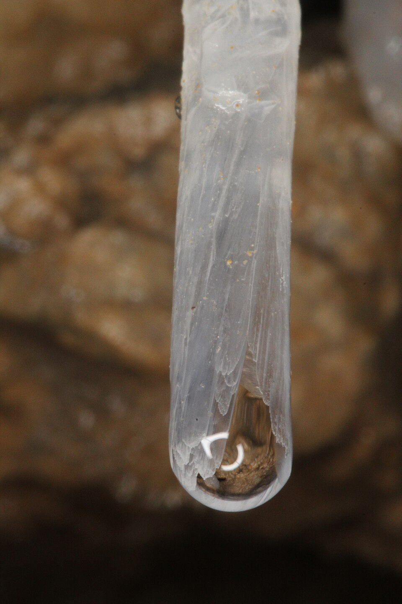

# Stalactites

 This work is licensed under a <a rel="license" href="http://creativecommons.org/licenses/by/4.0/">Creative Commons Attribution 4.0 International License</a>.

*[Section 5](../section5.md), session 26. The same session settles the theory and the wagers on [Stacked Cantilevers](stacked-cantilevers-lab.md) and deals with [Summing a Series](summing-a-series.md).*

!!! abstract "The problem"

    Reconstructed from the syllabus, which says only "deal with" stalactites;
    Winfree's own write-up is lost.

    Stone icicles (stalactites) hang from cave ceilings, dripping slowly, and
    blunt mounds (stalagmites) rise beneath them. Keep several working
    hypotheses alive at once.

    1. **Why is there stone at all?** Where does the limestone (calcium
       carbonate) come from, and what makes it leave the water on the
       ceiling? Give at least two mechanisms and a test for each.
    2. **Why that shape?** A young stalactite is a hollow tube a few
       millimetres across (a "soda straw"); an old one is a cone tapering to a
       tip; the stalagmite below is broader, with a rounded top. Explain each.
    3. **How old is it?** A metre-long stalactite drips once a minute.
       Estimate its age twice: from the drip rate and the mineral a drop could
       carry, and from any growth rate you can find or guess. Do they agree?
       Which assumption would you suspect first?
    4. **Turn it around.** Could the thickness of a stalagmite floor date the
       bones buried beneath it?

{ width="560" }

*Drawn for this site (CC BY 4.0). Schematic, not to scale.*

{ width="560" }

*A soda straw with a drop at its tip, Oregon Caves National Monument. Oregon Caves (National Park Service) photograph, CC BY 2.0, via Wikimedia Commons.*

## Why it is in the course

Section 5 is "Inferences, Hypotheses, Explanations", and session 25 assigns
Chamberlin's *The Method of Multiple Working Hypotheses*, an essay by a
geologist. A stalactite suits that lesson: nobody is an expert, and the first
explanation most people reach for, that the water dries up, is at best
incomplete.

The age question adds a second lesson: an inference is only as good as its
assumptions. Two honest estimates can disagree wildly; finding the guilty assumption is
the exercise. In the syllabus's words, "The purpose of the
puzzles (many of them silly) is to slow you down for a few minutes so you can
examine the working of your own mind."

## Where it comes from

Dating by growth has an instructive history. At Ingleborough Cave in
Yorkshire, James Farrer measured a stalagmite called the Jockey Cap in 1839
and 1845, and John Phillips put its age at 259 years, assuming that all or nearly all
the lime in the dripping water was deposited. In 1873 William Boyd Dawkins measured it
again: the gap to the roof had closed from 95.25 to 87 inches, about 0.29
inch a year. At that rate, he noted, it might be no more than 100 years old.
He concluded that "the present
rate of growth is not a measure of its past or future condition" (*Cave
Hunting*, 1874).

The shape was explained mathematically only in 2005, by Martin Short, Raymond
Goldstein and four colleagues: five of the six worked at the University of
Arizona, one at Kartchner Caverns State Park. Their growth law draws a broad range of starting shapes
toward one ideal profile, close to the average of real stalactites.

??? tip "Hints"

    - Separate what you are sure of (stone hangs; water drips) from what you
      assume (the water dries up; the drip never changed).
    - Fizzy water left standing loses something. Compare soil air with cave
      air.
    - Watch a drop hang from a tap. Where would a deposit be left?
    - For the age, write the chain: drops per year, mineral per drop, mineral
      in the stalactite. Each link is a hypothesis.
    - If your estimates differ tenfold, do not average them. Ask what the
      drop does after it leaves the tip.

??? success "Resolution"

    **Why stone forms.** Rain picks up carbon dioxide in the soil and
    dissolves limestone on the way down. Cave air holds far less carbon
    dioxide, so the gas escapes from a hanging drop and calcium carbonate
    comes out of solution. To test "it evaporates", look at a cold, damp,
    still cave: stalactites still grow there.

    **Why the shape.** Each drop leaves a thin ring of calcite at its rim,
    and ring on ring builds the soda straw, about 4 to 5 mm across. When the
    tube plugs or water runs down the outside, the cone thickens where more
    water has passed. Drops splash and spread on the floor, so the stalagmite
    has no canal, is wider, and is rounded.

    **How old.** The routes disagree, which is the point. Growth rates alone
    give about 300 years at a fast 3 mm a year, 8,000 at the average 0.13 mm,
    and 60,000 at the sixteenth of an inch per century quoted at Kartchner
    Caverns. If every drop (about 530,000 a year) left its whole
    load, the cone would form in centuries, far faster than the average
    rate allows. That convicts the assumption that all the mineral stays
    on the stalactite: much is carried to the floor, and drip rate and
    chemistry change over time. Phillips's 259 years also came from one
    calculation that assumed complete deposition; Dawkins's re-measurement
    gave a different age, and he warned that the present rate is not a
    measure of the past. (Rough illustrations only.)

    **Turn it around.** Not by thickness alone, as Dawkins warned. Modern
    dating measures uranium-thorium or radiocarbon in the calcite itself.

## Sources

- **Wikipedia contributors**, "Stalactite" — [Wikipedia](https://en.wikipedia.org/wiki/Stalactite){target=_blank} 🔓 (soda-straw diameter; growth rates)
- **U.S. National Park Service**, "Speleothems" — [nps.gov](https://www.nps.gov/subjects/caves/speleothems.htm){target=_blank} 🔓 (carbon-dioxide loss; hollow tubes; stalagmite shape)
- **Wikipedia contributors**, "Soda straw" — [Wikipedia](https://en.wikipedia.org/wiki/Soda_straw){target=_blank} 🔓 (ring deposition at the drop's edge)
- **Wikipedia contributors**, "Kartchner Caverns State Park" — [Wikipedia](https://en.wikipedia.org/wiki/Kartchner_Caverns_State_Park){target=_blank} 🔓 (growth rate)
- **W. Boyd Dawkins**, *Cave Hunting* (1874), pp. 39–40 and Appendix II — [Internet Archive](https://archive.org/details/cavehuntingrese01dawkgoog){target=_blank} 🔓
- **M. B. Short, J. C. Baygents, J. W. Beck, D. A. Stone, R. S. Toomey III and R. E. Goldstein**, "Stalactite Growth as a Free-Boundary Problem: A Geometric Law and Its Platonic Ideal", *Physical Review Letters* 94, 018501 (2005) — [doi:10.1103/PhysRevLett.94.018501](https://doi.org/10.1103/PhysRevLett.94.018501){target=_blank} 🔒
- **M. B. Short, J. C. Baygents and R. E. Goldstein**, "Stalactite growth as a free-boundary problem", *Physics of Fluids* 17, 083101 (2005) — [doi:10.1063/1.2006027](https://doi.org/10.1063/1.2006027){target=_blank} 🔒
- **Oregon Caves (National Park Service)**, "Soda Straw Formation", CC BY 2.0 — [Wikimedia Commons](https://commons.wikimedia.org/wiki/File:Soda_Straw_Formation_(9940650705).jpg){target=_blank} 🔓
- **Arthur T. Winfree**, *The Art of Scientific Discovery* (ECOL 479/579): course handout, archived 20 April 2002 — [Wayback Machine](https://web.archive.org/web/20020420212713/http://eebweb.arizona.edu/Faculty/Winfree/handout_479.htm){target=_blank} 🔓
- **Arthur T. Winfree**, *The Art of Scientific Discovery*: original course syllabus — [PDF](https://github.com/tyson-swetnam/aosd/blob/main/docs/assets/aosd_syllabus.pdf){target=_blank} 🔓

!!! note "How sure are we that this is Winfree's problem?"

    The topic is certain; the questions are not. The syllabus and archived
    handout give only "deal with stalactites"; the 2005 Arizona theory
    postdates the course and has no documented link to it. Candidates:

    - **Explain the phenomenon** (medium; used above): rival hypotheses for
      formation and shape.
    - **Estimate the age** (medium): expose the hidden assumptions, as
      Dawkins's re-measurement did for Phillips's estimate.
    - **A mathematical calculation** (low): the session's other items are
      mathematical.
    - **Pattern formation** (low): why dripping films produce one shape.

---

*Back to [Section 5](../section5.md) · [All problems](index.md) · [The schedule](../syllabus.md#section-5-inferences-hypotheses-explanations)*
