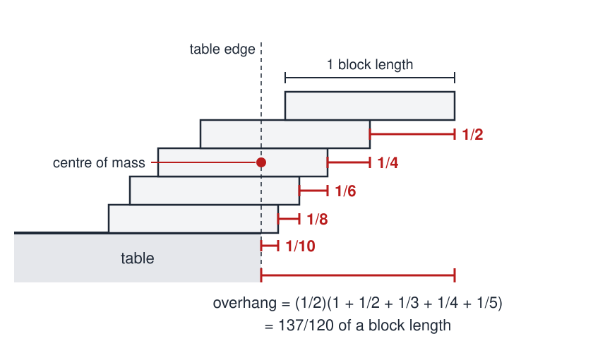
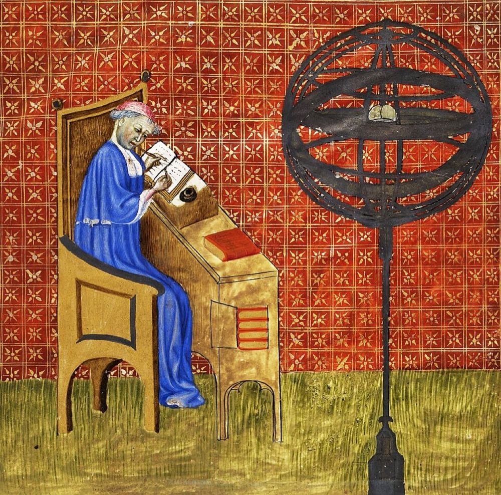

# Summing a Series

 This work is licensed under a <a rel="license" href="http://creativecommons.org/licenses/by/4.0/">Creative Commons Attribution 4.0 International License</a>.

*[Section 5](../section5.md), session 26. The same session works out the theory of the [Stacked Cantilevers](stacked-cantilevers-lab.md) lab and takes up [Stalactites](stalactites.md).*

!!! abstract "The problem"

    *Reconstructed from the syllabus, which says only "Deal with Summing a
    Series", in the session on the theory of stacking cantilevers. The
    series below is the one that theory produces.*

    **The stack.** Identical uniform blocks, one unit long, are piled at a
    table edge, each resting on exactly one block below, with no glue and
    no counterweights. How far beyond the edge can the top block reach?
    Find the largest overhang for *n* blocks.

    **The series.** Show that the answer is half of
    S(*n*) = 1 + 1/2 + 1/3 + ... + 1/*n*. Then deal with this series.

    - How many blocks give an overhang of one full block length? Of two?
    - The terms shrink toward zero. Does the sum approach a limit, or pass
      any number you name? Prove your answer by more than one route.
    - Roughly how fast does S(*n*) grow? Estimate how many blocks an
      overhang of ten block lengths would need.
    - Compare 1 + 1/2 + 1/4 + 1/8 + ... and 1 + 1/4 + 1/9 + 1/16 + ...
      What is different?

    **The wager.** Had you bet on how far a stack could reach, which bets
    win, and what hidden assumption did each side rely on?

{ width="560" }

*Five blocks stacked one on one; the centre of mass of the whole stack sits exactly above the table edge. Drawn for this site (CC BY 4.0).*

## Why it is in the course

Section 5 is "Inferences, Hypotheses, Explanations". Session 26 opens with
"Theory of stacking cantilevers, resolution of wagers", after two sessions of
the Stacked Cantilevers lab. If that lab stacked real blocks, as seems
likely, the theory turns the stacks into a series, and whether the series
has a limit settles the bets.

It is a model case for the section. The first few terms, even the first few
thousand, point the wrong way, and only an argument can decide. It also uses
habits from earlier sessions: [Sums of Integers](sums-of-integers.md) ("like
a jig-saw puzzle of cross-checks") and session 04's "distinguishing things we
know vs only imagine". And it shows how easily an inference overreaches: a
2005 paper in the *American Journal of Physics* improved the stack, then
concluded wrongly that nothing better was possible.

## Where it comes from

The overhang puzzle appears in nineteenth-century mechanics textbooks (Phear,
1850; Walton, 1855). It was posed in the *American Mathematical Monthly* in
1923. It resurfaced in Paul B. Johnson's note "Leaning Tower of Lire"
(*American Journal of Physics*, 1955) and became widely known through Martin
Gardner's *Scientific American* column of November 1964, "Some paradoxes and puzzles
involving infinite series and the concept of limit", reprinted in his *Sixth
Book of Mathematical Games* (1971).

The series, 1 + 1/2 + 1/3 + ..., is the harmonic series. Whether it has a
finite total was settled around 1350-1360 by the Paris scholar Nicole Oresme.
His argument was forgotten, then found again by Pietro Mengoli (1650) and by
Jacob and Johann Bernoulli (1689).

{ width="560" }

*Nicole Oresme at his studies, miniature from his* Traité de l'espère *(c. 1400-1420), Bibliothèque nationale de France, via Wikimedia Commons. Public domain.*

??? tip "Hints"

    - Start from the top. Where must the centre of mass of the top *k*
      blocks lie relative to block *k* + 1?
    - Tabulate S(*n*) for *n* = 1 to 10 and plot it against log *n*.
    - To decide about a limit, stop computing terms. Group them in blocks of
      2, 4, 8, 16, ... and bound each block from below.
    - For a second route, compare 1/*k* with the area under y = 1/x from
      x = *k* to x = *k* + 1.
    - For the wager, list every assumption in the theory. Which could be
      dropped?

??? success "Resolution"

    **The stack.** The top *k* blocks together can project 1/(2*k*) beyond
    the block below them (or the table), so *n* blocks reach
    (1/2)(1 + 1/2 + ... + 1/*n*). Four blocks give 25/24, clearing the edge
    entirely; two block lengths need 31 blocks, three need 227.

    **The series.** It has no limit. Oresme grouped the terms:
    1/3 + 1/4 > 1/2, 1/5 + ... + 1/8 > 1/2, and each later group of 8, 16,
    32, ... terms adds more than 1/2, so the sum passes any number. The
    area comparison agrees, ln(*n* + 1) < S(*n*) ≤ 1 + ln *n*, and shows
    how slowly it grows: S(*n*) first exceeds 10 at *n* = 12,367, and an
    overhang of ten block lengths needs about 272 million blocks. By
    contrast 1 + 1/2 + 1/4 + ... = 2 and 1 + 1/4 + 1/9 + ... = π²/6.
    Terms going to zero is necessary for a finite sum, not sufficient.

    **The wagers.** A bet that the overhang is bounded loses in principle
    but wins in practice: the offsets soon shrink below the imperfections of
    real blocks. A bet that the top block cannot clear the edge loses at
    four blocks. And one-on-one stacking is an assumption, not a law. With
    counterweights, four blocks reach about 1.168 (Ainley, 1979). John F.
    Hall (2005) showed that counterweights asymptotically double the
    harmonic overhang, then inferred wrongly that no further gain was
    possible. Paterson and Zwick (2006) built stacks whose overhang grows
    like the cube root of *n*, exponentially further than the one-on-one
    stack's roughly (1/2) ln *n*. In 2009 Paterson, Peres, Thorup, Winkler
    and Zwick proved that order is the true one.

## Sources

- **Wikipedia contributors**, "Block-stacking problem" — [Wikipedia](https://en.wikipedia.org/wiki/Block-stacking_problem){target=_blank} 🔓
- **Wikipedia contributors**, "Harmonic series (mathematics)" — [Wikipedia](https://en.wikipedia.org/wiki/Harmonic_series_%28mathematics%29){target=_blank} 🔓 (Oresme's grouping proof, Mengoli, the Bernoullis, the growth rate)
- **Wikipedia contributors**, "Nicole Oresme" — [Wikipedia](https://en.wikipedia.org/wiki/Nicole_Oresme){target=_blank} 🔓
- **Eric W. Weisstein**, "Book Stacking Problem", MathWorld — [MathWorld](https://mathworld.wolfram.com/BookStackingProblem.html){target=_blank} 🔓 (the overhang formula and the counts 4, 31 and 227)
- **Mike Paterson, Yuval Peres, Mikkel Thorup, Peter Winkler and Uri Zwick**, "Maximum Overhang", *American Mathematical Monthly* 116(9), 763–787 (2009) — [arXiv:0707.0093](https://arxiv.org/abs/0707.0093){target=_blank} 🔓 (history of the puzzle from 1850, Ainley 1979, Hall 2005)
- **Mike Paterson and Uri Zwick**, "Overhang", *American Mathematical Monthly* 116(1), 19–44 (2009), first presented at SODA 2006 — [arXiv:0710.2357](https://arxiv.org/abs/0710.2357){target=_blank} 🔓
- **Paul B. Johnson**, "Leaning Tower of Lire", *American Journal of Physics* 23(4), 240 (1955) — [doi:10.1119/1.1933957](https://doi.org/10.1119/1.1933957){target=_blank} 🔒
- **John F. Hall**, "Fun with stacking blocks", *American Journal of Physics* 73(12), 1107–1116 (2005) — [doi:10.1119/1.2074007](https://doi.org/10.1119/1.2074007){target=_blank} 🔒
- **Martin Gardner**, "Some paradoxes and puzzles involving infinite series and the concept of limit", *Scientific American*, November 1964, 126–133 — [index of Gardner's columns](https://en.wikipedia.org/wiki/List_of_Martin_Gardner_Mathematical_Games_columns){target=_blank} 🔓 (the link is Wikipedia's index, not the column, which is not freely online)
- **Martin Gardner**, *Martin Gardner's Sixth Book of Mathematical Games from Scientific American* (1971), chapter 17, "Limits of Infinite Series" — [Internet Archive](https://archive.org/details/martingardnerssi0000gard){target=_blank} 🔓 *(borrow)*
- **Arthur T. Winfree**, *The Art of Scientific Discovery*: original course syllabus — [PDF](https://github.com/tyson-swetnam/aosd/blob/main/docs/assets/aosd_syllabus.pdf){target=_blank} 🔓

!!! note "How sure are we that this is Winfree's problem?"

    Probable, not certain. The syllabus gives only the name, in session 26,
    beside the theory of stacking cantilevers and Stalactites. No surviving
    Winfree document names the series. Three readings:

    - **The harmonic series from the block stack** (likeliest): the
      classical theory of the stack is exactly this series, and whether the
      overhang is bounded is the natural wager.
    - **A separate cross-checking exercise** on some series, summed by
      several independent routes in the manner of session 12. This is
      compatible with the first reading.
    - **Paradoxes of infinite series**, such as 1/2 + 1/4 + 1/8 + ... = 1.
      Gardner's 1964 column treats these together with the block stack, but
      there is no direct evidence.

---

*Back to [Section 5](../section5.md) · [All problems](index.md) · [The schedule](../syllabus.md#section-5-inferences-hypotheses-explanations)*
