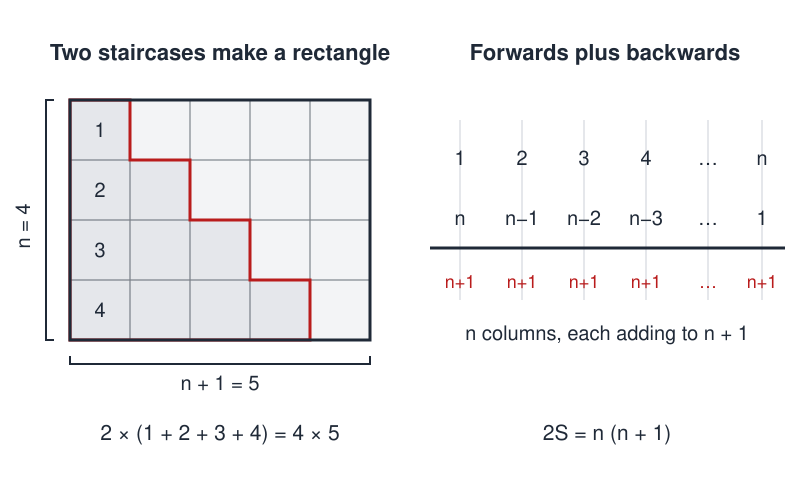
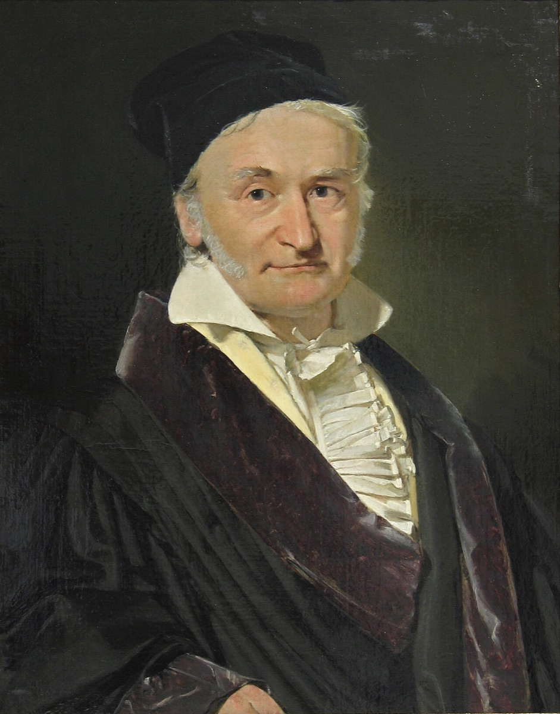

# Sums of Integers

 This work is licensed under a <a rel="license" href="http://creativecommons.org/licenses/by/4.0/">Creative Commons Attribution 4.0 International License</a>.

*[Section 2](../section2.md), session 12. The syllabus sets it beside the [Pedestrian Crosswalk Mystery](pedestrian-crosswalk-mystery.md) lab.*

!!! abstract "The problem"

    Reconstructed from the syllabus: Winfree left only the name of this problem and a gloss, "like a jig-saw puzzle of cross-checks". No handout for it has been found. What follows is the elementary exercise that name most plausibly points to, framed the way the course framed everything else: the point is not the answer but how many independent routes you can find to it, and how those routes check one another.

    **Part 1.** Find a formula for the sum of the first *n* positive integers, S(*n*) = 1 + 2 + 3 + ... + *n*, and convince yourself it is right. Do not stop at one argument. Find as many genuinely different ways as you can: arithmetic, pictorial, algebraic, inductive, whatever occurs to you. Treat each as a jig-saw piece and check that every piece fits every other. The same formula must come out; it must give the right values for *n* = 1, 2, 3, 4, computed by hand; and it must behave sensibly at *n* = 0.

    **Part 2.** Do the same for the sums of squares and of cubes, 1&#178; + 2&#178; + ... + *n*&#178; and 1&#179; + 2&#179; + ... + *n*&#179;. Before deriving anything, decide what *kind* of formula to expect (a polynomial in *n*? of what degree?) and how you would test a guess. Then look for relations between the three sums that let one formula check another.

    **Part 3 (extension).** Some numbers are a sum of two or more *consecutive* positive integers (9 = 4 + 5 = 2 + 3 + 4) and some are not (try 8). Which are which, and in how many ways? Make a table, guess a rule, then find at least two independent arguments for it.

    Keep a record in your GamesWorth book of every route you tried, including the ones that failed, and of every cross-check that caught a slip.

{ width="560" }

*Two of the routes, and the cross-check between them: the picture and the arithmetic must give the same formula. Drawn for this site (CC BY 4.0).*

## Why it is in the course

Winfree's gloss names the lesson. A jig-saw piece is confirmed not by staring at it harder but by whether it fits its neighbours, and a derived formula is confirmed the same way: by agreeing with hand-computed small cases, with a second derivation, with a picture, and with an identity that ties it to some other formula. The syllabus asks for that habit everywhere. The final exam rewards "as many cross-checking distinct solutions as you can", and graduate write-ups must show "ways to check and cross-check every part of the solutions".

Session 12 closes Section 2, "Creative Blocks", after Adams's chapters on perceptual, emotional, cultural and intellectual blocks and his chapter on blockbusters. A problem whose one-line answer almost everyone half-remembers is a good place to catch the intellectual block of stopping at the first method that works. The readings due that day push from another direction: Dyson on unfashionable pursuits and Narlikar on venture funding are both about the value of a route nobody else is taking.

The exercise also fits the course's stated design. Its problems "depend as little as possible on knowledge of any particular subject area", are "mostly made from elementary mathematics so as to require no lab setup", and exist "to slow you down for a few minutes so you can examine the working of your own mind".

## Where it comes from

The formula *n*(*n* + 1)/2 is ancient. The triangular numbers 1, 3, 6, 10, ... are usually traced to the Pythagoreans, and a statement of the rule appears in the *Computus* of the Irish monk Dicuil around 816; both attributions come from a secondary overview. Nicomachus of Gerasa (c. 60 &ndash; c. 120 CE) noticed that grouping the odd numbers 1, 3 + 5, 7 + 9 + 11, ... produces the cubes, which yields the identity now named after him. Johann Faulhaber (1631) computed formulas for the sums of higher powers one by one, and Jacob Bernoulli systematised them in *Ars Conjectandi* (1713), where the Bernoulli numbers first appear. Faulhaber also claimed, without proof, that such formulas exist for all odd powers. Carl Jacobi proved that claim in 1834.

{ width="560" }

*Christian Albrecht Jensen, portrait of Carl Friedrich Gauss (1840). Public domain, via Wikimedia Commons.*

The story everyone tells about this sum repays the course's own treatment. Brian Hayes went back to the memorial volume *Gauss zum Gedächtniss* (1856), written by Wolfgang Sartorius von Waltershausen the year after Gauss died, and calls it "the key document on which all subsequent accounts seem to depend". In that account the schoolmaster sets the class an arithmetic series to sum, and Gauss throws his slate on the table almost at once with the words "There it lies" (the English is Helen Worthington Gauss's translation of his Braunschweig dialect). What matters about this telling, Hayes says, "is not what's there but what's absent": no numbers 1 to 100, no pairing trick, no formula. Those arrived later, from retellers. Hayes collected "over a hundred exemplars, in eight languages", diverging in nearly every detail. A story we all know, most of which nobody recorded, is exactly the sort of thing this course asks you to notice.

The Part 3 extension has its own literature: J. J. Sylvester touched it in 1882, W. J. LeVeque studied it in 1950, and Robert Guy gave a short proof of the counting rule in 1982.

??? tip "Hints"

    - Write the sum forwards and backwards and add the two rows term by term. Every column then holds the same number. Count the columns.
    - Draw 1 + 2 + ... + *n* as a staircase of dots. Two identical staircases fit together into a rectangle; what are its sides? For squares, try three copies of a suitable three-dimensional staircase, or Nicomachus's grouping of the odd numbers.
    - Before deriving, decide what kind of formula to expect. Tabulate the sum for *n* = 1 to 6 and take successive differences; when the differences go constant you know the degree, and a handful of small cases then fixes the polynomial. Any other derivation must reproduce exactly that polynomial.
    - Hunt for identities that tie the sums together: the sum of the first *n* odd numbers, two consecutive triangular numbers, the relation between the cube sum and the plain sum. Each identity is a cross-check that costs nothing.
    - For the extension, notice that a sum of *k* consecutive integers is *k* times its average. Ask what that says when *k* is odd, then when *k* is even, then what could go wrong for powers of two.

??? success "Resolution"

    **Part 1.** S(*n*) = *n*(*n* + 1)/2. Independent routes, each a check on the others:

    - *Pairing.* Forwards plus backwards gives *n* columns each summing to *n* + 1, so 2S = *n*(*n* + 1). This is the trick traditionally credited to the schoolboy Gauss, though not by any early source.
    - *Staircase.* Two dot staircases fit into an *n* by (*n* + 1) rectangle.
    - *Finite differences.* S(*n*) &minus; S(*n* &minus; 1) = *n* is linear, so S is quadratic; three values fix it.
    - *Telescoping.* (*k* + 1)&#178; &minus; *k*&#178; = 2*k* + 1, summed from 1 to *n*, gives (*n* + 1)&#178; &minus; 1 = 2S + *n*.
    - *Induction.* Check *n* = 1, assume the formula, add *n* + 1.

    Checks: S(0) = 0, S(1) = 1, S(4) = 10, and S(*n*) + S(*n* &minus; 1) = *n*&#178;, so two consecutive triangular numbers make a square.

    **Part 2.** The squares sum to *n*(*n* + 1)(2*n* + 1)/6 and the cubes to *n*&#178;(*n* + 1)&#178;/4, which is S(*n*)&#178;.

    - *Degree.* Third differences of the square sum are constant, so it is a cubic; the cube sum is a quartic. Fit with small cases: 1, 5, 14, 30 and 1, 9, 36, 100.
    - *Telescoping.* (*k* + 1)&#179; &minus; *k*&#179; = 3*k*&#178; + 3*k* + 1 summed gives (*n* + 1)&#179; &minus; 1 = 3(square sum) + 3S + *n*, so one formula delivers the next. Fourth powers give the cube sum the same way.
    - *Nicomachus.* Odd numbers grouped 1 | 3 + 5 | 7 + 9 + 11 | ... give the cubes, so the cube sum is the sum of the first S(*n*) odd numbers, that is S(*n*)&#178;. This is the piece you could not have guessed from degrees alone, and it locks the picture together.
    - *Pictures.* Three copies of the stack of squares, as unit cubes, rearrange into a box of sides *n*, *n* + 1 and *n* + &#189;.

    Checks: the square sums 1, 5, 14 at *n* = 1, 2, 3; the cube sum at *n* = 3 is 36 = 6&#178; = S(3)&#178;; every formula gives 0 at *n* = 0.

    **Part 3.** A positive integer is a sum of two or more consecutive positive integers exactly when it is not a power of two, and the number of such representations is the number of its odd divisors greater than one. Sketch: a sum of *k* &ge; 2 consecutive integers starting at *a* &ge; 1 equals *k*(2*a* + *k* &minus; 1)/2. The factors *k* and 2*a* + *k* &minus; 1 have opposite parity, so exactly one is odd, and that odd one exceeds 1. Each representation thus gives an odd divisor *d* > 1, and each odd divisor *d* > 1 gives back exactly one representation: write N = *dm*, and take *k* = *d* if *d* < 2*m*, otherwise *k* = 2*m*. Powers of two have no odd divisor above one.

    Cross-check: 15 = 7 + 8 = 4 + 5 + 6 = 1 + 2 + 3 + 4 + 5 (odd divisors 3, 5, 15); 9 = 4 + 5 = 2 + 3 + 4 (odd divisors 3, 9); 8 has none. Guy counts the one-term representation as well, so his totals include the divisor 1.

## Sources

- **Arthur T. Winfree**, *The Art of Scientific Discovery*, ECOL 479/579 handout and schedule (2001), Wayback Machine capture of 20 April 2002 — [web.archive.org](https://web.archive.org/web/20020420212713/http://eebweb.arizona.edu:80/Faculty/Winfree/handout_479.htm){target=_blank} 🔓
- **Brian Hayes**, "Gauss's Day of Reckoning", *American Scientist* 94(3), 200-205 (2006) — [americanscientist.org](https://www.americanscientist.org/article/gausss-day-of-reckoning){target=_blank} 🔓
- **Wolfgang Sartorius von Waltershausen**, *Gauss zum Gedächtniss* (Leipzig: S. Hirzel, 1856) — [Internet Archive](https://archive.org/details/bub_gb_h_Q5AAAAcAAJ){target=_blank} 🔓
- **Wikipedia contributors**, "Triangular number" — [en.wikipedia.org](https://en.wikipedia.org/wiki/Triangular_number){target=_blank} 🔓
- **Wikipedia contributors**, "Squared triangular number (Nicomachus's theorem)" — [en.wikipedia.org](https://en.wikipedia.org/wiki/Squared_triangular_number){target=_blank} 🔓
- **Wikipedia contributors**, "Faulhaber's formula" — [en.wikipedia.org](https://en.wikipedia.org/wiki/Faulhaber%27s_formula){target=_blank} 🔓
- **Eric W. Weisstein**, "Power Sum", MathWorld — [mathworld.wolfram.com](https://mathworld.wolfram.com/PowerSum.html){target=_blank} 🔓
- **Wikipedia contributors**, "Polite number" — [en.wikipedia.org](https://en.wikipedia.org/wiki/Polite_number){target=_blank} 🔓
- **Robert Guy**, "Sums of Consecutive Integers", *The Fibonacci Quarterly* 20(1), 36-38 (1982) — [fq.math.ca](https://www.fq.math.ca/Scanned/20-1/guy.pdf){target=_blank} 🔓
- **W. J. LeVeque**, "On Representations as a Sum of Consecutive Integers", *Canadian Journal of Mathematics* 2, 399-405 (1950) — [doi.org](https://doi.org/10.4153/cjm-1950-036-3){target=_blank} 🔒
- **J. J. Sylvester**, with insertions by F. Franklin, "A Constructive Theory of Partitions, Arranged in Three Acts, an Interact and an Exodion", *American Journal of Mathematics* 5, 251-330 (1882) — [doi.org](https://doi.org/10.2307/2369545){target=_blank} 🔒
- **Arthur T. Winfree**, *The Art of Scientific Discovery*, original course syllabus — [PDF](https://github.com/tyson-swetnam/aosd/blob/main/docs/assets/aosd_syllabus.pdf){target=_blank} 🔓

!!! note "How sure are we that this is Winfree's problem?"

    The syllabus gives one line for session 12: the name of the problem, then "like a jig-saw puzzle of cross-checks". The archived copy of Winfree's own course page carries the same line and nothing more. No handout, no column and no other document describing the exercise has been found, so the page above is a reconstruction from the name, the gloss and the course's stated habits. That is why the identification is *probable* rather than *confident*. One further caution: the same syllabus schedules [Summing a Series](summing-a-series.md) separately at session 26, so Winfree evidently had more than one series exercise, and this one may have been narrower.

    The candidates the editors weighed:

    - **Power sums by many routes** (the version written above): formulas for 1 + 2 + ... + *n* and for the sums of squares and cubes, derived several independent ways so that each checks the others. It matches the name, matches the gloss, matches Winfree's repeated demand for "as many cross-checking distinct solutions as you can", and needs only elementary mathematics.
    - **Sums of consecutive integers**: which numbers can be written as a sum of two or more consecutive positive integers, and in how many ways. Also literally "sums of integers", and also a puzzle whose partial results must fit together, but Winfree wrote "integers", not "consecutive integers". It is offered above as Part 3 so that either reading is served.
    - **Some undocumented arithmetic puzzle of his own**, built on integer sums with deliberately redundant clues to be checked against each other. Winfree liked puzzles with hidden traps, but no candidate text was found, so this remains speculation.

    One loose end. Winfree's archived site has a page titled ["How to use this in ASD"](https://web.archive.org/web/20030114050407/http://eebweb.arizona.edu/faculty/winfree/Associativity.htm){target=_blank} 🔓, in which ten numbers added forwards and backwards by computer give different sums. Its subject would suit this session or session 06, on ways to check for errors; reading it into either is an inference from the title, not a documented fact.

---

*Back to [Section 2](../section2.md) · [All problems](index.md) · [The schedule](../syllabus.md#section-2-creative-blocks)*
