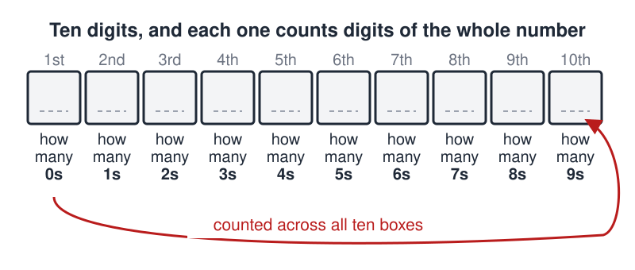
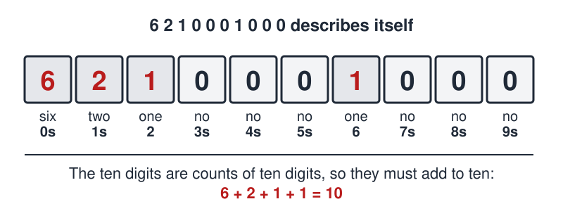

# Telltale Number

 This work is licensed under a <a rel="license" href="http://creativecommons.org/licenses/by/4.0/">Creative Commons Attribution 4.0 International License</a>.

*[Section 2](../section2.md), session 8. The syllabus sets it for the day of [The Barometer Story](barometer-story.md) and Adams's chapter on emotional blocks, with the note "About assumptions and [Tying Knots](tying-knots.md)".*

!!! abstract "The problem"

    Write down a ten-digit number with this property: its first (leftmost) digit tells how many zeros appear in the whole number, its second digit tells how many ones, its third digit how many twos, and so on, until the tenth digit tells how many nines.

    In other words, label the ten positions 0, 1, 2, ..., 9 from left to right. The digit sitting in position *k* must equal the number of times the digit *k* occurs anywhere in the number, counting its own position too.

    There is exactly one such ten-digit number. Find it, and be able to say why there is no other. Before you start filling in digits at random, ask what the wording forces to be true of every such number.

    A note on the wording: Winfree's archived course handout names the puzzle but never states it, and of the original, in James F. Fixx's *Solve It!* (1978), only the opening clause is readable ("Write a ten-digit number so that the first digit tells ..."). The three paragraphs above are our own reconstruction, checked against the puzzle as it circulates today; the instruction to prove that the answer is unique is our addition.

{ width="560" }

*The shape of the puzzle: ten boxes, each of which reports on all ten. Drawn for this site (CC BY 4.0).*

## Why it is in the course

Session 8 is the second meeting of Section 2, "Creative Blocks", and the reading due that day is Chapter 3 of James L. Adams's *Conceptual Blockbusting*, on emotional blocks: fear of making a mistake, an inability to tolerate ambiguity, the urge to judge an idea before it is finished, and the refusal to let a problem incubate. The Telltale Number exercises all four at once.

The puzzle is unpleasant at first sight, and that is the point. It looks circular, because every digit depends on all the others, and it looks hopeless, because there are ten billion ten-digit strings to sift. The two natural responses are paralysis and frantic guessing, which are the emotional blocks Adams describes, arriving on cue. Winfree's note for the session, "About assumptions", points at the exit. The assumption worth examining is not about the digits; it is your own assumption that searching is the only way in.

One unstated fact does the work. Find it and ten billion cases collapse into a few lines of reasoning; the puzzle's title is itself a hint that a single telltale feature gives the whole thing away. The syllabus describes the purpose of these exercises plainly: "The purpose of the puzzles (many of them silly) is to slow you down for a few minutes so you can examine the working of your own mind." What is worth writing in your GamesWorth book is not the number but the minute in which you stopped guessing.

## Where it comes from

The ten-digit self-describing number is a staple of recreational mathematics from the 1970s. James F. Fixx (1932-1984), a Mensa member far better known for *The Complete Book of Running*, published three puzzle collections with Doubleday, and the third, *Solve It!* (1978), carries this one as item 8 under exactly the name Winfree used. Full-text search inside the scanned copies returns the snippet with its running head: "50 SOLVE IT! 8. The Telltale Number Write a ten-digit number so that the first digit tells ...". That is most likely where Winfree found both the puzzle and the name.

The book is lending-restricted, so only that opening clause is readable, and Fixx's answer pages are not indexed at all. The answer below therefore rests on the later sources and on exhaustive computation, not on Fixx.

Martin Gardner posed the same puzzle in *Mathematical Circus* (Knopf, 1979) as problem 7; Tanya Khovanova reports that in discussing the answer Gardner mentions the name "tally numbers" for such numbers, and she generalized the idea in 2008 to the "biographies" of numbers. MathWorld cites Clifford Pickover's *Keys to Infinity* (1995), Chapter 28, for the same number, and the On-Line Encyclopedia of Integer Sequences carries the whole family as A046043, "autobiographical numbers", each entry written in the base equal to its own number of digits. Who first invented the puzzle is not recorded in any source found.

Winfree's own pages add nothing. The archived copy of his course handout, the document transcribed here as the syllabus, carries the session-8 line and no statement, hint or answer for the puzzle; the other item on that line, [Tying Knots](tying-knots.md), is undocumented, so what he did with it in class remains an open question.

??? tip "Hints"

    - Every digit in the number is a count of something, and the ten things being counted are the ten digits of the number itself. What, then, must the ten digits add up to?
    - That sum forces most of the digits to be zero. So the first digit, the count of zeros, must be fairly large. What does a large first digit imply about the digit sitting in the position with that same label?
    - Can any digit larger than 2 appear anywhere except in the first position? Can any digit larger than 2 appear twice?
    - Work down from the largest possible first digit (9, then 8, then 7 ...) and see how quickly each case contradicts itself.
    - If ten digits feel like too many, solve the same puzzle for four-digit and five-digit numbers first: a four-digit number whose digits count its zeros, ones, twos and threes. The pattern carries over.

??? success "Resolution"

    The unique answer is **6 2 1 0 0 0 1 0 0 0**. It contains six zeros, two ones, one two and one six, and no threes, fours, fives, sevens, eights or nines, which is exactly what its digits claim.

    { width="560" }

    *The answer, checked against itself. Drawn for this site (CC BY 4.0).*

    Why it is the only one. Call the digits a0, a1, ..., a9 from left to right, so that a0 counts the zeros in the number, a1 counts the ones, and in general the digit labelled with a given value counts how many times that value occurs. Since the number has ten digits and each digit is counted exactly once, a0 + a1 + ... + a9 = 10. The number has a0 zeros, so it has 10 - a0 nonzero digits, and a0 itself is one of them (a0 cannot be 0, or the number would contain a zero it fails to count). The other 9 - a0 nonzero digits therefore sum to 10 - a0, which is one more than their count: they are all 1s except for a single 2. So every digit apart from a0 is 0, 1 or 2.

    That already rules out a0 = 9 (no digit is left to carry the extra 1) and a0 = 8 (the one other nonzero digit would be a 2, so a2 would have to be 1, but no 1 is available). It also rules out a0 = 1 (then a0 is itself a 1 and there are seven more, so a1 would have to be 8, which is not a digit of the number) and a0 = 2 (six 1s, so a1 would have to be 6, likewise absent).

    For a0 between 3 and 7 the number contains exactly one 2, so a2 = 1, and the 1s are the remaining 8 - a0 of the "other" digits, so a1 = 8 - a0. But a1 is itself one of those other digits, so a1 is 1 or 2. If a1 = 1 then a0 = 7, yet a2 = 1 and a7 = 1 (the digit 7 occurs once, as a0) are already two 1s, a contradiction. If a1 = 2 then a0 = 6, and 6210001000 checks. No other case survives.

    The same question asked of numbers of other lengths, each read in the base equal to its own number of digits, gives 1210 and 2020 with four digits, 21200 with five, 3211000 with seven, 42101000 with eight, 521001000 with nine and 6210001000 with ten. There is nothing at all with two, three or six digits, and exactly one answer for every length from seven upward (OEIS A046043).

## Sources

- **James F. Fixx**, *Solve It! A Perplexing Profusion of Puzzles* (Doubleday, 1978), item 8, p. 50 — the source of the puzzle and of its name — [Internet Archive](https://archive.org/details/solveitperplexin00fixx){target=_blank} 🔓 *(borrow)*
- **Internet Archive / Open Library**, full-text search inside *Solve It!* for "Telltale Number Write a ten-digit number" — the evidence for the title, the item number and the opening clause — [openlibrary.org](https://openlibrary.org/search/inside?q=%22Telltale+Number+Write+a+ten-digit+number%22){target=_blank} 🔓
- **Martin Gardner**, *Mathematical Circus* (Knopf, 1979), problem 7, pp. 128 and 135 — page numbers cited from OEIS and Khovanova, not read in the book — [Internet Archive](https://archive.org/details/mathematicalcirc00gard){target=_blank} 🔓 *(borrow)*
- **Robert Leduc**, ed. N. J. A. Sloane, "A046043: Autobiographical numbers (or curious numbers)", OEIS — [oeis.org](https://oeis.org/A046043){target=_blank} 🔓
- **Eric W. Weisstein**, "Self-Descriptive Number", MathWorld — [mathworld.wolfram.com](https://mathworld.wolfram.com/Self-DescriptiveNumber.html){target=_blank} 🔓
- **Tanya Khovanova**, "Autobiographical Numbers", arXiv:0803.0270 (2008); published as "A Story of Storytelling Numbers", *Math Horizons* 17(1), 14-17 (2009) — [arxiv.org](https://arxiv.org/abs/0803.0270){target=_blank} 🔓
- **Tanya Khovanova**, "Autobiographical Numbers" (blog post, December 2007) — [blog.tanyakhovanova.com](https://blog.tanyakhovanova.com/2007/12/autobiographical-numbers/){target=_blank} 🔓
- **Wikipedia contributors**, "Self-descriptive number" — [en.wikipedia.org](https://en.wikipedia.org/wiki/Self-descriptive_number){target=_blank} 🔓
- **Wikipedia contributors**, "Jim Fixx" — [en.wikipedia.org](https://en.wikipedia.org/wiki/Jim_Fixx){target=_blank} 🔓
- **Rod Pierce**, "10-digit Number Puzzle", Math is Fun — [mathsisfun.com](https://www.mathsisfun.com/puzzles/10-digit-number.html){target=_blank} 🔓
- **Arthur T. Winfree**, handout for *The Art of Scientific Discovery* (EEB 479/479H/579), 2001 — the archived copy of the same document transcribed here as the syllabus — [Wayback Machine](https://web.archive.org/web/20021225142609/http://eebweb.arizona.edu/faculty/winfree/Handout_479.htm){target=_blank} 🔓
- **Arthur T. Winfree**, *The Art of Scientific Discovery*, original course syllabus — [PDF](https://github.com/tyson-swetnam/aosd/blob/main/docs/assets/aosd_syllabus.pdf){target=_blank} 🔓

---

*Back to [Section 2](../section2.md) · [All problems](index.md) · [The schedule](../syllabus.md#section-2-creative-blocks)*
