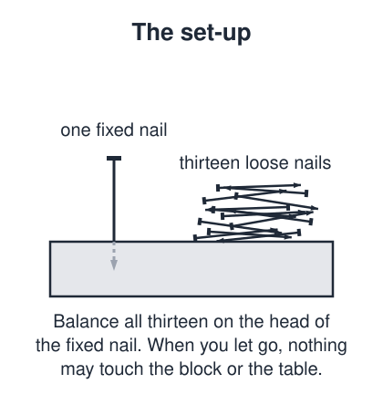
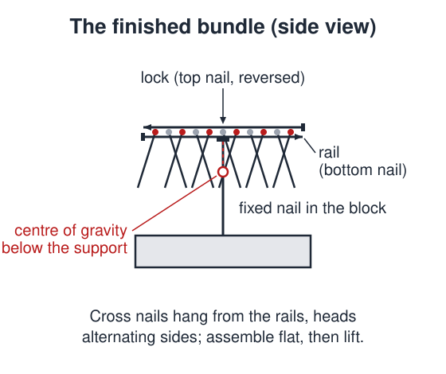

# 13 Nails

 This work is licensed under a <a rel="license" href="http://creativecommons.org/licenses/by/4.0/">Creative Commons Attribution 4.0 International License</a>.

*[Section 1](../section1.md), session 1. Set alongside the [Triangle Problem](triangle-problem.md); its contrasting partner, [Conscious Machines](conscious-machines.md), follows in session 2.*

!!! abstract "The problem"

    **The 13 nails problem.** Drive one large common nail upright into a block of wood, so that it stands firmly with its head a few centimetres clear. Balance thirteen more nails of the same kind, all at once, on the head of that upright nail. When you let go they may touch only each other and that nail head: nothing may rest on the block, the table or your hands, and there is no glue, tape, bending or notching.

    **The celts problem (the alternative).** A celt, or rattleback, is a small boat-shaped object with a smoothly curved underside. Spin it gently on a smooth table, first one way and then the other. One way it turns like an ordinary top; the other way it rocks end to end, the spin dies, and it starts turning the opposite way untouched. Say what you observe, decide whether any law of physics is broken, and explain the reversal.

    Either way, record how you attacked it, what you assumed without noticing, and what you tried that did not work.

    *Reconstruction. Winfree's own wording has not survived; the syllabus gives only the names. The set-up and the constraints above are paraphrased from standard published descriptions of the two demonstrations, and the ban on glue and bending is an editorial tightening, not a documented rule of his.*

{ width="560" }

*Drawn for this site (CC BY 4.0).*

## Why it is in the course

Session 1 is the introductory meeting of Section 1, "Detecting Nonsense, Error Checking, False Assumptions, Cherishing Mistakes". After the [Triangle Problem](triangle-problem.md) has done its job of "Demonstrating the need", the syllabus sets the "First of two contrasting challenges": this one, or, "alternatively, the celts problem". The second challenge, in session 2, is [Conscious Machines](conscious-machines.md).

The contrast is the point. This challenge is small and hands-on, with an answer you can hold in your hand; the other is enormous and may have no answer at all. The course is about how you work on both.

The nails fit the section's theme of false assumptions. Nearly everyone starts by piling nails on the fixed nail's head, or assumes a balanced object must carry its weight above its support, and the puzzle gives way the moment those assumptions do. The celt catches nonsense from the other side: its reversal looks like a broken conservation law. Winfree writes that the puzzles exist "to slow you down for a few minutes so you can examine the working of your own mind", and an object on the table does that in the first hour.

## Where it comes from

**Balancing nails.** No author and no date are known. The puzzle circulates as a jobsite or bar bet, and it is catalogued as a physics demonstration of centre of mass and equilibrium (Wesleyan 1J20.25, "Twelve Nails On One"). The count varies with the teller: six at ANU, eleven on a twelfth at Steve Spangler, twelve at Wesleyan, thirteen at ProTradeCraft, fourteen at Pleacher, sixteen at Rick's Hobby Garage. Thirteen is the number in Winfree's title. The one hobbyist who went looking for its history reports "zero luck on finding any history on it"; his bored-carpenter story is offered as his own guess, and nothing better has been found.

**Celts.** "Celt" (soft c) is the antiquarians' word for a prehistoric stone or bronze axe or chisel; some such stones, being slightly asymmetric, spin happily in one direction only. The first scientific treatment was a demonstration by the Cambridge mathematician Gilbert Thomas Walker, "On a curious dynamical property of celts", given to the Cambridge Philosophical Society in 1895 with J. J. Thomson presiding. His analysis "On a dynamical top" (1896) treated the celt as a rigid body rolling without slipping and showed that no law of mechanics is broken. The subject then drew only occasional papers until Jearl Walker's "Amateur Scientist" column of October 1979, after which plastic rattlebacks became a standard science toy and a research literature grew.

??? tip "Hints"

    - Nails: the fixed nail is the only support, but nothing says the thirteen must be assembled on it.
    - Nails: think of a nail's head as a hook. Where does its weight hang once hooked over something?
    - Nails: a hanging object is stable when its centre of gravity sits below the point it hangs from. Can you get the bundle's below that nail head?
    - Celts: write down, in order, what it does when spun each way, keeping observation apart from explanation. Then rock it end to end without spinning it, and see whether the curved underside lines up with the long axis of the mass or is twisted from it.

??? success "Resolution"

    **Nails.** Lay one nail flat on the table as a "rail", and lay eleven more across it, perpendicular and packed close, with their heads projecting past the rail on alternate sides. Lay the thirteenth on top, parallel to the rail but pointing the opposite way, in the groove between the crossed nails. Pinch the two parallel nails together at their middles and lift: the cross nails swing down and hook under them by their heads, locking the bundle. Set the middle of the rail on the fixed nail's head. The cross nails hang below the rail, so the bundle's centre of gravity lies below its support: it is stable, and swings back if nudged.

    { width="560" }

    *Drawn for this site (CC BY 4.0).*

    **Celts.** No law is broken: angular momentum about the vertical is not conserved, because the table's friction and normal force do not act through the celt's centre of mass. The principal axes of curvature of its underside are slightly rotated, in the horizontal plane, from its principal axes of inertia, and that skew couples spin to the pitching and rolling oscillations. Spun the "wrong" way, the spin feeds the pitching oscillation, which grows into the rattle while the spin dies; the coupling then turns that oscillation back into spin the other way, the direction in which it is stable.

## Sources

- **Wesleyan University Department of Physics**, "1J20.25 Twelve Nails On One" (physics demonstration) — [physicsdemos.site.wesleyan.edu](https://physicsdemos.site.wesleyan.edu/home/mechanics/1j/1j20-25-twelve-nails-on-one){target=_blank} 🔓
- **Steve Spangler Science**, "Balancing Nails" — [stevespangler.com](https://stevespangler.com/experiments/balancing-nail-puzzle/){target=_blank} 🔓
- **Patrick Roehrman**, "Jobsite Magic Trick: Balance 13 Nails on the Head of One", *ProTradeCraft* (2016) — [protradecraft.com](https://www.protradecraft.com/construction-phase/tools/video/55181668/jobsite-magic-trick-balance-13-nails-on-the-head-of-one){target=_blank} 🔓
- **David Pleacher**, "Balancing Nails" (puzzle page) — [pleacher.com](https://www.pleacher.com/mp/puzzles/tricks/mobnail.html){target=_blank} 🔓
- **ANU College of Science and Medicine**, "Nail balancing challenge" — [science.anu.edu.au](https://science.anu.edu.au/engagement/science-lab-experiments-home-school/try-nail-balancing-challenge){target=_blank} 🔓
- **Rick Simper**, "The Balancing Nails Puzzle", *Rick's Hobby Garage* (2022) — [rickshobbygarage.com](https://rickshobbygarage.com/the-balancing-nails-puzzle/){target=_blank} 🔓
- **G. T. Walker**, "On a curious dynamical property of celts", *Proceedings of the Cambridge Philosophical Society* (1895) — no digitised copy located; secondary bibliographies give 8: 305–306, which the editors have not checked 🔒
- **G. T. Walker**, "On a dynamical top", *Quarterly Journal of Pure and Applied Mathematics* 28: 175–184 (1896) — citation confirmed at the [Wikisource author page](https://en.wikisource.org/wiki/Author:Gilbert_Thomas_Walker){target=_blank} 🔓, which hosts no text of the paper
- **Linda Hall Library**, "Gilbert Walker", *Scientist of the Day* — [lindahall.org](https://www.lindahall.org/about/news/scientist-of-the-day/gilbert-walker/){target=_blank} 🔓
- **Jearl Walker**, "The Amateur Scientist: The mysterious 'rattleback': a stone that spins in one direction and then reverses", *Scientific American* 241(4): 172–184 (October 1979) — [scientificamerican.com](https://www.scientificamerican.com/article/the-amateur-scientist-1979-10/){target=_blank} 🔒
- **Hermann Bondi**, "The rigid body dynamics of unidirectional spin", *Proceedings of the Royal Society A* 405: 265–274 (1986) — [doi:10.1098/rspa.1986.0052](https://doi.org/10.1098/rspa.1986.0052){target=_blank} 🔒
- **A. Garcia and M. Hubbard**, "Spin reversal of the rattleback: theory and experiment", *Proceedings of the Royal Society A* 418: 165–197 (1988) — [doi:10.1098/rspa.1988.0078](https://doi.org/10.1098/rspa.1988.0078){target=_blank} 🔒
- **A. B. Pippard**, "How to make a Celt or rattleback", *European Journal of Physics* 11: 63–64 (1990) — [doi:10.1088/0143-0807/11/1/112](https://doi.org/10.1088/0143-0807/11/1/112){target=_blank} 🔒
- **Wikipedia contributors**, "Rattleback" (overview, accessed 2026) — [en.wikipedia.org](https://en.wikipedia.org/wiki/Rattleback){target=_blank} 🔓
- **University of Iowa Department of Physics and Astronomy**, "1M40.90 Celts or Rattle Backs" (lecture demonstration) — [instructional-resources.physics.uiowa.edu](https://instructional-resources.physics.uiowa.edu/1m4090-celts-or-rattle-backs){target=_blank} 🔓
- **E. A. Jagla and A. G. Rojo**, "The chiral knife edge: a simplified rattleback to illustrate spin inversion" (2023) — [arXiv:2309.06154](https://arxiv.org/abs/2309.06154){target=_blank} 🔓
- **Lasse Franti**, "On the rotational dynamics of the Rattleback" (2012) — [arXiv:1202.6506](https://arxiv.org/abs/1202.6506){target=_blank} 🔓
- **Arthur T. Winfree**, *The Art of Scientific Discovery: original course syllabus* (PDF) — [aosd_syllabus.pdf](https://github.com/tyson-swetnam/aosd/blob/main/docs/assets/aosd_syllabus.pdf){target=_blank} 🔓

---

*Back to [Section 1](../section1.md) · [All problems](index.md) · [The schedule](../syllabus.md#section-1-detecting-nonsense-error-checking-false-assumptions-cherishing-mistakes)*
