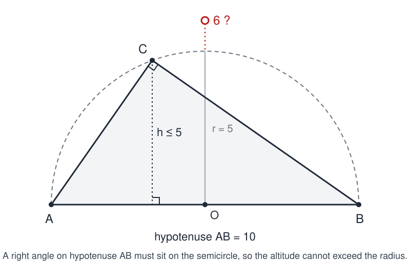

# Triangle Problem

 This work is licensed under a <a rel="license" href="http://creativecommons.org/licenses/by/4.0/">Creative Commons Attribution 4.0 International License</a>.

*[Section 1](../section1.md), session 1. Assigned together with [13 Nails](thirteen-nails.md).*

!!! abstract "The problem"

    The exact triangle problem Winfree used on the first day is not recorded.
    The syllabus gives only the phrase "Demonstrating the need: triangle
    problem". Below are the two candidates the evidence cannot rank. Both are
    written for this page. Neither is a transcription of his assignment.

    **Candidate A: a triangle between the stars.** This is Winfree's own; he
    used it with a class later in the semester. Pick any three stars on a clear
    night and imagine straight lines joining them, or stretch a taut string from
    one to the next. Do the three interior angles of the triangle you see add up
    to 180 degrees? Write down your answer and your reason. Then consider a
    triangle whose corners are a star on the southern horizon, a star on the
    western horizon, and a star directly overhead.

    **Candidate B: the impossible right triangle.** The hypotenuse of a
    right-angled triangle is 10 inches; the altitude dropped onto it is 6
    inches. Find the area of the triangle.

    V. I. Arnold printed this as problem 6 of his *Problems for children from 5
    to 15*, with a story attached. The question came from a standard American
    examination. American school students had been coping with it successfully
    for over a decade. Then Russian school students arrived from Moscow, and
    none of them was able to solve it as their American peers had, giving 30
    square inches. Why?

    Take either question as you would any textbook exercise: write down your
    answer and your reasoning before reading further. Then ask yourself what you
    assumed.

## Why it is in the course

The syllabus puts this item first, before any reading has been discussed,
under the label "Demonstrating the need". The need is the one the course
description spells out: the exercises are "practice scrimmages" in
"recognizing ignorance", "eliminating rejectable candidate solutions", and
"spotting and taking advantage of your own mistakes". A booby-trapped triangle
demonstrates that need in five minutes. Everyone in the room already knows the
answer, everyone gives the same one, and the confident, unanimous answer is
wrong. The lesson is that fluency with a familiar fact is not the same as
thinking, and that the first job with any problem is to ask whether its premises
can even be true. That is the agenda of Section 1, "Detecting Nonsense, Error
Checking, False Assumptions, Cherishing Mistakes", and of the reading assigned
for the same day, Adams's preface and Chapter 1.

The syllabus pairs the triangle with [13 Nails](thirteen-nails.md) as the
"first of two contrasting challenges". The triangle is a closed trap that
punishes haste; the nails problem is an open construction that rewards
persistence. The contrast is itself part of the day's message.

A wrong answer here is not a failure but the raw material of the course. The
syllabus says of mistakes that "they are often the most available doors to
discovery", and the GamesWorth notebook exists to record exactly how one walked
through this one.

## Where it comes from

The celestial triangle is Winfree's own. In his "Adventures in Discovery" column
for the Society for Amateur Scientists of 7 December 2001, "A Personal Encounter
with Non-Euclidean Space", he describes asking a classroom of university
seniors, the week before, to write down whether a triangle traced between stars
has angles summing to 180 degrees. Everyone said yes. Then he offered a star on
the southern horizon, one on the western horizon, and one at the zenith: three
right angles. Objections followed about the curvature of the sky and about
angles seen in perspective, so the class went out into the hall to look at
converging floor tiles. His comment, that "we are all so brainwashed by a 10th
grade encounter with Euclid that we have trouble even seeing the blatantly
different behavior of lines in our visual space", is a compact statement of what
the first section of the course is about.

The right-triangle version is best known from Vladimir I. Arnold's brochure
*Problems for children from 5 to 15* (Moscow: MCCME, 2004), 77 problems he put
onto paper in Paris in spring 2004. Problem 6 presents it as a question from a
standard American examination that American school students had been coping with
successfully for over a decade. His earlier essay *On teaching mathematics*
(1997) does not contain the anecdote, so the 2004 brochure is its first
appearance in his writing; the problem itself, on his account, was in American
use from roughly the early 1990s, well before Winfree's course.

It has since become a staple of classroom experiments on checking premises.
Tanya Khovanova (2009) gave it to her own students and reported answers of 30,
of 24 (from assuming a 6-8-10 triangle), and one negative number under a square
root. The mathematics behind the resolution is ancient: Thales's theorem, that
the angle in a semicircle is a right angle.

??? tip "Hints"

    - Star triangle: choose the three stars in extreme positions, two on the horizon a quarter-turn apart and one straight overhead, and estimate each corner angle separately.
    - Star triangle: what surface are those "straight" lines actually drawn on, and what counts as a straight line on that surface?
    - Right triangle: before you compute anything, try to draw the figure to scale. Can you actually construct a right triangle with these two measurements?
    - Right triangle: fix the hypotenuse as a segment of length 10. Where can the vertex with the right angle lie? An old theorem about angles in a semicircle answers this.
    - Right triangle: given the answer to the previous hint, what is the largest the altitude to the hypotenuse could possibly be? Compare it with 6.
    - Right triangle, if you prefer algebra: call the legs a and b, so that a^2 + b^2 = 100 and (from the area computed two ways) ab = 60. What do (a + b)^2 and (a - b)^2 come out to?

??? success "Resolution"

    **Star triangle.** The three stars are directions, and the "straight" lines
    between them are great circles on the celestial sphere. The triangle is
    spherical, and the sum of its angles exceeds 180 degrees by an amount
    proportional to its area. Winfree's example (one star on the southern
    horizon, one on the western horizon, one at the zenith) has three right
    angles, a sum of 270 degrees. The unanimous "must be 180" is the Euclidean
    assumption imported unexamined from tenth-grade geometry.

    **Right triangle.** No such triangle exists, so it has no area. By Thales's
    theorem the right-angle vertex of a right triangle lies on the circle whose
    diameter is the hypotenuse; the distance from any point of that circle to
    the diameter is at most the radius, here 5. An altitude of 6 to a hypotenuse
    of 10 is therefore impossible, and the largest area any right triangle with
    hypotenuse 10 can have is (1/2)(10)(5) = 25.

    { width="560" }

    *The right-angle vertex of any triangle on hypotenuse AB lies on the dashed semicircle, so the altitude to AB can never exceed the radius. Drawn for this site (CC BY 4.0).*

    Algebra says the same thing: with legs a and b, a^2 + b^2 = 100 and ab = 60
    give (a + b)^2 = 220 but (a - b)^2 = 100 - 120 = -20, which no real a and b
    satisfy. The answer 30 comes from applying (1/2)(base)(height) without asking
    whether the figure exists; the answer 24 comes from assuming a 6-8-10
    triangle, but there the altitude to the hypotenuse is 4.8, not 6. Arnold's
    Moscow students "failed" because they checked the premises first.

## Sources

- **V. I. Arnold**, *Problems for children from 5 to 15* (Moscow: MCCME, 2004; English translation by V. Goryunov and S. Gusein-Zade), problem 6 — [PDF at imaginary.org](https://www.imaginary.org/sites/default/files/taskbook_arnold_en_0.pdf){target=_blank} 🔓
- **V. I. Arnold**, "On teaching mathematics", address at the Palais de la Découverte, 7 March 1997; *Russian Mathematical Surveys* 53:1 (1998), 229–236 — [online text](https://www.karlin.mff.cuni.cz/~spurny/doc/articles/arnold.htm){target=_blank} 🔓
- **Arthur T. Winfree**, "A Personal Encounter with Non-Euclidean Space", SAS Adventures in Discovery column no. 5 (7 December 2001) — [Internet Archive](https://web.archive.org/web/20030114051703/http://eebweb.arizona.edu/faculty/winfree/SAS/SAS05/SAS05.html){target=_blank} 🔓
- **Arthur T. Winfree**, ECOL 479/579 The Art of Scientific Discovery: course handout and retrospective syllabus (Spring 2001) — [Internet Archive](https://web.archive.org/web/20020420212713/http://eebweb.arizona.edu/Faculty/Winfree/handout_479.htm){target=_blank} 🔓
- **Tanya Khovanova**, "An Experiment Inspired by Vladimir Arnold" (2009) — [blog post](https://blog.tanyakhovanova.com/2009/05/an-experiment-inspired-by-vladimir-arnold/){target=_blank} 🔓
- **Presh Talwalkar**, "Evil Geometry Problem: Sunday Puzzle", Mind Your Decisions (2016) — [blog post](https://mindyourdecisions.com/blog/2016/02/28/evil-geometry-problem-sunday-puzzle/){target=_blank} 🔓
- **Dave Peterson**, "Vacuous Solutions: Correct, But Not Really", The Math Doctors (2025) — [article](https://www.themathdoctors.org/vacuous-solutions-correct-but-not-really/){target=_blank} 🔓
- **Brilliant.org wiki**, "In a right triangle with hypotenuse 10, can the altitude perpendicular to the hypotenuse be 6?" — [wiki page](https://brilliant.org/wiki/can-a-right-triangle-with-hypotenuse-10-have-a/){target=_blank} 🔓
- **Wikipedia**, "Thales's theorem" — [article](https://en.wikipedia.org/wiki/Thales%27s_theorem){target=_blank} 🔓
- **Eric W. Weisstein**, "Thales' Theorem", MathWorld — [entry](https://mathworld.wolfram.com/ThalesTheorem.html){target=_blank} 🔓
- **Arthur T. Winfree**, *The Art of Scientific Discovery: original course syllabus* — [PDF](https://github.com/tyson-swetnam/aosd/blob/main/docs/assets/aosd_syllabus.pdf){target=_blank} 🔓

!!! note "How sure are we that this is Winfree's problem?"

    Not sure. The syllabus gives the name, the session (day one, with Adams's
    preface and Chapter 1), the label "Demonstrating the need", and the
    neighbour, 13 Nails. Winfree's archived course handout repeats that line and
    nothing more. A search of his whole archived lab site turns up no problem
    sheet and only one piece of triangle content anywhere: the star
    demonstration in his column of 7 December 2001. The editors weighed three
    readings.

    - **Winfree's triangle between the stars.** Genuinely his, genuinely a triangle used to demonstrate the need to test an assumption everyone shares, and documented in his own words. But the column says "last week", placing the demonstration in late November 2001, week 14 of the semester whose day one was 21 August, and inside a run of columns on the apparent curvature of lines in the sky. Within that semester the two are separate occasions, and the handout describes itself as a retrospective of the Spring 2001 offering with the dates changed. Low to medium confidence.
    - **The impossible right triangle** (hypotenuse 10 inches, altitude 6 inches). Fits the name, the day-one purpose, the Section 1 theme, and the course's preference for elementary mathematics that needs no special knowledge; Arnold reports it as American examination material from well before 2001. But no document of any kind connects Winfree to it, and Arnold's brochure postdates the course by three years. Low to medium confidence.
    - **A "how many triangles are in this figure" counting puzzle.** A common classroom opener that fits "error checking", but nothing in the syllabus or on Winfree's pages points to it, and "demonstrating the need" fits a booby-trapped question better. Low confidence.

    The evidence does not rank the first two above each other, so this page
    presents both. Whichever it was, the session was about the same thing: a
    familiar-looking problem whose confident answer collapses when the premises
    are examined. Former students who remember the first day are invited to
    correct the record.

---

*Back to [Section 1](../section1.md) · [All problems](index.md) · [The schedule](../syllabus.md#section-1-detecting-nonsense-error-checking-false-assumptions-cherishing-mistakes)*
