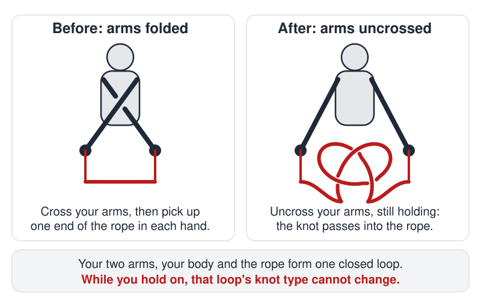

# Tying Knots

 This work is licensed under a <a rel="license" href="http://creativecommons.org/licenses/by/4.0/">Creative Commons Attribution 4.0 International License</a>.

*[Section 2](../section2.md), session 8. The readings due that day are [The Barometer Story](barometer-story.md) and Adams Chapter 3, on emotional blocks; the session also discusses [Telltale Number](telltale-number.md).*

!!! abstract "The problem"

    Winfree's schedule gives four words for this session's exercise: "About assumptions and Tying Knots". Nothing else of his survives for it, so the statement below is a reconstruction: the classic puzzle that fits those words, rebuilt from Clifford Ashley's 1944 version and from the way it circulates today.

    Lay a piece of rope (a shoelace or a metre of string works) straight on a table in front of you. Pick up one end in your left hand and the other end in your right hand. Now, **without letting go of either end at any moment**, tie an ordinary overhand knot in the middle of the rope.

    You may move your hands, arms and body however you like, and pass the rope over or under anything; but the rope must never leave your grip, you may not slide your hands along it, and no one may help.

    Most people conclude, after a few minutes of contorted attempts, that it is impossible. It is not. Before you look for the trick, write down every rule you think you are obeying, and ask which was actually stated.

## Why it is in the course

Session 8 sits in the middle of Section 2, on creative blocks, between Adams's chapters on perceptual blocks (session 7) and cultural blocks (session 9). Winfree's wording puts assumptions first and knots second, and that is what the exercise is for. The solver fails not because the task is hard but because of a rule that was never in the problem: that you begin with your arms uncrossed. Every failed attempt demonstrates a constraint the solver supplied.

The pairing with Adams Chapter 3, on emotional blocks, matters too. The puzzle is attempted in public; most give up and declare it impossible, and the answer, once seen, looks childishly simple. It is a safe rehearsal of being wrong, and of the reluctance to look foolish that Adams discusses.

There is a second lesson for Winfree the topologist. Ordinary attempts fail for a genuine reason, not for want of dexterity: once you are holding both ends, no amount of wriggling can put a knot into the rope. So the exercise also separates what is truly impossible from what merely seems so, in the spirit of the Section 1 sessions on "hidden assumptions" and on "distinguishing things we know vs only imagine".

## Where it comes from

The challenge is an old parlour trick. Clifford W. Ashley recorded it in *The Ashley Book of Knots* (1944) as entry #2576, in his chapter of tricks and puzzles: hold the opposite corners of an unknotted handkerchief and, "without once letting go", tie a knot in it. It "has also been called the 'Fourth-Dimensional Knot' because it appears from nowhere in particular", Ashley notes, and he describes the performer folding his arms, toying with the two ends, and producing the knot on unfolding them.

The idea of a knot stored in the arms was working knowledge among sailors: Ashley's #2543 forms a clove hitch with the arms "crossed as far as possible" and then rotated, a method he calls "one of the most practical ways to form the knot".

*The Magician's Own Book* (1862) is full of neighbouring handkerchief feats but not this one, so Ashley's entry is the earliest printed source verified here. Today the puzzle circulates as a bar bet, on puzzle sites and as the magicians' napkin-knot wager. It belongs to the family of tricks Martin Gardner called "topological tomfoolery", whose secret is that some property cannot change under continuous motion.

??? tip "Hints"

    - Write down the rules you are obeying. The problem forbids letting go of the ends. It says nothing about the position of your arms and body before you pick the rope up.
    - Think of your arms, your body and the rope as one closed loop. Once you are holding both ends, can any amount of wriggling change whether that loop is knotted?
    - If the closed loop cannot become knotted after you grip the ends, then it must already be knotted before you grip them. Where could a knot be hiding if the rope is straight?
    - Try it in reverse: tie an overhand knot, hold the two ends, and see what posture you end up in if you work the knot out of the rope without ever letting go.

??? success "Resolution"

    Fold your arms first. Keeping them crossed, bend down and pick up one end of the rope in each hand. Now uncross your arms without letting go. As your arms pass back to the ordinary position, the crossing they carried is transferred into the rope, and an overhand knot appears in its middle.

    { width="560" }

    *The knot is stored in your arms before the rope is touched. Drawn for this site (CC BY 4.0).*

    Why nothing else works: from the moment both ends are held, your arms, your torso and the rope form a single closed loop. Moving about without releasing the rope deforms that loop continuously and can never pass one part of it through another, so its knot type cannot change. An overhand knot in the rope, with the ends joined through your body, is a trefoil, a genuine knot; a straight rope held with uncrossed arms closes up into an unknotted loop. You cannot get from the second to the first, so you must start with the closed loop already a trefoil, which is exactly what folding your arms does.

    The "impossible" puzzle was impossible only under the unstated assumption about how you begin.

## Sources

- **Clifford W. Ashley**, *The Ashley Book of Knots* (Doubleday, 1944), entry #2576 in "Tricks and Puzzles" — [archive.org scan](https://archive.org/details/TheAshleyBookOfKnots){target=_blank} 🔓
- **Wikipedia**, "The Ashley Book of Knots" — [en.wikipedia.org](https://en.wikipedia.org/wiki/The_Ashley_Book_of_Knots){target=_blank} 🔓
- **Wikipedia**, "Overhand knot" — an overhand knot becomes a trefoil knot when its ends are joined — [en.wikipedia.org](https://en.wikipedia.org/wiki/Overhand_knot){target=_blank} 🔓
- **George Arnold and Frank Cahill**, *The Magician's Own Book, or The Whole Art of Conjuring* (Dick & Fitzgerald, 1862) — [Project Gutenberg #60687](https://www.gutenberg.org/ebooks/60687){target=_blank} 🔓
- **Martin Gardner**, *Mathematics, Magic and Mystery* (Dover, 1956), "Topological Tomfoolery" — [Google Books](https://books.google.com/books/about/Mathematics_Magic_and_Mystery.html?id=-kOFBQAAQBAJ){target=_blank} 🔒
- **James L. Adams**, *Conceptual Blockbusting: A Guide to Better Ideas* (5th ed. 2019; 1st ed. 1974), Chapter 3, "Emotional Blocks" — the session's assigned reading — [publisher page](https://www.hachette.co.uk/titles/james-l-adams/conceptual-blockbusting-fifth-edition/9781541674042/){target=_blank} 🔒
- **Braingle**, "Knot the Rope" (Brain Teaser #896) — [braingle.com](https://www.braingle.com/brainteasers/896/knot-the-rope.html){target=_blank} 🔓
- **Puzzle Prime**, "Tie a Knot" (2018) — [puzzleprime.com](https://www.puzzleprime.com/puzzles/brain-teasers/practical/tie-a-knot/){target=_blank} 🔓
- **Chris Welsh (Mr Magician)**, "Knot in Handkerchief Trick" — [mrmagician.co.uk](https://www.mrmagician.co.uk/knotinhandkerchief.html){target=_blank} 🔓
- **Arthur T. Winfree**, *The Art of Scientific Discovery: original course syllabus* (2001), session 8 — the only Winfree record of the exercise — [PDF](https://github.com/tyson-swetnam/aosd/blob/main/docs/assets/aosd_syllabus.pdf){target=_blank} 🔓

!!! note "How sure are we that this is Winfree's problem?"

    The syllabus gives four words and nothing more: "About assumptions and Tying Knots". It is the only Winfree document that mentions the exercise; no page of his archived lab site names a knot puzzle. The identification below is therefore an inference from the wording, the session and his tastes, not a documented fact. Candidate readings:

    - The crossed-arms rope puzzle, Ashley #2576 (high confidence; the reading used above). It is literally about tying a knot, its whole point is an unstated assumption, it takes two minutes with a shoelace, and its explanation is topological, which was Winfree's own research field.
    - A short talk, demonstrated with string, on why a closed loop cannot be knotted or unknotted without cutting: an "assumption" that is really a theorem (low confidence). The entry reads "About assumptions and ..." where sibling entries say "Discuss ...", which leaves room for a demonstration; but no source attests a lecture, and demonstrating the crossed-arms trick would satisfy this reading too.
    - Maier's two-string problem, in which two strings hanging from a ceiling must be tied together (low confidence; a standard creativity-block demonstration, but its point is tying strings to each other rather than tying a knot, and it needs a rigged ceiling).

    The statement above is paraphrased from Ashley #2576 and from the modern puzzle-site versions; only the labelled phrases are quoted from Ashley, whose 1944 book is still in copyright. The topological explanation is stated in the editors' own words.

---

*Back to [Section 2](../section2.md) · [All problems](index.md) · [The schedule](../syllabus.md#section-2-creative-blocks)*
