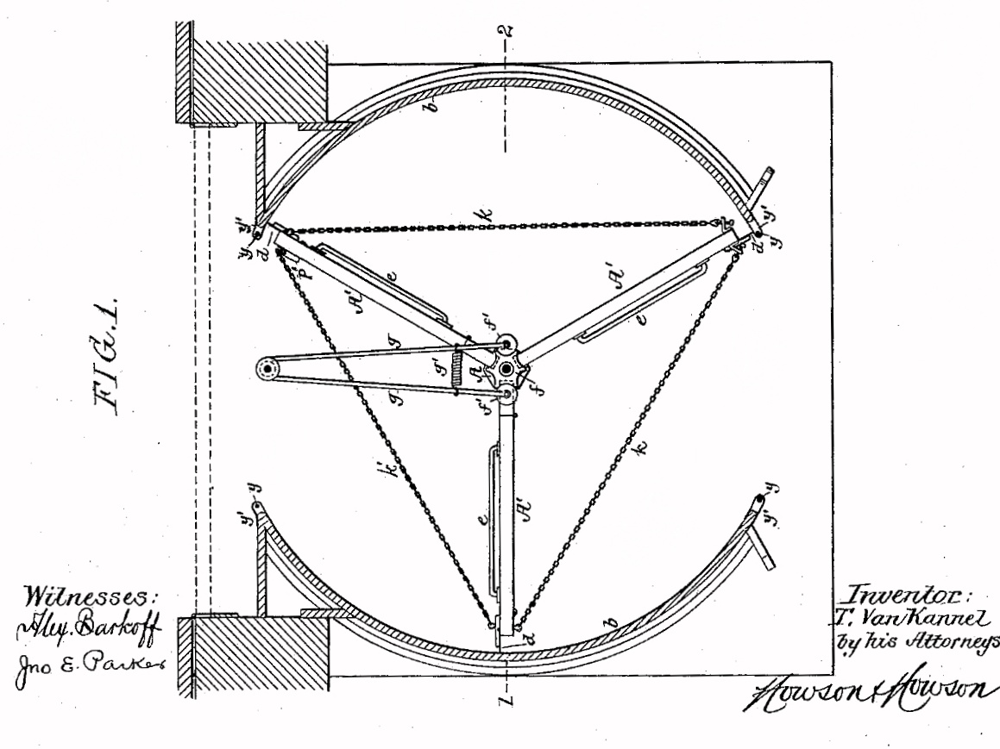

# Walking Through Walls

 This work is licensed under a <a rel="license" href="http://creativecommons.org/licenses/by/4.0/">Creative Commons Attribution 4.0 International License</a>.

*[Section 2](../section2.md), session 11, the only problem the syllabus lists that day. The reading due is Adams's Chapter 7, Blockbusters.*

!!! abstract "The problem"

    Reconstructed from the syllabus: the archived handout carries only the
    one-line schedule entry for this session, so the rounds below are
    rebuilt from the passage in Adams's *Conceptual Blockbusting* that the
    name most probably points to. Finish each round in your notebook before
    reading the next.

    **Round 1.** A client says: *design me a better door.* List or sketch as
    many designs as you can.

    **Round 2.** Cross out the word *door*. The real request turns out to
    be: *find me a better way to get through a wall.* What can you propose
    now that Round 1 did not allow?

    **Round 3.** Widen it once more: *find a better way to keep two spaces
    apart - sound, sight, heat, weather, privacy - while still letting
    people and things pass between them.*

    **Round 4.** Compare the three lists. What did the word *door* decide
    about shape, material, hinges and the position of the opening?

    A request for a better way to get through a wall, Adams writes,
    "releases one from the preconception of the rectangular slab that swings
    or slides" (*Conceptual Blockbusting*, 2nd ed., 1980, p. 31).

{ width="560" }

*Each statement is a special case of the next one out. Drawn for this site (CC BY 4.0).*

{ width="560" }

*One answer that is not a hinged slab. Theophilus Van Kannel, US Patent 387,571 (1888), via Wikimedia Commons, public domain.*

## Why it is in the course

Session 11 is the fifth of Section 2's six sessions, and the one where the
reading turns from blocks to *blockbusters*. Earlier sessions used Adams's
puzzles to expose perceptual, emotional, cultural and intellectual blocks.
This one drills a tool for getting past them: a questioning attitude aimed
not at the answer but at the problem statement.

It follows straight on from session 10, [Taboo Questions](taboo-questions.md)
and [Paths Through Mazes](paths-through-mazes.md). A maze is only a maze if
you accept its walls; a door is only the answer if you accept the word
"door".

The exercise has no answer. Its product is the difference between your three
lists, and your account of what one word had silently decided. That suits a
syllabus which says the puzzles exist "to slow you down for a few minutes so
you can examine the working of your own mind".

## Where it comes from

James L. Adams taught mechanical engineering and design at Stanford and
published *Conceptual Blockbusting: A Guide to Better Ideas* in 1974; the
fourth edition (2001) was the one in print when the course ran. His chapter
on perceptual blocks has a section on the tendency to delimit the problem
area too closely, and the door is his example. Ask for a better door and the
answers stay inside the word: a hinged slab with a handle. Ask instead for a
better way to get through a wall, and his students varied the opening
itself - its shape, and whether the thing that closes it swings at all.
Widen the request once more, from opening a wall to keeping two spaces
separate, and the question becomes what the wall is for rather than what a
door looks like.

The example became a standard classroom drill, reproduced in Dennis Coon's
*Introduction to Psychology*. The title, though, is probably Winfree's own.
It echoes Marcel Ayme's 1941 story *Le Passe-muraille*, "The Man Who Walked
Through Walls", though nothing links the two.

??? tip "Hints"

    - First write down every property a "door" has that nobody asked for:
      shape, material, how it moves, that it is one thing.
    - In Round 2, change one property of the opening at a time: shape, size,
      height off the floor, whether it moves or the person does.
    - In Round 3, ask what the wall is *for*. Cold, noise, sight and
      strangers are different jobs, and each suggests a different way
      through.
    - Count the ideas in each round. That count is the result, not any one
      design.

??? success "Resolution"

    There is no single answer. What you can compare your notebook against
    is what Adams reports. Asked for a better door, people stay inside the
    word: a hinged slab, better made. Asked for a better way through a
    wall, his students varied the opening itself - other shapes, curtains
    and shutters, doors that rotate or fold rather than swing. Asked for a
    better way to keep two spaces separate, they could reach answers that
    are not openings at all; Adams's example is the air curtain that keeps
    warm air inside a shop while people walk straight through it. At that
    width the statement even invites the question of whether the two spaces
    need walling apart.

    His moral is that it is foolish to constrain a problem so closely that
    the solver's abilities go unused, and that this holds just as much when
    the person stating the problem and the person solving it are the same.
    Every statement carries a picture of its answer inside it.

## Sources

- **James L. Adams**, *Conceptual Blockbusting: A Guide to Better Ideas*, 2nd ed. (1980), pp. 31-32 - [Google Books search-inside](https://books.google.com/books?id=tYyBl80D5GsC&q=%22through+a+wall%22){target=_blank} 🔒
- **James L. Adams**, *Conceptual Blockbusting*, 2nd ed. (1980) - [Internet Archive](https://archive.org/details/conceptualblockb0000adam){target=_blank} 🔓 *(borrow)*
- **James L. Adams**, *Conceptual Blockbusting*, 4th ed., 2001 Perseus printing - [Internet Archive](https://archive.org/details/conceptualblockb00adam_2){target=_blank} 🔓 *(borrow)*
- **James L. Adams**, *Conceptual Blockbusting*, 5th ed. (2019) - [Google Books preview](https://books.google.com/books?id=DMaCDwAAQBAJ&q=%22through+a+wall%22){target=_blank} 🔒
- **James L. Adams**, *Conceptual Blockbusting* - [publisher page, Basic Books / Hachette](https://www.hachettebookgroup.com/titles/james-l-adams/conceptual-blockbusting/9781541674042/){target=_blank} 🔒
- **Dennis Coon**, *Introduction to Psychology: Exploration and Application*, 8th ed. (1998) - [Google Books](https://books.google.com/books?id=Gjrj9k_zzkEC&q=%22better+way+to+get+through+a+wall%22){target=_blank} 🔒
- **Arthur T. Winfree**, course handout (the syllabus) for EEB 479/479H/579 (2001), archived 20 April 2002 - [Internet Archive](https://web.archive.org/web/20020420212713/http://eebweb.arizona.edu/Faculty/Winfree/handout_479.htm){target=_blank} 🔓 · transcribed at [the schedule](../syllabus.md#section-2-creative-blocks)
- **Theophilus Van Kannel**, US Patent 387,571, "Storm-door structure" (1888) - [Google Patents](https://patents.google.com/patent/US387571A/en){target=_blank} 🔓
- **Wikipedia contributors**, "Revolving door" - [Wikipedia](https://en.wikipedia.org/wiki/Revolving_door){target=_blank} 🔓
- **Wikipedia contributors**, "Le Passe-muraille" - [Wikipedia](https://en.wikipedia.org/wiki/Le_Passe-muraille){target=_blank} 🔓

!!! note "How sure are we that this is Winfree's problem?"

    The syllabus gives only one row for this session: Adams Chapter 7,
    Blockbusters, as the reading, and Walking Through Walls as the sole
    problem. Winfree's handout is archived, but it carries that same
    schedule row and no problem text, so his own wording is lost. The
    identification is *probable*: it rests on the match between his title
    and Adams's "a better way to get through a wall", on Adams being the
    reading assigned in the same row, and on Adams's own report that he set
    the restated problem to students.

    Against it: that passage sits in Adams's Chapter 2, read back at session
    7, not the Chapter 7 assigned here, and Winfree wrote "walking" where
    Adams wrote "get through".

    The live alternative is a joke continuing session 10: having found
    [Paths Through Mazes](paths-through-mazes.md) under the rules, students
    are invited to walk through the walls instead. Nothing supports that
    beyond the two names sitting in consecutive sessions, but the teaching
    point above holds either way.

---

*Back to [Section 2](../section2.md) · [All problems](index.md) · [The schedule](../syllabus.md#section-2-creative-blocks)*
