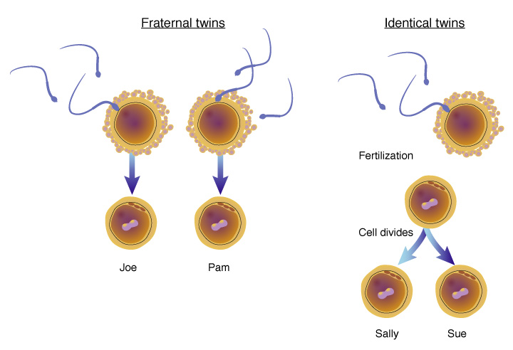
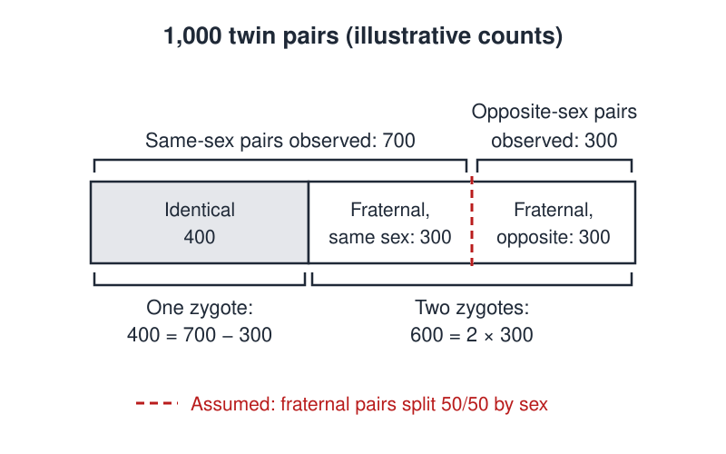

# Zygotes

 This work is licensed under a <a rel="license" href="http://creativecommons.org/licenses/by/4.0/">Creative Commons Attribution 4.0 International License</a>.

*[Section 3](../section3.md), session 17. Discussed together with [Martian Honeycombs](martian-honeycombs.md).*

!!! abstract "The problem"

    Reconstructed from the syllabus: Winfree's text is lost; this is the
    editors' best guess from the name. The counts are invented, not data
    from any real registry.

    *Identical* twins come from one fertilized egg (one zygote) that splits
    in two, so they are always the same sex. *Fraternal* twins come from
    two zygotes, and each is a boy or a girl independently of the other.
    Without genetic tests, nobody can tell whether a same-sex pair came
    from one zygote or two.

    **Part 1.** A birth registry records 1,000 twin pairs: 700 same-sex
    and 300 opposite-sex. Nothing else is known. How many pairs are
    identical? State every assumption you need, and how you would check it.

    **Part 2.** A friend from that registry says she is a twin and her twin
    is a sister. What is the probability they are identical? Is it simply
    the overall fraction of identical pairs?

    **Part 3.** A large study reports that 57 to 60 per cent of
    *fraternal* pairs are same-sex, not 50. What does that do to your
    answers, and what would you ask about how the twins were classified?

{ width="560" }

*One zygote or two. National Human Genome Research Institute, Talking Glossary of Genetic Terms. Public domain (US government work), via Wikimedia Commons.*

## Why it is in the course

Section 3 is "Observations and Questions". If the reconstruction is right,
the lesson is Wilhelm Weinberg's: one thing you can observe, whether twins
share a sex, lets you count something you cannot see, how many zygotes
each pair came from. The count is only as good as its assumptions, so the
real work is naming them, as in Section 1's "hidden assumptions".

The syllabus says the purpose of its puzzles, "many of them silly", "is to
slow you down for a few minutes so you can examine the working of your own
mind". Part 2 is built for that: the first answer most people give is
wrong, and noticing why is the exercise.

The session's reading is Chapter 3 of Robert Ehrlich's *Nine Crazy Ideas
in Science*; its subject could not be confirmed, so no link is claimed.

## Where it comes from

The syllabus gives only the name. The note at the end of this page weighs
what else survives.

Wilhelm Weinberg (1862-1937), a Stuttgart obstetrician better known for
the Hardy-Weinberg principle, showed in 1901 how to estimate identical and
fraternal twin numbers from same-sex and opposite-sex counts. His "differential rule" served twin research for most
of the twentieth century. Its assumptions (an even sex ratio, independent
sexes in fraternal pairs, equal survival) were questioned repeatedly, and a
2018 study found fraternal pairs same-sex more often than chance predicts.
The reverse question circulates as a probability puzzle. Whether Winfree
used either form is not documented.

??? tip "Hints"

    - Biology forbids an identical boy-girl pair. Which of the two counts
      can contain only fraternal pairs?
    - If fraternal sexes are independent and even, what fraction of
      fraternal pairs is opposite-sex? Estimate all the fraternal pairs,
      then subtract.
    - For Part 2, tabulate the 1,000 pairs by type and sex, and count
      only the rows your friend's statement allows.
    - List every assumption, including how anyone decided which pairs
      were "identical". Each is a question to put to the data.

??? success "Resolution"

    This resolves the reconstruction only.

    **Part 1.** Only fraternal pairs can be opposite-sex, and half of them
    should be. So fraternal pairs are about 2 × 300 = 600, and identical
    pairs about 700 − 300 = 400. Marshall and Knox write Weinberg's rule
    with L same-sex and U opposite-sex pairs: identical (L − U)/(L + U),
    fraternal 2U/(L + U). It assumes an even sex ratio, independent sexes
    in fraternal pairs, and no loss or selection that depends on type.

    { width="560" }

    *Illustrative figures. Only the split into 700 same-sex and 300 opposite-sex pairs is observed; the dashed line is Weinberg's assumption. Drawn for this site (CC BY 4.0).*

    **Part 2.** 400/700 = 4/7, not 400/1,000 = 2/5. Learning the pair is
    same-sex rules out the 300 opposite-sex pairs. In Talwalkar's popular
    version, with 1 in 10 pairs identical, two brothers are identical with
    probability 2/11, not 1/10.

    **Part 3.** If fraternal pairs are same-sex more than half the time,
    the rule undercounts fraternal pairs and overcounts identical ones.
    At 60 per cent same-sex, 300 opposite-sex pairs imply 750 fraternal
    pairs and only 250 identical, and Part 2's answer drops to 250/700 =
    5/14. Kanazawa, Segal and de Meza found 60.4 and 57.4 per cent in
    British and American cohorts, but mothers, not DNA tests, classified
    the twins. The honest answer to Part 1 is a range
    plus a list of things to measure.

## Sources

- **Arthur T. Winfree**, *The Art of Scientific Discovery* (ECOL 479/579), course handout; the session-17 line and its bookmark — [Wayback Machine capture, 20 April 2002](https://web.archive.org/web/20020420212713/http://eebweb.arizona.edu/Faculty/Winfree/handout_479.htm){target=_blank} 🔓
- **Wilhelm Weinberg**, "Beiträge zur Physiologie und Pathologie der Mehrlingsgeburten beim Menschen", *Archiv für die gesammte Physiologie des Menschen und der Thiere* 88, 346-430 (1901) — [DOI](https://doi.org/10.1007/BF01657695){target=_blank} 🔒
- **Wikipedia contributors**, "Wilhelm Weinberg" — [Wikipedia](https://en.wikipedia.org/wiki/Wilhelm_Weinberg){target=_blank} 🔓
- **T. Marshall and E. G. Knox**, "Disease concordance and sex similarity in twins", *Journal of Epidemiology and Community Health* 34(1), 1-8 (1980) — [PubMed Central](https://pmc.ncbi.nlm.nih.gov/articles/PMC1052031/){target=_blank} 🔓
- **Johan Fellman and Aldur W. Eriksson**, "Weinberg's Differential Rule Reconsidered", *Human Biology* 78(3), 253-275 (2006) — [DOI](https://doi.org/10.1353/hub.2006.0044){target=_blank} 🔒
- **Satoshi Kanazawa, Nancy L. Segal and David de Meza**, "Why are there more same-sex than opposite-sex dizygotic twins?", *Human Reproduction* 33(5), 930-934 (2018) — [DOI](https://doi.org/10.1093/humrep/dey046){target=_blank} 🔓
- **Presh Talwalkar**, "Can You Solve The Identical Twins Puzzle?", *Mind Your Decisions* (2017) — [blog post](https://mindyourdecisions.com/blog/2017/07/16/can-you-solve-the-identical-twins-puzzle/){target=_blank} 🔓
- **Eva Bianconi et al.**, "An estimation of the number of cells in the human body", *Annals of Human Biology* 40(6), 463-471 (2013) — [DOI](https://doi.org/10.3109/03014460.2013.807878){target=_blank} 🔒
- **Robert Ehrlich**, *Nine Crazy Ideas in Science: A Few Might Even Be True* (2001) — [Internet Archive](https://archive.org/details/ninecrazyideasin00ehrl){target=_blank} 🔒 *(print-disabled readers only)*
- **National Human Genome Research Institute**, identical and fraternal twins illustration, Talking Glossary of Genetic Terms — [Wikimedia Commons](https://commons.wikimedia.org/wiki/File:Identical_twins_lg.jpg){target=_blank} 🔓
- **Arthur T. Winfree**, *The Art of Scientific Discovery: original course syllabus* — [PDF](https://github.com/tyson-swetnam/aosd/blob/main/docs/assets/aosd_syllabus.pdf){target=_blank} 🔓

!!! note "How sure are we that this is Winfree's problem?"

    Not sure. The syllabus gives one word. In Winfree's handout, the link
    on this item points to a bookmark named `Zygote_zygote`, inside a
    companion problem document that was not archived, so no description
    survives. The readings weighed:

    - **Twin zygosity** (medium confidence): the reconstruction above, the
      best-known elementary puzzle about zygotes. The editors' guess, not
      Winfree's text: the doubled word in the bookmark may mean one zygote
      against two, or may be an accident of the word processor.
    - **Cell doublings** (low): how many doublings turn one zygote into a
      body of about 3.7 × 10¹³ cells (Bianconi and colleagues' estimate),
      and why that naive count misleads.
    - **Cleavage geometry** (low): how the early embryo packs its cells.
      In this schedule, problems sharing a session are usually unrelated,
      so the pairing with Martian Honeycombs is no evidence.

    A former student's memory of the handout would outweigh all of this.

---

*Back to [Section 3](../section3.md) · [All problems](index.md) · [The schedule](../syllabus.md#section-3-observations-and-questions)*
